# 解释机器学习模型和预测的博弈论——最终指南

> 原文：<https://towardsdatascience.com/the-ultimate-guide-using-game-theory-to-interpret-machine-learning-c384cbb6929?source=collection_archive---------6----------------------->

## 第 6 部分—沙普利值和 SHAP 包

这是翻译 ML 教程的第六部分。在以前的帖子中，我们已经介绍了几种解释机器学习模型的方法。在高度可解释的模型中，所有模型都有它们的问题，像回归这样的高偏差模型或者像决策树这样的高方差模型。我们解决了偏差和方差之间的权衡，基本上结合了几个模型，特别是高方差模型，所以我们有了最好的模型，低偏差和低方差，代价是我们不再能控制模型如何做出决策或变量之间的关系，即模型变成了一个黑盒。

第 1 部分— [可解释性介绍](/interpreting-machine-learning-model-70fa49d20af1)
第 2 部分— [统计建模—全语用指南](/statistical-modeling-the-full-pragmatic-guide-7aeb56e38b36)
第 3 部分—解释低偏差和高方差模型。
第 4 部分——有可能解决偏倚和方差之间的权衡吗？
第 5 部分——可解释性的本地方法。
**第六部分—(本帖)可解释性的全局方法。**

可选项目:
[数据科学的范围是什么](https://medium.com/swlh/data-science-and-the-data-scientist-db200aac4ea0)
[统计学简史](/a-brief-history-of-statistics-36cfdac9439f)

在上一篇文章(第 5 部分)中，我们看到了一些解释黑盒模型的局部方法。在本帖中，我们将着眼于更强大、更复杂的全球方法，这些方法可以结合两个世界的优点，即统计模型的可解释性和机器学习模型的灵活性。
我们的黑盒模型代表将是 xgboost，但它可以是任何其他深度神经网络或集成，我们的全局可解释性模型代表将是 Shapley Value，还没有竞争对手。

首先讲一点历史和背景。

# 这种博弈论是什么？

博弈论是数学的一个分支，研究代理人如何在考虑冲突和合作的不同策略之间进行选择。这有点让人想起经济学的定义，经济学是研究当人们在竞争目标之间拥有稀缺商品(如时间或金钱)时，他们如何做出决定，如早起并在媒体上阅读一篇文章或获得更多睡眠。毫不奇怪，随着约翰·冯·诺依曼(杰出的数学家)和奥斯卡·莫根施特恩(经济学家)的《博弈论与经济行为》一书的出版，博弈论在经济学中被“专业化”了。

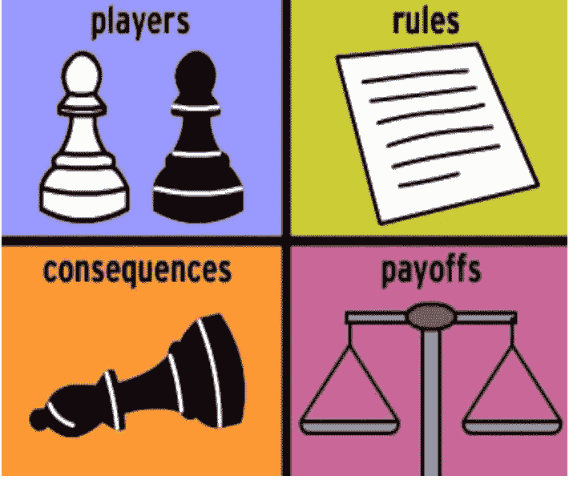

Understanding Game Theory is Super Important for Action Learning Machine Models. If your prediction is passive, it only generates an output to analyze, no problem, but if you (or your client) make a decision with that prediction, you are certainly worth studying game theory. Reinforcement Learning algorithms can already solve problems of cooperation and conflict, that is, problems of Game Theory.

那么博弈论(以下仅 GT)和经济学有什么区别呢？博弈论是经济学家了解社会如何做出选择的另一个工具，而 GT 不仅研究社会中的选择，它还被用于许多领域，如计算，逻辑，政治，哲学，新闻，营销和许多其他进化生物学，以解释达尔文进化中的利他行为。博弈论是研究代理人如何在给定他们如何互动的情况下做出最佳决策的领域。这里我们开始更感兴趣，因为机器学习模型的一个问题是变量之间复杂的相互作用。我们继续。

# 劳埃德·沙普利——博弈论的化身

博弈论，像几乎所有的科学一样，有一个历史演变和几个父母。1713 年的沃尔德格勒夫，1838 年的古诺已经在讨论这个问题了，但是是诺依曼在 20 世纪 30 年代系统化并扩展了这个领域。很多人都知道这个领域的另一位天才，约翰·纳西，他的重要贡献(子博弈中的均衡)使他获得了 1994 年的诺贝尔奖，但我们在这里感兴趣的是 2012 年沙普利和阿尔维姆·罗斯的诺贝尔奖。沙普利被认为是该领域最伟大的理论家，他的一生与 JW 的进化交织在一起，他在不同的领域做出了贡献，如[稳定婚姻问题](https://en.wikipedia.org/wiki/Stable_marriage_problem)。在 1953 年的著作中，他研究了当代理人有不同的利益/需求时，如何让**公平**。Shapley 解决了这个问题，但问题仍然存在，它与解释机器学习模型有什么关系？

John Nash, Lloyd Shapley and Leon Petrosyan. Unfortunately I don’t know who the boy in the green t-shirt is but I can guarantee that he is very well matched.

为了传达 Shapley 值(所谓的公允价值)，让我们在两个区域之间建立一个关系:Shapley 的合作/竞争代理将是我们的模型(X)变量。他们计划分配的“工作”将是我们目标的方差(y ),每个代理/变量支付的公允价值是该变量在预测中的权重/重要性。

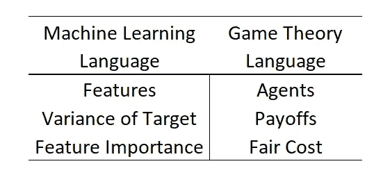

Dictionary Machine Learning <-> Game Theory

# 沙普利值 e Piscinas

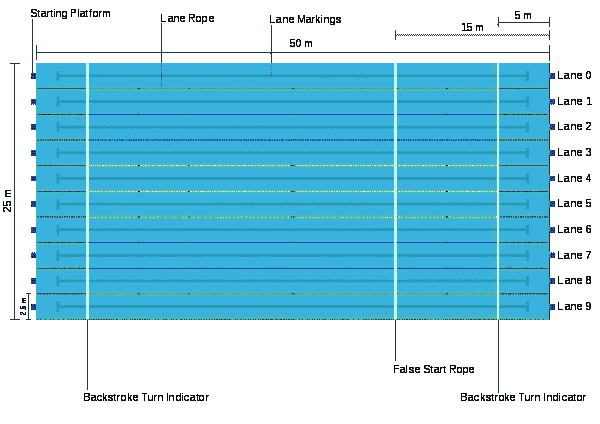

在最初的文章中，著名的[机场问题](https://en.wikipedia.org/wiki/Airport_problem)被用在一个人必须决定建造多大的机场跑道以及每个代理商将为这条跑道支付多少费用的地方。我会为自己开脱数学上的严谨，创造一个更接近我们现实的问题(除非你有飞机)。在我们的例子中，
我们住在一栋有 99 名居民的大楼里，并决定建一个游泳池。于是有两个疑问:
1)要建的池子的大小是多少；
2)每人应该贡献多少。

解决这个问题最传统的方法是投票，这个泳池会不会建，有多大，如果建了，我们平摊费用，不管你会不会游泳。

想象我们有三组人住在这栋楼里。第一组人不太喜欢游泳，他们想要一个小游泳池，比如 20 米长的。
- **B)** 第二组是休闲游泳者，通常使用游泳池，他们想要一个 30 米的游泳池。
- **C)** 最后一组由迈克尔·菲尔普斯和他的朋友组成，他们需要一个位于 50 米公寓的奥运泳池。

Michel Phelps happy to pay the right price on his new 50m pool.

游泳池的每一米都将花费相同的单位，1 美元。因此，如果我们做平均，我们将有一个 33 米的游泳池，价格为 33 美元，而如果我们做 50 米的游泳池，A 组和 B 组将支付比理想情况多得多的费用。Shapley 认为这是一种不公平的成本分配方式，并且对于池大小来说效率低下。为此，他想到了下面的策略。如果我们不考虑总成本，而只考虑边际成本，也就是说，因为其他人已经支付了一部分，所以多付了多少。既然汇款单干扰了结果，我们必须从这些边际成本的期望最低水平开始。因为如果 C 组先来，它将支付最多，而 A 组和 B 组将什么也不支付(同样的事情也发生在机器学习中！).当我们计算这个的时候，欧瑞卡！沙普利价值和公平价格！

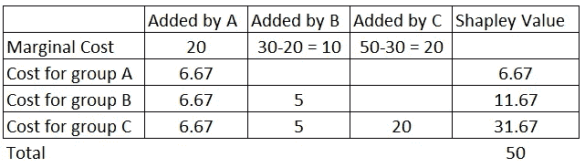

Table dividing Pool construction costs by Marginal benefits. Note that we started with group A who would like a 20 meter pool with a marginal cost of 20\. So we split this into 3\. After that we split the extra cost of the 30 meter (+10) meter pool between B and C, therefore +5 for each. Lastly, the difference from 30 to 50 meters is paid in full by group C.

任何想要 20 米泳池的人都要支付 6.67 英镑，想要 30 米泳池的人要支付 11.67 英镑，在这种情况下，迈克尔·菲尔普斯和他的朋友们将支付 31.67 英镑购买 50 米泳池。每个人都是赢家，这是应该支付的合理价格。

在机器学习中，由于变量总是相互关联的，因此变量进入贡献的顺序有很大的不同。例如，在决策树中，我们可能会在一个非常重要的变量之前随机选择一个次要变量，这将增加错误变量的重要性。为了解决这个问题，我们将平均所有可能的排列/订单的边际贡献，这将是贡献的公允价值。这就是为什么特性的重要性使用起来如此危险。这里是我的警告，不要使用它们，它们通常是不稳定的，而且通常与人类的直觉毫无关系。

Example when we are using Educ and Grit to predict wages. If we add Educ first, its importance will be 300 (real) + 100 (shared with Grit). If we add Grit first, it’s 200 + 100\. But when calculating the Shapley Value Let’s find the actual values ​​for the two variables, 300 for Educ and 200 for Grit!

这个理论并不复杂，但它是一个需要等待天才去思考的洞见，我们现在的问题是计算性的。一个已经知道了 60 多年的理论，为什么我们从那时起就不再应用它了？最大的问题是，她在计算上非常昂贵，我们需要等待第二个天才和慈善的灵魂来解决这个问题，并与社区分享。这些人是存在的，他们是斯科特·m·伦德伯格(Scott m . Lundberg)和 T4(Su-in Lee)，他们写了精彩的[文章](http://papers.nips.cc/paper/7062-a-unified-approach-to-interpreting-model-predictions)解释了如何计算沙普利值，并在[**【SHAP】**](https://github.com/slundberg/shap)(**SH**apley**A**additive ex**P**lanations)上提供了代码。我们现在可以计算诺贝尔奖和开源软件包支持的变量的数量。我们生活在一个多么美好的世界啊！

# 解释没有 Shapley 值的黑盒模型

让我们用一个包含房价和特征的数据集作为例子来说明我们的想法(这里有[代码](https://www.kaggle.com/sn3fru/interpreting-ml-model-with-shapley-value?scriptVersionId=22551189))。

让我们用热图和关联图来看一下相关性，以了解重要性的线性顺序:

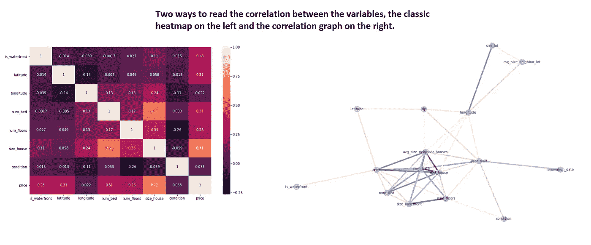

On the left our famous correlation heatmap, and on the right our correlation graph, both give the same idea, but I always prefer the graph because it gives a better idea of ​​which groups of variables correlate more quickly.

第一个错误是被简单的相关性冲昏了头脑。我们已经在[第 2 部分](/statistical-modeling-the-full-pragmatic-guide-7aeb56e38b36)中看到，变量都是相互关联的，当我们运行模型时，重要的是变量相互独立解释的程度，因此解释最多的变量可能解释与目标/ y 方差相同的方差。有时，相关性较低的变量与其他变量(即更具外生性的变量)差异如此之大，以至于它们变得更加重要。一种分析方法是线性回归:

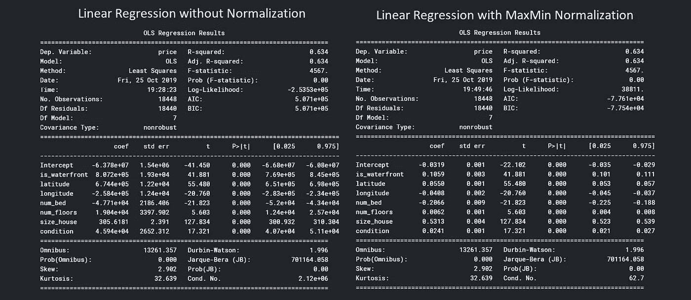

Same regression run twice with pure data (left) and normalized data (right)

现在我们需要小心，估计的 Beta 值(上表的 coef 列)不能被解释为可变权重，因为它取决于 X 方差。例如，纬度变量有一个巨大的系数 6.74e5，但变量 It 的范围从 47，155933 到 47，7777624。
size _ house 变量的系数较小，范围为 290-13540。这里衡量变量重要性的一种方法是看 t 检验，变量越大(绝对值)越重要，或者，正如我更喜欢在运行回归之前归一化数据(右总结)。
请注意，所有指标都是完全相同的，R、误差、t 检验、除了系数值之外的所有指标都是一样的，因为我们可以对数据进行归一化，并且可以直接比较这些值，而不会丧失一般性。因为我们已经失去了一些读取估计系数的敏感性，所以对线性回归进行归一化是不常见的。只有当我们使用正则化方法时，才有必要进行归一化。

此外，请记住，除非明确传递，否则线性回归不了解变量如何相互作用，因此它们可能有一些变量，即使相关性很差，也可以通过使模型更具解释性来帮助改变其他变量的权重。最后，我们的致命弱点是，这是一个线性模型，因此任何非线性都必须明确传递，否则它将成为偏差。所有这些都将在本系列的第 2 部分中得到最好的探讨。

Why we don’t use Xtreme Gradient Boosting

让我们使用我们的 Megazord 算法 XGBoost，它几乎解决了所有这些问题，因为它是一个低偏差算法(由于树结构，参见第 3 部分)和低方差算法，因为它是一个非常聪明的单个树组件(参见第 4 部分),并且低于 XGBoost 产生的 5 个特征重要性:

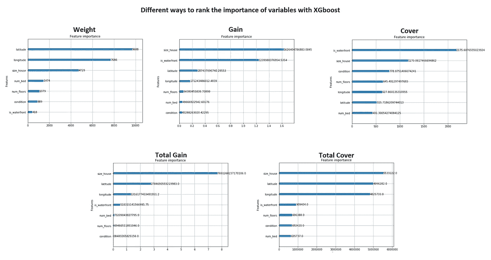

The 5 feature importance types available from XGBoost, I don’t recommend using any, but if you’re in a hurry, go with Total Cover.

用哪个？我可以写一篇很长的文章来解释每一个的机制，它的优点和缺点，但是如果我们说:不要使用它，我们很快就会知道 Shapley 值！

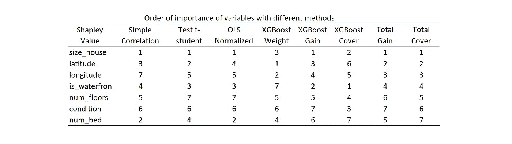

Summary of the different methods of ordering the importance of variables. The order of the variables in the first column is the * fair * order with Shapley value and the only method that can put the variables in the same order, in this case, was Total Cover, and although the order is the same, the dimensions are different.

# 用 Shapley 值解释黑盒模型

这里，我们将删除算法的所有参数化，只关注 SHAP，但必须完成控制偏差和方差之间的权衡、插补、平衡和其他步骤的所有步骤，否则模型可能会解释错误的变量。训练完模型后，我们执行以下操作:

要运行 shap，只需两行:

> 解释者= shap。tree explainer(model)
> shap _ values = explainer . shap _ values(X)

神奇的事情发生后，首先是我们的功能重要性

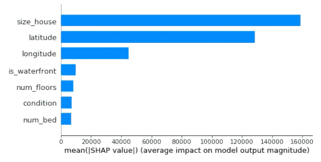

Feature importance with Shapley Value, among several advantages, such as having a solid theory behind, being more like human intuition, being stable, answers a number of mathematical axioms that can be found in the original paper.

以下是我们扩展的功能重要性，以及一些有趣的见解:

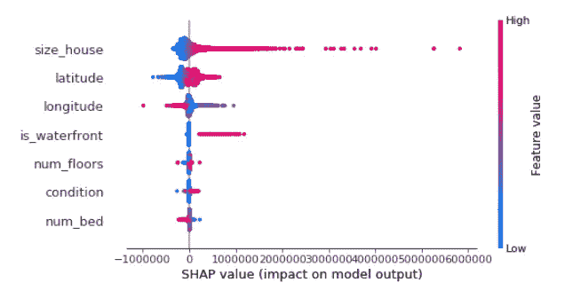

Detailed Importance Feature.

这个图表第一次看的时候很吓人，但是让我们看看它的不同维度。

它由点(这些彩色点)组成，数据集中的每个观察值为每个变量生成一个点，即使变量为空并由灰点表示。请注意，变量的顺序与特征重要性顺序相同，这不是偶然的，它是通过将颜色表的所有权重相加而形成的。

另一个维度是分布的形状，当你有一大堆点时，它把球堆成躺着的小提琴的形式。

第三个维度是点的位置，注意在零点有一个垂直轴，这个轴上的点表示变量没有积极或消极的影响，如果点在这条线的右边，它积极地影响目标，而在左边，消极地，离轴越远，影响越大。

第四个也是最后一个维度是球的颜色，但这更简单，蓝点表示低值，红点表示高值，这是为每个变量做的。

了解不同的维度让我们分析结果。首先，我们有房子大小这个变量，正如标准化回归告诉我们的，大房子对价格有正面影响，小房子有负面影响，这很明显，但我们走得更远。请注意，0 轴右侧的分布有一个长尾，蓝色已经全部集中在 0 附近，这表明非线性，大房子影响很大，但通过减小房子的大小，模型不再对房子的大小敏感，好像房子的大小只在阈值之后才重要。

is_waterfront 变量也有这种解释，但在这种情况下，它是一个哑变量(只取值 0 和 1)，在线性回归中，我们应该只有一个影响值用于此变量，但在分析汇总时，我们有不同的值。为什么？因为模型允许变量通过改变它们的值来相互作用。

# 分析个人预测

这个软件包的另一个巨大优势是能够向我们解释一个特定的预测，让我们用一个单独的数据集来预测它的价格:

Explaining the prediction of the first row of the dataset. This house has a 240k yhat. Note that Shapley Values ​​values ​​do not understand the entire house value, as they only represent the difference to the average value.

在这里，具有这些特征的房子的预测价值是 240097 美元。每个变量用一个彩色条表示，并表示它对预测的影响。蓝色条减少预测值，红色条增加预测值。

第二个例子是:

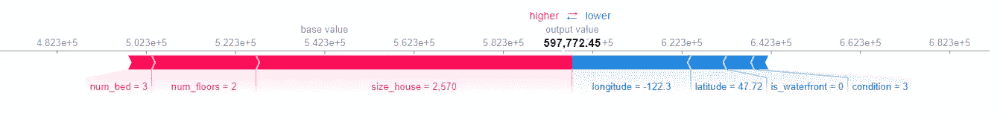

The same variable can have different weights or even different signals, because in low bias models like Boosting, the variables can interact in complex ways.

有人会想，如果我们对所有的观测数据旋转这些预测，把这些条像塔一样堆叠起来，我们就能从宏观上看到变量的行为。作者也想过，但他们把这座塔转了 90 度:

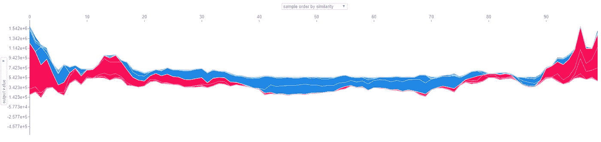

We can notice that both the impact of the variables

这个图表的一个有趣的特点是它是交互式的，你可以过滤特定的变量，按不同的影响排序，并对变量在你的模型中如何工作有丰富的见解。

最好的是最后，变量之间的依赖图。

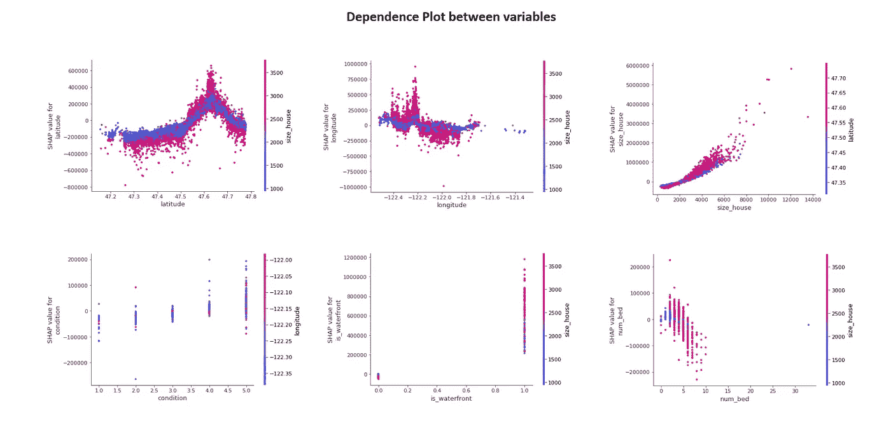

这些图表显示了变量如何相互作用，改变彼此的值。让我们关注右上图。房子的大小。请注意，它正在增长，甚至让人联想到线性增长，但为什么对于相同的房屋大小值，预测会有不同的影响？让我们把重点放在 4000u 大小的房子上。影响有很大的差异，因为其他变量与大小相互作用。尤其是纬度变量(赋予点颜色)。请注意，对于 2000u 以下的房屋，低纬度(蓝色)增加了房屋的价值，而在 2000u 之后，情况就相反了，
高纬度增加了同样大小的房屋的价值。当我们更仔细地分析数据时，我们注意到纬度较高的地方是城市中心湖边的房子，随着纬度的降低，这些房子变成了田地房子，更大的土地。

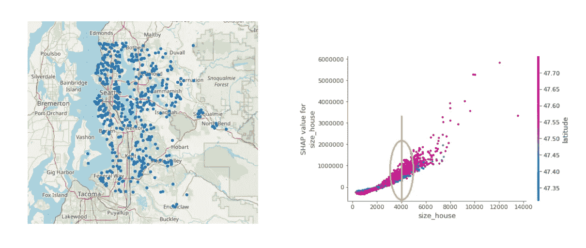

Example of interacting variables. Here we see the value of the latitude variable changing the return of house size to house price, and the real-world explanation lies in the nonrandom distribution of real estate. Houses near the lake are smaller and more expensive, and houses far from the center are usually less expensive per square meter and larger.

如果我们有一个线性模型，这些点必须排列在一条线上。但是由于这是一个低偏差模型，他可以理解这些复杂的行为。要进行真正的测试，让我们运行相同的 XGBoost，但 max_depth = 1，因此模型仍然可以理解非线性，但不能与变量交互，结果正如预期的那样，消除了相同 X 值的预测方差:

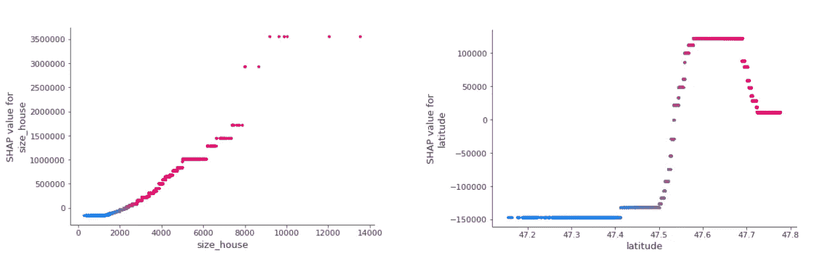

Trained model with maximum depth of only 1 tree break. Note that for the same size_house or latitude there is always only one impact value on the target as the variables stop interacting.

# 究竟如何解读沙普利价值？

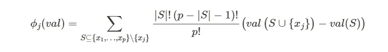

Shapley value of a feature is its contribution to target prediction, weighted and summed over all possible permutations between features.

我们已经说过，这是由坚实的理论支持的划分变量权重的唯一公平的方法。但是这个数字的确切解释是什么呢？

Shapley 值是该特征对预测值和平均值之间的差异的贡献，即我们到目前为止分析的所有数字都必须根据平均值进行解释。这在单个预测图中很容易看到，因为对于房价预测，我们几乎没有影响价格的变量，因为实际上它们正在改变预测的平均值。

# 次要用途

这可能的用途非常广泛，在作者的 github 库中，他给出了其他非常酷的用途，如排序、自然语言和图像，下面是一些来自那里的例子:

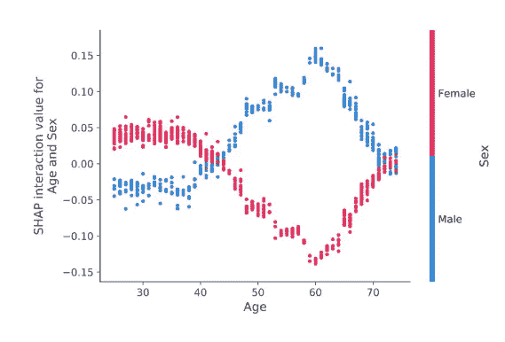

Risk of death by age. The interpretation would be as follows: If you are under 40 you are more likely to die for women. But if you are a woman and succeed and survive at age 40, the likelihood of death drops sharply and increases if you are a man.

SHAP 只为模特工作吗？

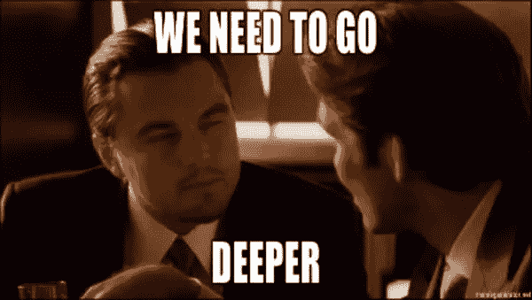

SHAP typically works with deep learning models.

不，SHAP 可以将深度神经网络应用到不同的环境中！

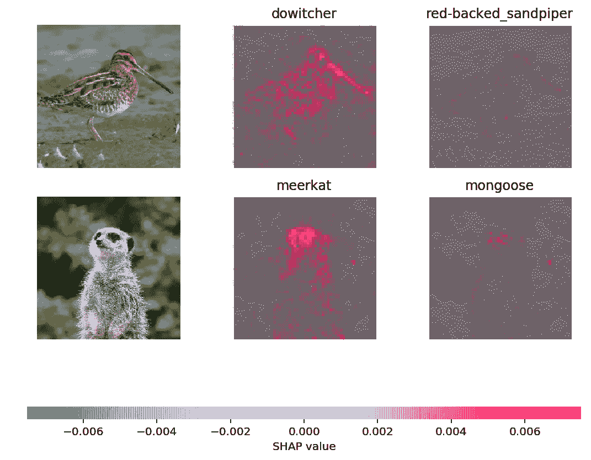

In this example the author uses a deep neural network to predict the species of animal, and the SHAP is able to display which pixels (since each pixel is a feature) impacts the predictions more or less.

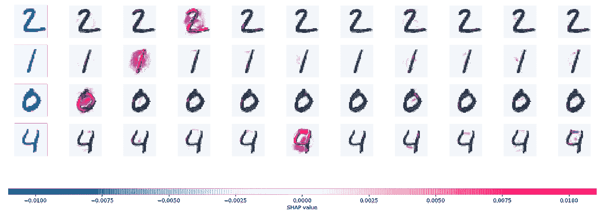

Similar to the previous explanation. Here Slundberg uses the classic MNIST dataset to explain digit predictions.

现在，你已经拥有了这个打开机器学习算法黑匣子的伟大工具，不要只是做出被动的预测，你现在可以向你的经理解释什么是推动你的业务的最佳杠杆。我必须开发的一个真实的例子是欺诈预测，在这种情况下，仅仅显示合同欺诈的可能性是不够的，我需要解释为什么这种联系被认为是欺诈，SHAP 帮助了我。例如，这可能有助于理解如何防范未来的欺诈。

我经常使用 shap 的另一个用途是在统计建模中。我们可以运行一个类似 XGBoost 的模型来了解变量的行为，哪些变量与哪些变量的交互更多，以回到我们节省时间的线性模型。

我使用 SHAP 的最后一个用途是了解我的模型是否有泄漏，即作为未来变量的信息泄漏。当我们对数据建模时，这是很常见的，我们无法控制表的构造，因为在绘制摘要时，最能说明问题的空值是明显的，Shap 值的一角会出现一系列灰点。

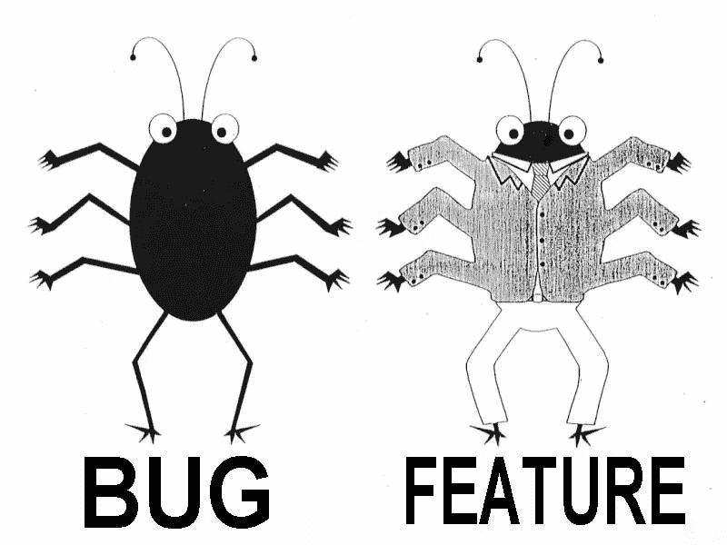

SHAP is also your friend when debugging your model.

也就是说，你可以使用 SHAP:
—了解你的模型在做什么，从而更加信任它；
—特色工程调试；
——应用这些预测帮助人类决策。例如，如果员工离开公司的概率很高，
如果解释变量可以是工资或其经理，则解决方案会有很大不同。
—帮助将因果推理模型建模为线性回归。

Beware, although it is a fairly robust method, it does not mean that your estimates are causal. For a causal analysis all measures of the statistical booklet remain valid.

这篇文章中使用的所有代码都可以在 [kaggle](https://www.kaggle.com/sn3fru/interpreting-ml-model-with-shapley-value?scriptVersionId=22614010) 中找到

另请参阅我们的系列文章:

*   [统计学简史](http://a%20brief%20history%20of%20statistics/)；
*   [数据科学家书籍、课程、电影推荐。](/how-to-become-a-data-scientist-2a02ed565336)
*   [数据科学](https://medium.com/swlh/data-science-and-the-data-scientist-db200aac4ea0) [的范围是什么；](https://medium.com/beacon-insight/ci%C3%AAncia-de-dados-e-o-cientista-de-dados-72634fcc1a4c)
*   [解释机器学习。](/interpreting-machine-learning-model-70fa49d20af1)

[*LinkedIn*](https://www.linkedin.com/in/marcosviniciusenator/) GitHub