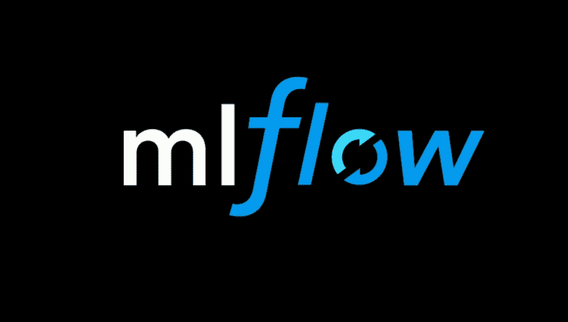

# 数据科学的终极工具特性工厂

> 原文：<https://towardsdatascience.com/the-ultimate-tool-for-data-science-feature-factories-55aed0f70974?source=collection_archive---------23----------------------->

正如 Splice Machine 的联合创始人兼首席执行官 Monte Zweben 在早期的一篇文章中所写的那样，[数据科学孤岛如何破坏应用程序现代化](https://medium.com/p/how-data-science-silos-undermine-application-modernization-14cee5ff3047?source=email-5d691d0967c--writer.postDistributed&sk=b16853df1e8c166a5a3fed480483148e)，任何团队都必须采取许多重要步骤来避免可能阻碍现代化进程的昂贵孤岛。其中最重要的两个是*为正确的功能创造正确的团队*和*通过功能工厂创造实验文化*。前者非常简单:找到统计专家、主题专家和 SQL 天才，你就已经在通往数据科学梦之队的路上了。我们在许多公司看到的最大挑战是后者，即功能工厂，尤其是我喜欢称之为**功能**组织的东西。然而，在我们开始之前，让我们定义一下什么是**特征**:数据科学中的一个特征是你的机器学习模型可以用来预测结果(标签)的一条信息。想象 Excel 电子表格中的一列；列越多，模型预测的基础就越多。

# **科学家需要什么数据:特征组织**

**功能组织**是将您测试过的每个功能、训练过的数据集和部署过的模型保存在一个有组织、有凝聚力的工作空间中的过程，可以方便地访问您团队中的所有数据科学家和工程师。现在，特征是*至关重要的* ***。*** 他们会成就或破坏你的模型；垃圾进，垃圾出。找到并最大化这些特征的信号需要时间、实验和“快速失败并继续前进”的文化。但是你实验、测试和创造的越多，就越难准确地记住你做了什么以及你是如何做到的。如果管道中出现问题，如果没有痕迹，几乎不可能找到罪魁祸首。这就是组织变得至关重要的地方。没有高质量的特征组织，你注定会生活在分散的特征、随机的超参数和不匹配的模型中。

# **科学家有什么数据:功能过载**

让我们考虑一下数据科学团队生活中典型的一天。一个由经验丰富的数据科学家组成的团队负责使用公司数据建立一个模型，以准确预测哪些订单项目将可用以及何时将它们交付给客户，也称为 ATP ( [可承诺量](https://www.splicemachine.com/real-time-order-promising/))。这是许多公司面临的一个重要问题，如果处理得当，可以大大减少损失，提高客户满意度。

团队迅速采取行动:SQL 专家开始用复杂的连接组织不同的表，使其易于接收和试验，主题专家利用她对供应链管理的深厚知识，开始起草将引入信号的有价值的功能，数据科学家开始阅读研究论文，寻找为问题构建的最佳模型，试验确定的功能。构建第一个 PoC 模型；不是很棒，但是大意是有的。他们讨论结果，调整特征，去掉一些有噪声的，然后再试一次。这次的模式稍微好一点，但是他们可以打败它；数据科学家转向神经网络架构。现在变好了，增加了更多的功能，[减少了，](/l1-and-l2-regularization-methods-ce25e7fc831c)增加了，增加了两个新功能，去掉了一个。精度降低，但 F1 提高，这是好事，对吧？添加一个隐藏层，然后删除，然后添加一些神经元。我们知道我们是否已经收敛了吗？事情变得非常复杂。

# **代价是什么:我们真的在尽最大努力做数据科学吗？**

作为一名数据科学家，我创建了无数的 Excel 电子表格，试图记住和记录我在每个实验中使用的功能、标准化技术、编码方案和模型超参数的微妙组合，以及每个实验提供的各种指标。这让人筋疲力尽、灰心丧气，并促使我选择我看到的第一个有效的模型，而不是仔细分析我的实验，寻找最佳可能的组合。最重要的是，当需要重新培训和重新部署模型时，我很可能忘记或放错了电子表格，需要从头开始调整。

我看到一些公司试图创建自己的解决方案来解决这一问题，尽管积极主动的方法令人钦佩，但推出自己的解决方案会占用团队的宝贵时间和资源，而他们本可以将这些时间和资源用于实际的数据科学研究。更糟糕的是，这不是一次性投资，因为随着新库的发布和旧库的改进，任何自主开发的解决方案都需要持续的维护和更新。

# **特征工厂的开始:MLFlow**

这是开发过程中工程师们开始关注不可思议的开源社区的时候了。 [MLFlow](https://mlflow.org/) 是数据科学社区中我最喜欢的开源项目之一，因为它重新定义了特性组织，并推动了特性工厂的创建。它标准化了整个数据科学工作流的治理流程，从总体实验到单次运行试验，再到团队中的各个数据科学家。MLFlow 允许您按照自己的意愿精确地(或广泛地)跟踪您的流程，并让您的数据科学家有时间去做真正重要的事情。每一个超参数调整、每一个特性变化、你能想到的每一个可能的度量标准，都记录在一个有组织的位置(下一篇文章将详细介绍)。

所以你有了你的理想模型，每个超参数都调整到完美，你已经从你的特征中提取了最大量的信号，现在呢？MLFlow 也使部署变得简单。只需几行代码，您就可以让您的模型在 SageMaker 或 AzureML 上实时运行，而不管您选择的库是什么，通过简单的 API 就可以实时获得您的预测。MLFlow 是让你的团队保持同步的工具，让他们专注于手头的任务，并让他们直接行动**。**

在 Splice Machine，我们围绕 MLFlow 构建了一个名为 [ML Manager](https://splicemachine.com/product/ml-manager/) 的包装器，我们每天都在实验中使用它。它与我们的数据库本地连接，并允许我们跟踪和部署我们在源位置构建的模型。它使我们的内部工作流程更有条理，我们的客户也非常喜欢它。您可以[点击此处](https://splicemachine.com/product/ml-manager/)了解更多关于 ML Manager 和拼接机器平台的信息，或者[注册](https://info.splicemachine.com/operationalize-ml-webinar-recording.html)观看关于如何操作机器学习的网络研讨会。

**更新**:关于 MLManager 和 MLFlow 的更深入的技术回顾和一些代码示例，请查看我的[后续文章](/feature-factories-pt-2-an-introduction-to-mlflow-873be3c66b66?source=friends_link&sk=f6194169c3e8b5f9a9ae91ed701ab146)。