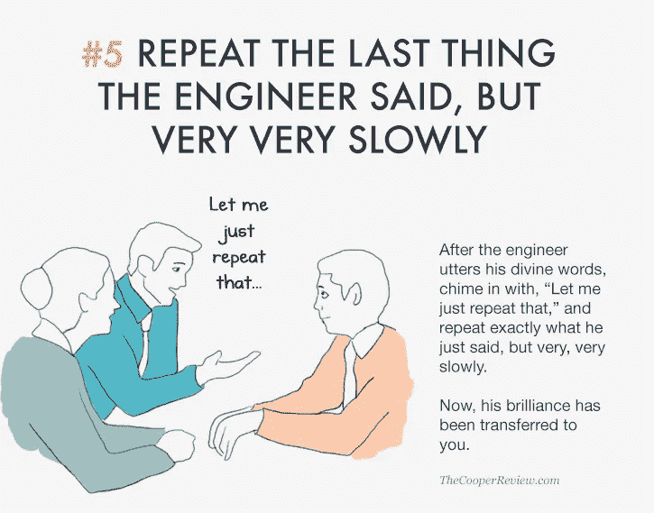

# 成为 at 数据科学家的不确定不全面的指南

> 原文：<https://towardsdatascience.com/the-un-definitive-un-comprehensive-guide-to-becoming-at-data-scientist-39593b27b1dc?source=collection_archive---------19----------------------->

## 帮助你成为数据科学家的小贴士。

So you wanna data science, huh?

我在 LinkedIn 上相当活跃，不时会看到关于“如何成为”数据科学家的文章。我发现这些文章中的许多都是基于作者/数据科学家的视角，非常主观，我发现自己不一定同意所有的建议，或者至少不同意成为数据科学家需要具备的条件。

我想，如果我不同意所有这些文章，我会写我自己的，可笑的怀疑，版本。事不宜迟，我列出了成为一名数据科学家需要具备的条件。

# **1。停止阅读数据科学家关于如何成为数据科学家的列表。**

看了这篇文章，你就失败了。

Whoops.

等等，不，你没有。让我重新开始。

# **1。通过快速失败和快速灵活的转变，你可以学到很多东西。**

有些事情是学校教不了你的，而实践经验可以。照本宣科通常不是你在新工作中学习的方式，相反，你会不断尝试不同的解决方案，向你的利益相关者提出不同的想法，直到有一个坚持下来。在整个过程中，你要记下你哪里失败了，哪里可以改进。

此外，你可能在快节奏的工作中工作，或者在截止日期的压力下工作。你可能没有获得完美解决方案的奢侈。你必须弄清楚你能从一个最低限度可行的产品中获得多少百分比的覆盖率，并且当你不可避免地遇到阻碍时，一定要转向不太明显的解决方案。

现实是，在很多工作中，变化是唯一不变的，以不太完美的方式灵活解决问题的能力是现状。我说拥抱它。随着时间的推移，你会学到很多关于如何迭代和成为更好的问题解决者的知识。

我觉得学校和训练营教你用干净的教科书来解决问题。但是解决工业中的问题并不能反映出上述环境的清洁程度。

当学习任何与数据科学相关的技能时，不要让完美阻碍你的学习。允许自己犯错。尽可能寻求对你的错误的反馈。问很多问题。失败是收集知识的最好方法之一。不要害怕弄糟你的家庭作业，你的个人爱好项目，或者你在工作中做过的模型。

# **2。学习如何与你的同事、同事和客户交谈。**

Repeating things will either make you look smart, or just very slow on the uptake.

让我给你一个假设的场景:你在一家医疗保健公司工作(像我一样！)你正在思考医生如何更有效地管理他们的高危人群。您希望构建一个模型，在该模型中，您可以预测出在未来六个月内，特定医院因心脏相关诊断而就诊的急诊数量。

你决定建立一个模型。太好了！

你的第一步是什么？也许收集一些数据，做一些探索性的分析，建立一个 MVP 模型，看看你的模型是否合适。听起来不错。

好吧，那么，谁来消费你的模型呢？它是否解决了您的客户正在寻找解决方案的一系列特定问题？

当然，你是绿光资本投入生产的许多业务高层食物链上的数据科学家。你是如何传达这种模式的价值的？提前六个月预测急诊就诊对患者护理和价值节约有什么帮助？你有和这个预测相关的金额吗？这如何可能降低您客户的劳动力成本，并潜在地释放资源投资于其他类型的患者护理？

你想过如何解释这个模型的机制吗？你使用的是 **ARIMA** 还是**时序回归**模型？或者你在考虑一个更复杂的黑盒模型，比如神经网络，比如 T4 LSTM T5？你打算如何解释这些解决方案是如何将输入转化为输出的？

我之所以提到这些(不那么)愚蠢的问题，是因为你的沟通技巧对于获得各级同事的认同至关重要。

请这样想:在数据科学的食物链上，您可以通过三个步骤来为模型的开发开绿灯:说服您的数据科学同行，说服您的业务利益相关者，以及说服潜在客户。特别是关于你的模型的价值。

想想你会如何与这三组人交谈。你会像和 MBA 一样和数据科学家交流，像和医生一样交流吗？可能会有重叠，但是你仍然需要对你的想法进行大量的剪裁。

此外，我从更专注于产品的数据科学家同行那里获得的关于他们自身经历的智慧尤其让我深受启发。作为一名支持产品的数据科学家，你不可避免地要与产品经理合作，为公司成功推出新产品。当推出一个产品、功能或模型时，你如何定义成功的衡量标准？你如何与你的利益相关者一起 1)开发假设，2)开发一个框架来测试这些假设，3)使用分析/机器学习来支持/拒绝这些假设，以及 4)使用这些结论来推动有价值的商业问题的答案？

学习这些技能是很棘手的，但是我已经习惯于找出我可以观察和学习的导师。我寻求各种利益相关者的反馈，看我如何改进。我和我的经理一起评估我认为可行的方法，以及可能不可行的方法(参见第 1 条的趋势？).

在许多这种情况下的共同点是学习如何像走路一样说话。**说清楚。善于沟通。永远不要假设任何人都知道你在说什么。**

# **3。了解您想要走哪条“数据”路径，并专注于磨练帮助您沿着这条路径导航的技能。**

如今有许多“数据科学家”的分类。当我阅读关于如何成为一名数据科学家的文章时，他们越来越让我反感，因为他们将培训视为一刀切的方法。迄今为止，数据科学对不同的人和不同的组织有不同的含义。概括地说，我见过一些关于数据科学的宽泛定义。[我特别喜欢 AirBnB 将数据科学专业二分法，但他们的方式绝不是“黄金标准”。](https://www.linkedin.com/pulse/one-data-science-job-doesnt-fit-all-elena-grewal/)

你更感兴趣的是讲故事、探索数据片段、挖掘隐藏在数据下的秘密吗？也许你是一名**数据科学分析师**，专注于构建故事，并在涉及任何面向数据的事情时成为一名侦探。

您是否对构建模型和算法更感兴趣，用您的编程能力做许多繁重的工作，并实现为产品提供动力的模型？也许你想考虑成为一名**数据科学构建者或数据科学建模者**。

或者，你可能喜欢做实证测试，提出假设，使用各种研究方法确定如何得出因果结论，然后使用统计数据来验证这些结论。也许你可能是一个专门从事推理的数据科学家。

这些只是数据科学各个方面的例子。大多数分类法都有重叠的技能，尽管如果你更倾向于成为一名数据科学分析师(像我一样)，你擅长将数据拼凑在一起，编织一个故事，并交流结果。你可能知道如何建立模型或进行 A/B 测试，但这不一定是你的专长(或兴趣)。

# **4。明白你绝对需要正确的技能和力学基础。**

这是学校可以帮助你的地方，这是肯定的。从长远来看，拥有一套技术技能的基础将为你的成功做好准备，至少在学习最新的花式技术或最新的尖端工具方面。

这是什么意思？首先，理解一定程度的统计学。我建议从基础(比如描述性和推断性统计)开始，一直到基本的建模技术(至少学习回归模型的机制)。你会惊讶这将带你走多远，因为对这些主题核心的基本概念的理解将允许你更快更容易地学习更复杂的技术。

我是一名受过训练的心理学家，所以从技术上来说，数学对我来说从来都不是天生的。但是通过我所有的统计学课程，我学到了微积分和线性代数的知识。理解这里的基础知识会让你更容易理解你所使用的模型的机制。所述数学的使用将因公司、团队和项目而异。如果你正在构建算法，你可能会花时间复习微积分和线性代数，但如果你没有，你可能只需要知道一些基本知识就可以了。您的里程可能会有所不同。

最后，编程技巧。Python。R. SQL。可能是 Scala 和 Java。去读几本这方面的书吧。观看 Udemy/Coursera/Data Camp 视频。做黑客等级和/或 LeetCode 练习。不可避免的是，你会在面试中测试你的编程技能，所以我建议你能流利地掌握一些语言。同样，你的里程数可能会根据你需要深入的程度而变化:你可能在一个经常将代码放入产品的团队中，所以你可能会从做大量的在线编码挑战和了解一些基本的计算机科学中受益。或者，也许你所在的团队有更熟练的数据工程师将你的代码投入生产。拥有用 python 编写(潜在的模块化)脚本的技能可能就足够了。

如果你真的在寻找资源，你可以随时查看这些链接，寻找[编程](http://bfy.tw/Lfzm)和[机器学习](http://bfy.tw/Lfzi)。

(不过说真的，搜索各种资源来学习所需的技能并不太难)。

就我个人而言，我读了几本书(并做了笔记)，从事业余爱好项目来学习 R 和 Python，并通过做编码挑战来进一步完善这些技能。

Programming looks EXACTLY LIKE THIS in real life.

# 我的心得:数据科学是一个巨大的领域，你能做什么，需要的技能千差万别。

然而，你会注意到，我把软技能放在这个列表的第一位，因为我认为，以我最无知、最不完美的观点来看，这些技能会让你在职业生涯中走得更远。任何人都可以拿起一本教科书，用最热门的语言学习最新的花哨算法或程序，但我读过的大多数列表似乎都忽略了这项工作最困难的部分之一:学习如何学习(再次)以及学习如何在多元化的团队中协作，就像一台润滑良好的机器。

*米歇尔·塔特(Michelle Tat)是一名居住在大波士顿的反同性恋美籍华人活动家。她目前是 athenahealth 的产品分析经理，也是马萨诸塞州变性人政治联盟的联合主席。你可以在推特上找到她关于数据、社会正义和猫的帖子。*