# 游戏设计中的恐怖谷

> 原文：<https://towardsdatascience.com/the-uncanny-valley-in-game-design-6a6c38a36486?source=collection_archive---------6----------------------->

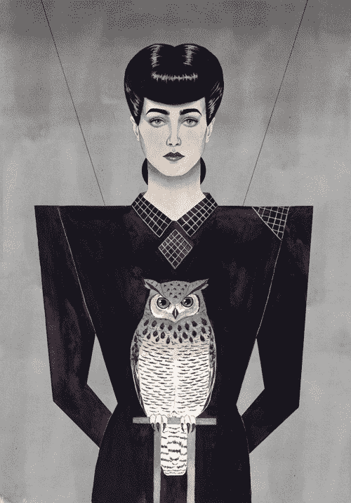

## 创造不会让玩家毛骨悚然的类人角色

恐怖谷的概念是由一位名叫森昌弘的日本机器人专家在 20 世纪 70 年代提出的。森喜朗也是第一届日本机器人制造比赛 [**Robocon**](https://en.wikipedia.org/wiki/ABU_Robocon) 的创始人，也是研究机器人技术形而上学含义的 Mukta 研究所的主席。

森喜欢设计机器人，而且他也很擅长。他学得越多，他的作品看起来就越逼真——有人造皮肤、会动的眼睛和其他神奇的技艺。但是 Mori 注意到了一些有趣的事情:虽然简单的机器人引起了周围人类的积极反应，但是它们变得越逼真或像人，人们就越害怕它们——即使它们是机器人的优秀例子。

森注意到的是，在事物与人类的相似程度和我们的情感反应之间存在着某种关系。

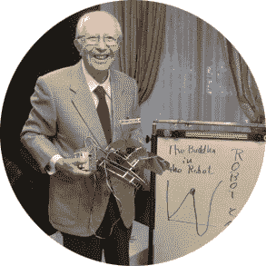

所以，他创造了一个图形来代表他的发现，关于我们如何对类似人类的事物做出反应

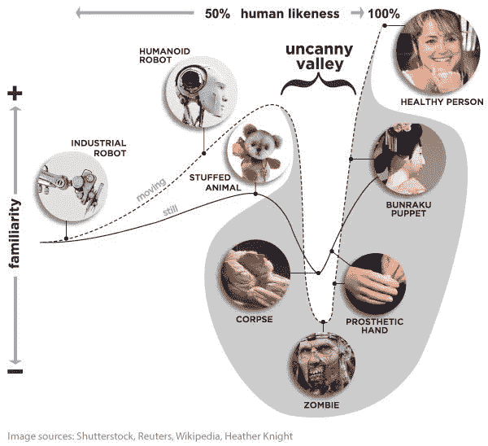

该图形有**两个轴**:

*   **人类相似度** *(横向*)，意思是机器人和一个活生生的人有多相似；和
*   **熟悉度** *【垂直】*，或者机器人在观看或与之互动的人身上是否产生积极或消极的情绪。

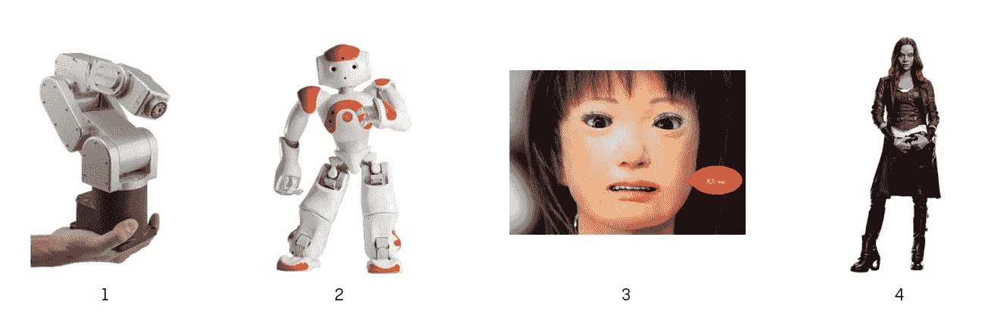

1.  我们从**相当熟悉的**开始，但是**看起来不太像人类**:一只**机器人手**(例如 Mecademic 的 [*Meca500*](https://www.mecademic.com/products/Meca500-small-robot-arm) *用于工业用途)。从情感上来说，我们对此持中立态度。*
2.  当我们沿着“*人类相似度*”轴移动时，我们会发现一个**人形机器人**(在这种情况下，毗湿奴工程公司的[*【NAO】*](https://www.indiamart.com/proddetail/nao-humanoid-robot-17671491230.html)*，*虽然填充动物也可以)。我们给物体添加了人类的特征，这使得**更有吸引力**——我们认为它有“*个性*”，或者在这种情况下，它很可爱。
3.  但是如果我们太接近真实的人类，我们不会做出太好的反应，这让我们感到不安。我们现在在神秘的山谷中间。
4.  当我们最终穿过山谷，移动到右上角时，我们又没事了。没有令人毛骨悚然的感觉，没有不可思议的负面反应。唯一的一点是，到目前为止，**只有人类栖息在这边**(没错，绿人还是人类)。我们在技术上还没到那一步，无论是机器人还是数字角色。

## 关于运动的一个注记

如果我们考虑静态的**和移动的**角色，那么**曲线与**略有不同。运动有助于感知“*活着的*”和“*有感觉的*”，例如 Travis，由位于 [IDC Herzliya](https://en.wikipedia.org/wiki/Interdisciplinary_Center_Herzliya) 的媒体创新实验室和[佐治亚理工](https://gtcmt.gatech.edu/)音乐技术中心开发:

但是移动的角色也会让我们毛骨悚然，看看 [Spot](https://www.bostondynamics.com/spot) ，由 [Boston Dynamics](https://www.bostondynamics.com/) 创造的——或者下面这个引起噩梦的婴儿:

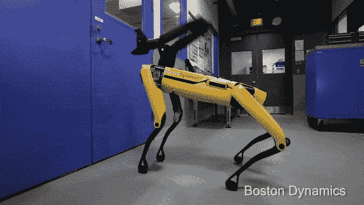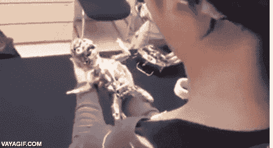

游戏可以…嗯，给我们一些有趣的小故障。不完全令人毛骨悚然，但如果你想要现实主义和沉浸感，你可能会想避免这些:

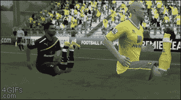

# 为什么会有恐怖谷？

人们似乎一致认为**恐怖谷与期望有关。我们期望事物，尤其是人类，以特定的方式看待**和**表现**。****

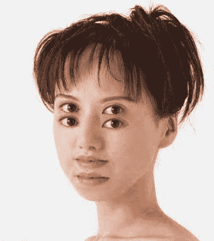

例如，我们习惯于看到别人的脸(虽然我在家工作，而且我的大多数 twitter 朋友都是机器人；).我们也可以如此浮躁，这真的很有趣。你看了左边的图片了吗？对你来说是不是也很模糊不舒服？

我们不能轻易接受一张不符合我们期望的脸，**我们的大脑会试图纠正它，**让它符合我们认为的**人类应该有的样子**。

发生这种情况的原因是因为，作为智人，**我们已经进化得非常擅长辨别面孔**。

人类的面孔已经变得独一无二，因为我们通过视觉(而不是气味或声音)来识别彼此。我们的面部变化实际上通过进化得到了增强。例如，人类**基因组**比身体的任何其他部分都有更多的**区域**来决定**脸型变异**。

同样令人惊讶的是，我们在 [***尼安德特人***](https://en.wikipedia.org/wiki/Neanderthal)*和 [***丹尼索瓦人***](https://en.wikipedia.org/wiki/Denisovan)*(我们最亲近的亲戚)身上发现了类似的变异，所以我们早就善于用我们的面部来检测和表达情绪了！**

****

**Hominid sculpture reconstructions by [Adrie and Alfons Kennis](http://www.kenniskennis.com/site/Home/)**

**现在，围绕着**有一场争论，在我们对看起来像人类但不完全真实的机器人感到不安的背后，是哪种** **机制。这些是最大的竞争者:****

*   ****择偶。**自动厌恶免疫系统无效的配偶——通过面部和身体特征可见。**
*   *****死亡率凸显。与生俱来的对死亡的恐惧和文化上支持的应对死亡不可避免性的方式。*****
*   *****避开病原体。通过引起厌恶反应来避免潜在的病原体来源。惊恐和厌恶的反应就像尸体和明显有病的人。*****
*   *****违反人类规范。*** 我们以人类的共情、智力等标准来判断机器人/实体。**
*   ****宗教对人类身份的定义。**对人类身份概念的威胁。民间传说，创造类似人类但没有灵魂的生物。**
*   *****相互矛盾的知觉线索*。**已证实*知觉紧张*与类别成员的冲突线索。厌恶混合实体。**
*   *****对人类独特性和身份的威胁*。**挑战人类的独特性——人类性的重新定义。**

## **机器人和共情**

**但是我们的感情是双向的吗？我们是否也能像与生物交流一样与机器人交流？不管是好是坏…似乎我们可以！**

**让我告诉你关于 [Pleo](https://en.wikipedia.org/wiki/Pleo) 的事情。Pleo 是 Innvo Labs 在 2006 年创造的一个电子宠物恐龙玩具，它有很多很酷的功能，如摄像头，触摸和倾斜传感器，麦克风，红外线和其他功能。**

**最近，一项研究使用 [**功能磁共振**](https://en.wikipedia.org/wiki/Functional_magnetic_resonance_imaging) (通过检测与血流相关的变化来测量大脑活动)来观察与人类**相比，人们**对**机器人**的**有多同情。这是受访者看到的视频(我觉得它应该有某种触发警告！):****

*****A* [*study*](https://www.sciencedaily.com/releases/2013/04/130423091111.htm) *from the University of Duisburg-Essen in Germany using* ***functional MRI*** *to see how much people empathize with robots compared to humans.*****

****如果你真的和研究中的大多数人一样同情 PLEO，你会忍不住想知道人机互动关系的含义。****

****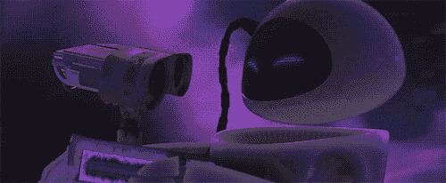****

****你觉得 PLEO 不好的原因是，如果我们有很多机器人特征而很少人类特征的东西，人类角色会更加突出。反过来说，**机器人脱颖而出**。****

****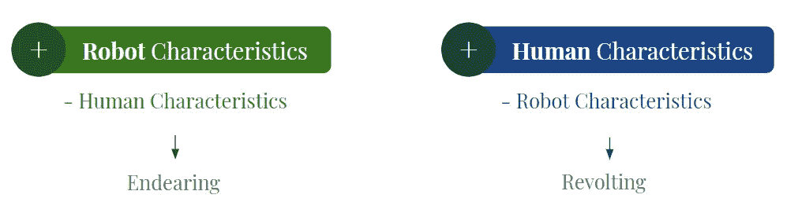****

****如果某种非人类的东西被赋予了人类的品质，我们会觉得它很可爱。如果我们赋予它太多的人类特征，它开始看起来像一个不完美的模拟(因此可能会令人反感)。****

****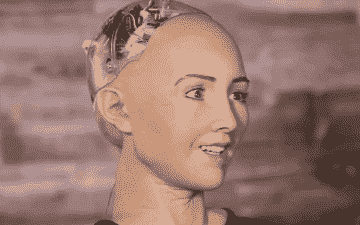****

# ****游戏中的恐怖山谷****

****我们希望游戏角色变得**可爱**，或者至少**可信**。因此，它们需要在图表的上半部分。也就是**如果**你希望他们讨人喜欢！如果没有，你知道在哪里寻找怪物的想法；)****

****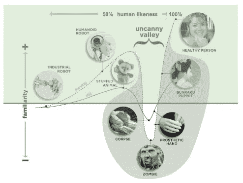****

*****Recommended Area (for likable characters!)*****

****因为它们需要在图形的一个顶点上，所以它们可以是风格化的**(像人形机器人或毛绒熊)或照片逼真的**:********

****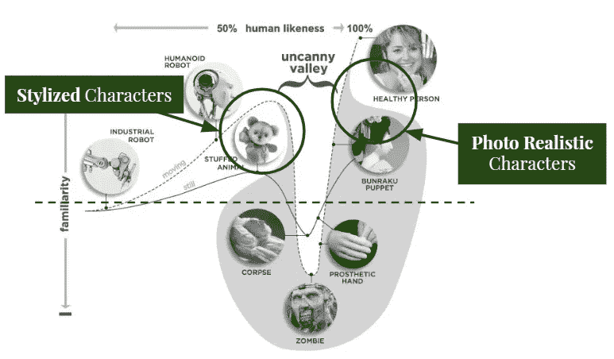****

# ****照片写实主义****

****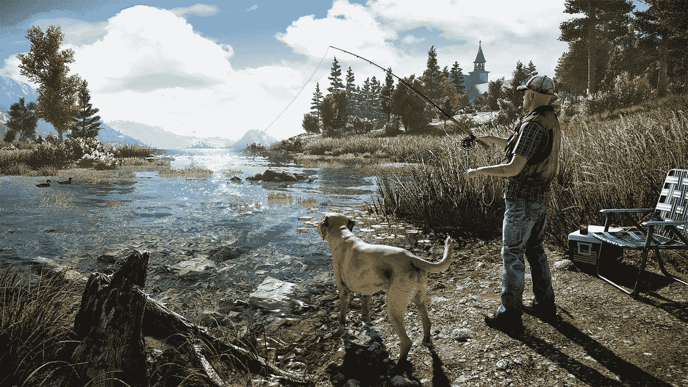****

*****(Far Cry 5, Ubisoft 2018)*****

****照片写实游戏的目标是看起来和照片或者现实生活没有区别。或者比现实生活更好，我们将在下面看到。****

****在这种类型开发的优势中，我们可以看到照片逼真的游戏以一种视觉上可信的方式模拟现实，这使得它们通常更具沉浸感。****

****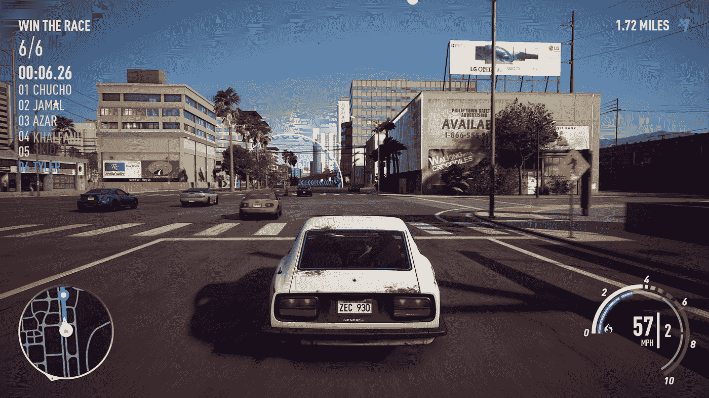****

*****(NFS Payback, Polygon 2017)*****

****然而，照片真实感的开发通常更加昂贵，并且需要更大的团队协同工作。****

****这也更加**复杂，**必须考虑到纹理、模型、运动、光线和表演等创造可信体验所需的因素。****

****这使得隐藏**错误**更加困难，因为模拟的每个方面都需要打磨到完美。****

## ****当现实主义出了问题…****

****创造一个完整的体验需要很多层次。如果少了一个，所有的东西都会倒塌。****

****我记得《最终幻想》*电影上映的时候。像世界各地的其他高中生一样，我的朋友们&我是绝对的书呆子，他们已经知道自己想和计算机打交道。当电影终于上映时，我们都非常兴奋…也非常失望。我们所能看到的只是角色们怪异的表情，一个我们无法逾越的深渊。不久之后，随着电影 ***《极地特快》*** 的发行，以及最近游戏 ***质量效应《仙女座菌株》*** 的首次发行，这种情况注定会再次发生。*****

****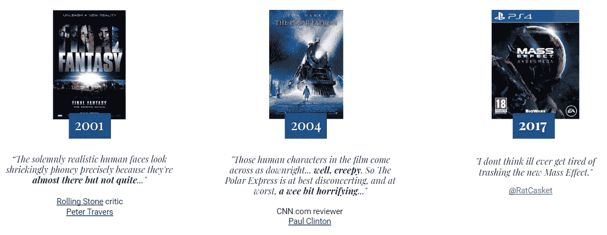****

****许多人对 Mass Effect 2017 年的反响感到惊讶。由于对对话动画**过于雄心勃勃的改进**和大量的故事要播放，他们没有时间将**动画应用到正在说话的角色嘴**以外的面部部分。****

> ****文字、多人游戏、游戏性以及除了动画之外的一切都有各自的优点和缺点，但在可预见的未来，当谈到这款游戏时，粉丝们首先会谈论的是 ***人们说话时的表情有多怪异*** *。这不是抱怨，这只是一个最古老和最明智的公理的又一次重复:链条的强度取决于它最薄弱的一环。* [The Kenpire](https://thekenpire.com/2017/03/25/mass-effect-andromeda-the-uncanny-valley-and-the-looming-threat-of-memes/)****

****只制作一个虚拟角色的嘴的动画会是一个问题，我们将会看到为什么。****

## ****虚拟角色对精神变态的感知****

****波尔顿大学的安吉拉·汀威尔**做了一个很棒的研究，他们使用回归分析来追踪用户面对这种纯嘴动画的反应。******

************

******如果一个角色**在眼睛区域**缺乏对情绪状况的可见反应，这就会唤起一种与愤怒、冷酷、支配、漠不关心和不值得信任的关系——所有这些特征都与精神变态有关。******

******因此，类人虚拟角色中不充分的上部面部动画可以*唤起不可思议的*，这是由于对角色中**心理变态特征**的感知。例如，表现出对尖叫声没有惊吓反应的角色被认为是最不可思议的。什么，我们没有计划让你的角色对周围的声音做出反应？******

******但是如果你有足够的面部动画和注重细节的团队，你可以创造出类似于《刺客信条奥德赛》(育碧，2018):******

******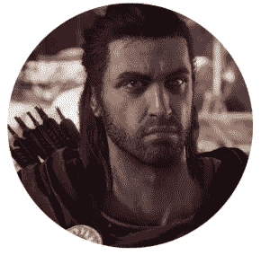******

******表达是如此之好，它几乎使这篇文章毫无意义！******

## ******图形保真度与人类保真度******

******要点应该是，你可以拥有一个看起来不可思议的游戏，但除了草，每个个体在夏日微风的抚摸下看起来都很美，**图形保真度** **不一定意味着人类保真度**。******

******而且你需要**两个**来创造一个**现实体验**。******

******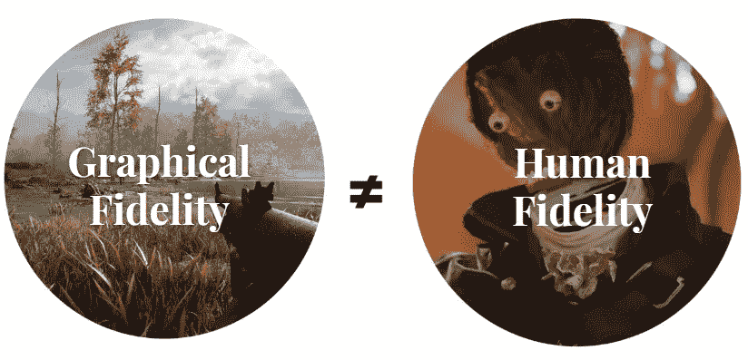******

******因为我们对人脸、表情和动作如此敏感，所以我们需要尽可能覆盖所有感知领域。******

******那么，我们如何才能创造一个现实的和人性化的游戏体验…？******

******实现**人类保真**的最好方法就是**观察*****利用*** 人类作为我们的基础。我们可以捕捉动作，也可以捕捉整个演员的表演。因为当你使用面部和身体捕捉时，你会…******

## ******虚拟世界中的实时电影技术。******

******有机会玩[塞纳的牺牲](https://www.hellblade.com/)吗？我第一次看到预告片的时候就很敬畏。这是其中之一:******

******下面是他们如何实现如此美妙和人性化的表达:******

******当然，我们不希望事情看起来很真实，我们希望它们听起来和感觉起来也很真实。我想不出比《巫师 3》更成功的故事了。******

## ******逼真的电影对话******

******对于《巫师 3》，对话在 **4 个阶段中创建:写作、任务设计、对话设计**和**后期制作**(包括修改相机、创建空闲、动画手势以及纠正面部和姿势)。******

******总共有大约 2400 个对话动画，最棒的是:它们都是可重复使用的！不同角色之间支持共享。这里有一个小总结:******

******游戏的设计者所做的是添加对**实时预览**的支持，这允许创作者轻松地在场景中移动角色，同时他们可以通过在编辑器旁边预览整个**场景来检查他们的结果。不仅如此，只需点击一下鼠标，场景就可以在预期的世界位置播放(渲染)。********

******Real time dialog creation or The Witcher 3******

# ******格式化******

******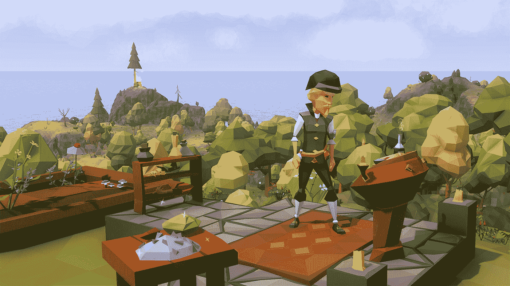******

*******(Ylands, Bohemia Interactive 2017)*******

******现在除了现实人物之外的另一个选择。**风格化**是指**简化**在形状、颜色、图案和表面细节方面，以及在功能和与场景中其他物体的关系方面。******

******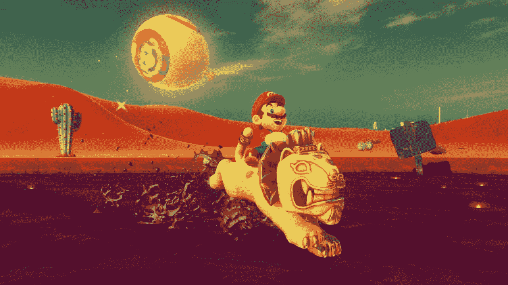******

*******(Mario Odyssey, Nintendo 2017)*******

******风格化的好处之一就是人物不是人，这让他们的**人性特征**更加突出。此外，风格化允许几乎**无限多种设计**。******

******另一方面，角色可能不会像照片般真实的角色那样引起我们的共鸣，因为他们不是“人类的 T21”。如果简化破坏了模拟的真实性，这种体验就不那么身临其境了。******

******风格化有几个层次，但一般来说，游戏倾向于分为**过度夸张的**和**极简的**。******

## ******过分夸张的风格化******

******在这种情况下，重点是**更大的细节和形状**，而不是在具有真实图形的游戏中常见的小细节和微表面。[**fire watch**](https://www.firewatchgame.com/)**是 **2016** 出的一款过分夸张的游戏，没有让人失望。********

******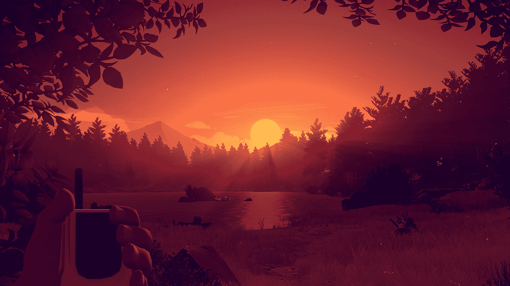******

*******(Firewatch — Campo Santo, 2016)*******

******游戏设计师决定使用复古国家公园海报的**风格和颜色。丰富的色调和卡通动画看起来并不真实，然而游戏却令人难以置信**身临其境**——尽管不仅仅是从视觉角度来看，故事也很引人注目。********

> ****由于没有与现实世界进行比较，玩家可能会真正迷失。利比·凯勒，奥德赛****

## ****极简风格化****

****相对而言**平淡**，极简风格化玩的是简单。它通常**去除了所有中等和小的细节，**并且可以例如仅使用彩色地图。我们有像[**《我的世界》**](https://www.minecraft.net/es-es/) 这样伟大的极简游戏，其中一个立方体比一个像素多一点，但充满了创造新的伟大事物的潜力。****

****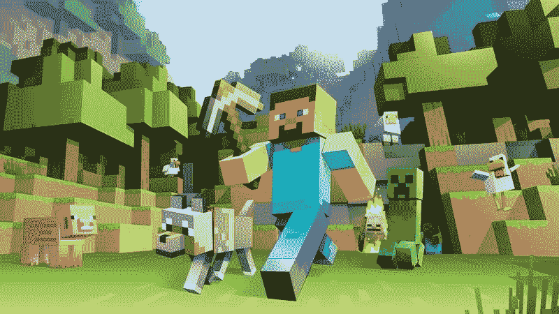****

****(Minecraft — Mojang, 2011)****

> ****无论我们是在谈论太空入侵者还是通道，像素艺术的部分吸引力在于, ***简单性避免了我们的注意力浪费在细节上*** *比如凹凸贴图，让一切看起来像湿塑料。玩了几分钟后，我们在《我的世界》看不到立方体，我们看到的是海洋、堡垒、隧道或树屋。爱好 GameDev。*****

## ****机器人中的极简风格化****

****最后是一个成功的极简主义机器人的小例子——因为我们可以爱上任何一双可爱的眼睛！2018 年首次亮相的**本田 3E-A18 机器人装置**:****

# ****最后的想法****

****如果你想创造一个可爱的角色，从哪里开始呢？首先，你需要选择一个方向:**风格化**或者**现实化。你的道路可能取决于你想做的游戏类型、团队和你可利用的资源。******

****如果你选择**现实主义**，你将需要额外关注每一个细节，并且很可能在后期制作上花费很长时间。如果你选择**风格化的**角色，你将需要关注他们的个性，关注会脱颖而出的人类特质。****

****无论你做什么，你都需要确保它是一个**一致的体验**，它有 ***保真度*** 。****

****最初，游戏要求角色只是**一个进入他们虚拟世界的入口**。这很容易通过令人愉快的卡通如马里奥和索尼克，或者英雄原型如萝拉·卡芙特来实现。某些类型，主要是 RPG，走得更远，提供了丰富多彩的个人演员阵容，每个人都有自己的个性和动机。****

********

****Evolution of games and their characters****

****今天我们有像[《刺客信条》](https://store.steampowered.com/sale/ac/)、**这样的游戏，它们看起来绝对令人惊叹**。或者像《辐射新维加斯》或《生化奇兵》那样的故事情节。甚至**程式化的游戏**像[我的这场战争](https://store.steampowered.com/app/282070/This_War_of_Mine/)(我玩过最悲伤的游戏。对不起，我们永远不会忘记你！).还有创造甜蜜可信体验的小游戏，比如[艾米丽不在](https://store.steampowered.com/app/417860/Emily_is_Away/)。****

****但是我相信创造可信体验的线索是作为一个愿意分享他们创造力的团队的一部分来工作。****

****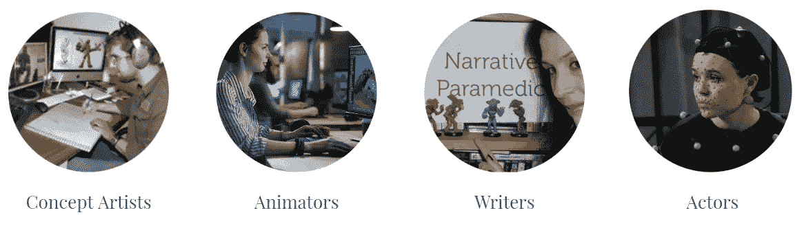****

****尽管动画制作人和概念艺术家之间的关系已经很好的建立起来了，但是编剧和演员的角色还是让这个行业不太舒服。传统上游戏演员应该是“*配音演员*”，但现在不再是这样了。许多工作室使用动作捕捉软件来捕捉演员全身的表演，将他们提供的特殊动作融入到角色的动画中。****

****我们都有不同的灵感，通过**合作和对话**我们可以成就伟大。有什么比赋予我们的作品一点自己的独特性更好的方式来创造人类体验呢？****

****你在游戏中体验过恐怖谷吗？当你追踪一个好故事或一个引人注目的角色时，你也有这种感觉吗？请在下面分享你的想法，我很乐意收到你的来信！****

*****本文由*[*Yisela Alvarez Trentini*](http://www.yisela.com)*于 2019 年 3 月 3 日在* [*女性游戏开发者 Meetup(法兰克福)*](https://www.meetup.com/Female-Game-Developers-Meetup-Frankfurt/) *上原创。*****

****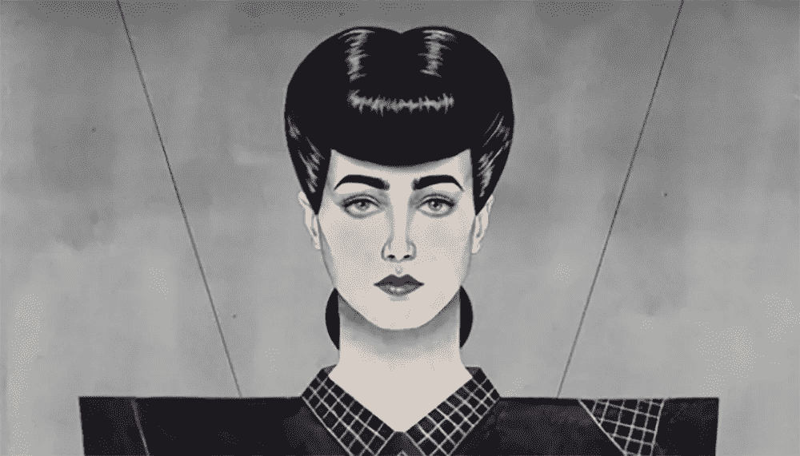****