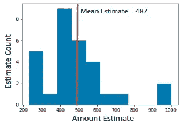
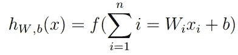
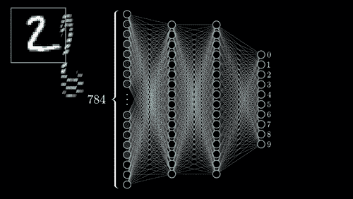
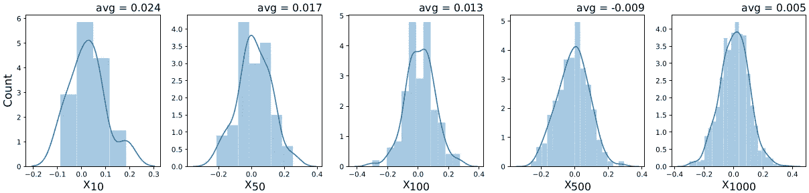
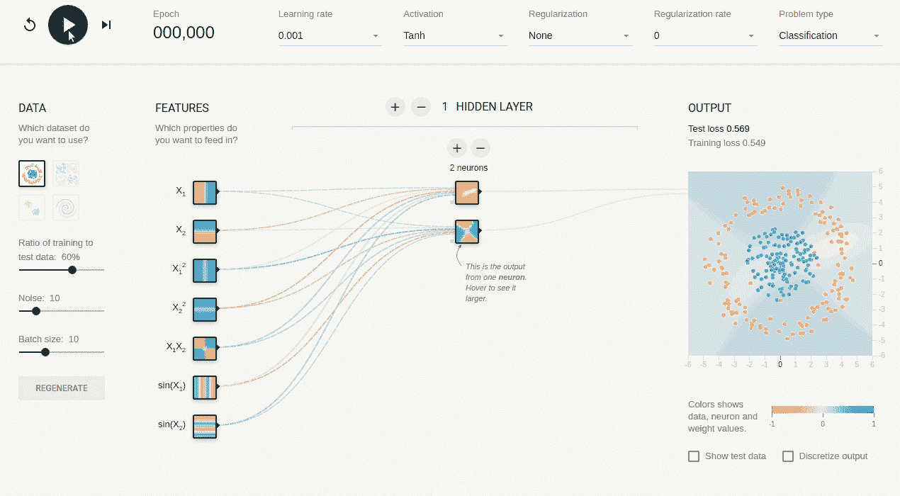
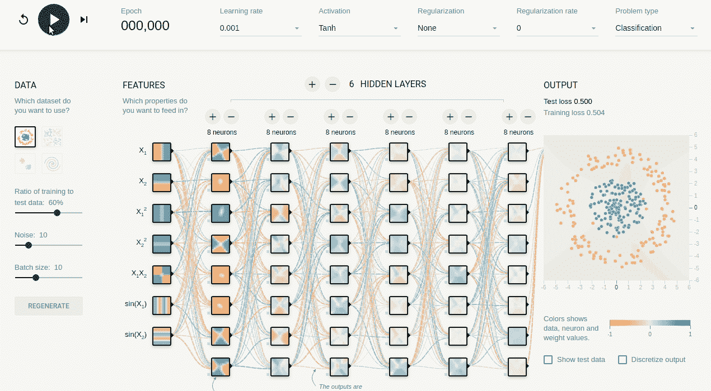

# 软糖罐里的意外一课

> 原文：<https://towardsdatascience.com/the-unexpected-lesson-within-a-jelly-bean-jar-1b6de9c40cca?source=collection_archive---------17----------------------->

Photo by [Patrick Fore](https://unsplash.com/@patrickian4?utm_source=unsplash&utm_medium=referral&utm_content=creditCopyText)

## 糖豆如何帮助我理解一个关键的人工智能原理

在英国维多利亚时代晚期普利茅斯的一个牲畜交易会上，一位名叫弗朗西斯·高尔顿的统计学家让大约 800 名与会者猜一猜展出的一头公牛的重量。然后他计算了所有估计值的中间值，结果是 1207 磅。令他惊讶的是，这头牛的测量重量为 1198 磅，这使得估计值的中位数与实际重量相差约 0.01%。正如高尔顿自己指出的:

> ……最中间的估计表达了人民的心声，其他的估计被大多数选民指责为过低或过高

这实际上意味着，作为一个群体，或者作为一群独立思考者，我们是非常非常好的评估者。

因为我热爱数据和科学，我想自己复制这个实验，所以不久前我在我的办公室用我自己的方式复制了这个实验。我负责软糖罐游戏，你可能在之前就听说过[。](https://diggy.wordpress.com/2007/03/07/how-to-win-a-jellybean-counting-contest/)

我买了一个罐子，里面正好装了 490 颗豆子(是的，我都数过了)。然后，像弗朗西斯·高尔顿爵士一样，我让 30 名同事估计一下罐子里软糖的数量。令我惊讶的是，估计值的分布如下所示:

Distribution of Jelly Bean Estimates. Red line depicts the mean estimate.

平均估计是 487，离地面只有三颗糖豆的距离！通过这个简单的实验，我越来越相信*民意*或**群众智慧**是真实存在的。

作为一个群体，我们是非常好的估计者，但作为个体，就不那么好了。

注意:有耐心的人比胡乱猜测的人表现更好。在我的实验中，一些人测量了罐子的体积，并估计了每颗软糖的体积，然后将其推断为罐子里软糖的数量。其他的干脆去说“嗯不知道……1000”(见图)。尽管如此，所有的估计都集中在一个值上，即*地面真相*。请记住这一点。

在本文的其余部分，我将把这个*大众之声*原则与我长期以来一直感兴趣的一个原则进行比较。这听起来可能很疯狂，但我认为人工神经网络与它有一个共同点。特别是因为在这两种情况下，零件的集合被赋予一个单一的任务，并一起工作来解决它。我希望在这篇文章结束时，你也有这样的感觉。

开始这种比较的一个好方法可能是提供一个人工神经网络中*神经元*的定义。我发现这种描述对 understand⁴:来说相当有说服力和简单

> 每个神经元接收一个或多个输入信号 **x 1** 、 **x 2** 、…、**x m**，并向下一层的神经元输出值 ***y*** ，依此类推。输出 ***y*** 是输入信号的非线性加权和。

根据这种观点，人工神经网络中的神经元是集体思维的个体。事实上，ANN 的*事实上的*架构是一个相互关联的个体回归变量的集合。一个具有 *n 个*输入神经元的神经元的输出被定义为 by⁵:

然后，每个输出 *h* 是来自所有输入 *x* 的单独线性回归之和的具有参数 *W* 和 *b* 的函数，这又将是下一层的输入(在激活函数之后，通常是非线性⁶)。神经元**集体地并且只有集体地**解决任务。尝试用一个神经元为一个复杂的任务建立一个人工神经网络分类器，你很可能会失败。这就像高尔顿让一个人估计一头牛的重量。估计很可能是错误的。这就是安真正集体工作的地方。这个概念可以在下一个例子中形象化:

Taken from [here](https://gfycat.com/altruisticinferiorfantail)

在上面的图像中，经过训练的 NN 从“2”的图像中提取 784 个特征作为输入，并相应地对其进行分类。随着每个神经元的增加，系统的复杂性急剧增加，但反过来增加了有效提升分类器性能的可能特征*排列*的数量。但是加多了，你就会成为 overfitting⁷.的受害者我建议你访问[这个谷歌游乐场](https://playground.tensorflow.org/)来更好地理解这些和其他概念，在这里你可以看到每个添加(或移除)的神经元对一个简单分类器的影响。试着只用前两个特征( *X* 和 *X* ) 训练模型，看看结果。现在多做一点。你能找到获得好结果所需的最少神经元数量吗？做简单的任务需要很多神经元/层吗？答案是否定的。我们一会儿再回到这个话题。

回到公牛和糖豆，这就像找到一个非常好的估计所需的最小个体数量。当然，向 10，000 人询问牛的重量会减少误差，但在 800 人的时候，我们已经有 99%接近事实了。只有当期望的输出没有被满足时，增加算法的复杂度才是有用的。从这里开始，从计算上来说，最好减少估计量，以找到达到期望性能所需的最小值。一旦找到这种平衡，vox populi 就会降低计算成本。为了理解这一点，我们可以看看我用 Python 快速制作的下一张图:

Distribution plots with *μ* = 1 and *σ* = 0.1 from 10 to 1000 points.

我们可以创建一组随机正态分布，其中*μ*= 1*T5*σ*= 0.1，同时将样本数量从 10 个增加到 1000 个。因为我们知道均值*基本事实*设计为等于 1，所以我们可以计算这些分布的平均值，看看它有多接近 *μ。*正如你可能已经猜到的，我们拥有的数据越多越好，这意味着我们的估计越来越接近我们的实际情况。在无限个样本之后，我们到达 *μ* ，但是由于显而易见的原因，这是不切实际的。甚至可能由于某种原因，1000 个样本太昂贵，我们决定使用 500 个点集合进行分析，这产生了满足我们需要的误差。这是我们的最佳点:足够概括以最大化性能，但足够具体以最小化错误。人工神经网络遵循类似的(尽管不完全相同)原理。*

尽管对于应该 use⁸多少个神经元和多少层有一些通用规则，但选择这些限制是我在构建深度神经网络时经常遇到的一个常见问题。对于一个相当简单的问题，太多的神经元和/或层可能会导致严重的过度拟合(在我们之前的例子中，询问 10，000 个人关于牛的体重或使用 1000 点或更多)。太少的话，你将无法推广你的盲测模型。在某种程度上(一般来说)，ANN 对简单性和复杂性之间的平衡感到很舒服。

回到 Google 的 TensorFlow Playground，我们可以看到，在一个非常简单的分类任务中，简单的人工神经网络达到低损失值所需的时间很短:

Simple ANN classifier with one Hidden layer and two neurons. Image generated from freely available [TensorFlow Playground](https://playground.tensorflow.org/).

虽然微不足道，但这充分体现了我想表达的观点。测试训练损失在大约 350 个时期内达到大约 0.05(见散布图正上方的值)。现在让我们看看**过度**复杂的人工神经网络对相同的数据进行分类并使用相同的参数会发生什么:

Complex ANN classifier with six Hidden layers and 8 neurons. Image generated from freely available [TensorFlow Playground](https://playground.tensorflow.org/).

甚至不到 200 个时期，损失值仍然不在与前一个例子相同的水平上。如果我们等待足够长的时间，网络会完成这项工作。根据前面段落中的正态分布示例，您可以使用数千个点来获得对 *μ，*的“更好”估计，但误差无法补偿高成本。在这个例子中，同样的事情正在发生。更不用说其他超配的 problems⁹，后一种架构对于这样的任务来说太昂贵了。第一种架构以非常低的成本完美地完成了工作，因此选择它而不是另一种是更明智的决定。

我喜欢将人工智能模型，特别是深度神经网络，视为复杂的系统，应该尽可能简单地构建。信不信由你，我的果冻豆罐实验帮助理解了这个原理。这两种情况都需要划分某个任务(刚好足够)来共同解决它。这似乎是最好的解决办法。正如阿尔伯特·爱因斯坦在 1933 年⁰:的一次演讲中指出的

> 几乎不能否认，所有理论的最高目标是使不可约的基本元素尽可能简单和少，而不必放弃一个单一的经验数据的充分代表。

我不能和那个*争论。*可以吗？

感谢您的阅读！

参考资料:

[1]高尔顿，F. [人民之声](https://www.nature.com/articles/075450a0) (1907)，*自然*， *75* (7)，450–451 页。

[2]关于群体智慧故事的正文:[https://towards data science . com/on-the-Wisdom-of-Crowds-collective-predictive-analytics-302 b7ca 1c 513](/on-the-wisdom-of-crowds-collective-predictive-analytics-302b7ca1c513)

[3]安资源:[https://towardsdatascience.com/nns-aynk-c34efe37f15a](/nns-aynk-c34efe37f15a)

[4] Koutsoukas，a .，Monaghan，K. J .，Li，x .，& Huan，J. [深度学习:调查深度神经网络超参数并与生物活性数据建模的浅层方法进行性能比较](https://jcheminf.biomedcentral.com/articles/10.1186/s13321-017-0226-y)(2017)*化学信息学杂志*， *9* (1)，42 .

[5]关于多层神经网络基础的伟大文字:[http://ufldl . Stanford . edu/tutorial/supervised/MultiLayerNeuralNetworks/](http://ufldl.stanford.edu/tutorial/supervised/MultiLayerNeuralNetworks/)。

[6]激活函数:[https://towards data science . com/Activation-functions-neural-networks-1 CBD 9 F8 d 91d 6](/activation-functions-neural-networks-1cbd9f8d91d6)。

[7]关于过拟合的一句话:[https://www . Jeremy Jordan . me/deep-neural-networks-preventing-over fitting/](https://www.jeremyjordan.me/deep-neural-networks-preventing-overfitting/)

[8][https://stats . stack exchange . com/questions/181/how-to-choose-the-number of-hidden-layers-and-nodes-in-a-forward-neural-netw](https://stats.stackexchange.com/questions/181/how-to-choose-the-number-of-hidden-layers-and-nodes-in-a-feedforward-neural-netw)

[9][https://towards data science . com/preventing-deep-neural-network-from-over-fitting-953458 db 800 a](/preventing-deep-neural-network-from-overfitting-953458db800a)

爱因斯坦真的这么说过吗？ (2018) *性质*， *557* (7703)，30–31。