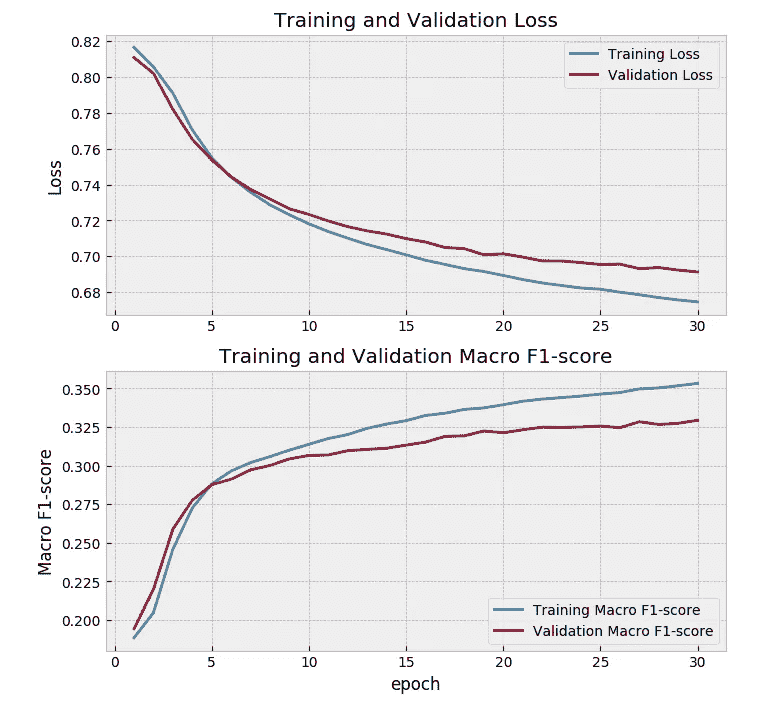

# 在分类系统中使用软 F1 损失的未知好处

> 原文：<https://towardsdatascience.com/the-unknown-benefits-of-using-a-soft-f1-loss-in-classification-systems-753902c0105d?source=collection_archive---------2----------------------->

## 如何不保持一个决策门槛，仍然直接针对你关心的东西进行优化！

在生产中部署机器学习系统并确保其日常效率可能是一项非常艰巨的挑战。在过去的五年里，我看到越来越多的技术变得越来越复杂(算法、编码库、云服务等等)。这是用有用的人工智能应用重塑我们世界的好消息。

但是，和许多其他领域一样，化繁为简是成功的关键。莱昂纳多·达·芬奇将简单描述为“终极的复杂”。
在数据科学中，它不仅仅是一种理论，它可以采取流程的形式。


Photo by [Hilthart Pedersen](https://unsplash.com/@h3p?utm_source=medium&utm_medium=referral) on [Unsplash](https://unsplash.com?utm_source=medium&utm_medium=referral)

不管怎样，我为什么要说这个话题？
在一篇非常鼓舞人心的题为“ [***机器学习:技术债务的高息信用卡***](http://research.google.com/pubs/pub43146.html)的论文中，谷歌的一个人工智能研究团队分享了一些非常务实的建议，关于如何在生产中管理机器学习系统的复杂性。在他们描述的所有方面中，有一个问题是如何使 ML 系统适应外部世界的变化。

下面是他们对动态系统中固定阈值的看法:

> 通常需要为给定模型选择一个决策阈值来执行一些动作:预测真或假，将电子邮件标记为垃圾邮件或非垃圾邮件，显示或不显示给定的广告。机器学习中的一种经典方法是从一组可能的阈值中选择一个阈值，以便在某些指标(如精确度和召回率)上获得良好的折衷。然而，这种阈值通常是手动设置的。因此，如果模型根据新数据更新，旧的手动设置的阈值可能无效。跨多个模型手动更新多个阈值既耗时又脆弱。对于这类问题，一个有用的缓解策略是通过对 heldout 验证数据的简单评估来学习阈值。”

最近，我一直在研究一个 ML 系统，以帮助自动化汽车诊断。基于汽车数据，系统应该预测在发生事故时需要更换哪些零件。这是一个多标签分类问题，可以分解成数百个二元分类子问题(每个部分一个)。

考虑到所有的生产约束，学习和不断更新每个子问题的决策阈值对我来说非常乏味。

在这篇博文中，我想分享一些额外的缓解策略，以忽略决策阈值的调整，并仍然获得分类系统的优化性能。据我所知，没有像这样的普遍做法，没有文章，没有公认的研究。这只是我实验的结果。因此，我建议谨慎使用以下见解，并随时分享您的观点和我们可以一起讨论的任何问题。

如果你想重现结果，你可以一步通过这个 [**Jupyter 笔记本**](https://github.com/ashrefm/multi-label-soft-f1/blob/master/Multi-Label%20Image%20Classification%20in%20TensorFlow%202.0.ipynb) 。完整的代码在麻省理工学院的许可下共享在 [**Github**](https://github.com/ashrefm/multi-label-soft-f1) 上。

# 研究案例

为了说明这个想法，让我们考虑一个从海报图像预测电影流派的机器学习系统。对于每个海报，可以分配一个或多个标签(动作、惊悚、戏剧、恐怖、奇幻等。).卷积神经网络当然是学习从电影海报到可能的标签列表的映射的非常好的方法。关于实现细节，可以在 tensor flow 2.0*中阅读我关于“ [***多标签图像分类”的文章，但也可以独立继续阅读本文。***](https://medium.com/@ashrefm/multi-label-image-classification-in-tensorflow-2-0-7d4cf8a4bc72)*

**

# *了解 F1 分数*

*给定一张电影海报，我们需要预测系统为每个标签生成 0 或 1 的预测。例如，如果一部电影有一些“动作”内容，系统应该给“动作”标签分配 1，否则应该给相同的标签分配 0。对于每部电影，我们以一个 N 维的二进制向量结束，这个向量代表所有的猜测，N 是所有可能的标签(电影类型)的数量。二元预测向量可能看起来像这样:00011000001..000.*

*当对一个标签进行推理时，有四种类型的预测:*

*   *两种类型的正确预测(真阳性和真阴性)。*
*   *任何观测值预测为阳性而实际为阴性的错误类型 I(假阳性，也称为假警报)*
*   *任何观测值预测为阴性而实际为阳性的错误类型 II(假阴性)*

*这通常使用[混淆矩阵](https://en.wikipedia.org/wiki/Confusion_matrix)来可视化。*

**

*基于此，通常分析两个指标:*

*   *Precision: TP/(TP+FP)
    在所有预测为阳性的示例中，实际为阳性的百分比是多少→我们希望降低错误警报率*
*   *回忆:TP/(TP+FN)
    在所有实际为正的例子中，预测为正的占百分之几→我们要提高模型的灵敏度*

*但是因为这两个指标通常是相互对立的，所以我们可以依赖它们的调和平均值，即[F1-得分](https://en.wikipedia.org/wiki/F1_score)。*

**

> *在开发您的 ML 系统时，有一个单一的评估指标可以加快进度。*

# *直接针对 F1 分数进行优化*

*在训练和评估机器学习算法(如神经网络)之前，我们需要定义两个主要函数:*

*   ***一个损失函数:**它是现代机器学习的面包和黄油。我们需要它来测量训练批次的模型误差(成本)。它必须是可微分的，以便[反向传播](https://en.wikipedia.org/wiki/Backpropagation)神经网络中的误差并更新权重。*
*   ***一个评价函数:**它应该代表我们真正关心的最终评价指标。与损失函数不同，它必须更直观地理解模型在现实世界中的表现。*

*如果我们想使用 F1 分数作为评估指标，有两种可能的策略来最大化它:*

## ***策略 1:** **通过设定阈值使 F1 分数最大化***

*当模型生成概率值时，我们需要为每个标签设置一个阈值，以获得二元预测。例如，如果动作的概率高于阈值 0.5，我们可以预测 1(电影是关于动作的)，否则我们预测 0(没有动作)。使每个标签的 F1 分数最大化的最佳阈值在 0 到 0.5 之间(有数学证明，但不在本文中讨论)。我们通常在等待验证集上搜索阈值。*

**

## ***策略 2:** **将 F1 得分嵌入损失函数***

*如果您想直接针对 F1 指标进行优化，这将是最简单的方法。损失函数不仅提供了模型误差的度量，它还是定义如何最佳拟合数据以实现最佳目标的学习过程的核心。出于某种原因，将 F1 分数嵌入损失函数并不是一种常见的做法。*

**

*[Introduction to loss functions (Algorithmia)](https://algorithmia.com/blog/introduction-to-loss-functions)*

## ***为什么在损失函数中出现 F1 得分是不寻常的？***

*F1 分数的问题是它不可微分，因此我们不能将其用作损失函数来计算梯度和在训练模型时更新权重。请记住，F1 分数需要二进制预测(0/1)来衡量。*

*通常我们使用`binary cross-entropy loss`,它代表某一特定类别观察值的负对数似然性`-log(p)`,模型预测该类别的概率`p`。一般来说，这种损失效果很好，并广泛用于使用策略 1 训练分类器，但它并不直接与我们想要最大化的 F1 分数一致。*

## ***解决方案？***

> *我们可以修改 F1 的分数，使其具有可区分性。我们可以通过使用概率而不应用任何阈值，将真阳性、假阳性、假阴性的数量计算为似然值的连续和，而不是将它们计算为离散的整数值。*

*让我们来看两个有助于理解这种转变的例子:*

```
***Example 1:** If the target is 1 for a movie being Action and the model prediction for Action is 0.8, it will count as:0.8 x 1 = 0.8 TP (because the target is 1 and the model predicted 1 with 0.8 chance)0.2 x 1 = 0.2 FN (because the target is 1 and the model predicted 0 with 0.2 chance)0.8 x 0 = 0 FP (because the target is 1 not 0, condition negative is not valid)0.2 x 0 = 0 TN (because the target is 1 not 0, condition negative is not valid) **Example 2:** If the target is 0 for a movie being Action and the model prediction for Action is 0.8, it will count as:0.8 x 0 = 0 TP (because the target is 0 not 1, condition positive is not valid)0.2 x 0 = 0 FN (because the target is 0 not 1, condition positive is not valid)0.8 x 1 = 0.8 FP (because the target is 0 and the model predicted 1 with 0.8 chance)0.2 x 1 = 0.2 TN (because the target is 0 and the model predicted 0 with 0.2 chance)*
```

*我们将这个版本称为`**soft-F1-score**`。下面，你可以看到在 TensorFlow 中的一批预测上实现它的代码。*

## ***这里有一些事情需要考虑:***

*   *每个标签的成本实际上是该标签的`1 — soft-F1`。要想最大化软-F1，就要最小化`1 — soft-F1`。*
*   *你可以把`soft-F1`定义中的`Precision`和`Recall`替换掉，得到一个更直接的基于 TP、FP、FN 项的公式。之所以要这样做，是因为当 TP = 0 时，F1 的调和平均值表达式是未定义的，但转换后的表达式是定义的。
    F1 = 2 * TP / (2 * TP + FN + FP)*
*   *一批观察中的总成本将是所有标签上的平均成本。我们将称之为`macro soft-F1 loss`。*
*   *你必须确保批量足够大，以便在培训时看到一个代表`macro soft-F1 loss`。*

## *学习曲线(优化和评估指标)*

*让我们假设，为了简单起见，我们希望对所有标签只使用一个阈值来将任何概率值转换成二元预测。换句话说，我们现在将考虑默认阈值 0.5，并通过优化我们之前定义的宏软 F1 损失(策略 2)来尝试最大化宏 F1 得分@阈值 0.5，而不是通过为每个标签分别设置阈值来最大化性能。*

*与使用似然项的宏软 F1 不同，我们将在宏 F1 分数的实现中使用阈值 0.5。*

*在下面的学习曲线上，我们观察了训练过程中损失度量(宏软 F1)和评估度量(宏 F1-分数@阈值 0.5)的变化。*

**

*Learning curves (macro soft-F1 loss and macro F1 @thesh 0.5) with a batch size of 256*

> *您可能会注意到，在学习曲线上，宏观软 F1 损失降低到接近 0.69 的水平与宏观 F1 分数增加到接近 0.33 的水平相关。这两个值几乎互补为 1。请记住，我们定义的宏软 f 1 损失实际上是我们需要最小化的 1-软 F1 的宏。这是第一个指标，表明宏观软 F1 损失直接优化了我们的评估指标，即宏观 F1 得分@阈值 0.5。*

# *了解宏观软-F1 损失的作用*

*为了解释这个损失函数的含义，我训练了两个神经网络模型，它们具有相同的体系结构，但是有两种不同的优化。第一个模型使用宏观软 F1 损失直接优化宏观 F1 得分，而第二个模型更经典，并针对二进制交叉熵进行了优化。在这两种情况下，当预测电影海报的类型时，训练的模型将为每个标签生成独立的概率分数。为了创建最终的决策系统，我们需要为每个标签选择 0 到 1 之间的决策阈值，以便将每个概率转换成二进制信息。通常，系统的性能取决于这些决策阈值的选择。因此，让我们检查一下，对于每种类型的优化，系统如何根据我们为某些标签设置阈值的级别来处理验证集。*

**

## *有趣的事情正在这里发生！*

*当使用宏软 F1 损失训练模型时，我们得到几乎与阈值无关的 F1 得分(绿色曲线)。当使用二元交叉熵损失时，我们没有这种效应。这实际上是一个有趣的效果，因为它提供了将所有标签的阈值固定在 0.5 的可能性，并且仍然获得接近于当使用 BCE 损失时通过搜索最佳阈值所获得的性能。当构建生产 ML 系统时，这是一个非常好的特性。更新阈值并确保它们在新数据到来时保持最佳状态是一项巨大的工作。使用宏软 F1 损失可以帮助解决这个问题，但实际上这种行为来自哪里？*

*当使用两种不同的优化时，分析来自神经网络的概率值的分布将是有趣的。*

**

## ***好了，现在可能看起来更清楚了！***

*当使用二进制交叉熵损失进行训练时，输出的概率分布具有一些高斯属性(注意蓝色直方图的钟形)。实际上，这种优化是从数据的原始分布中学习的。我们可以看到，对于覆盖 50%数据集的标签“Drama ”,概率分布集中在 0.5。顺便说一下，为“戏剧”构建的分类器似乎非常弱，因为这两个类别似乎没有在概率值上分开。我们还可以注意到，标签出现的频率越低，分布就越左移。例如,“喜剧”的概率得分似乎更低，这个标签只覆盖了数据集的 32%。该模型从这种罕见性中学习来预测较低的概率值。另一方面，当使用宏软 F1 损失时，我们正在创建一个不反映相同数量级的条件概率值的系统。相反，它学会不那么犹豫，并生成非常接近 1 或 0 的预测。我们在中间范围有较少的概率值。因此，在该范围内改变阈值时，性能不会发生太大变化。*

> *使用宏软 F1 损失进行优化可以取代一些穷举技术，例如:*
> 
> *1-在验证集上搜索使性能最大化的最佳决策阈值*
> 
> *2-通过在训练前对少数类过采样或对多数类欠采样来校准概率值(在多标签分类的情况下非常复杂，因为标签同时出现)*

# *缺点和对策*

*您可能已经注意到，在标签“Drama”的情况下，使用宏 soft-F1 loss 进行优化会产生一个预测“Drama”始终为正的模型(请注意概率直方图如何在最右侧接近 1，以及召回曲线如何在 100%的最大水平保持不变)。*

*每当训练好的分类器不提供信息时，这种副作用就可能发生。这是由于加州大学的研究人员在这篇 [**论文**](https://arxiv.org/pdf/1402.1892.pdf) 的第 10 页上证明了 F1 度量的一些性质。*

> *只要测试集中实际阳性的频率不为零，并且分类器不提供信息，就可以通过预测所有样本为阳性来最大化预期 F1*

*本文关注的是通过阈值化来最大化 F1 得分(策略 1)，但同样的逻辑也适用于本文所述的基于软 F1 优化的最大化(策略 2)。*

*我们基本上希望最大化 F1 的期望值，作为正面预测的函数，因此我们可能需要定义以下术语:*

```
*F1 = 2*tp / (2*tp + fp + fn) # translated expression of F1
a = tp + fn # number of actual positives
b = a / (tp + fp + fn + tn) # label frequency
c = tp + fp # number of predicted positives*
```

*当分类器不提供信息时，真阳性的数量预计是所有阳性预测的一部分，等于基本比率(标签频率)*

```
*E(tp) = c * b # expected tp in case of uninformative classifier
a + c = 2 * tp + fp + fn # denominator in previous F1 expression*
```

*然后，可以使用以下公式计算预期 F1:*

**

*并且期望 F1 相对于 c 的偏导数可以分解如下:*

**

*这个导数总是正的，这证明了每当分类器没有信息时，系统将通过预测所有样本为正来学习获得最优 F1。*

## ***如果你觉得这种效果不好，我建议采取以下对策。***

*当考虑 F1-socre 时，我们默认推理正类(结果等于 1)。但是，你也可以考虑在相同的条件下，如果你对负类进行推理(结果等于 0)，你会得到的 F1 分数。唯一的区别是 TP 和 TN 量的交替。*

```
*F1_class1 = 2*tp / (2*tp + fp + fn)
F1_class0 = 2*tn / (2*tn + fn + fp)*
```

*然后我们可以取这两个量的平均值来定义一个新的度量。*

```
*New_F1 = (F1_class1 + F1_class0) / 2*
```

*当然，让它变得可区分:*

*通过这样做，你可以期望系统通过不仅生成正面预测而且生成负面预测来抵消其先前的行为，以便优化这个新的损失。*

**

*这将保护系统在无信息分类器的情况下避免预测总是肯定的不可接受的行为。*

# *摘要*

*生产 ML 系统的性能来自于部署可靠且易于维护的模型。决策阈值是复杂性的另一个来源。在这篇博文中，我分享了一个优化技巧，通过将 F1 得分的定义纳入损失函数(软 F1 损失)来避免不断调整决策阈值。这非常有帮助，尤其是在多标签分类的情况下，您希望使用相同的默认阈值 0.5 将预测转换为二进制结果，同时保持最佳的分类性能。*

*从海报预测电影类型是标签数量可能变高的一个例子。但这实际上是一个艰难的分类挑战。在一些标签上，我们只能得到非常弱的分类器。在无信息分类器的情况下，所描述的技术可能导致预测总是肯定的不良效果。如果你想避免这种影响，你可以使用双软 F1 损失。*

*在其他一些数据集上，比如汽车诊断，我可以看到非常有趣的结果。因此，如果您正在处理类似的任务，您可以在自己的数据集上尝试，并让我知道您得到的结果！*