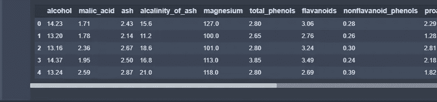
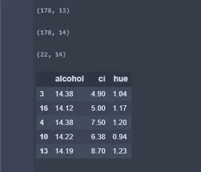
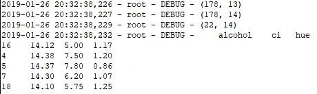
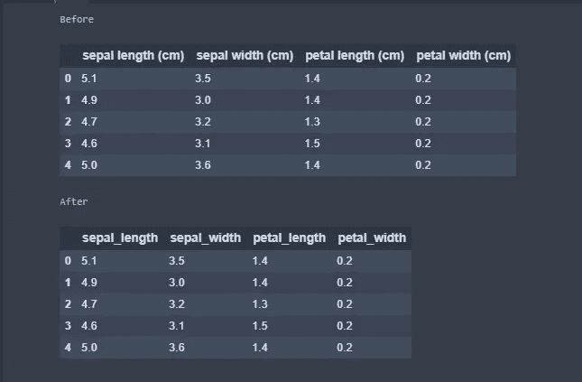
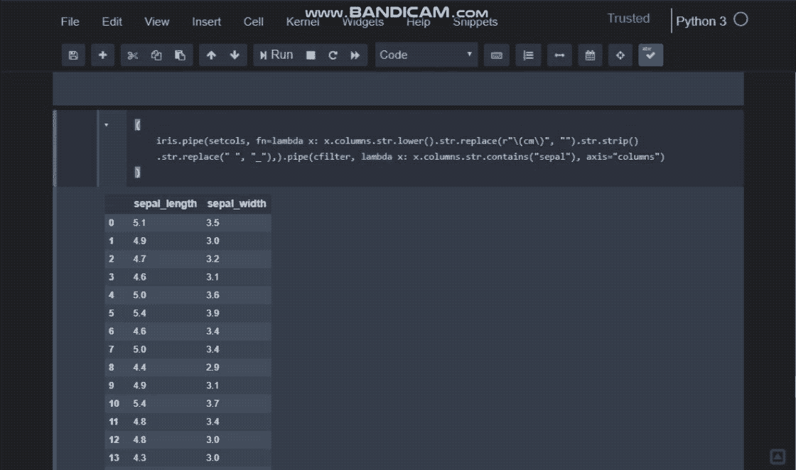

# 熊猫中方法链接的不合理有效性

> 原文：<https://towardsdatascience.com/the-unreasonable-effectiveness-of-method-chaining-in-pandas-15c2109e3c69?source=collection_archive---------3----------------------->

> 方法链接如何提高代码的可读性，用 lambda 函数编写自定义管道以实现最大的灵活性，并以代码格式化技巧结束。

Image by [Texturex](https://texturex.com/metal-textures/chain-metal-texture-steel-8-links-chains-stock-photo/)

# 介绍

方法链接是一种编程风格，依次调用**多个方法调用**，每个调用在同一个对象上执行一个动作并返回它。它**消除了在每个中间步骤命名变量**的认知负担。 [Fluent 接口](https://en.wikipedia.org/wiki/Fluent_interface)，一种创建面向对象 API 的方法依赖于方法级联(又名方法链)。这类似于 Unix 系统中的管道。

方法链接大大增加了代码的可读性。如果你不相信我，我们去问问杰克和吉尔。

*让我们尝试使用嵌套函数调用和方法链接来讲述杰克和吉尔的故事*，

**嵌套调用:**

**方法链接:**

方法链接的一个明显的优点是，它是一种**自顶向下的方法**，参数放在函数旁边，不像嵌套调用，在嵌套调用中，跟踪各个函数调用到其参数是很费力的。

Pandas 为方法链接提供了几个函数，

向数据帧`assign`添加新列，重命名列`rename`，过滤数据帧`query`等。让我们来看看教育学的`wine`数据集。它包含 178 种葡萄酒的化学成分。

Wine dataset

下面的代码从重命名`color intensity`开始，因为它的缩写是`ci`。然后，它基于`hue` 和`ci`上的值创建一个新列`color filter`。然后，它过滤酒精含量超过 14 的葡萄酒，并通过彩色过滤器。最后，它根据酒精含量对数据框进行排序，并显示我们感兴趣的列。**如果在没有方法链接的情况下重复相同的步骤，则必须在每个步骤创建一个新的数据帧。**

# 方法链接的好处和坏处:

Image by [Sally Dasouki](https://onmogul.com/stories/by-sally-dasouki-is-internet-a-boon-or-a-bane-for-the-youngsters)

与 Python 相比，R 的一个优势是它的`tidyverse` 包具有丰富的方法链接功能。再加上`margrittr`，你经常可以找到一种方法来做你想在管道中做的事情。另一方面，Pandas 没有一个可理解的方法列表用于方法链接。但是为了弥补它，熊猫从版本 *0.16.2* 开始引入了[管道](https://pandas.pydata.org/pandas-docs/stable/reference/api/pandas.DataFrame.pipe.html)功能。管道在方法链中启用用户定义的方法。

随着 pipe 的引入，你几乎可以在一个方法链中写任何东西，这引发了一个问题，**多少链是太多了？**。这是一个完全主观的问题，必须由程序员来决定。大多数人发现在一个单独的链中有 7 或 8 个方法是最合适的。我对一个链中的方法数量没有任何硬性限制。相反，*我试图用一个方法链*来表示一个连贯的思想。

**一些方法链的坚定批评者指责它增加了代码的可读性，但却增加了调试的难度，这是事实**。想象一下，一个月之后，你正在调试一个十个方法长的链。从那时起，数据帧结构或列名已经改变，现在您的链开始抛出错误。尽管您可以很容易地找到哪个方法调用破坏了代码，但是现在不可能在整个链中进行调试，并在您沿着链移动时看到它对数据帧所做的更改。在生产或笔记本中开始使用长方法链之前，需要解决这个问题。

# 组合管道和 lambda 函数:

Image by [Grofers](https://lambda.grofers.com/)

每当数据框架的形状改变时，我经常会遇到方法链接的问题。如果你能沿着链跟踪形状，调试就容易多了。让我们定义一个自定义管道函数。编写管道函数的关键是它应该接收数据帧并返回数据帧。

这个函数中需要注意的两件事是可以接受 lambda 函数的`fn`参数和`display`函数调用。Lambda 函数提供了灵活性，display 函数调用使 Jupyter 实验室或笔记本电脑环境中的数据框和绘图显示更加美观。

在这个例子中，我们可以看到我们从 13 列开始，`assign`将列数增加到 14，随后的`query`将行数减少到 22。末尾的管道从数据帧中随机打印出 5 行。这可以很容易地更改为 head 或 tail 函数。由于自变量是一个 lambda 函数，它给出了无数种可能性。当你开始写一个链时，在末尾添加一个带有`csnap` 函数的管道有助于你看到链上的变化。完成后，您可以删除管道或注释掉该行。这是拆除管道的一种幼稚的方法。相反，如果要将代码转移到生产环境中，可以使用 logger 对象并将其写入外部文件。

Example of logging to a file

日志记录为我们提供了不删除管道语句的灵活性，而是将日志记录级别更改为 INFO，以避免在生产过程中获得调试信息。

让我们看看其他自定义管道函数。`setcols`用于设置链中的列名。通常，当我们从外部源读取数据时，列名将包含大小写以及空格和特殊字符。这些问题可以这样解决，

Iris data set before and after column rename

**与** `**csnap**` **函数不同** `**setcols**` **函数创建数据帧的副本，这使得函数调用代价很高**。但这是必要的，以确保我们没有在数据帧的全局副本上写入。大多数 pandas 函数的工作方式类似，都有一个就地标志，用于返回新的数据框或重新分配顶级引用。

*杰夫·雷巴克说，*

> **不能保证**就地操作确实更快。通常，它们是对副本进行的相同操作，但是顶级引用被重新分配。

让我们用最后一个例子来结束这一部分。r 有一个多功能的选择函数，可以选择/取消选择宽数据框中的列，而不是列出所有内容。`cfilter` 使用 lambda 函数帮助我们实现同样的多功能性。

# 代码格式:

**当多人使用不同的 IDE 在同一个代码库上工作时，代码格式的一致性是一个令人头疼的问题**。在多行函数调用的情况下，方法链接使这个过程更加复杂。

# 输入黑色:

Image from [Black](https://github.com/ambv/black)

*摘自他们的 GitHub 描述，*

> *布莱克*是不折不扣的 Python 代码格式化程序。通过使用它，您同意放弃对手写格式的细节的控制。作为回报， *Black* 为您提供了速度、确定性以及摆脱 pycodestyle 对格式的困扰。你将节省时间和精力去做更重要的事情。
> 
> 不管你在读什么项目，黑化的代码看起来都一样。一段时间后，格式变得透明，您可以专注于内容。
> 
> *黑色*通过产生尽可能小的差异，使代码审查更快。

**使用 black 的一个主要优点是它理解 fluent 接口**并相应地自动格式化函数调用，不像任何其他 IDE 的默认格式化程序。

# 为 Pycharm 设置黑色:

第一步是`pip install black`。在 pycharm 中，您可以将它集成为一个文件监视器，这样每次保存文件时，都会自动完成格式化；也可以将它集成为一个预提交挂钩，这样每次提交时，都会对代码进行格式化，从而保持整个项目的格式化完整性。详细的设置说明可在[这里](https://github.com/ambv/black)找到。

# **为 Jupyter 笔记本/实验室设置黑色**:

第一步是`pip install nb_black`。下一步是根据环境加载适当的扩展。如果是笔记本，那么使用`%load_ext nb_black`其他实验室用`%load_ext lab_black` 。

一个快速演示布莱克的行动，

Before and after of Black Formatting

参考:

1)[https://tomaugspurger.github.io/method-chaining](https://tomaugspurger.github.io/method-chaining)

2)[https://stack overflow . com/questions/22532302/pandas-specular-performance-drop-in-place-rename-after-drop na/22533110 # 22533110](https://stackoverflow.com/questions/22532302/pandas-peculiar-performance-drop-for-inplace-rename-after-dropna/22533110#22533110)

3)[https://github.com/ambv/black](https://github.com/ambv/black)