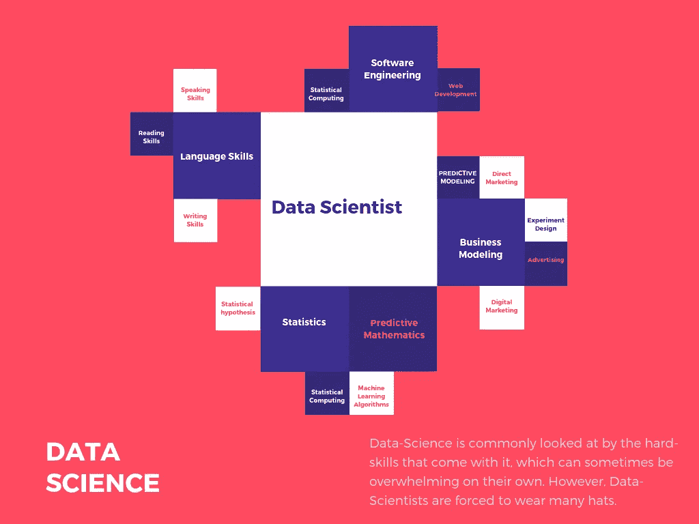

# 未言明的数据科学软技能

> 原文：<https://towardsdatascience.com/the-unspoken-data-science-soft-skills-cc836d51b73d?source=collection_archive---------17----------------------->

A basic neural map of some essential Data-Science skills

对于初学者来说，数据科学的世界可能令人望而生畏，因为在许多方面，数据科学是许多不同操作之间的桥梁。不仅有硬技能:编程、计算、统计，当然还有更多，而且作为一名数据科学家还有许多更小的软技能。这些技能是数据科学所必需的，并且在数据科学的世界中每天都非常依赖。

# 阅读和写作

每个数据科学家需要掌握的最不言而喻也是最重要的软技能之一是熟练的阅读和写作。如果你真的很擅长计算机，但英语课不及格，数据科学可能不适合你。对任何软件工程师来说，最重要的事情之一就是能够轻松快速地解读文档以及错误输出。当然，考虑到这一点，数据科学的世界一直在发生变化。作为一名数据科学家，要求你每天都要学习。大量的资源将无法在视频或有声读物中获得，而是必须阅读。理解所使用的词汇对于理解软件包如何工作，以及如何将它们合并到您的软件中，或者在您的数据上使用它们也是绝对重要的。

写作也是绝对重要的，但是对你写作能力的依赖也取决于你的工作。关于数据科学的一个有趣的事情是，许多工作在需要证明的技能和掌握程度方面非常不同。例如，在一份工作中，你可能大部分是工程包，并为你的团队编写函数。而在另一份工作中，你可能正在创建复杂的模型，或者用机器学习解决复杂的问题。有些工作可能需要更像软件工程师的数据科学家，而其他工作可能需要擅长写备忘录的数据科学家。无论如何，写作肯定是一项非常重要的技能。

# 商业

虽然一般来说，拥有业务相关技能的想法不被视为软技能，而是硬技能，但对于数据科学家来说，这往往最终会成为他们主要工作流程的副产品。然而，对于从事商业分析、预测建模和统计实验广告的数据科学家来说，这项技能绝对至关重要。

捍卫并能够验证你的模型和假设，是企业会发现数据科学家非常有价值的事情。此外，基本的演示技巧对于展示模型、统计数据和可视化来展示你的作品是绝对重要的。

# 开发运营、网络开发和软件工程

同样，开发运营、Web 开发和软件工程不是软技能。但对于数据科学家来说，尽管这些技能不一定与工作描述相符，但其中许多技能符合你作为数据科学家的日常职责。许多数据科学工作要求你能够设计软件，为全栈 web 开发人员推送数据，甚至编写自己的应用程序和模块来处理数据。

许多数据科学家都很熟悉 Docker，因为它是一个虚拟机工具，并且经常在他们的业务环境中使用它。Docker 传统上并不被认为是一个数据科学工具，而是一个开发运营工具。通常，像任何软件工程师一样，数据科学家需要熟悉他们的终端，以及虚拟操作系统终端，如 Debian、Ubuntu 和 Fedora。

# 领域知识

有时，领域知识可能是数据处理的关键。了解你的公司是做什么的，以及关于你的公司产品的事情，对于了解你的生态系统内的目标是绝对重要的。

一个很好的例子是人口普查数据，有时人口普查的回答并不完全一致。您可能会遇到这样一个数据集，根据您所拥有的领域知识，您可能会发现某些观察结果是无效的，否则会完全破坏您的模型。

# 最后

这些只是数据科学家在其环境中取得成功所需的一些较大技能。有时候，对普通人来说，记住所有的事情有点太多了。请注意，所有这些都是常规的数据科学知识。

数据科学是一个快速发展的领域，每天都在扩展和增长，通过对未来十年的预测，肯定可以为我们的生活奠定基础。数据科学最大的特点是个人发展。作为一名数据科学家，世界永远不会停止，因此，你也不能。您必须不断地学习，以跟上数据科学计算领域当前的发展。