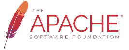
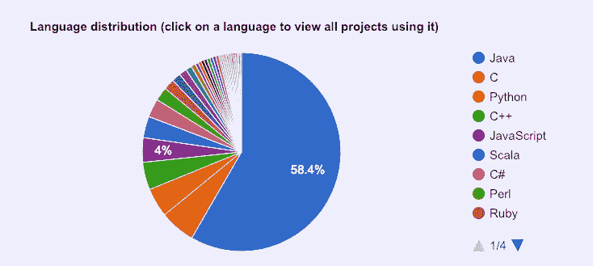

# 现代软件开发的无名英雄

> 原文：<https://towardsdatascience.com/the-unsung-heroes-of-modern-software-development-561fc4cb6850?source=collection_archive---------5----------------------->

## 每个人都应该知道的开源软件基础

开源软件是人人受益的开发模式。这就是今天许多重要软件的构建方式。

支持这一发展的开源基金会起着至关重要的作用。然而，他们的工作往往不为人知。直到我研究了这篇文章，我才知道有这么多项目受益于这些基金会。

在本文中，我们将了解软件开发人员和数据科学家每天使用的许多工具的幕后推手。

Exploring the landscape of open source foundations

# 为什么要开源基金会？

开源基金会的出现是为了帮助维持和管理开源项目。这些基金会为与开源软件(OSS)项目有利害关系的公司和个人提供了走到一起的空间。它们作为独立的非营利实体的地位为相互竞争的公司合作提供了中立的基础。

Foundations support the things that get build on top of them

开源基金会通常为软件开发项目提供广泛的业务和运营支持。在基金会的庇护下，该项目通常可以获得财政支持和后台协助。基金会可以通过以下具体方式提供帮助:

*   谈判并签署供应商合同
*   雇用员工或承包商
*   缓冲法律风险
*   提供法律框架(许多基金会已经创建了自己的许可证)
*   提供代码签名证书等技术服务
*   访问银行账户等金融产品
*   提供营销服务，如新闻发布
*   提供监督和治理
*   管理项目成员资格

正如你所想象的，这些都是项目领导需要协助的无价角色。这些基础帮助项目成员专注于修复错误、编写文档和开发新功能。点击阅读更多关于开源基金会的角色[。](https://www.cio.com/article/2984133/open-source-tools/8-key-open-source-software-foundations.html#slide1)

# 开源基金会领导人

我将重点介绍六个开源基金会，它们是许多重要项目的关键。对于每个基金会，我都会简单介绍一下，提供截至 2019 年初得到支持的项目数量，并重点介绍一些知名项目。请注意，这些团体属于 IRS 对慈善和贸易组织的各种分类，并非所有团体都是基金会。

## 阿帕奇软件基金会

Apache 软件基金会已有 20 年的历史，是最大的基金会之一。截至 2019 年初，它有超过 350 项开源计划。

> ASF 为知识产权和财务贡献提供了一个既定的框架，同时限制了我们的项目提交人的潜在法律风险。通过 ASF 被称为“Apache 方式”的精英管理过程，730 多个个人成员和 7000 名提交者成功地合作开发了免费提供的企业级软件，使全球数百万用户受益:数千个软件解决方案在 Apache 许可下分发；社区积极参与 ASF 邮件列表、指导计划和 ApacheCon，即基金会的官方用户会议、培训和展览。

[www.apache.org](http://www.apache.org)

许多 Apache 项目都大量使用 Java。受欢迎的项目包括:Apache HTTP Server、Hadoop、Tomcat 和 Arrow。

## Linux 基金会

Linux 基金会是 Linux 操作系统和许多相关项目的所在地。它的其他 100 多个项目包括 NodeJS 和 RethinkDB。

> Linux 基金会通过提供资金和智力资源、基础设施、服务、活动和培训来支持创建可持续的开源生态系统。Linux 基金会和它的项目一起工作，形成了在创造共享技术方面最雄心勃勃和最成功的投资。

www.linuxfoundation.org

Linux 基金会成立于 2000 年，由另外两个团体合并而成。它目前有超过 1000 名成员，包括所有常见的大牌技术公司。

所有托管项目都获得治理结构和后端资源。一些项目也获得资助。Linux 基金会也提供培训和会议。

## 自由软件基金会

成立于 1983 年的自由软件基金会维护着构成 GNU Linux 生态系统的项目。其他流行的项目包括 Bash、Emacs、Gawk、Make 和 r。

> 自由软件基金会(FSF)是一个非营利组织，其全球使命是促进计算机用户的自由。我们捍卫所有软件用户的权利。

【https://www.fsf.org/ 

自由软件基金会有 5，000 多名成员和大约 400 个开放源码软件项目。

## 软件自由保护协会

软件自由保护协会成立于 2006 年。它有超过 45 个项目，包括像 Busybox、Git、Homebrew、Inkscape、phpMYAdmin、PyPy 和 Selenium 这样受欢迎的项目。

> 软件自由保护协会是一个非营利慈善机构，帮助促进、改进、开发和维护自由、自由和开源软件(FLOSS)项目。保护协会为 FLOSS 项目提供了一个非盈利的家园和基础设施。这使得 FLOSS 开发人员可以专注于他们最擅长的事情——为公众编写和改进 FLOSS——而 Conservancy 则负责那些与软件开发和文档不直接相关的项目需求。

[https://sfconservancy.org/](https://sfconservancy.org/)

软件自由保护协会有超过 500 个赞助商，包括谷歌和其他一些大公司。

## 符合公众利益的软件

公益软件成立于 1997 年。它的 39 个项目包括 haskell、PostgrSQL、Jenkins、Arch Linux 和 Debian。

> 公益软件是一个非盈利组织，旨在帮助组织开发和分发开放硬件和软件。我们的使命是通过处理他们的非技术性管理任务来帮助真正的、实质性的、重要的自由和开源软件项目，这样他们就不需要运营他们自己的法律实体。

【https://www.spi-inc.org/ 号

## 云本地计算基金会(CNCF)

云本地计算基金会是这个街区的新生事物。成立于 2015 年，支持围绕 Kubernetes 容器化云微服务的开源项目。

> CNCF 是一个开源软件基金会，致力于使云本地计算普及和可持续发展。云原生计算使用开源软件堆栈将应用部署为微服务，将每个部分打包到自己的容器中，并动态编排这些容器以优化资源利用率。云原生技术使软件开发人员能够更快地构建优秀的产品。

[www.cncf.io](https://www.cncf.io/)

CNCF 成员包括技术名人录:AWS、阿里巴巴云、戴尔、英特尔、甲骨文、微软 Azure、IBM Cloud 和谷歌云。

截至 2019 年初，已有 4 个项目毕业，16 个在孵。受欢迎的相关项目包括毕业于 CNCF 的 Kubernetes。

有趣的是，CNCF 得到了 Linux 基金会的支持。

## 数字焦点

NumFOCUS 是许多流行的数据科学开源项目的所在地。它成立于 2012 年，其 25 个受欢迎的项目包括 NumPy、Matplotlib、Pandas、Jupyter、Julia 和 Bokeh。NumFOCUS 还将许多其他开源项目作为附属项目进行推广。

> NumFOCUS 提供了许多程序来支持我们的使命，即促进可持续的高级编程语言、开放代码开发和可重复的科学研究。

[https://numfocus.org/](https://numfocus.org/)

NumFOCUS 在世界各地举办 PyData 会议。披露:我在 PyData DC 做志愿者，过得很愉快。强烈推荐志愿！😃

这是六个需要了解的开源基金会。他们为许多推动世界发展的开源软件项目提供了宝贵的支持。请注意，我没有包括那些支持少数项目或具有更广泛宣传重点的基金会。

以下是概要:

*   阿帕奇软件基金会
*   Linux 基金会
*   自由软件基金会
*   软件自由保护协会
*   符合公众利益的软件
*   云本地计算基金会(CNCF)
*   数字焦点

如果你知道为其他 OSS 项目提供支持的其他组织，请在评论或 Twitter @discdiver 上告诉我。

要了解更多关于开源基金会的信息，请参见[这项调查研究](https://livablesoftware.com/study-open-source-foundations/)。

# 包装

现在，您知道当时机到来时，您的开源项目将转向何处。你也知道一些人，他们让开源项目有效地成长。

我希望这篇文章对你有所启发。如果你有，请在社交媒体上分享，以便其他人可以找到它。

我写关于机器学习、数据科学、深度学习、云计算、Docker、开源软件和其他有趣的东西。点击这里[查看我的文章](https://medium.com/@jeffhale)，如果其中有你感兴趣的，请关注我。

非常感谢所有为开源做出贡献和支持开源的人！👍

