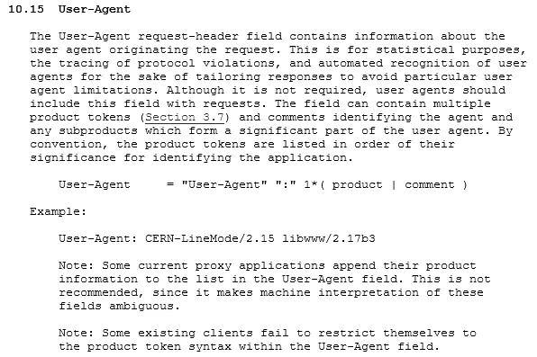
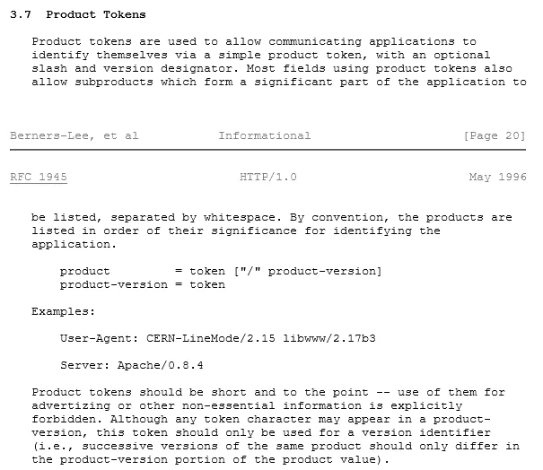
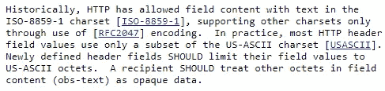
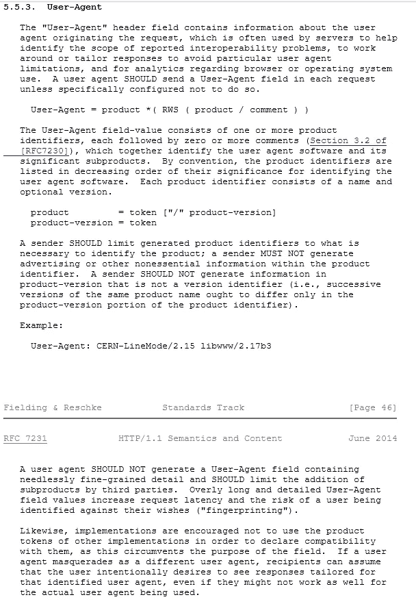

# 用户代理——支撑一系列分析的疯狂字符串

> 原文：<https://towardsdatascience.com/the-user-agent-that-crazy-string-underpinning-a-bunch-of-analytics-86507ef632f0?source=collection_archive---------15----------------------->

## 令人惊讶的是，我们竟然如此依赖它


Only Innocent Browsers Here (Photo: Randy Au)

在网络分析领域工作一段时间，甚至不到一周，我敢打赌，你就会听说这个叫做“用户代理”的东西。我们从用户那里得到的就是这个字符串，它应该告诉我们关于他们的各种事情。如果我们应该用这个东西来统计和分析用户，我们需要更多地了解它。

目前在 2019 年，它最重要的用途是弄清楚客户正在使用什么设备(桌面、手机等)来将正确的页面设计发送给客户。这不是进行设备检测的唯一方法，但它形成了一个非常重要的基础。甚至 Javascript 设备检测库经常只是请求和解析用户代理。

用户代理还提供了一个数据点，用于在不使用 cookies 的情况下对用户进行指纹识别。它包含在每个 HTTP 请求中，在某些不常见的情况下，它可能很长，并且对用户来说是唯一的。

但是这一串是关于什么的，为什么这些作品有点疯狂？

# 那么什么是用户代理字符串呢？

用户代理(UA)是 HTTP 报头中的一个字段，客户端“应该”(在技术上 [RFC 2219](https://tools.ietf.org/html/rfc2119) 意识到如果不这样做，它们可能是技术上的分支)将该字段包含在对服务器的请求中。这在 [RFC 1945-HTTP/1.0](https://tools.ietf.org/html/rfc1945) 和当前 [RFC 7231-HTTP/1.1](https://tools.ietf.org/html/rfc7231) 规范中都有规定(具体章节见下图)。RFC 7540-HTTP/2 关注的是 HTTP 消息本身，而不是 UA 所在的报头，所以 7231 也适用于此。

让我们看看在 RFC 中是如何定义 UA 的。

TL；灾难恢复如下:用户代理是…

*   HTTP 请求标头中的字段
*   这应该包括在每一项请求中
*   应采用 US-ASCII 格式(与整个标题一样)
*   由一系列“产品令牌”组成，即带有可选版本号的产品名称字符串，以“/”分隔
*   产品令牌之间用空格隔开。
*   允许用括号将注释括起来
*   产品令牌应排在最重要的前面
*   一个产品不应该复制另一个产品的令牌来声明兼容性
*   没有广告，没有过于精细的细节

## RFC 1945—1996 年 5 月发布的 HTTP/1.0



rfc1945 — [https://tools.ietf.org/html/rfc1945](https://tools.ietf.org/html/rfc1945) — HTTP 1.0

*虽然这不是必需的，但用户代理应该在请求中包含此字段。— RFC 1945*

RFC 1945 早于 SHOULD 的[RFC 2119](https://tools.ietf.org/html/rfc2119)语言，所以读起来更随意。然而，最重要的几点是:

*   不是必需的，但 UA 应包含在请求中
*   用于统计目的，跟踪违反协议的情况，根据用户代理限制定制响应
*   字段可以包含多个“产品令牌”和注释
*   产品令牌按照识别应用程序的重要性顺序列出

有趣的是，即使在这个 RFC 中，它也已经警告了异常情况，例如一些代理将数据附加到 UA，这使得解释不明确，以及一些客户端不遵循产品令牌语法。

## 什么是产品令牌？



RFC 1945 — HTTP/1.0

产品令牌只是采用了`product/version`的格式，其中版本是可选的。**令牌由空格分隔**，所以产品不应该有空格。历史上，ISO 8859-1(Latin-1)和 RFC 2047 (Base64 和可打印引号)编码是允许的。如今，规范要求使用 US-ASCII，任何八位字节> 127 都被视为“不透明数据”

因此，理论上，你可以将表情符号或 base64 短文推入 UA，但所有的赌注都取决于服务器如何决定是否以及如何处理它。



Encoding to be used in HTTP header fields — RFC 7230 [https://tools.ietf.org/html/rfc7230#section-3.2.4](https://tools.ietf.org/html/rfc7230#section-3.2.4)

## 2014 年 6 月发布的 RFC 7231-HTTP/1.1(当前标准)



rfc 7231 [https://tools.ietf.org/html/rfc7231](https://tools.ietf.org/html/rfc7231) — HTTP 1.1

HTTP RFCs 的后续版本有了更标准化的语言，但一般来说，事情保持不变。它仍然是由空格分隔的*产品/版本*条目，注释在括号中。值得注意的是增加了非常具体的禁令，禁止在 UA 中放置非必要的细粒度信息或广告。过长的 UAs 是专门针对潜在的指纹用户而言的(我们稍后会谈到这一点)。

还特别说明了**不鼓励** *产品使用其他产品的产品令牌来声明兼容性。我们将进入下一步。*

有趣的是，在 1997 年 1 月的原始 HTTP/1.1 规范或 1999 年 6 月的 RFC 2616 中，这些新增内容并不存在。在互联网使用激增的 5 年间，他们似乎看到了一些他们想要阻止的滥用行为。

# 历史用户代理使用

虽然了解 RFC 对用户代理字符串的描述有助于了解它所采用的格式，但它并不能告诉你它在实践中是如何使用的。

正如在“[浏览器用户代理字符串](https://webaim.org/blog/user-agent-string-history/)的历史”中非常有趣地陈述的那样，UAs 今天的现实是，几乎所有东西都首先伪装成 Mozilla。这是因为在 20 世纪 90 年代，当浏览器功能迅速变化时，Mozilla 浏览器具有某些功能，如最初在竞争浏览器中不可用的框架，所以 web 设计师根据用户代理发送不同版本的页面。

但是当其他浏览器在功能上赶上 Mozilla 时，网页设计者更新他们的服务规则很慢(或者懒得更新)。因此，可以支持高级功能的浏览器不会提供具有这些功能的页面。为了解决这个问题，其他浏览器只是声明自己是 Mozilla 来获取 Mozilla 版本。

很快，几乎每个主流浏览器都决定将 Mozilla 作为第一个产品字符串，同时在评论或后续产品字符串中添加实际的浏览器。这很可能是促使最新的 RFC 明确表示不鼓励使用另一个产品的字符串(例如 Mozilla)的原因。**直到今天，浏览器仍然这么做，没有任何改变的迹象。**

```
Mozilla/5.0 (Windows NT 10.0; Win64; x64) AppleWebKit/537.36 (KHTML, like Gecko) Chrome/78.0.3904.87 Safari/537.36
-- A Chrome User-AgentMozilla/5.0 (Windows NT 10.0; Win64; x64; rv:70.0) Gecko/20100101 Firefox/70.0
-- A Firefox User-AgentMozilla/5.0 (Windows NT 10.0; Win64; x64) AppleWebKit/537.36 (KHTML, like Gecko) Chrome/70.0.3538.102 Safari/537.36 Edge/18.18362
-- A Microsoft Edge User-AgentMozilla/5.0 (Windows NT 10.0; WOW64; Trident/7.0; rv:11.0) like Gecko
-- An Internet Explorer 11 User-Agent"Links (2.16; FreeBSD 12.0-RELEASE-p10 amd64; LLVM/Clang 6.0.1; text)"
-- A Links2 User-Agent
```

如果你愿意，你可以用[资源在线浏览大量的用户代理，比如这个](https://developers.whatismybrowser.com/useragents/explore/)。

你还会注意到，每个浏览器都有自己独特的产品令牌序列和类型。通过足够的研究，你可以相当可靠地知道一个请求来自什么设备和浏览器。IE11 使用注释 Trident/7.0 来表示其渲染引擎，使用“rv:11.0”来表示 IE 版本，Chrome(以及 Edge，在后端[转换为 chromium](https://thenextweb.com/microsoft/2018/12/06/microsoft-edge-is-officially-switching-to-chromium-in-2019-heres-why-thats-a-good-thing/) )是完整的产品版本令牌，但也会声称 Safari 兼容，因为它们都使用 AppleWebKit。这是一张纠结的网。

## 机器人呢？

各不相同:有些人比其他人表现更好。一些人声称该机器人是顶级产品，一些人还声称与 Mozilla 兼容，或者声称是在移动设备上。有些库提供了一个默认的用户代理，开发者可以覆盖它，但是忘记了。

```
W3C_Validator/1.3 [http://validator.w3.org/services](http://validator.w3.org/services) - W3c's validatorGooglebot/2.1 (+[http://www.google.com/bot.html](http://www.google.com/bot.html)) - A GooglebotMozilla/5.0 (Linux; Android 6.0.1; Nexus 5X Build/MMB29P) AppleWebKit/537.36 (KHTML, like Gecko) Chrome/41.0.2272.96 Mobile Safari/537.36 (compatible; Googlebot/2.1; +[http://www.google.com/bot.html](http://www.google.com/bot.html)) - A Googlebot, but AndroidMozilla/5.0 (compatible; bingbot/2.0; +[http://www.bing.com/bingbot.htm](http://www.bing.com/bingbot.htm)) - one of the BingbotsPython/3.6 aiohttp/3.5.4 - Python's AIOHTTP librarypython-requests/2.20.1 - Python's Request library
```

机器人和脚本是如此的明显，但是你有时不得不眯着眼睛看。他们更有可能在文本中有 URL(作为允许人们识别和报告行为不端的机器人的一种做法)，但这并不能保证，你必须逐个案例地解析它。

# 欺骗是完全允许的

出于各种原因，无论是出于测试、兼容性还是隐私原因，用户可能希望让他们的浏览器给出不同于默认的用户代理字符串。RFC 明确指出，如果一个客户端发送一个伪装的 UA，那么它应该被解释为客户端故意想要那个版本，即使它可能无法正确呈现。

> 如果一个用户代理伪装成一个不同的用户代理，接收者可以假定用户有意地希望看到为那个被识别的用户代理定制的响应，即使它们对于正在使用的实际用户代理可能不那么有效。— RFC 7231，HTTP/1.1

浏览器通常为用户提供欺骗他们的 UAs 的功能。也就是说，很少会遇到遇到麻烦的用户，因为从用户的角度来看，浏览器功能之间的差异已经变得微不足道。

# 好的，我们知道无人机是什么样子，它们是如何使用的？

关于用户代理，需要记住的一点是，它是一项非常古老的技术，历史上它被用来做的许多事情(如基本分析)已经被其他可以提供更多细节和解决方案的技术所取代。

## 为不同版本的网站服务

这种用法是 UA 字符串的最初目的，它使服务器能够根据客户机的处理能力提供不同版本的网页。Internet Explorer 6 可能是网站设计者需要了解浏览器版本的最惊人的例子，因为它对现代网络标准的处理非常糟糕。

有趣的一面是，IE6 在 2000 年代末/2010 年代初是一个大问题，因为它可怕的标准支持需要开发者进行大量定制，但使用人数居高不下。痛苦催生了[努力](https://www.theverge.com/2019/5/4/18529381/google-youtube-internet-explorer-6-kill-plot-engineer) [等](https://www.ie6nomore.com/)作为[这些](https://www.computerworld.com/article/2506551/microsoft-launches-ie6-deathwatch.html)去杀死它。

## 基本分析

早在 2000 年代中期/早期，无人机系统是分析用户使用情况的重要工具。使用 Javascript 获取浏览器信息仍处于初级阶段，所以用户代理是你所拥有的最有信息量的东西。由此，您可以看到使用 IE6 和 Firefox 的用户比例(以及您是否应该停止使用某些 HTML 特性)。你还可以看到搜索引擎爬虫访问的频率，以及你是否有真正的人类访客。以现代标准来看很原始，但总比没有好。

## 机器人检测

对于机器人、网络爬虫和类似的自动化程序来说，通过用户代理字符串识别服务器被认为是一种良好的实践和方式。通常情况下，UA 会包含字符串“bot”“crawler”“spider”，有时还带有 bot 所有者的 URL 作为注释。但普遍获得的具体实施将因 bot 而异。这是因为最终由人类开发人员决定“自我识别”的含义，没有标准的格式。

## 通过 robots.txt 进行基本的机器人控制

基本的[*robots . txt*](https://www.robotstxt.org/robotstxt.html)*文件用于告诉网络爬虫和其他机器人在给定的网络服务器上应该或不应该访问什么。通常，它不会区分不同类型的客户端，但是实际上有一个工具可以指定在某些地方允许哪个用户代理字符串。*

*显然，这假设机器人 1)阅读并遵循 *robots.txt* 文件中的指令，2)在用户代理中正确地标识自己(并再次遵循指令)。*

## *原始用户指纹*

*用户代理字符串可以非常简单，也可以非常长，将许多产品令牌链接在一起。最令人震惊的是安装了许多粗略工具栏的浏览器，每个工具栏通常会将自己的产品令牌附加到 UA 上。*

*UA 越长，就越有可能偏离浏览器提供的基本默认 UA，并且 UA 越有可能成为特定安装的唯一 UA。在这种假设下，人们可以使用 UAs 作为一种跨时间和 IP 地址伪识别用户的方法。我见过安装了多达 6 个工具栏的浏览器，浏览器+ IP 组合在请求的海洋中几乎是独一无二的，足以在互联网上跟踪某人。*

*实际上，这种方法只对一小部分人有效，他们安装了足够多的浏览器扩展，或者伪造了足够多的用户应用程序，从一大堆默认字符串中脱颖而出。但即便如此，UA 仍然在涉及使用 Javascript 和 HTML5 方法的更大的用户指纹框架中提供了一些熵。*

*我将不得不改天进入设备指纹，这是一个巨大的话题。现在，如果你感兴趣的话，你可以看看这个，了解一下当你使用所有可能的技术，从请求头到 Javascript、Flash 和 HTML5 Canvas，会发生什么。*

## *设备和平台检测*

*如今，许多高级浏览器功能都是通过 Javascript 直接检测到的，这可能是 UA 字符串的主要现代用途，用于确定客户端运行的是什么设备/平台。*

*2000 年代末，随着智能手机和平板电脑的爆炸，无人机系统获得了新生。虽然 UAs 过去会告诉你 Windows 或 Mac 上的 IE、Firefox 或 Chrome 用户群的百分比，但我们突然开始看到令人兴奋的新字符串，如 iPad、iPhone 和 Android。不是每个人都在使用台式机/笔记本电脑，但我们可以看到他们在使用什么，并进行调整！*

*这些新设备具有不同的物理屏幕尺寸和物理功能。不再仅仅是“哦，这个浏览器没有 Javascript/HTML5/CSS 支持”。这些信息与设计人员高度相关，特别是在 2010 年初/中期的旧设备上，这些设备没有全高清 1080p 或更高的屏幕分辨率。(2011 年的 iPhone 4S 拥有 960×640 像素的屏幕。)为移动设备设计的网站需要有不同的用户界面，以便更好地用于触摸屏，并且要更小，以便用于 2G、3G 无线网络。*

*但是，因为用户代理是完全自由形式的，它可能以非常独特的方式对制造商/设备/操作系统/浏览器的每一个排列都有潜在的不同。开发人员应该如何处理这种情况？*

*当然是通过苦心分析，建立字符串的大型数据库！*

*幸运的是！有一些开源项目正在解决这类问题(以及进行用户代理字符串分析的付费 API 服务)。一个是 UA-parser 项目，其核心是一个超过 1100 个正则表达式定义的巨大列表[](https://github.com/ua-parser/uap-core/blob/master/regexes.yaml)****，该列表搜索 UA 中的唯一模式，并将其与制造商和特定设备相关联。这是许多人坚持不懈的努力。*****

*****[](https://github.com/ua-parser/) [## ua 分析器

### ua-parser 有 18 个可用的存储库。在 GitHub 上关注他们的代码。

github.com](https://github.com/ua-parser/) 

在单个字符串上运行(多达)一千次 regex 搜索显然是非常耗费资源的，但这是确保尽可能完整地识别一个 UA 字符串的唯一方法，除非手动读取它。

在实践中，您可以通过哈希和缓存来大幅提高速度，因为大多数用户都有相同的默认设置，所以您只需对新字符串运行 regex。这是因为 UA 字符串有一个非常密集的完全匹配的值集群，然后是一个庞大的深奥值长尾。

# 使用无人机系统会出什么问题？

## 无人机不必完全遵循 RFC 格式

RFC 在任何方面都没有得到强有力的执行，所以完全有可能遇到不一致的用户代理字符串。我个人见过字符串中放入了像换行符(\n)和 ASCII 空符(\0)这样的无意义字符。Unicode 在技术上也是允许的(因为系统将它视为不透明的字节)，但通常是意外的和不常见的。大多数 UA 处理程序仍然假设 UA 是 US-ASCII(如最新 RFC 中所规定的)

通常，这些东西来自于编写机器人的人，他们不熟悉 RFC。或者他们想成为混蛋，试图破坏系统。无论哪种方式，当您大规模处理 UA 字符串时，您的代码将由于格式错误的字符串而中断大量数据，因此**要准备好编写异常处理程序来捕获错误的字符串**。

## 无人机不是用户，它们甚至不是唯一的浏览器

用户代理无处不在，所以很多人对它们知之甚少。当这些人试图解释它们并得出错误的结论时，问题就来了。

人们有时认为用户代理以某种方式为他们提供了用户数量。这通常是十年前的过时思维的混合，当时人们通常只有一台联网计算机，或者他们听说过浏览器指纹识别，但不知道对浏览器进行指纹识别需要多少数据点。

显然，这在今天是不正确的。如今，大多数用户全天使用多种设备/浏览器，指纹识别方法非常复杂。唯一 UAs 的数量确实给出了发出请求的唯一类型浏览器的大致数量。但是，即使与 IP 地址相结合，许多人也可以使用多个设备，这些设备都使用完全相同的 UA，并且位于 NAT 之后，共享一个 IP。

我个人不得不使用 UAs 对浏览一个网站的浏览器的最小数量进行粗略的限制，原始点击数是上限。这是因为我们确实没有其他可用的数据。但是我必须非常非常清楚我们测量的是什么。

## 无人机可能是谎言(欺骗)，但通常大多数不是

当人们听说无人机很容易被欺骗时，他们通常担心他们被欺骗了，他们的指标会被关闭。他们经常担心得想太多，去寻找技术上更困难的解决方案。**我经常告诉人们不要担心恶搞。**

主要原因是绝大多数用户没有动力去摆弄他们的 UA 字符串。他们只是想使用互联网。唯一想操纵他们的用户应用的人通常是极少数编写某种机器人/爬虫的用户。然后，它被分解成几个主要案例:

1.  UA 是由一个人来做的，而且是人类规模的流量。在每天使用你的网站的成百上千甚至上百万人中，他们最终是微不足道的，因为他们只代表了流量的一小部分。
2.  UA 是一个小型机器人——这些是小型的学生 scraper 项目，随机的程序员在尝试一些东西。只要它们通常表现良好并且数量很少，它们就不会扭曲你的指标，所以你可以像上面那样忽略它。
3.  这是一个垃圾邮件非常多的机器人— **你需要以某种方式解释这种情况**。这些通常来自最终用户通常不使用的一小组 IP(如 AWS IP 块或数据中心)，您通常可以基于试探法过滤掉这些 IP。当你面对这些类型的机器人时，通常会有问题的迹象(比如你的系统超载，就像是 DDoS 攻击)。

很少需要担心欺骗，除非你运行的东西机器人制造商有滥用的动机(如果这是你的问题，UA 不太可能是解决方案)。我认为有一些边缘情况:比如如果你几乎没有流量，那么机器人将占主导地位，但你也没有理由在这一点上做很多分析。

# 我们能发现假冒的无人机吗？

太好了。在一些非常特殊的情况下，你可以在谎言中抓住 UA。但不要指望这是一个经常性的事情。

最简单的情况是当有人在欺骗他们的 UA 字符串时出错。他们的 UA 非常显眼，因为没有其他人使用它。它可以是一些简单的事情，比如多加一个空格或标点符号。

类似地，有时欺骗者对用户代理字符串理解不够，将不可能的产品字符串组合在一起。他们也会因超级独特而脱颖而出。

另一种常见的情况是通过 JavaScript 访问浏览器的数据。如果你看到一部 iPhone 的屏幕尺寸与手机本身的物理像素尺寸大相径庭，那么它很可能在谎称自己是一部手机。

在这些有限的方法之后，整个想法开始进入 bot 和欺诈检测技术的领域，这有点超出了这里的范围。*****