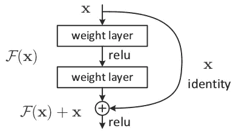
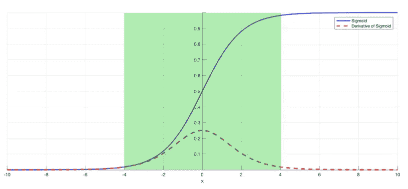

# 消失梯度问题

> 原文：<https://towardsdatascience.com/the-vanishing-gradient-problem-69bf08b15484?source=collection_archive---------1----------------------->

## 问题、原因、意义及其解决方案

Title Image // [Source](https://commons.wikimedia.org/wiki/File:Vanishing_Point_of_Railway.jpg)

## **问题:**

随着使用某些激活函数的更多层被添加到神经网络，损失函数的梯度接近零，使得网络难以训练。

## **为什么:**

某些激活函数，如 sigmoid 函数，将大的输入空间压缩成 0 到 1 之间的小输入空间。因此，sigmoid 函数输入的大变化会导致输出的小变化。因此，导数变小。

Image 1: The sigmoid function and its derivative // [Source](https://isaacchanghau.github.io/img/deeplearning/activationfunction/sigmoid.png)

例如，图 1 是 sigmoid 函数及其导数。请注意，当 sigmoid 函数的输入变大或变小时(当|x|变大时)，导数变得接近于零。

## **意义何在:**

对于只有几层使用这些激活的浅层网络，这不是一个大问题。然而，当使用更多的层时，它会导致梯度太小而不能有效地进行训练。

使用反向传播找到神经网络的梯度。简单地说，反向传播通过从最后一层一层地移动到初始层来找到网络的导数。根据链式法则，每层的导数沿网络向下相乘(从最后一层到初始层),以计算初始层的导数。

然而，当 *n* 个隐藏层使用类似 sigmoid 函数的激活时， *n* 个小导数相乘在一起。因此，当我们向下传播到初始层时，梯度呈指数下降。

小的梯度意味着初始层的权重和偏差不会随着每次训练而有效地更新。由于这些初始层通常对识别输入数据的核心元素至关重要，因此会导致整个网络的整体不准确。

## **解决方案:**

最简单的解决方法是使用其他激活函数，比如 ReLU，它不会引起一个小的导数。

剩余网络是另一种解决方案，因为它们提供直接到早期层的剩余连接。如图 2 所示，残差连接直接将块开头的值 **x** 加到块的结尾(F(x)+x)。这种剩余连接不经过激活函数，激活函数“挤压”导数，导致块的整体导数更高。

Image 2: A residual block

最后，批量规范化图层也可以解决这个问题。如前所述，当一个大的输入空间被映射到一个小的输入空间，导致导数消失时，问题就出现了。在图 1 中，这在|x|较大时最为明显。批量标准化通过简单地标准化输入来减少这个问题，这样|x|就不会到达 sigmoid 函数的外部边缘。如图 3 所示，它对输入进行了归一化处理，使大部分输入落在绿色区域，这里的导数不会太小。

Image 3: Sigmoid function with restricted inputs

如果您有任何问题或建议，请在下面留下您的评论:)

阅读这些文章了解更多信息:

*   [https://www . quora . com/什么是消失的渐变问题](https://www.quora.com/What-is-the-vanishing-gradient-problem)
*   https://en.wikipedia.org/wiki/Vanishing_gradient_problem
*   [https://towards data science . com/intuit-and-implement-batch-normalization-c 05480333 C5 b](/intuit-and-implement-batch-normalization-c05480333c5b)