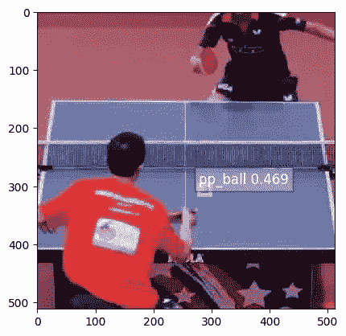

# 视频搜索引擎——我的计算机视觉之旅

> 原文：<https://towardsdatascience.com/the-video-search-engine-my-journey-into-computer-vision-9789824e76bb?source=collection_archive---------21----------------------->

## 制作视频很容易，但是谁有时间看完呢？我提出一个视频搜索引擎来找到相关的时刻(原型包括在内)。

创作视频内容是我一生的爱好。我记得在中学制作停止动画电影，毕业到 30 分钟。高中和大学的短片。由于我的孩子们，我的“电影”现在更加面向家庭，但我总是在思考新的项目。

当我反思我喜欢做的项目时，我不断回到同一个问题:记录镜头远比理解它容易。想想你手机的相机胶卷。它可能充满了数百个，如果不是数千个，未经编辑的视频，太长，不值得一看。

创作和消费视频之间的不平衡是“[典型的现代问题](https://www.npr.org/2019/08/09/749938354/episode-932-deep-learning-with-the-elephants)”的一部分，这是由廉价的录制设备甚至更便宜的数字存储设备造成的。快速总结一下，问题是我们可以把 15 个摄像头从 15 个不同的角度对准同一个体育赛事两个小时，产生 30 个小时的未剪辑视频。但是没有人有 30 个小时来观看这些内容。

> 我们需要的是一种从视频内容中提取有趣瞬间的方法。

让我们考虑一个更实际的例子。你当地的零售商可能每个月会录制数千小时的视频来识别商店扒手。然而，尽管有明显的商业价值，这个视频是未经编辑的，冗长的，非常不值得一看。需要的是**一个视频**的“搜索引擎”。以图像或视频“关键时刻”作为搜索词输入，输出相关视频片段作为搜索结果的系统。

这个问题让我想起了 2004 年夏天在我们国家的一个顶级 R&D 实验室——IBM t . j .沃森研究中心的实习。在那里，我看到了计算机视觉项目的早期应用，例如在进出停车场的汽车上绘制边界框。


Bounding boxes identifying cars and persons

我在 IBM 工作已经 15 年了，但我从未忘记那种神奇的感觉——看着屏幕上闪烁着汽车和人周围的盒子。当时，这样的输出是机器学习和计算能力的突破。我现在可以探索是否可以建立通用的视频搜索引擎。

## 探索:视频搜索引擎

我的目标是建立一个上述视频搜索引擎的原型。该系统将视频记录乒乓球比赛，当球在比赛时提取视频剪辑，并只向用户显示相关的剪辑。第一个关键结果是使用便携式设备视频记录乒乓球比赛，并将视频发送到云存储进行分析。第二个关键结果是训练一个目标检测模型，该模型发现一个乒乓球在运动。第三个关键结果是将提取的视频剪辑输出到 web UI。

我对这个项目施加了各种限制，让它保持在晚上和周末的范围内。例如，我不打算在 Raspberry Pi 上构建一个完全包含的对象检测系统。相反，我将使用 AWS 来检索存储的视频剪辑，通过对象检测器处理它们，并将结果返回给 web UI。视频的实时处理也超出了这个项目的范围。也就是说，这些限制为这个项目带来了令人兴奋的未来机遇。

## 在便携式设备上录制视频

到目前为止，我已经完成了第一个关键结果的 70%,通过使用 Raspberry Pi 录制视频内容，并将视频发送到 AWS S3 以供未来分析。

从一开始，我就想象树莓 Pi(带有 Pi 相机模块)将是探索便携式视频捕捉的理想选择。我了解到[有很多选择](https://www.pyimagesearch.com/2019/04/15/live-video-streaming-over-network-with-opencv-and-imagezmq/)，包括 IP 摄像头、网络摄像头等等。但是事后来看，我很高兴我选择了 Raspberry Pi，因为它的外形、记录良好的代码和热情的社区。

一旦我启动了 Raspberry Pi，我就配置了一个 SSH 环境，这样我就可以从我的笔记本电脑上执行代码来捕捉图像和视频。

然后我不得不把视频发给 S3 AWS。我用 Python 做了一个简单的设计:(1)从 Pi 摄像机打开一个视频流，(2)每两秒钟向 S3 发送一帧。

```
import imutils
from imutils.video import VideoStream
from imutils.video import FPS
import boto3
import cv2
import datetime
import time
from decimal import Decimal
import uuid
import json
import pytz
from pytz import timezone
import os# init interface to AWS S3 via Python
s3_client = boto3.client('s3',
      aws_access_key_id=os.environ["AWS_ACCESS_KEY_ID"],
      aws_secret_access_key=os.environ["AWS_SECRET_ACCESS_KEY"])

# init where to send the captured frames
s3_bucket = "img-from-raspi-for-web"
s3_key_frames_root = "frames/"# init video stream from Raspberry Pi Camera
print("[INFO] starting video stream...")
vs = VideoStream(src=0).start()
# vs = VideoStream(usePiCamera=True).start()
time.sleep(2.0) # warm up the sensordef convert_ts(ts, selected_timezone):
   *# Converts a timestamp to the configured timezone. Returns a localized datetime object
*   tz = timezone(selected_timezone)
   utc = pytz.utc
   utc_dt = utc.localize(datetime.datetime.utcfromtimestamp(ts))
   localized_dt = utc_dt.astimezone(tz)
   return localized_dt

# loop over frames from the video file stream
while True:
   # grab the frame from the video stream and resize it
   frame = vs.read()
   approx_capture_ts = time.time()
   if frame is None:
      continue # useful to skip blank frames from sensor

   frame = imutils.resize(frame, width=500)
   ret, jpeg = cv2.imencode('.jpg', frame)
   photo = jpeg.tobytes() 
   # bytes are used in future section to call Amazon Rekognition API

   now_ts = time.time()
   now = convert_ts(now_ts, "US/Eastern")
   year = now.strftime("%Y")
   mon = now.strftime("%m")
   day = now.strftime("%d")
   hour = now.strftime("%H")

   # build s3_key using UUID and other unique identifiers
   s3_key = (s3_key_frames_root + '{}/{}/{}/{}/{}.jpg').format(year, mon, day, hour, frame_id)

   # Store frame image in S3
   s3_client.put_object(
      Bucket=s3_bucket,
      Key=s3_key,
      Body=photo
   )
   time.sleep(2.0) # essentially, a frame rate of 0.5
```

图像开始出现在我的 S3 桶中，所以我开始为这个项目设计数据库。

我的设计将每幅图像、其时间戳和每幅图像的预测结果存储在 NoSQL 表中。稍后，我将查询该数据库中的预测，并获取相应的时间戳，以将视频剪辑成相关的剪辑。

现在，我为预测设置了一个存根，依靠 [AWS Rekognition](https://aws.amazon.com/blogs/aws/launch-welcoming-amazon-rekognition-video-service/) API 来检测对象。下面是我如何将数据保存到 DynamoDB 表中的:

```
def detect_labels_local_file(photo):
    response = rekog_client.detect_labels(Image={'Bytes': photo},
            MaxLabels=5,
            MinConfidence=60.0)

    for label in response['Labels']:
        print (label['Name'] + ' : ' + str(label['Confidence']))

    return response### In the while loop ###
    rekog_response = detect_labels_local_file(photo) # Persist frame data in dynamodb
    ddb_item = {
       'frame_id': frame_id,
       'processed_timestamp': now_ts, # beware of putting floats into DDB. Had to use json.loads as a workaround
       'approx_capture_timestamp': approx_capture_ts,
       'rekog_labels': rekog_response['Labels'],
       'rekog_orientation_correction':
          rekog_response['OrientationCorrection']
          if 'OrientationCorrection' in rekog_response else 'ROTATE_0',
       'processed_year_month': year + mon,  # To be used as a Hash Key for DynamoDB GSI
       's3_bucket': s3_bucket,
       's3_key': s3_key
    }

    ddb_data = json.loads(json.dumps(ddb_item), parse_float=Decimal)

    ddb_table.put_item(Item=ddb_data)
```

成功！我有一个 NoSQL 表，它引用了 S3 图像、时间戳及其相应的预测:


Items in DynamoDB table, showing Rekognition API results for captured frames from Pi Camera

## 构建乒乓球检测的机器学习模型

在摄像头对准我的情况下，AWS Rekognition 以 99.13%的置信度检测到了一个‘人’。但是，Rekognition 能否检测到正在运动的乒乓球来帮助我实现第二个关键结果呢？

遗憾的是，没有。在测试了许多乒乓球图像后，我发现 Rekognition 在检测场景方面的表现令人钦佩——例如标记属于“乒乓球”的图像。但是在寻找乒乓球方面，Rekognition 表现不佳。在大多数情况下，它根本没有将球区分为可识别的物体。当它找到球时，它把它标为“月亮”😎


Rekognition results for an image of a ping pong match

使用 Rekognition API 很方便，但是对于我的项目来说有所限制。幸运的是，如果你想定制自己的模型，亚马逊提供了 [SageMaker 对象检测 API](https://docs.aws.amazon.com/sagemaker/latest/dg/object-detection.html) 。

我从一场乒乓球比赛的视频开始。以下是一些示例框架:


## 准备和标记数据

我的第一个任务是用乒乓球标记视频帧，以建立一个训练、验证和测试数据集。 [FFmpeg 库](https://en.wikipedia.org/wiki/FFmpeg)有助于将视频转换成我可以标记的图像:

```
# from Terminal after installing the ffmpeg library# Get one frame to identify the area I care about
ffmpeg -i tt-video-1080p.mp4 -ss 00:00:59.000 -vframes 1 thumb.jpg

# I found an area I care about in a fixed-position video feed using a photo-editing program: a 512x512 image with a top-left corner at x:710, y:183y
ffmpeg -i tt-video-1080p.mp4 -filter:v "crop=512:512:710:183” cropped.mp4# output the video as a series of jpg images @ 10 frames per second
ffmpeg -i cropped.mp4 -vf fps=10 thumb%04d.jpg -hide_banner
```

上面的片段在我的机器上生成了成千上万的图像。下一步是给乒乓球添加“边界框”。

有许多[服务](https://thehive.ai/hive-data?gclid=EAIaIQobChMIwrbin5m45gIV4oNaBR39agSjEAAYAyAAEgLNqfD_BwE)为你执行这项艰巨的任务，但我选择亲自标记这些图像，以便更深入地理解和欣赏计算机视觉。我求助于 RectLabel，这是一个图像注释工具，用于标记图像以进行边界框对象检测和分割:


我在这项任务上花了大约四个小时，平均每分钟 8.3 个标签，得到了 2000 个带标签的图像。这是令人麻木的工作。

在我的标记工作进行到一半的时候，我想知道在给定 JPEG 压缩伪像和乒乓球上的运动模糊的情况下，紧密还是松散的边界框会更好地平衡模型精度和模型泛化。在打电话给一个朋友、[保罗·布兰克利](https://www.linkedin.com/in/paulblankley/)和[咨询网络](https://www.quora.com/How-should-I-label-image-data-for-machine-learning)之后，我了解到“边界框通常紧紧围绕着图像中的每个[对象]”，因为:

> 如果没有精确绘制的边界框，整个算法都会受到影响，从而导致无法准确识别[对象]。这就是为什么质量检查和确保高度重视每个边界框的准确性，从而产生一个强大的人工智能引擎。

如果我不得不再次做这个项目，我会使用无损图像格式(*。png)并绘制更紧密的边界框来改善我的训练数据。然而我认识到**这种优化不是免费的**。当我开始用更紧的边界框标记图像时，我的平均标记速度下降了大约 50%。

一旦我完成了对图像的标记，RectLabel 就将数据输出到一个 JSON 文件中，该文件适合计算机视觉任务。以下是输出示例:

```
{"images":[
    {"id":1,"file_name":"thumb0462.png","width":0,"height":0},
    {"id":2,"file_name":"thumb0463.png","width":0,"height":0},
#    ...
    {"id":4582,"file_name":"thumb6492.png","width":0,"height":0}],"annotations":[
    {"area":198,"iscrowd":0,"id":1,"image_id":1,"category_id":1,"segmentation":[[59,152,76,152,76,142,59,142]],"bbox":[59,142,18,11]},
    {"area":221,"iscrowd":0,"id":2,"image_id":2,"category_id":1,"segmentation":[[83,155,99,155,99,143,83,143]],"bbox":[83,143,17,13]},
#    ...       {"area":361,"iscrowd":0,"id":4,"image_id":4582,"category_id":1,"segmentation":[[132,123,150,123,150,105,132,105]],"bbox":[132,105,19,19]},"categories":[{"name":"pp_ball","id":1}]
}
```

然后，我创建了一个函数，按照 Amazon SageMaker 输入通道的预期，将注释分成训练和验证文件夹。如果你正在遵循我的准则，请注意来自 [Ryo Kawamura](https://stackoverflow.com/questions/58592206/understanding-the-output-of-sagemaker-object-detection-prediction) 的重要提示:

> 虽然 COCO JSON 文件中的“category_id”从 1 开始，但 Amazon SageMaker JSON 文件中的“class_id”从 0 开始。

```
import json
import osdef fixCategoryId(category_id):
    return category_id - 1;with open(file_name) as f:
    js = json.load(f)
    images = js['images']
    categories = js['categories']
    annotations = js['annotations']
    for i in images:
        jsonFile = i['file_name']
        jsonFile = jsonFile.split('.')[0] + '.json'line = {}
        line['file'] = i['file_name']
        line['image_size'] = [{
            'width': int(i['width']),
            'height': int(i['height']),
            'depth': 3
        }]
        line['annotations'] = []
        line['categories'] = []
        for j in annotations:
            if j['image_id'] == i['id'] and len(j['bbox']) > 0:
                line['annotations'].append({
                    'class_id': fixCategoryId(int(j['category_id'])),
                    'top': int(j['bbox'][1]),
                    'left': int(j['bbox'][0]),
                    'width': int(j['bbox'][2]),
                    'height': int(j['bbox'][3])
                })
                class_name = ''
                for k in categories:
                    if int(j['category_id']) == k['id']:
                        class_name = str(k['name'])
                assert class_name is not ''
                line['categories'].append({
                    'class_id': fixCategoryId(int(j['category_id'])),
                    'name': class_name
                })
        if line['annotations']:
            with open(os.path.join('generated', jsonFile), 'w') as p:
                json.dump(line, p)jsons = os.listdir('generated')
print ('There are {} images that have annotation files'.format(len(jsons)))
```

接下来，我按照 SageMaker 端点:/train、/validation、/train_annotation 和/validation_annotation 的要求，将文件移动到一个包含四个文件夹的亚马逊 S3 桶中。我在训练和验证文件上使用了 70%的分割，并混洗了数据:

```
import shutil
import randomnum_annotated_files = len(jsons)
train_split_pct = 0.70
num_train_jsons = int(num_annotated_files * train_split_pct)
random.shuffle(jsons) # randomize/shuffle the JSONs to reduce reliance on *sequenced* frames
train_jsons = jsons[:num_train_jsons]
val_jsons = jsons[num_train_jsons:]

#Moving training files to the training folders
for i in train_jsons:
    image_file = './images/'+i.split('.')[0]+'.png'
    shutil.move(image_file, './train/')
    shutil.move('./generated/'+i, './train_annotation/')

#Moving validation files to the validation folders
for i in val_jsons:
    image_file = './images/'+i.split('.')[0]+'.png'
    shutil.move(image_file, './validation/')
    shutil.move('./generated/'+i, './validation_annotation/')

### Upload to S3
import sagemaker
from sagemaker import get_execution_role

role = sagemaker.get_execution_role()
sess = sagemaker.Session()

from sagemaker.amazon.amazon_estimator import get_image_uri
training_image = get_image_uri(sess.boto_region_name, 'object-detection', repo_version="latest")

bucket = 'pp-object-detection' # custom bucket name.
# bucket = sess.default_bucket()
prefix = 'rect-label-test'

train_channel = prefix + '/train'
validation_channel = prefix + '/validation'
train_annotation_channel = prefix + '/train_annotation'
validation_annotation_channel = prefix + '/validation_annotation'

sess.upload_data(path='train', bucket=bucket, key_prefix=train_channel)
sess.upload_data(path='validation', bucket=bucket, key_prefix=validation_channel)
sess.upload_data(path='train_annotation', bucket=bucket, key_prefix=train_annotation_channel)
sess.upload_data(path='validation_annotation', bucket=bucket, key_prefix=validation_annotation_channel)

s3_train_data = 's3://{}/{}'.format(bucket, train_channel)
s3_validation_data = 's3://{}/{}'.format(bucket, validation_channel)
s3_train_annotation = 's3://{}/{}'.format(bucket, train_annotation_channel)
s3_validation_annotation = 's3://{}/{}'.format(bucket, validation_annotation_channel)
```

## 训练模型

在下一步中，我创建了一个具有某些超参数的 SageMaker 对象检测器，例如使用“resnet-50”算法的和一个类(我的乒乓球)以及大小为 512x512 像素的图像。

```
s3_output_location = 's3://{}/{}/output'.format(bucket, prefix)od_model = sagemaker.estimator.Estimator(training_image, role, train_instance_count=1, train_instance_type='ml.p3.2xlarge', train_volume_size = 50, train_max_run = 360000, input_mode = 'File', output_path=s3_output_location, sagemaker_session=sess)od_model.set_hyperparameters(base_network='resnet-50',
                             use_pretrained_model=0,
                             num_classes=1,
                             mini_batch_size=15,
                             epochs=30,
                             learning_rate=0.001,
                             lr_scheduler_step='10',
                             lr_scheduler_factor=0.1,
                             optimizer='sgd',
                             momentum=0.9,
                             weight_decay=0.0005,
                             overlap_threshold=0.5,
                             nms_threshold=0.45,
                             image_shape=512,
                             label_width=600,
                             num_training_samples=num_train_jsons)
```

然后，我为对象检测器设置训练/验证位置，称为。拟合函数，并将模型部署到一个端点:

```
train_data = sagemaker.session.s3_input(s3_train_data, distribution='FullyReplicated', content_type='image/png', s3_data_type='S3Prefix')validation_data = sagemaker.session.s3_input(s3_validation_data, distribution='FullyReplicated', content_type='image/png', s3_data_type='S3Prefix')train_annotation = sagemaker.session.s3_input(s3_train_annotation, distribution='FullyReplicated', content_type='image/png', s3_data_type='S3Prefix')validation_annotation = sagemaker.session.s3_input(s3_validation_annotation, distribution='FullyReplicated', content_type='image/png', s3_data_type='S3Prefix')data_channels = {'train': train_data, 'validation': validation_data, 'train_annotation': train_annotation, 'validation_annotation':validation_annotation}od_model.fit(inputs=data_channels, logs=True)object_detector = od_model.deploy(initial_instance_count = 1,
                             instance_type = 'ml.m4.xlarge')
```

鉴于我只有 2000 张图片，我的亚马逊盒子(ml.p3.2xlarge)花了大约 10 分钟来训练模型。部署端点通常需要更长的时间，并且测试模型的预期是令人痛苦的！

终于，真相大白的时刻到了。我通过传递一个它从未见过的 PNG 文件来调用我的模型:

```
file_with_path = 'test/thumb0695.png'
with open(file_with_path, 'rb') as image:
            f = image.read()
            b = bytearray(f)
            ne = open('n.txt', 'wb')
            ne.write(b)results = object_detector.predict(b)
        detections = json.loads(results)
        print(detections)
```

我得到了这样的输出:

```
[1.0, 0.469, 0.566, 0.537, 0.605, 0.595]
```

下面是如何根据 AWS SageMaker 解释这个输出:

> 这些对象数组中的每一个都由六个数字组成。第一个数字是预测的类标签。第二个数字是检测的相关置信度得分。最后四个数字代表边界框坐标[xmin，ymin，xmax，ymax]。这些输出边界框角索引由整体图像尺寸归一化。请注意，这种编码不同于输入使用的编码。json 格式。例如，在检测结果的第一个条目中，0.3088374733924866 是边界框的左坐标(左上角的 x 坐标)作为整体图像宽度的比率，0.07030484080314636 是边界框的上坐标(左上角的 y 坐标)作为整体图像高度的比率，0.7110607028007507 是右坐标(右坐标

凉爽的😏

## 可视化结果

坦白地说，我需要一些更实际的东西来欣赏结果。所以我用这个函数来可视化每个预测:

```
def visualize_detection(img_file, dets, classes=[], thresh=0.6):
    import random
    import matplotlib.pyplot as plt
    import matplotlib.image as mpimg

    img = mpimg.imread(img_file)
    plt.imshow(img)
    height = img.shape[0]
    width = img.shape[1]
    colors = dict()
    for det in dets:
        (klass, score, x0, y0, x1, y1) = det
        if score < thresh:
            continue
        cls_id = int(klass)
        if cls_id not in colors:
            colors[cls_id] = (random.random(), random.random(), random.random())
        xmin = int(x0 * width)
        ymin = int(y0 * height)
        xmax = int(x1 * width)
        ymax = int(y1 * height)
        rect = plt.Rectangle((xmin, ymin), xmax - xmin,
                             ymax - ymin, fill=False,
                             edgecolor=colors[cls_id],
                             linewidth=3.5)
        plt.gca().add_patch(rect)
        class_name = str(cls_id)
        if classes and len(classes) > cls_id:
            class_name = classes[cls_id]
        plt.gca().text(xmin, ymin - 2,
                       '{:s} {:.3f}'.format(class_name, score),
                       bbox=dict(facecolor=colors[cls_id], alpha=0.5),fontsize=12, color='white')
    plt.show()# then I used the function like this:
object_categories = ['pp_ball']
threshold = 0.40
visualize_detection(file_name_of_image, detections['prediction'], object_categories, threshold)
```

当我看到这个输出时，我兴奋而欣慰地发抖:



我花了一个小时用它从未见过的各种测试图像敲打模型。有些是伟大的预言。其他的则很傻，比如这个模型把球员制服上的白点当成了乒乓球🙄


幸运的是，我能够通过将置信度阈值提高到 0.40 来消除大多数误报。

## 未来方向

我对目前的结果很满意，但是未来的工作需要评估和优化我的模型。例如，我打算计算[平均精度(mAP)](https://medium.com/@jonathan_hui/map-mean-average-precision-for-object-detection-45c121a31173) 作为性能指标。那个地图度量将帮助我评估不同的优化，例如添加更多的训练图像，尝试迁移学习，以及尝试其他深度学习拓扑。我将把这些任务留给我的 2020 年路线图(和未来的帖子)。

我也很高兴能够在 2020 年实现我的第三个关键成果——通过网络用户界面向用户展示相关的视频剪辑。当关键结果完成后，我将在真实环境中测试整个设置:

*   用我的树莓皮视频记录一场现场乒乓球比赛
*   将视频导出到 S3 的图像帧中
*   使用对象检测器模型来识别球何时在比赛中
*   当球在比赛时存储时间戳
*   向用户提供网络用户界面
*   允许用户将视频过滤到球正在运动的瞬间

请继续关注这个方向的更多学习和发展。

## 结束语

数据科学家普遍认为

> 算法便宜；
> 
> 数据为王。

这个项目让我深深体会到这一真理。事实上，在 AWS SageMaker 上,[改变深度学习拓扑结构的能力](https://docs.aws.amazon.com/sagemaker/latest/dg/object-detection-api-config.html)是微不足道的。然而结果并没有明显的变化。我还以最小的努力在另一个模型中利用了[迁移学习](https://docs.aws.amazon.com/sagemaker/latest/dg/algo-object-detection-tech-notes.html)。同样，结果也好不到哪里去。然后，我想起了为我的项目收集和标记图像的艰苦工作…

当我将与模型相关的工作和与数据相关的工作在努力程度和跨项目适用性方面进行比较时，我感到困惑。例如，在深度学习拓扑结构之间切换相对容易，许多项目可以在各种计算机视觉任务中利用这些拓扑结构。相比之下，我的图像标签工作需要大量的努力，可能只会对我的项目有益。

面对这一现实，我对通用视频搜索引擎的可行性感到有点悲观，这种搜索引擎可以从用户任意输入的(1)视频和(2)图像作为搜索词中产生结果。诚然，一个特定用途的视频搜索引擎指日可待。但重要的、不平凡的工作还在后面，以探索一个模型如何能够根据几个图像示例进行归纳，以检测用户想要找到的任何内容。

在这方面，这是一个有趣的学习年！

非常感谢 [Sandeep Arneja](https://www.linkedin.com/in/sandeeparneja/) 、 [Paul Blankley](https://www.linkedin.com/in/paulblankley/) 、 [Ryo Kawamura](https://www.linkedin.com/in/ryo-kawamura-91a11a52/?locale=en_US) 和 [Thea Zimnicki](https://angel.co/thea-zimnicki) 对这个项目的反馈和贡献。