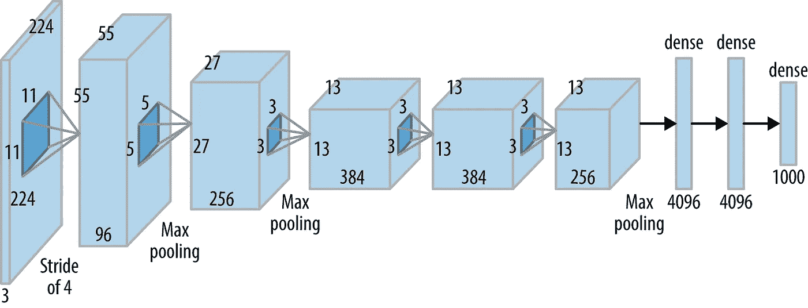

# AlexNet、VGGNet、ResNet 和 Inception 之间的区别

> 原文：<https://towardsdatascience.com/the-w3h-of-alexnet-vggnet-resnet-and-inception-7baaaecccc96?source=collection_archive---------0----------------------->

在本教程中，我将快速浏览四个著名的 CNN 架构的细节，并通过解释它们的 W3H(何时、为什么、什么和如何)来说明它们之间的区别

# AlexNet

**什么时候？**

*   艾伦·图灵年
*   人人享有可持续能源年
*   伦敦奥运会

**为什么？** AlexNet 的诞生源于提高 ImageNet 挑战赛成绩的需要。这是首批 ***深度*** 卷积网络之一，在 2012 ImageNet LSVRC-2012 挑战赛中获得了相当高的准确率，准确率为 84.7%，相比之下，第二名的准确率为 73.8%。使用卷积层和感受野探索了图像帧中空间相关性的思想。

**什么？**网络由 5 个卷积(CONV)层和 3 个全连接(FC)层组成。使用的激活是整流线性单元(ReLU)。网络中每一层的结构细节可以在下表中找到。

Alexnet Block Diagram (source:oreilly.com)

该网络共有 6200 万个可训练变量

**如何？**网络的输入是一批大小为 227×227×3 的 RGB 图像，并输出 1000×1 的概率向量，每个向量对应一个类别。

*   执行数据扩充以减少过拟合。这种数据扩充包括镜像和裁剪图像，以增加训练数据集中的变化。网络在第一、第二和第五个 CONV 图层之后使用重叠的 max-pooling 图层。重叠的最大池层只是跨度小于窗口大小的最大池层。使用 3×3 最大池层，步幅为 2，因此产生重叠感受野。这种重叠将前 1 名和前 5 名误差分别提高了 0.4%和 0.3%。
*   在 AlexNet 之前，最常用的激活函数是 *sigmoid* 和 *tanh。*由于这些函数的饱和性质，它们遭受消失梯度(VG)问题，并使网络难以训练。AlexNet 使用的是 *ReLU* 激活函数，不会遇到 VG 问题。原始论文显示，具有 *ReLU* 的网络实现 25%的错误率比具有 *tanh* 非线性的相同网络快大约 6 倍。
*   尽管 ReLU 有助于解决梯度消失的问题，但由于其不受限制的性质，学习到的变量可能会变得不必要的高。为了防止这种情况，AlexNet 引入了本地响应标准化(LRN)。LRN 背后的想法是在放大受激神经元的像素邻域中执行归一化，同时抑制周围的神经元。
*   AlexNet 还通过使用丢弃层来解决过拟合问题，其中在训练期间以 p=0.5 的概率丢弃连接。虽然这通过帮助网络摆脱坏的局部最小值而避免了网络的过度拟合，但是收敛所需的迭代次数也加倍了。

# VGGNet:

**什么时候？**

*   国际家庭农业和结晶学年
*   首次机器人登陆彗星
*   罗宾·威廉姆斯去世的那一年

**为什么？** VGGNet 的诞生是为了减少 CONV 层中的参数数量和提高训练时间。

**什么？**VGGNet 有多个变种(VGG16，VGG19 等。)不同之处仅在于网络的总层数。VGG16 网络的结构细节如下所示。

VGG16 Block Diagram (source: neurohive.io)

VGG16 共有 1.38 亿个参数。这里需要注意的重要一点是，所有 conv 内核的大小都是 3x3，maxpool 内核的大小是 2x2，步长为 2。

**如何？**固定大小内核背后的想法是，Alexnet (11x11，5x5，3x3)中使用的所有可变大小卷积内核都可以通过使用多个 3x3 内核作为构建块来复制。这种复制是根据核仁覆盖的感受野进行的。

让我们考虑下面的例子。假设我们有一个大小为 5x5x1 的输入层。实施内核大小为 5x5 且跨距为 1 的 conv 图层将产生 1x1 的输出要素地图。如下所示，通过使用跨距为 1 的两个 3x3 conv 图层，可以获得相同的输出要素地图

现在让我们看看需要训练的变量的数量。对于 5×5 conv 层过滤器，变量的数量是 25。另一方面，内核大小为 3x3 的两个 conv 层总共有 3x3x2=18 个变量(减少了 28%)。

同样，一个 7x7 (11x11) conv 层的效果可以通过以一个步长实施三(五)个 3x3 conv 层来实现。这将可训练变量的数量减少了 44.9% (62.8%)。可训练变量数量的减少意味着更快的学习和更强的抗过拟合能力。

# 雷斯内特

**什么时候？**

*   引力波的发现
*   国际土壤和光基技术年
*   火星电影

**为什么？**神经网络臭名昭著，因为当它存在时，无法找到更简单的映射。

*   例如，假设我们有一个完全连接的多层感知器网络，我们想在输入等于输出的数据集上训练它。这个问题最简单的解决方案是让所有的权重等于 1，所有的隐藏层的偏差为零。但是当使用反向传播来训练这样的网络时，学习了相当复杂的映射，其中权重和偏差具有大范围的值。
*   另一个例子是给现有的神经网络增加更多的层。假设我们有一个网络***【f(x)***，它在数据集上达到了 *n%* 的精度。现在将更多层添加到这个网络 ***g(f(x))*** 应该至少具有 *n%* 的精度，即在最坏的情况下 ***g(。)*** 应该是产生与***【f(x)***相同精度的相同映射，如果不是更多的话。但不幸的是，事实并非如此。实验表明，网络层数越多，精度越低。
*   上述问题的发生是因为消失梯度问题。随着 CNN 越做越深，当反向传播到初始层时，导数的值几乎变得微不足道。

ResNet 通过引入两种类型的“快捷连接”来处理这个网络:*身份快捷方式*和*投影快捷方式。*

**什么？**resnet XX 架构有多个版本，其中“XX”表示层数。最常用的是 ResNet50 和 ResNet101。自从消失梯度问题被解决后(在如何解决的部分有更多的介绍)，CNN 开始越陷越深。下面我们介绍 ResNet18 的结构细节

Resnet18 有大约 1100 万个可训练参数。它由 CONV 层和大小为 3x3 的滤镜组成(就像 VGGNet 一样)。在整个网络中只使用两个池层，一个在网络的起点，另一个在网络的终点。每两个 CONV 层之间都有身份联系。实线箭头表示输入和输出维度相同的标识快捷方式，而虚线箭头表示维度不同的投影连接。

**如何？**如前所述，ResNet 架构利用快捷连接解决渐变消失问题。ResNet 的基本构造块是在整个网络中重复的剩余块。

Residual Block — Image is taken from the original paper

网络不是从 x →F(x)学习映射，而是从 x → F(x)+G(x)学习映射。当输入 x 和输出 F(x)的维数相同时，函数 G(x) = x 是恒等函数，这种快捷连接称为恒等连接。通过在训练期间将中间层中的权重归零来学习相同的映射，因为将权重归零比将它们推到 1 更容易。

对于 F(x)的维数不同于 x 的情况(由于在它们之间的 CONV 层中步长> 1)，实现投影连接而不是单位连接。函数 G(x)将输入 x 的维数改变为输出 F(x)的维数。在原始论文中考虑了两种映射。

*   **不可训练的映射(填充):**输入 x 简单地用零填充，以使维数匹配 F(x)的维数
*   **可训练映射(Conv 层)** : 1x1 Conv 层用于映射 x 到 G(x)。从上表可以看出，在整个网络中，空间维度保持相同或减半，深度保持相同或加倍，并且每个 conv 层之后的宽度和深度的乘积保持相同，即 3584。通过分别使用步长 2 和多个这样的滤波器，1×1 conv 层被用于空间维度的一半和深度的两倍。1x1 conv 层的数量等于 F(x)的深度。

# 初始状态:

**什么时候？**

*   国际家庭农业和结晶学年
*   首次机器人登陆彗星
*   罗宾·威廉姆斯去世的那一年

**为什么？**在图像分类任务中，显著特征的大小可以在图像帧内显著变化。因此，决定一个固定的内核大小是相当困难的。对于分布在图像的大面积上的更全局的特征，较大的核是优选的，另一方面，较小的核在检测分布在图像帧上的区域特定的特征方面提供良好的结果。为了有效地识别这种可变大小的特征，我们需要不同大小的核。这就是《盗梦空间》所做的。它不是简单地在层数上更深入，而是走得更宽。不同大小的多个内核在同一层中实现。

**什么？**初始网络架构由以下结构的若干初始模块组成

Inception Module (source: original paper)

每个初始模块由四个并行的操作组成

*   1x1 conv 层
*   3x3 conv 层
*   5x5 conv 层
*   最大池化

黄色显示的 1x1 conv 块用于深度缩减。四个并行操作的结果随后在深度方向上连接在一起，形成滤波器连接模块(绿色)。《盗梦空间》有多个版本，最简单的一个是 GoogLeNet。

**如何？** Inception 增加了网络空间，通过训练可以从中选择最佳网络。每个 inception 模块都可以捕获不同层次的显著特征。全局要素由 5x5 conv 层捕获，而 3x3 conv 层易于捕获分布式要素。max-pooling 操作负责捕捉邻域中突出的低级要素。在给定的级别上，所有这些特征都被提取并连接起来，然后再传送到下一层。我们让网络/训练来决定哪些特征具有最大的价值和权重。假设如果数据集中的图像富含全局特征而没有太多低级特征，那么与 5×5 conv 内核相比，训练的初始网络将具有非常小的对应于 3×3 conv 内核的权重。

# 摘要

在下表中，这四个 CNN 根据其在 Imagenet 数据集上的前 5 名准确度进行排序。还可以看到向前传递所需的可训练参数和浮点运算(FLOP)的数量。

可以进行几种比较:

*   AlexNet 和 ResNet-152 都有大约 60M 的参数，但在它们的前 5 名精度方面有大约 10%的差异。但是训练 ResNet-152 需要大量的计算(大约是 AlexNet 的 10 倍)，这意味着需要更多的训练时间和精力。
*   与 ResNet-152 相比，VGGNet 不仅参数和 FLOP 数量更多，而且精度也有所下降。训练精度降低的 VGGNet 需要更多的时间。
*   训练一个 AlexNet 和训练 Inception 花的时间差不多。内存需求减少了 1/10，精确度提高了约 9%

# 奖金:

可以在下面的链接中找到这个主题和机器学习中许多其他重要主题的紧凑备忘单

 [## 机器学习面试主题的备忘单

### ML 面试的视觉备忘单(www.cheatsheets.aqeel-anwar.com)

medium.com](https://medium.com/swlh/cheat-sheets-for-machine-learning-interview-topics-51c2bc2bab4f) 

如果这篇文章对你有帮助，欢迎鼓掌、分享和回复。如果想了解更多关于机器学习和数据科学的知识，请关注我@[**Aqeel an war**](https://medium.com/u/a7cc4f201fb5?source=post_page-----7baaaecccc96--------------------------------)**或者在**[***LinkedIn***](https://www.linkedin.com/in/aqeelanwarmalik/)***上与我联系。***