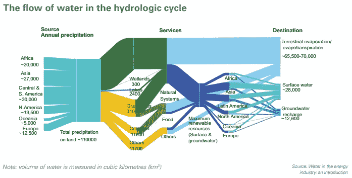
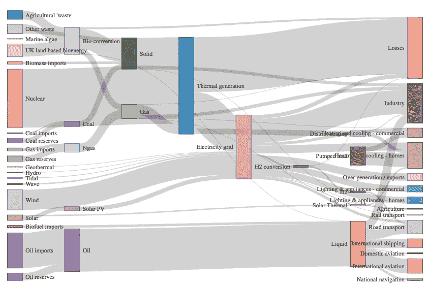
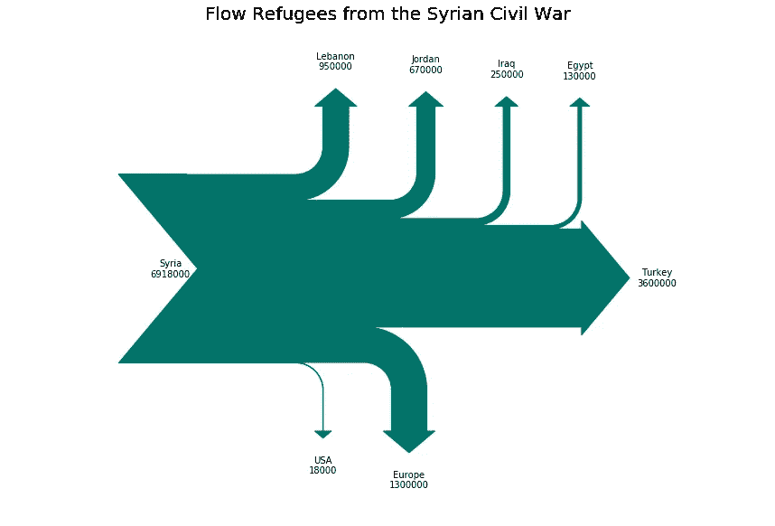
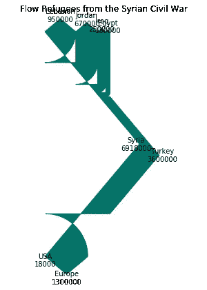
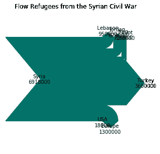
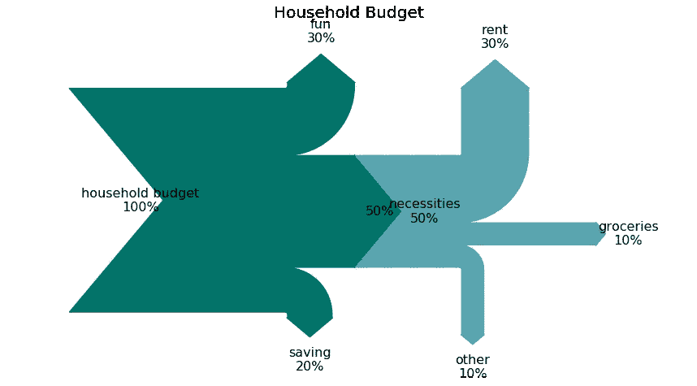
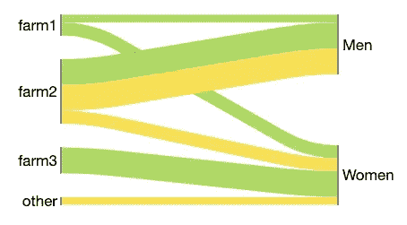

# 桑基图的内容、原因和方式

> 原文：<https://towardsdatascience.com/the-what-why-and-how-of-sankey-diagrams-430cbd4980b5?source=collection_archive---------7----------------------->

## 智能显示资源流动

# **知道什么**

桑基图显示了资源的流动。他们交流所代表的资源、材料或成本的来源和用途。

阅读和解释桑基图的关键是记住宽度与所表示的数量成正比。在下面的例子中，观众很快就会看到，除了水文循环的其他特征之外，水的最大目的地是陆地蒸发。



Source: [The Energy Sustainability Challenge](https://www.ourenergypolicy.org/wp-content/uploads/2014/01/BP_ESC_Riosmallpdf.com_.pdf)


## 红旗

当呈现桑基图时，记住唯一的规则(好的，主要规则)是线条和箭头的宽度代表资源的数量或体积。如果箭头不具有代表性，这可能意味着构造者犯了一个错误，不理解工具的用途，或者试图隐藏一个难以忽视的事实。如果出现了什么问题，一定要问问题，以确保你理解了可视化。

# 为什么/什么时候它们很棒

1.  Sankey 图允许您直观地显示复杂的流程，重点关注您想要突出显示的单个方面或资源。如果你的团队正在做一个关于精力、时间或金钱的决定，那么这是一个考虑桑基图的好时机。
2.  Sankeys 提供了支持多种观看级别的额外好处。观众可以获得高层次的观点，看到具体的细节，或产生互动的看法。如果你有一个喜欢向下钻取的队友，许多工具会让你共享该功能，而不需要创建者做任何额外的工作。您还可以预先确定最适合您的目的的深度级别。
3.  桑基图使主要贡献者或消费者脱颖而出，并帮助您的受众看到相对数量和/或具有最大机会的领域。

## 当他们不好的时候



This Sankey diagram from [Data to Viz](https://www.data-to-viz.com/graph/sankey.html) has a lot going on

有时，桑基图并不是适合您情况的合适工具:

*   它们可能显得过于复杂，让你的观众难以消化。
*   制作拙劣的桑基图，隐藏而不是突出可操作的洞察力。
*   由于不是每个人都熟悉这种可视化类型，复杂的桑基图可能需要花费更多的时间和精力来解释
*   桑基图很难区分和比较具有相似值(宽度)的流量。如果这些比较对你的目的是必要的，考虑一个(堆积)条形图。

# 如何制作桑基图

## 第一步:设计

首先，巩固你的目的和对你的观众最重要的收获。为了避免浪费时间重新构建图表或构建无效的桑基图，我建议在开始之前问自己以下几个问题:

*   您正在使用此 Sankey 进行探索性数据分析吗？
*   你是用它来讲述一个故事，促进一个特定的行动，改变想法吗？
*   谁是你的观众？
*   您的受众对数据可视化的体验水平如何？
*   你的受众在寻找什么并被什么说服——投资回报率、效率、有效性、盈利能力、地区或城市的比较？

从这里开始，在开始编码之前，从你想要的可视化的轮廓开始是一个好主意。绘制草图时，请考虑以下几点:

*   交流观点的替代方式
*   用空间和/或颜色对相关的输入或输出进行分组
*   用颜色表示从一种状态到另一种状态的转换
*   使用色彩饱和度或强度、位置、长度、角度、方向、形状来强调你的观众的主要观点。(除了宽度以外的任何东西！)
*   削减微小的流量或将它们归入“其他”类别以减少混乱

## 第二步:编码

```
from matplotlib.sankey import Sankey
from matplotlib import pyplot as pltfig = plt.figure(figsize=(15,10))
ax = fig.add_subplot(1, 1, 1, xticks=[], yticks=[],
                    title="Flow Refugees from the Syrian Civil War")
sankey = Sankey(ax=ax, 
                scale=0.0000001, 
                offset= 0.1,
                format = '%d')
sankey.add(flows=[6918000, -3600000, -950000, -670000, -250000, 
                  -130000, -1300000, -18000], 
           labels = ['Syria', 'Turkey', 'Lebanon', 'Jordan', 'Iraq', 
                     'Egypt', 'Europe', 'USA'], 
           orientations=[0, 0, 1, 1, 1, 1, -1, -1],#arrow directions
           edgecolor = '#027368',
           facecolor = '#027368')
sankey.finish();
```



## 其他有用的论据

*   Pathlength 使用此参数可以调整箭头的长度，一旦它们通过一个浮动列表从主流中分离出来。
*   Trunklength 使用此参数调整输入和输出之间的空间长度

## 一句警告



最初，我得到了这个不太像桑基的可视化。我完全不知道哪里出了问题——我看到了一些数字、标签和宽度，但肯定不是我所期望的。

深入研究文档，我决定调整树干长度，这有助于我的桑基开始从它的几何艺术品茧中出现。正如我丈夫指出的，它从波洛克到了大理。



然后我找到了——比例因子。原来比例因子是处理大值的关键！经过一点试验，我让桑基看起来好多了。

看起来默认值对于百分比值很有效，但是要准备好缩放任何其他数据量。

## 添加中间或附加步骤



```
fig = plt.figure(figsize = (15,8))
ax = fig.add_subplot(1, 1, 1, xticks=[], yticks=[], 
                     title="Household Budget")sankey = Sankey(ax=ax, scale=.1, offset=1, unit='%')sankey.add(flows=[100, -50, -30, -20],
           labels=['household budget', 'necessities', 'fun', 
                   'saving'],
           orientations=[0, 0, 1, -1],
           trunklength = 10,
           edgecolor = '#027368',
           facecolor = '#027368')sankey.add(flows=[50, -30, -10, -10], 
           labels=['','rent', 'groceries', 'other'],
           trunklength = 2,
           pathlengths = [3,3,3,3],
           orientations=[0, 1, 0, -1], 
           prior=0, #which sankey are you connecting to (0-indexed)
           connect=(1, 0), #flow number to connect: (prior, this)
           edgecolor = '#58A4B0',
           facecolor = '#58A4B0')diagrams = sankey.finish()
for diagram in diagrams:
    for text in diagram.texts:
        text.set_fontsize(16);
```

Matplotlib 的 sankey 包似乎不能完成您希望 Sankey 图所做的一切。例如，它似乎没有使用颜色来指示源或第三个属性来跟踪跨节点的流。如果你想制作更复杂的桑基图，特别是带有颜色功能的，我推荐你使用其他工具，比如`[f](https://github.com/ricklupton/floweaver)loweaver` [ [如何在这里使用](/creating-beautiful-sankey-diagrams-with-floweaver-dc1f02fe76bc?source=friends_link&sk=54c1f2f864d7ee6749964e3d6a8fc0e3) ]。



Sankey diagram from [floWeaver’s](https://github.com/ricklupton/floweaver) quick start guide showing the flows of apples and bananas

他们选择的主题——苹果和香蕉从农场到性别化消费者的转移——感觉有点做作。我很难相信没有女人吃农场 2 的苹果，只有女人吃农场 3 的苹果。同时，我认为这个工具是一个不错的选择，这取决于你的需求和风格偏好。

桑基图并不是每种情况下的完美工具。它们绝对不是创建或理解起来最快捷、最简单的可视化方式。但如果做得好，它们会成为强有力的话题引子。只要确保你正在使用它们，因为它们是传达你的信息的最佳方式，而不仅仅是炫耀你的可视化技能。