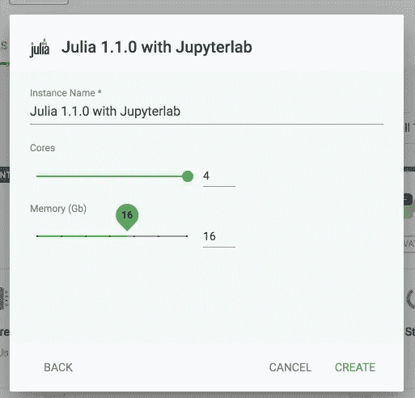

# 整个数据科学世界掌握在您手中

> 原文：<https://towardsdatascience.com/the-whole-data-science-world-in-your-hands-2f418165075e?source=collection_archive---------13----------------------->

## 在不同的语言和工具上测试 MatrixDS 功能。如果你处理数据，你必须检查这个。


Image by [Héizel Vázquez](https://www.instagram.com/heizelvazquez/)

多年来，我一直在寻找一个平台，在这个平台上，我可以运行我的数据科学项目，而不会有安装的痛苦，也不会让我的计算机充满许多不同的工具和环境。

幸运的是，我发现 [MatrixDS](https://matrixds.com/) 拥有所有这些以及更多免费的东西！在本文中，我将测试他们拥有的几乎所有工具，因此您不必这样做。

该项目在平台中是公开的，您可以在这里看到它:

 [## MatrixDS |数据项目工作台

### MatrixDS 是一个构建、共享和管理任何规模的数据项目的地方。

community.platform.matrixds.com](https://community.platform.matrixds.com/community/project/5cb72e2478de19f638a914b9) 

如果你想测试它，你必须做的就是铲车，就是这样。

还有一个 GitHub 回购:

[](https://github.com/FavioVazquez/matrix_languages_tools) [## FavioVazquez/matrix _ languages _ tools

### 测试 MatrixDS 的不同工具和语言。通过…为 FavioVazquez/matrix _ languages _ tools 开发做出贡献

github.com](https://github.com/FavioVazquez/matrix_languages_tools) 

# 测试 Python 的东西


## Jupyter 笔记本


我目前最喜欢的编程语言是 Python。有很多很棒的工具和特性可以帮助你使用这种语言。其中最受欢迎的是 Jupyter 笔记本。要在 MatrixDS 中启动笔记本，请执行以下操作:

1.  转到平台中的工具选项卡。
2.  单击右侧的(+)按钮:


3.选择 Python 3(或 2)与 Jupyter 笔记本:


4.为工具选择一个名称，并设置内核和 RAM 的数量:


5.创建并启动笔记本后，只需打开它:


6.开心编程；)

在笔记本里面，你可以自由地做任何你想做的事情。我创建了一个简单的 Python 笔记本来测试 [PySnooper](https://github.com/cool-RR/PySnooper) ，所以你可以试试。

这是该笔记本的要点，您可以在 MatrixDS 项目中找到:

## 朱庇特实验室


JupyterLab 是 Jupyter 项目的下一代基于网络的用户界面。这就像类固醇上的朱庇特笔记本。

要在 MatrixDS 中启动笔记本，请执行以下操作:

1.  转到平台中的工具选项卡。
2.  单击右侧的(+)按钮:


3.选择 Python 3 和 JupyterLab:


4.为工具选择一个名称，并设置内核和 RAM 的数量:


5.创建并启动工具后，只需打开它:


6.玩得更开心:)

我在 JupyterLab 实例中创建了一个简单的 Python 笔记本来进行测试，所以您可以尝试一下。

如果你一直在关注我，这就是你应该看到的:


哦，顺便说一下，如果你想知道如何使用 git 和 MatrixDS，请查看这篇文章:

[](/data-science-with-optimus-part-2-setting-your-dataops-environment-248b0bd3bce3) [## 擎天柱的数据科学。第 2 部分:设置您的数据操作环境。

### 用 Python、Spark 和 Optimus 分解数据科学。今天:数据科学的数据操作。..*第 1 部分在此…

towardsdatascience.com](/data-science-with-optimus-part-2-setting-your-dataops-environment-248b0bd3bce3) 

我创建的测试笔记本测试功能性机器学习的新库 [fklearn](https://github.com/nubank/fklearn) 。这是该笔记本的要点，您可以在 MatrixDS 项目中找到:

# 测试 R 事物


[https://www.computerworld.com/video/series/8563/do-more-with-r](https://www.computerworld.com/video/series/8563/do-more-with-r)

我在 r 上开始了我的数据科学生涯。它是一个非常棒的工具，可以进行数据分析、数据清理、绘图等等。我认为现在机器学习部分用 Python 更好，但要成为一名成功的数据科学家，你需要了解这两者。

要在 MatrixDS 中启动 RStudio，请执行以下操作:

1.  转到平台中的工具选项卡。
2.  单击右侧的(+)按钮:


3.使用 RStudio 选择 R 3.5:


4.为工具选择一个名称，并设置内核和 RAM 的数量:


5.创建并启动工具后，只需打开它:


6.玩得开心点:)

我创建的 test R 环境正在测试名为 g2r 的新库，该库使用 g2 为交互式可视化创建图形。

Btw！在运行 g2r 之前，我必须这样做:

```
sudo su 
apt-get install libv8-dev
```

所以，通常这就是你用 ggplot2 得到一个图的方法:

```
library(ggplot2)ggplot(iris, aes(Petal.Length, Petal.Width, color = Species)) +
  geom_point() +
  facet_wrap(.~Species)
```

您将获得:


不算太坏，但是给它带来交互性怎么样？？使用 g2r 非常简单。这是实现这一点的代码:

```
library(g2r)g2(iris, asp(Petal.Length, Petal.Width, color = Species)) %>% 
  fig_point() %>%
  plane_wrap(planes(Species))
```

您将获得:


在您更改的代码中:

```
aes -> asp
geom_point() -> fig_point()
facet_wrap(.~Species) -> plane_wrap(planes(Species))
```

我仍然想知道为什么他们不使用相同的 API，但这是一个非常酷的项目。你可以在这里找到更多的例子:

[](https://g2r.dev/articles/) [## 文章

### 启动并运行 g2r，发现与 ggplot2 的相似之处，并通过几个示例指出正确的方向…

g2r.dev](https://g2r.dev/articles/) 

这是所有的代码:

# 测试朱莉娅的东西


当我在攻读物理学硕士学位时(大约两年前)，我真的认为 Julia 将会彻底改变科学编程世界。不要误解我的意思，它做了一件了不起的工作，但是我认为 Python 的新进步已经让这个项目在很多方面都处于第二位。

为了测试 MatrixDS 的 Julia 功能，我想看看这种语言的数据库。你可以在下面看到。

要在 MatrixDS 中启动 Julia 笔记本，请执行以下操作:

1.  转到平台中的工具选项卡。
2.  单击右侧的(+)按钮:


3.选择 JupyterLab 的 Julia 1.1.0:


4.为工具选择一个名称，并设置内核和 RAM 的数量:



5.创建并启动工具后，只需打开它:


6.让我们朱莉娅:)(听起来很奇怪)

启动它时，您可以打开或创建任何 Python 或 Julia 笔记本:


这是我为测试 Julia 的数据科学能力而创建的笔记本:

在这里，我测试了一些库，如 DataFrames、牛虻、Queryverse、Vega 等用于绘图的库:)

如你所见，对我来说，这是在云中进行数据科学的更完整的平台。你需要最小的配置，你甚至可以用 docker 安装你自己的工具。

关于这个平台，还有更多的内容和事情要做，我将在其他文章中介绍。如果你想和我联系，请点击这里:

[](https://twitter.com/faviovaz) [## 法维奥·巴斯克斯(@法维奥·巴斯克斯)|推特

### Favio Vázquez 的最新推文(@FavioVaz)。数据科学家。物理学家和计算工程师。我有一个…

twitter.com](https://twitter.com/faviovaz)