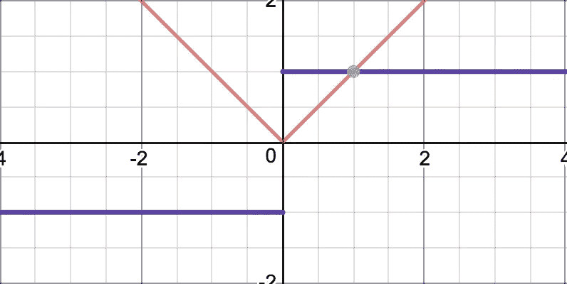

# 成本函数的世界——包容性、多数主义和寡头政治

> 原文：<https://towardsdatascience.com/the-world-of-cost-functions-inclusivity-majoritarianism-and-oligarchy-51362b8b91f4?source=collection_archive---------32----------------------->

The curve fitting problem ([Image credits](https://commons.wikimedia.org/wiki/File:Curve_fitting.svg))

大多数机器学习问题归结为将一组观察值(点)拟合到某条数学曲线(在机器学习的说法中简单地称为“模型”)。这就产生了一个压缩的表示形式,可以用于包括预测和模式识别在内的应用。

拟合过程通常包括最小化所谓的**成本函数**，该成本函数代表所选曲线相对于其试图拟合的观察样本的误差。在本文中，我们将更深入地研究成本函数的有趣世界，它们的选择如何在模型的选择中发挥重要作用，并最终看到一些令人难以置信的与现实世界治理模型的更深层次的联系(我确信这将是有趣的，因为选举即将到来！)!在理解这些成本函数的过程中，我们将使用最简单的曲线拟合问题——线性回归。

# 线性回归

Predicting the price of a house

假设你有一个特定问题的一堆特性(假设 n = 100)。你知道你试图预测的输出是这些特征的线性组合。大多数教程谈到的经典用例是[根据房屋的各种特征(xᵢ)预测房屋的价格](https://www.kaggle.com/alphaepsilon/housing-prices-dataset#test.csv)，其中特征的范围从位置到屋顶类型到面积等。价格(y)的预测由函数 h(x)表示，如下所示:

其中 fᵢ = featureᵢ，Wᵢ=为特征值，ᵢ和 W₀=为常数

# 成本函数

假设我有一个 m=2000 个数据点的训练数据。我们需要找到 W 的值，使得预测的价格尽可能接近实际价格。

换句话说，W 应该取什么值才能使下面的成本最小。

请注意，我们试图测量每个样本的预测绝对误差(如图所示),并取平均值。

Simple Linear regression: Y with respect to one feature variable X

然而，大多数文献(实际上也是)中使用的最流行的成本函数如下:

其中取每个样本中误差平方的平均值。注意，两个成本函数之间的差异在于绝对误差的幂。因此，平方误差函数被称为 L₂-norm，而前一个函数被称为 L₁范数。

# 成本最小化

现在是一个百万美元的问题:为什么 L₂-norm 比 L₁常模更受欢迎？大多数文献都指出了计算机出现之前的计算方法，如下所述。

对于成本最小化问题，任何微积分的初级教科书都会告诉我们，在最小点的一阶导数为零。简单地说，问题的解决方案将位于满足以下标准的点上。

Typical cost function whose first order derivative yields the minima

事实证明，当成本函数是绝对误差时，而不是当成本函数是平方误差的和时，[封闭形式的解决方案](https://en.wikipedia.org/wiki/Closed-form_expression)——用简单的话来说是简单的公式——是不可能的。原因是成本函数在点 Cost = 0 处不可微，如下图所示。代表导数的紫色线在点 Cost = 0 处不连续

First order derivative (violet) of the absolute error cost function (red)

使用平方误差的成本函数是完全可微的，如下图所示。

First order derivative (violet) of the absolute error cost function (red)

事实上，封闭形式的解是下面的方程

其中 x 是特征值矩阵，Xᵢ,ⱼ代表 sampleᵢ.featureⱼ的值

然而，在计算机时代，可以应用像[梯度下降](https://www.youtube.com/watch?v=yFPLyDwVifc)这样的算法，并迭代地导出解决方案。我不打算深入研究梯度下降的细节，但我想指出，只要成本函数在零处的微分为零，梯度下降仍可用于 L₁-norm。或者，也可以使用诸如[次梯度](https://en.wikipedia.org/wiki/Subgradient_method)的方法。那么，还有理由使用 L₂标准吗？它值得如此受欢迎吗？我们一会儿就会明白。

# Lp 范数

现在，我们已经研究了两个成本函数——l₁范数和 L₂范数，让我们尝试将其推广到 Lp 范数，其中 p 可以是正实数。

那么 L₀-norm 意味着什么呢？

这意味着如果特定点的绝对偏差为零，则误差为零，否则误差为 1。想象一下在一个连续的空间中发生这种情况的可能性。

如果在线性回归的情况下使用 L₀-norm，成本将是不在拟合线上的点的总数。这意味着使用 L₀-norm 将试图找到线，正是通过最大数量的点！

# 通过示例了解成本函数

所以我举了一个例子来更好的理解三个代价函数。假设我想对下图所示的点进行线性回归。

我知道这不是一个应用线性回归的好例子，因为这些点似乎分散在 3 个区块中。在顶部有一条线，在中间有一小组共线的点，在最右边的块中有一堆随机分布在零周围的点。然而，我将使用线性回归来说明成本函数的行为。另外，请假设这些点都不是噪声或异常值。

此时，同样重要的是指出梯度下降算法不能应用于 L₀-norm，因为函数在零处的不连续性质(其值为零时的脉冲下降！)以及其他地方的平坦性质(高原)，如下图所示。

L₀-norm discontinuous at zero!

然而，有一些算法，如[匹配追踪](https://en.wikipedia.org/wiki/Matching_pursuit)也允许我们求解 L₀-norm 成本函数。

# 成本函数统治着我们的世界！

现在让我们看看由三个成本函数拟合的曲线。

可以看出，L1 范数穿过最上面的点，而 L₀-norm 穿过中间的一小组共线点，L2 范数穿过图形的中间。我认为这很有趣，我们将在接下来的段落中看到原因。

L2 norm — attempts to be inclusive!

L2-诺姆试图迎合每一个观察到的样本——虽然乍一看它可能看起来过度拟合，但成本函数实际上试图“*包含*”和“*适应*”，并将线放置在*尽可能接近每一点*的位置。

Majoritarianism of L1-norm ([Image credits](https://en.wikipedia.org/wiki/File:Majority_Rules_Logo.jpg))

另一方面，L1 范数通过围绕一条线采样的看似点的主要块。L1-诺姆成本函数实际上忽略了中间和最右边的块。本质上 *L1 范数更像是一个多数派函数*迎合了观察样本集中的最大块。

L₀-norm: Oligarchy at play?

L₀-norm 穿过一组较小的共线点。它是一个成本函数，几乎是“我的(我们的)道路或高速公路”的一个体现。它不能容忍哪怕是最轻微的偏差——所以它几乎忽略了所有的样本，只寻找样本中真正线性的点。这几乎是一种“T10”寡头政治在起作用，其中*一小组完全一致的观察决定了模型*。请想一想，在一个真正连续的空间中，如果是线性关系但不是完全线性的，三个点共线的概率几乎为零，所选的线可能只通过两个点，这几乎就像两个单独的点在表演一样！

# 获胜者

因此，推广它，在 Lp-范数成本函数中，随着 p 的减少，我们可以看到模型转变为多数主义，最终寡头政治！然而，Lp 范数的高阶成本函数促进了包容性！我认为这解释了选择 L₂范数函数背后的流行。成本函数的选择取决于场景，但对于大多数数据集，公平地说，L₂范数函数是可行的。

在下一篇文章中，我将讨论过度拟合的主题，这是通过一种称为正则化的技术来解决的。

*(首次发表于* [*《印度分析》杂志*](https://www.analyticsindiamag.com/the-world-of-cost-functions%e2%80%8a-%e2%80%8ainclusivity-majoritarianism-and-oligarchy/) *)*