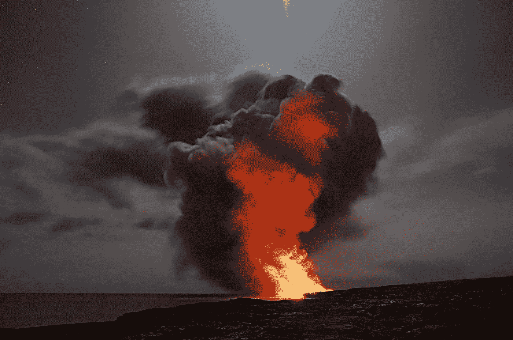
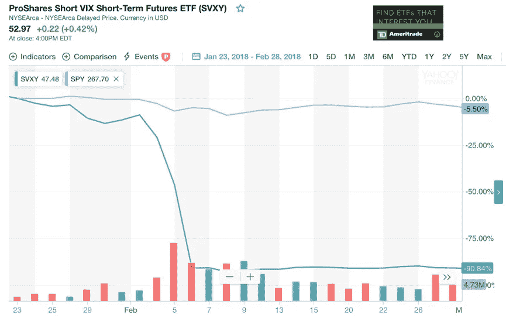
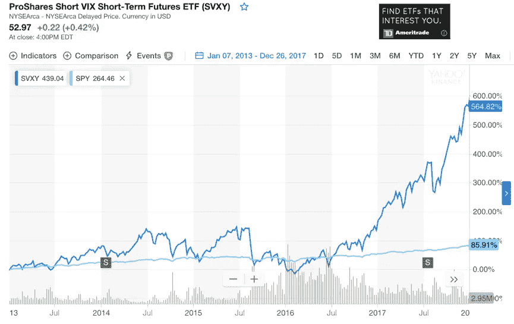
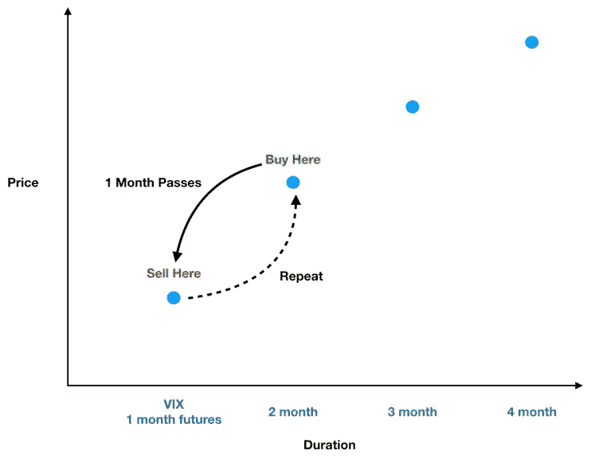
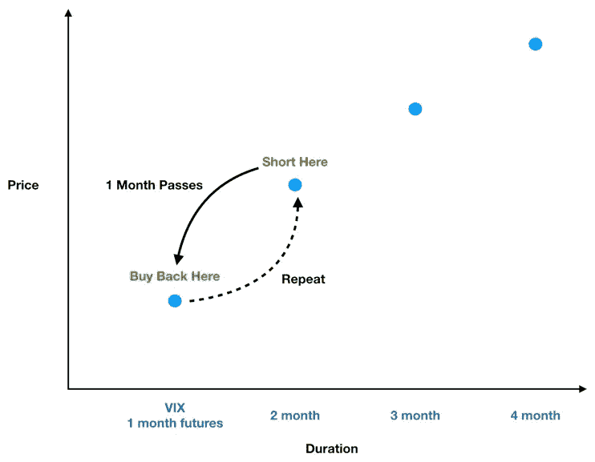
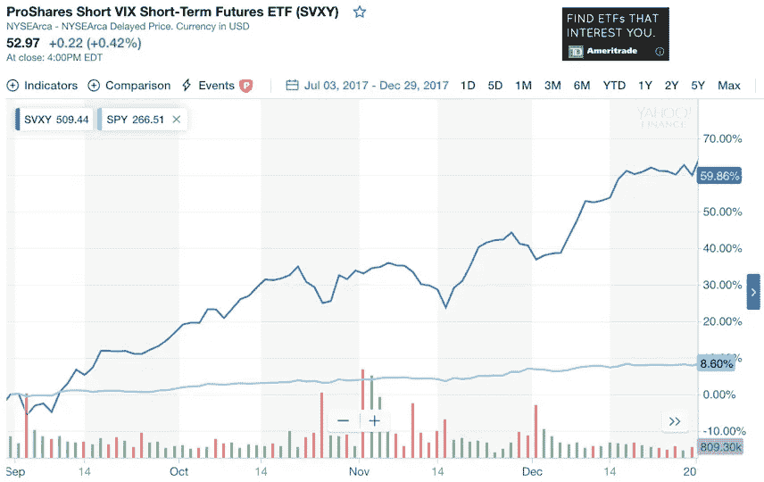

# 十四大灾难

> 原文：<https://towardsdatascience.com/the-xiv-meltdown-1b0608110b9f?source=collection_archive---------5----------------------->

## 为什么“稳赚不赔”变成了一场史诗般的金融灾难

我一直对 VIX 很感兴趣。对于金融领域以外的人来说，VIX 代表 CBOE(芝加哥期权交易所)波动指数。在新闻中，你可能会听到它被称为“恐惧指数”。

在 2018 年 2 月之前，VIX 因两个主要原因而闻名:

1.  在严重的市场抛售期间，它往往会飙升，因此有了“恐惧指数”的绰号。
2.  它为做空者创造了大量财富(**做空是押注投资价格会下跌——因此，如果你做空 VIX，当 VIX 下跌时你会赚钱，当它上涨时你会赔钱**)。做空 VIX 变得如此流行，以至于[有了自己的子市场](https://www.reddit.com/r/tradeXIV/)。

然后 2018 年 2 月到来，这种情况在短短几个交易日内就发生在 XIV、SVXY 和其他做空 VIX 基金的投资者身上(XIV 是最受欢迎的 ETF，或交易所交易基金，做空 VIX 期货)——GG。

Ouch! (Source: Yahoo Finance)

短短几天内，XIV(被迫清算)、SVXY 和其他做空 VIX 投资基金的投资者损失惨重(与此同时，跟踪标准普尔 500 的基金 SPY 仅损失了 5.5%)。在今天的帖子中，我们将探讨 XIV 这样的基金为何如此引人注目，以及它如何为不要将所有鸡蛋放在一个策略上提供了一个警示故事(特别是如果你不了解所涉及的所有风险)。

# 什么是 VIX？还有为什么大家都做空？

看看下面的图表。深蓝色的线是 SVXY，一个做空 VIX 期货的 ETF(不像 XIV，它今天仍然活跃)。浅蓝色的线(看起来几乎是水平的)是标准普尔 500。

从 2013 年初到 2017 年底，标准普尔 500 获得了 86%的可观回报，几乎让你的钱翻了一倍。在同一时间段内，通过 SVXY 做空 VIX 获得了令人难以置信的 565%的回报，几乎是你的钱的 7 倍(从 1 到 7)！这些在相对较短的时间内获得的荒谬回报是人们持续光顾 VIX 赌场的原因。

Source: Yahoo Finance

我一直在说的这个 VIX 是什么？VIX 的技术定义是标准普尔 500 期权的隐含波动率。但它是如何计算的远没有它代表什么重要。

> 简而言之，VIX 衡量股票市场的恐惧和投资者的不确定性。

当事情进展顺利时，VIX 会越来越低。当市场崩溃时，VIX 飙升。

> 做多 VIX 相当于购买了应对市场崩盘的保险，而做空 VIX 相当于卖出崩盘保险。

## 那么，市场恐惧指数是如何变成这样一座金矿的呢？

两个因素推动了做空 VIX 者的回报:

1.  随着时间的推移，市场趋向于上涨——随着市场上涨，VIX 逐渐下降(如果 VIX 下跌，VIX 做空利润)。
2.  VIX 期货曲线通常有一个正斜率——这意味着如果你做多 VIX，你会不断地高买低卖。

第二点非常重要。让我们更深入地看看 VIX 期货曲线。首先什么是期货曲线？ **A** [**期货合约**](https://en.wikipedia.org/wiki/Futures_contract) **是在未来某一时刻以预定价格买入资产的承诺。**

下图显示了一条假设的 VIX 曲线。每个蓝点是一个有特定到期日的期货合约，例如，第一个蓝点是 VIX 期货合约，从今天起正好一个月后到期。现在，由于 VIX 不能直接以市场价格(在金融中这被称为现货价格)投资，像 XIV 这样专注于 VIX 的 ETF 的经理们被迫使用期货合约来获得他们的敞口。

Being Long the VIX Futures Curve — Buy High Sell Low

因此，正如我在上面的图表中所描绘的，经理们将购买两个月后到期的 VIX 期货合约(绿色的“在此购买”)，并持有该合约以获得 VIX 的长期敞口。但是一个月后，开始时是两个月的期货合约现在变成了一个月的合约(红色的“在这里卖出”)。为了保持对 VIX 的持续敞口，经理卖出他所拥有的合同，现在是一个月的合同，并购买一个新的两个月的合同(该交易由标有“重复”的虚线描述)。

现在回想一下，VIX 曲线通常是向上倾斜的。这意味着每个月经理在红灯时低价卖出，以便在绿灯时高价买入，这个过程被称为“VIX 曲线滚动”。一些数字可能会使这一点更容易理解:

1.  我们以 100 美元购买了两个月后的 VIX 期货合约。
2.  一个月后，假设 VIX 期货曲线没有实质性的变化，我们之前购买的合同现在是一个月的合同，价值只有 97 美元。
3.  现在是时候重置我们的敞口了——因此我们以 97 美元卖出一个月合约，以 100 美元买入一个新的两个月合约，在此过程中损失了 3 美元(-3%的回报率)。
4.  因为我们每个月都需要这样做，只要 VIX 曲线保持向上倾斜，我们每个月都会损失 3%。

因此，在上涨或稳定的股市中做多 VIX 相当于月复一月地失血。那么，为什么不扭转这种局面，转而做空 VIX 期货，赚回做多 VIX 的投资者损失的所有钱呢？很多人都这么做了。

月复一月，投资者只需简单地改变交易方向，就可以在高位卖出(红色表示“做空”)，在低位买回(T21 ):

Being Short the VIX Futures Curve — Buy Low Sell High

# 那么有什么问题呢？

早些时候我们指出，做空 VIX 和出售防范股市崩盘的保险是一回事。

> 销售保险是一种不对称的风险回报策略——大多数时候你赚了一点点，偶尔你会失去一切。

这就是为什么保险公司雇佣大批精算师来计算如何准确地向你和我收取费用，以此作为从我们手中拿走某些风险的回报(即便如此，为了以防万一，他们仍然会将一些风险转移给再保险人)。

让我们继续用这个保险类比。如果一家保险公司发现了一个特别有利可图的利基市场，并开始赚大钱，会发生什么？**竞争对手会抓住机会，涌入市场供应，从而压低每家公司的保险价格。**

当你投保的是股市崩盘时，这就更危险了。

> **随着越来越多的投资者争相提供股市崩盘保险，不仅每个投资者被迫收取更低的价格，而且每个投资者承担的风险也增加了。**

这是因为当大多数投资者意识到这一交易时，股市已经大幅上涨(市场越涨，VIX 跌得越多，VIX 做空获利)。因此，投资者争相购买保险的股市更有可能是一个被高估的市场。此外，每一个做空 VIX 的增量投资者也会将市场推高一点——随着崩盘保险价格(又称对冲成本)下降，投资者会购买更多股票，推高价格。

> 因此，在拥挤的市场中做空 VIX 的投资者受到了无形的双重打击——他们的行为推高了他们面临的风险，同时压低了他们可以获得的作为承担这些风险的补偿的预期回报。

这是导致灾难的原因。可悲的是，FOMO(害怕错过)导致投资者对这种危险视而不见。老实说，当你看到 SVXY(和 XIV 几乎一样)六个月的回报导致其内爆时，你很难不去 FOMO。不幸的是，这种 FOMO 会导致许多投资者几乎失去一切。

The Six Months Before the Implosion (Source: Yahoo Finance)

# 失去一切

让我们回顾一下我们在迈向 2018 年 2 月时的情况:

*   有成千上万的投资者在不知情的情况下，通过交易所交易基金(如 XIV 和 SVXY)陷入了极其拥挤的 VIX 空头交易，由于历史表现强劲，这些交易所交易基金已经吸金数十亿美元。
*   VIX 接近历史低点，这意味着投资者提供市场崩溃保险的价格也接近历史低点。

在市场中，很少有线性因果关系。很多时候，看似无关紧要的事件，通过一系列非线性和意料之外的关系，可以引发市场崩盘。

在 2018 年 2 月之前，股票市场是如此令人难以置信的平静(VIX 如此之低)，以至于即使是小幅下跌也可能导致投资者恐慌。这正是所发生的事情——标准普尔 500 指数本应是例行的下跌，却导致 VIX(和 VIX 期货合约)像火箭一样飙升(几分钟内上涨近 50%)。

这迫使 XIV 和 SVXY 等做空 VIX 交易所交易基金的经理回补空头，以控制损失。但是你认为当所有人同时试图从同一个小门逃走时会发生什么？

**每个人都试图逃离的赌注超过了市场的承受能力**，因此每笔交易都以递增的价格执行。也就是说，每一次取消做空(相当于做多 VIX)的交易都会产生痛苦的效果，把 VIX 推得更高。感觉到 ETF 经理绝望的交易者，就像鲨鱼闻到水中的血腥味一样，决心要捞一磅肉。

当所有人都完成交易时，VIX 几乎翻了一倍，持有大量 VIX 空头头寸的投资者几乎损失殆尽。

以下是 Reddit 上的一些评论，强调了这场金融灾难给投资者带来的伤害和痛苦:

> “我已经损失了 400 万美元，3 年的工作成果，还有别人的钱。”——u/Lilkanna
> 
> “我感觉到你，因为我今天失去了 1/2 的净资产，这可能是我生命中的 5 年”——u/Asian here
> 
> “这是对的！？？？还是某个系统故障？”—u/cheap DVD
> 
> “如果我错了，请纠正我，但我从 XIV 崩溃中最大的收获是，如果我想启动一个庞氏骗局，并声明‘你可能会失去一切’，那就没问题，对吗？”— [u/mauimikes](https://www.reddit.com/user/mauimikes/)

# 经验教训

回首过去，说做空 VIX 是一个错误太容易了。回想起来，事情总是显而易见的，但当它们发生时，就不是了。然而，当我们面对可能是泡沫的投资时，仍有一些事情我们应该记住:

1.  如果价格下降 50%，我会没事吗？不要将你投资组合的很大一部分投资于高波动性的资产。
2.  流动性。金融市场中许多最严重的崩溃都是因为市场突然枯竭，每个人都需要卖出。当大多数人都站在热门交易的同一侧时，是时候诚实地评估该资产的市场是否足够深，以支持同时出现的离场蜂拥。
3.  在金融市场，预期回报是你承担市场风险的补偿。换句话说，高预期回报保护你免受意外的伤害。但是当人群涌入你的交易时，预期回报会变为零，同时价格大幅下跌的可能性也会增加。因此，您的保护在您最需要的时候消失了。

感谢阅读，祝你好运，干杯！

**我在投资和金融方面的更多帖子:**

[*投资个人贷款*](/turning-lending-clubs-worst-loans-into-investment-gold-475ec97f58ee)

[*剖析股市低迷*](/the-anatomy-of-a-stock-market-downturn-6527e31406f0)

[*股票是否战胜现金？*](/do-stocks-provide-a-positive-expected-return-d21571e78ea4)

[*我有足够的钱退休吗？*](/do-i-have-enough-money-to-retire-af7914a07b34)