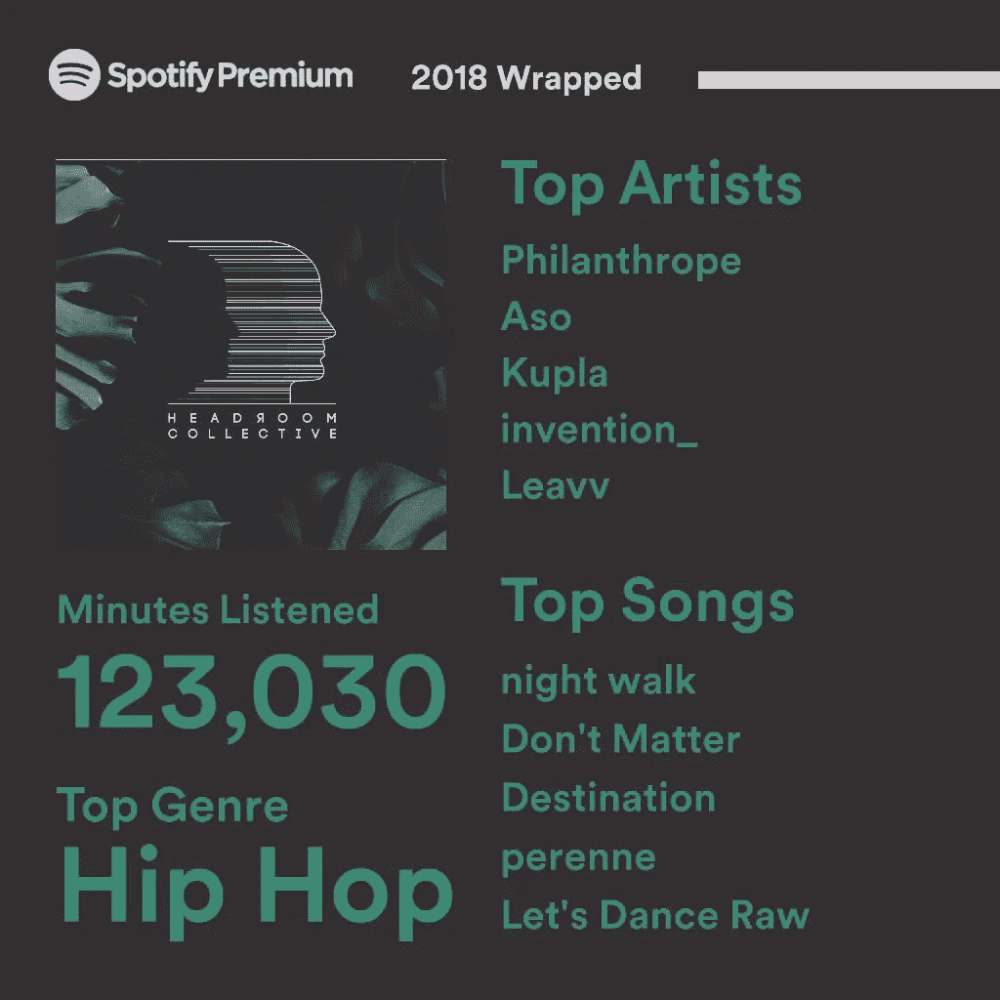
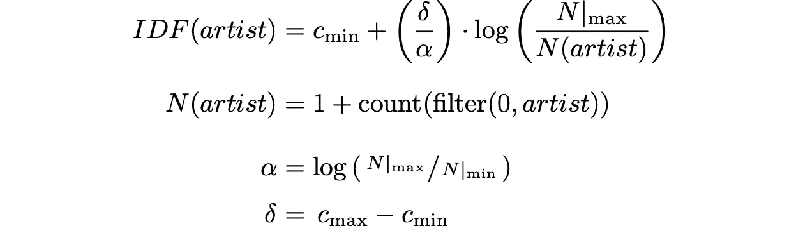
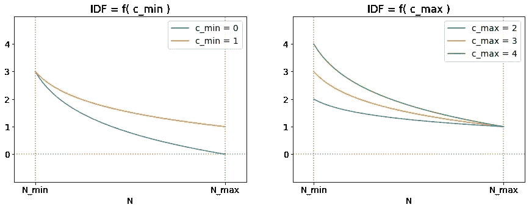
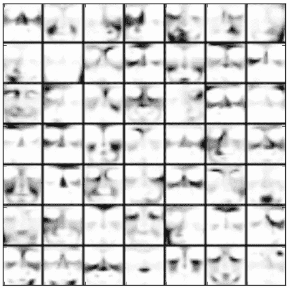
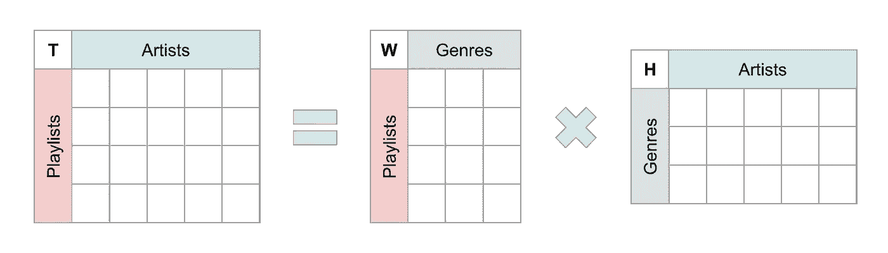
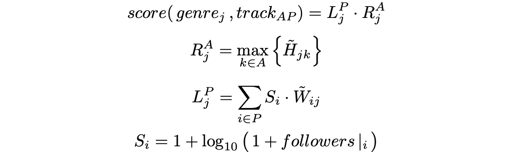
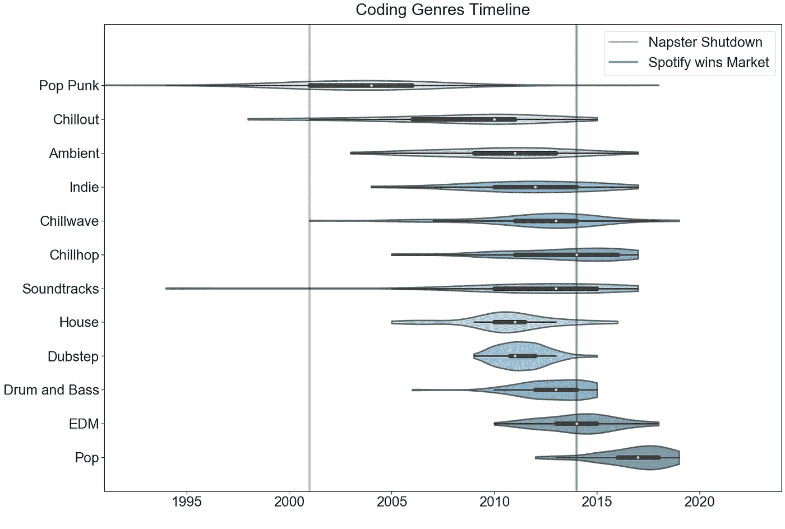
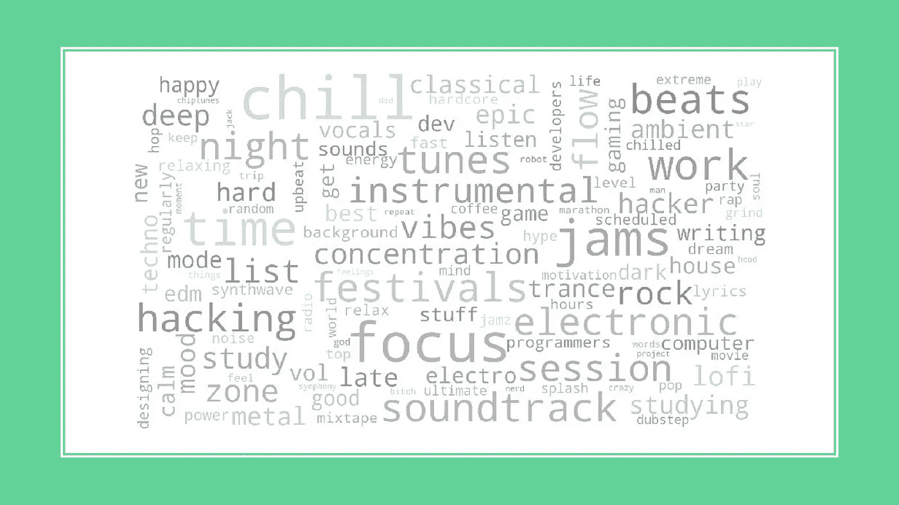

# 必须有 50 种方法来制作一个[编码]播放列表

> 原文：<https://towardsdatascience.com/there-must-be-50-ways-to-make-a-coding-playlist-110451228b69?source=collection_archive---------21----------------------->


art by [@marta.louzeiro](https://www.instagram.com/p/B5Vi1NBlFo_)

> 你只需要一首新歌，杰克
> 也许一些空气，克莱尔
> 这里有一些关于蜡的噩梦，马克斯
> 你只需要听[这些](http://www.vibrazebra.com/)

这是写给那些边听音乐边开夜车的程序员的博客。一篇关于将播放列表创建重新定义为集群问题的博客文章。最重要的是一篇关于理解制作这些“[编码](https://open.spotify.com/search/coding/playlists)”播放列表的人的博文。

# 项目介绍



For reference, 123k minutes ≈ 25% of a Year

作为一名音乐消费者，我总是在寻找新的音乐。有了正确的配乐，编码就简单多了。问题是寻找新音乐依赖于探索周刊风格的播放列表和朋友的推荐。正是因为这个原因，我决定自己动手，有节奏地建立一些“编码”播放列表。

这些是我采取的步骤…

# 第一步:通过关键词抓取 Spotify 播放列表

正如你可能已经猜到的，创建播放列表的第一步是从 Spotify 上搜集播放列表集。这是通过获取一个 [API 键](https://developer.spotify.com/documentation/web-api/)并与 [/search](https://developer.spotify.com/console/get-search-item/?q=%22coding%22&type=playlist) 端点交互来完成的。在这个上下文中，我们将搜索包含术语的播放列表:**编码**或**编程**。

这可以通过 python 包来实现， [spotipy](https://github.com/plamere/spotipy) :

```
import os
from spotipy import Spotify
from spotipy.oauth2 import SpotifyClientCredentialscur_spotify = Spotify(
  client_credentials_manager = SpotifyClientCredentials(
    client_id=os.getenv("SPOTIFY_CLIENT_ID"), 
    client_secret=os.getenv("SPOTIFY_SECRET")
  )
)cur_playlists = []for search_term in "coding programming".split():
  cur_offset = 0

  while cur_offset < 10000:
    tmp_playlists = cur_spotify.search(
      q=search_term, offset=cur_offset,
      type='playlist', limit=50
    )["playlists"]["items"]

    if len(tmp_playlists) == 0 : break
    cur_playlists.extend(tmp_playlists)
    cur_offset += 50
```

一旦我们有了这些 **~10k 播放列表**，我们将想要从其中提取曲目和艺术家的信息。这是通过循环遍历`cur_playlists`并调用`user_playlist_tracks` API [端点](https://spotipy.readthedocs.io/en/latest/?highlight=user_playlist_tracks#spotipy.client.Spotify.user_playlist_tracks)来完成的。与所有数据争论一样，会有一些缺失和无效的数据。此外，上面使用的`cur_offset`方案将不得不重复读取超过 100 首歌曲的播放列表(根据 API-hit 的歌曲限制*)。*

此时，我们基本上有了一个 dictionary 对象，播放列表映射到其中出现的曲目。从这个数据集中可以做出的最简单的播放列表是在所有“编码”播放列表中找到出现最频繁的曲目。或者在*伪代码*中，

```
# find 250 most frequent tracks among all the playlistsfrom collections import Counterall_tracks = [ cur_item 
  for cur_list in playlist_tracks.values() 
  for cur_item in cur_list 
]top_tracks = list(map(
  lambda cur_tuple: cur_tuple[0], 
  Counter(all_tracks).most_common(250)
))
```

虽然这在技术上可行，但 [**播放列表**](https://open.spotify.com/playlist/0iChQ41GGrBFjUckVn70kK?si=Dl7Vwdx_Q1qfzDc0vjF2pA) 与我们预期的质量相差甚远。虽然你可能会认为 Air、蠢朋克和 Bonobo 会浮到顶部，但我们实际上最终会有 Billie Eilish、汉斯·季默和 Magic Sword 这样的流行歌曲占据空间——前两首歌曲实际上已经被禁止的艺术家名单明确删除(对于这个播放列表)。

这就是我们新项目的切入点。问题的解决方案是:比莉·埃利什紧随倭黑猩猩而来，将播放列表中的艺术家分成流派。

# 步骤 2:使用 TF-IDF 扩展磁道数

构建流派播放列表的关键是认识到艺术家和使用 NLP 技术的播放列表之间存在相似性。我的意思是，播放列表(或文档)包含一个有序的曲目(或单词)列表。这意味着大多数的自然语言处理技术都适用于这个问题，并且给了我们一个框架来理解这些类型是如何被聚类的。

具体地，在来自步骤 1 的数据中存在生成通过曲目计数连接艺术家和播放列表的矩阵的信息(例如，播放列表#42 包含 16 首蠢朋克歌曲)。

Example table showing how playlists and artists populate a track-counts matrix

该表说明了播放列表群集固有的几个问题:

1.  对数正态播放列表长度
2.  艺术家频率之间的极端差异
3.  矩阵稀疏性(即很少非零值)

这些问题通过在轨道计数矩阵上使用 TF-IDF 标度来解决。这里，TF-IDF 中的 TF 代表词频，而 IDF 代表逆文档频。对于计数矩阵中的每个单元格，TF 项根据艺术家在单个*播放列表(内部播放列表)中的相对重要性进行缩放。然而，IDF 在*所有*播放列表(内部播放列表)中衡量艺术家的重要性。与简单的原始计数相比，这两种效应放大了艺术家和播放列表对流派的重要性。*

结合播放列表聚类，术语频率(TF)术语降低了来自长播放列表的重要性提升。仅仅因为播放列表 7 比播放列表 4 多了**10 倍**的蠢朋克，并不意味着它应该多算十倍(对他们的朋克来说)。假设相对艺术家重要性呈对数正态分布，则使用的 TF 术语为:

> **TF = log( 1 +跟踪计数)**

这个 TF 公式极大地减少了选择艺术家时附加音轨计数的影响。例如，log _ 10(100)= 2–少了 50 倍。增加的一项是保持 0 计数固定在 0(为了保持稀疏)。这种 TF 缩放的实际效果是，汉斯·季默的全长专辑不会把他推到顶峰。

虽然 TF 术语关注某个艺术家在单个播放列表中的重要性，但是逆文档频率(IDF)淡化了出现在多个播放列表中的艺术家的重要性。例如，蠢朋克可能出现在超过 20%的“编码”播放列表中。如果使用原始计数的话，蠢朋克肯定会是顶级的星团之一，而且几乎完全是纯的。这意味着这个群体将被蠢朋克所主导，其他艺术家的意义将仅仅是随机的噪音。

因此，IDF 这个术语允许将蠢朋克的重要性分成几个流派。在这些流派中，蠢朋克现在几乎和其他流派一样重要，比如说，德玛乌和汉斯·季默。与自然语言处理类似，这些过于普通的艺术家(如汉斯·季默、倭黑猩猩和蠢朋克)被视为停用词(如“the”、“is”和“cause”)。从数学上讲，我们对 IDF 的处理如下:



简单地说，IDF 是一个由`c_min`和`c_max`限定的函数，它测量一个艺术家在不同播放列表中出现的频率。`N(artist)`等式是对给定艺术家出现多少非零条目的度量。因此，`N_max`是包含最频繁出现的艺术家的播放列表的数量。而`N_min`是一个阈值计数，用于移除只出现在`1, 2, ..., (N_min-1)`播放列表上的艺术家。

选择`c_min`和`c_max`的能力让你在如何对待稀有艺术家和普通艺术家方面拥有相当大的灵活性。例如，如果是`c_min = 0`，那么最常用的词将被完全忽略，也就是说，它将是一个字面上的停用词。因为蠢朋克和汉斯·季默对我们很重要，所以我们将设置`c_min = 1`。下一个参数，`c_max`，是最罕见的艺术家从他们的计数中获得的额外权重。通过选择`c_min = 1`，值`c_max = 2`将导致稀有艺术家的每首曲目的价值是普通艺术家的两倍。

这个`c_max`变量是一个旋钮，我们将在下一步调优集群时使用它。在最终的[簇](http://www.vibrazebra.com)中使用的值是`c_max = 3`。



The effects of changing c_min and c_max on the IDF scalar

# 步骤 3:使用 NMF 聚类创建流派

抓取 Spotify 和缩放曲目计数可能很有趣，但这与数据科学相去甚远。我们现在要把我们所有的努力放在一起，以便从播放列表和组成它们的音轨中制作流派。这将使用非负矩阵分解( [NMF](https://en.wikipedia.org/wiki/Non-negative_matrix_factorization) )来找到从“编码”播放列表语料库中出现的构造块。



The reason for using NMF to cluster playlists is much like the work done by the [Zitnik](http://nimfa.biolab.si/nimfa.examples.cbcl_images.html) group on facial analysis. Akin to genres, these masks – that add together to create someone’s face – are themselves face-like and easy to interpret.

NMF——或非负矩阵分解——是一种线性代数技术，可用于聚类文档。顾名思义，它只是将矩阵一分为二:

> T =宽高

而且，就像原来的轨迹计数矩阵( **T** )一样，W 和 H 内部只有非负值。这迫使体裁具有建设性，并避免破坏性干扰的存在。

对于我们的问题，`T`是一个曲目矩阵，它通过 TF-IDF 比例曲目计数将播放列表(行/条目)与艺术家(列/特征)联系起来。在经历 NMF 之后，我们剩下两个非负矩阵:`W`和`H`。由于它们必须相乘才能近似地重新创建`T`，`W`和`H`在其外部维度上分别具有播放列表和艺术家。内在维度是从语料库中自然产生的原本潜在的*体裁*。他们就是我们一直在寻找的星团！



The goal of NMF clustering is to separate a matrix in two and find the latent clusters that separate the data

然而，构建和标记这些集群的过程与其说是科学，不如说是艺术。因为这是一个无人监督的学习问题，你能应用的唯一真正的度量是人类的直觉。即便如此，模式确实开始出现。使用流行的网站来贴标签(事后)—[一次贴一个标签](http://everynoise.com/)——给这个流派的内容增加了一些可信度。例如，blink-182 和 Sum 41 确实出现在“[流行朋克](https://open.spotify.com/playlist/1ApsG3XRYmhdM3osE1x6uU?si=mOdQl5zQQFy9wukDK2syzA)群中，而巴赫和贝多芬安全地驻留在“[古典](https://open.spotify.com/playlist/67clVAspJNa8nsMDFwG2DV?si=ogeKP037RZeoKgRMnTHEfw)群中。

现在缺少的是如何从这些播放列表( **W** )和艺术家( **H** )矩阵回到不同流派的顶级曲目选择的描述。在进入这一关键步骤之前，讨论一下在这一步骤中人为干预的位置是有益的。

第一点是,《vibrazebra.com》上使用的大约 30 个流派来自 75 个集群。这意味着我们丢弃了超过一半的集群！这可能是因为我没有认识到一些重要的流派，但这也是对杂乱数据进行聚类的必然结果。我们的数据集中有一些噪声，必须以某种方式将其聚类出来。

要说明的另一点是关于建模者为了改善结果而需要调整的参数。它们是:`c_max`和集群的数量——`n_clusters`——假设`c_min`为 1。如前所述，我们使用了`c_max = 3`，有 75 个集群。显然，这个`n_clusters`决定了音乐类型变得有多粗糙。例如，蠢朋克会和语料库中的每一位电子艺术家归为一类吗(对少数人来说`n_clusters`)还是基本上引领一个完整的流派(对许多人来说`n_clusters`)。

对于最终用户来说，有趣的一点是`c_max`和`n_clusters`具有非线性关系。当改变`n_clusters`时，必须根据经验缩放`c_max`以保持相同的(无监督的)性能水平。

# 步骤 4:构建代表性播放列表

因此，我们剔除了 Spotify，创建了一个将播放列表与艺术家联系起来的矩阵，并将该矩阵分解为两部分，以发现潜在的流派。现在剩下的就是退出代表这些流派的曲目。这将利用一些漫不经心的方式从`H`和`W`矩阵中提取信息，以及一些有偏见的方法来定义什么是好的播放列表。举例来说，你就是这样得到下面这个标志性的编码者的播放列表的(现在*没有了*汉斯·季默、比莉·埃利什和德玛乌):

Now that’s what I call coding music! (Volume 12)

描述播放列表生成的起点是来自步骤 1 的原始的、天真的混合播放列表。我们很快讨论了构建代表性播放列表的最简单方法是如何找到在所有播放列表中出现频率最高的曲目。现在，我们只需要找到一种方法来概括和确定这种情况在每个集群中发生的范围——使用来自`H`和`W`因式分解矩阵的数据。

原始播放列表和聚类播放列表的主要区别在于，现在曲目的权重取决于艺术家和播放列表对流派的相对贡献。因此，代替每个轨道的原始计数，将使用一些正的浮点值，将几个分量相乘。虽然对读者来说这可能是显而易见的，但是现在详细说明以下内容是有用的:每个音轨与一个艺术家列表( **A** )和一个播放列表列表( **P** )相关联。利用这一知识，我们提出了以下用于给流派曲目评分的方法。



上面的第一个等式只是对上一段的重述:一首曲目的分数是基于其艺术家(`A`)和播放列表(`P`)对流派(`j`)的相对重要性的合成值。这里，艺术家的成分， **R** ，只是在 **H** 中的给定音轨的艺术家中选择最大权重成分——对于一个流派。例如，当专注于电子音乐时，这可能会选择蠢朋克而不是法瑞尔·威廉姆斯作为 2013 年的热门歌曲《走运》。

另一方面，播放列表的组成部分 **L** 更符合最初的天真标准。这实际上意味着，我们基本上仍然在计算一首歌曲有多少个播放列表。关键区别在于，总和现在考虑了播放列表在流派上的相对重要性( **W** )以及播放列表有多少关注者(参见`**S_i**`)。让我们对`**S_i**`的描述更具体一点，我们希望它是一个基于播放列表的关注者数量来衡量重要性的因素——只是非常缓慢，从 1 开始。

在描述使用这个乐谱制作播放列表的实际过程之前，有必要解释一下出现在上述等式中 **H** 和 **W** 上方的`~`。这些波浪符号(或旋转符号)意味着这些矩阵中的组件已经过规范化和重新缩放。为了清楚起见，这样做不是使用它们的原始值或它们的对数变换——因为根据经验发现两者都产生相当一般的播放列表。相反，每个矩阵中的*类型*向量首先被归一化，使得每个值都在范围[0，1]内。然后，每个值都被提升到某个幂:α代表艺术家，ρ代表播放列表。


我们的α和ρ值分别是`3/4`和`2/3`。请注意，这两个值都小于 1。这是因为范围[0，1]中的数字对于小于 1 的幂会变大(例如`0.1 ^ 0.1 ≈ 0.8`)。实际上，这意味着使用更小的功率为越来越多不知名的播放列表/艺术家铺平了道路。对于我们的问题，这也证明了ρ小于α的原因:我们想要基于许多播放列表聚集列表，但是我们真的只想关注与流派最相关的艺术家。

有了所有的数字，我们现在可以做出定性的决定，让播放列表变得值得一听。首先要考虑的是两者的长度:整个播放列表和其中的歌曲。在这个练习中，我们选择制作播放列表 **4 小时** **长**，并且只包含 2 到 12 分钟的歌曲。接下来，我们想防止任何一个艺术家完全控制一个群体。因此，我们将一位艺术家创作的歌曲数量限制为 3 首！

最后一个有点偏颇的决定是让播放列表按顺序播放。根据个人经验，这意味着一个艺术家永远不应该有两首歌背对背出现(或者甚至在另一首歌的两首歌内)。这一点在下面的 downtempo 播放列表中得到了强调，其中:Air、Bonobo 和 Gramatik 在列表顺序中被涂掉了。需要这样做的原因是因为聚类算法可能会对艺术家进行分层，导致自然混合的机会减少，从而加强已经发生的生日悖论行为。

[](https://open.spotify.com/playlist/2v9EqSueMu980UezpJ3J8t?si=JMPfUzttQgiLc8G6UcoBDA) [## 唐顿堡——这就是我所说的编码音乐

open.spotify.com](https://open.spotify.com/playlist/2v9EqSueMu980UezpJ3J8t?si=JMPfUzttQgiLc8G6UcoBDA) 

在进入探索创建这些播放列表的用户的部分之前，快速深入了解上一段中使用的[重新排序算法](https://github.com/djsegal/metis/blob/master/3_spotify_playlists/reorder_list.py)是有用的。这种算法通过在曲目上不断向前和向后推送来防止艺术家在播放列表中聚集在一起。这种非确定性的方法在速度上可能不是最佳的，但确实产生了符合我们对聚集的限制的播放列表顺序——同时显著地限制了对初始顺序的扭曲。

# 第五步:了解 Spotify 上的编码员

在这个阶段，我们的功能已经完成:我们已经为所有的“编码”播放列表收集了 Spotify，并为 30 个不同的流派制作了一个代表性的播放列表。我们还没有问的一个问题是:为什么？为什么有人专门为编码制作播放列表？为什么他们选择某些艺术家作为他们的编程灵感？更重要的是，为什么我把*变成了这个*，而不是只听最初 Spotify 搜索中的热门播放列表？

除了亲自欣赏来自这些流派播放列表的音乐——并实际学习一些新歌——我认为在这次搜索中有真正的人类学数据。例如，编码是一个目前已经过时的词吗——是社交网络和 deadmau5 主宰的时代的残余吗？或者更一般地说，这些编码者是我们认为的那样吗:痴迷于“ [chill-](http://www.vibrazebra.com/chillwave) ”前缀音乐流派并喜欢听[lofi hip hop radio-beats to relax/study to](https://youtu.be/hHW1oY26kxQ)的千禧一代 redditors？

谁是用户这一更普遍的问题可能最好用下面的时间表来表示。投射一点，我相信这些用户:在中学 Rec 夜听林肯公园(流行朋克)，在高中让花园之州真正改变他们的生活(Chillout)，在大学期间实验天空中的爆炸( [Ambient](https://open.spotify.com/playlist/2w5Sj7RalCfEalXtJjohDZ) )。如果这种说法成立，那么用户似乎是在 2010 年左右(独立音乐)进入成年期，开始怀旧，其中一些在 2012 年被淘汰(Chillwave)，到 Spotify 流行时，基本上已经放弃了歌词音乐( [Chillhop](https://open.spotify.com/playlist/6T3ouFwmEJ0p1NzzIZXpkF) )。



A violin plot showing coding music trends – or – what to project when you’re projecting

在另一条时间线上，同样的用户可能在他们上大学的时候就已经尝试过 house 了(蠢朋克和拉塔特)。想和杜布斯普(德莫和史奇雷克斯)一起继续派对。无法摆脱他们的固定，因为他们转向鼓和低音。并最终达到一种永久的 EDM 状态——被电雏菊嘉年华的灯光惊呆了。

虽然没有更多的人口统计数据，但这显然只是纯粹的猜测和传闻。然而，它确实引出了这样一个问题:制作这些编码播放列表的人是谁？这可以通过调查上述图的音轨部分得到部分解决。正如你所看到的，这种类型在 2010 年左右真正兴起——这一年《社交网络》问世——并一直保持到 2015 年的《机器人先生》。因此，这种类型很可能与千禧年科技文化有关。

然而，在我们对这些数字游牧民族的研究中，一个局限是我们对 Spotify 播放列表搜索的依赖。如上图所示，Spotify 直到 2014 年左右才成为占主导地位的音乐平台。因此，我们的许多类型都来自于史前时代，当时人们在各种服务中分散开来。因此，这些民间传说只是人们从故国带来的东西，无论是来自 Songza、Pandora、Grooveshark、iTunes 还是 SoundCloud。

虽然我们可能永远无法确切知道这些千禧一代的编码者是谁，但我们可以肯定地说，他们的音乐有许多共同的核心特征:重复的节拍，数字乐器，以及普遍缺乏歌词——这是代码使音乐成为可能。

# 结束语

这个项目的目标是:使用聚类技术创建流派播放列表。特别是，我们专注于通过搜索 Spotify 来“编码”播放列表而找到的播放列表语料库。为了构建在 [vibrazebra](http://www.vibrazebra.com/) 上发现的 30 个集群，我们随后使用了 NMF 集群和定制的 TF-IDF 轨道计数缩放。在找到带有 NMF 的聚类后，我们标记了这些组，并使用特殊的曲目选择过程构建了代表性的播放列表。

为了给这个项目画上一个圆满的句号，我们在聚类过程之后进行了一个快速调查，看看到底是谁制作了这些“编码”播放列表。然后我们做了一些总结性发言。现在，…

> 时光流逝，歌曲结束，我想我还有更多的话要说。
> 
> ——时间([平克·弗洛伊德](https://open.spotify.com/playlist/7qA1COU0f5NYmHkNeMfJCO?si=kn336ArNSV-7YNLorOOEnw))



Common words used in “coding” playlist titles

> >[站点](http://www.vibrazebra.com/) [代码](https://github.com/djsegal/metis/tree/master/3_spotify_playlists) [通话](https://djsegal.github.io/metis/spotify_playlist_slides.pdf) [spotify](https://open.spotify.com/user/yulwt4y240ouygqkm421k4cmy?si=oJp8pMruTA6Fv_UoL8fBYw)