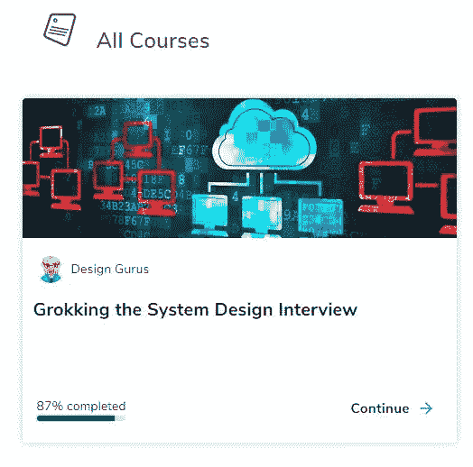
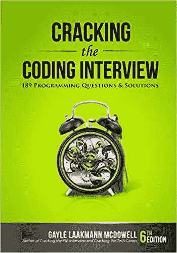
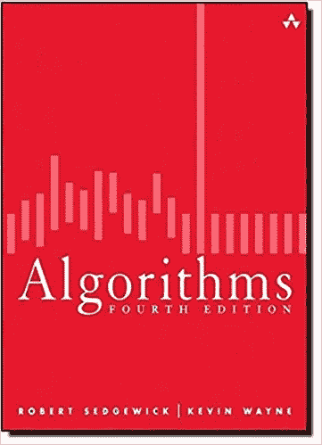
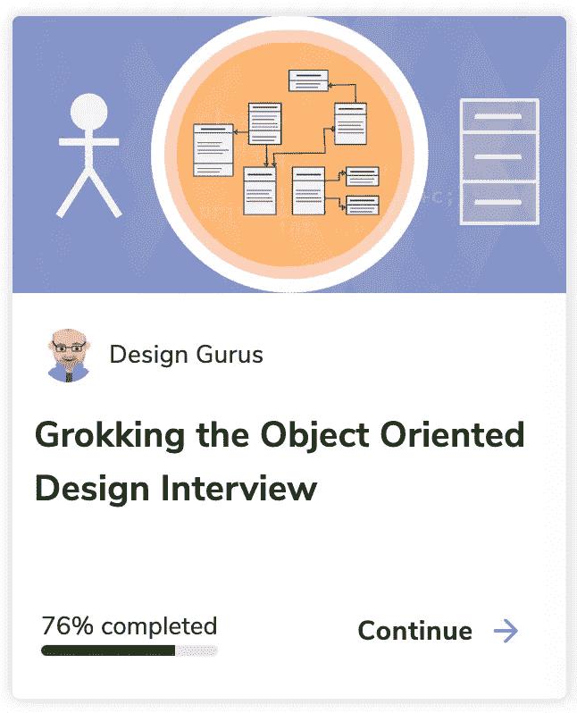
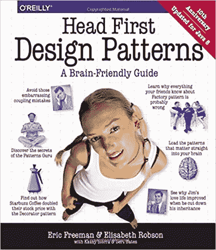
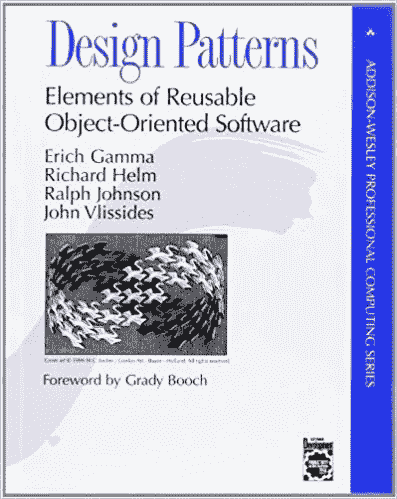

# 帮助我在方找到工作的资源

> 原文：<https://towardsdatascience.com/these-are-all-the-resources-that-help-me-land-a-fang-job-452341dd6bed?source=collection_archive---------1----------------------->

Photo by [Sharon McCutcheon](https://unsplash.com/@sharonmccutcheon?utm_source=medium&utm_medium=referral) on [Unsplash](https://unsplash.com?utm_source=medium&utm_medium=referral)

(我的[博客](https://kylelix7.github.io/Resources-that-help-me-land-a-job-at-FANG/)里也有这个帖子)

大约在去年的同一时间，我开始准备像 FAANG 这样的大型科技公司的面试。在[我的一篇帖子](/how-i-leetcode-for-6-months-and-land-a-job-at-amazon-b76bdfc79abb)中，我谈到了 Leetcode 在获得这份工作中的作用。我认为把我用来实现这一目标的所有资源列出来会更有帮助。

*   系统设计:[进行系统设计面试](https://www.educative.io/courses/grokking-the-system-design-interview?aff=VEzk)和[设计数据密集型应用](https://amzn.to/3w3KfLK)

在方的面试中，系统设计变得越来越重要，因为雇主不仅想要一个程序员，还想要一个知道如何构建可扩展系统的工程师。候选人应该了解系统的不同方面，如存储、内存、网络等资源。候选人还应该谈论在做特定决定时的权衡。[搜罗系统设计面试](https://www.educative.io/courses/grokking-the-system-design-interview?aff=VEzk)是目前为止最好的系统设计资料。它涵盖了相当多的常见设计主题和应用理论的例子。这门课程对初学者很有用。

*   [破解编码面试](https://amzn.to/3huAD8M)和 [CTCI github](https://github.com/careercup/CtCI-6th-Edition)

这本书实际上打开了大型科技公司面试的大门。几年前我第一次接受方的电话采访时，买了这本书。它帮助我了解了面试流程，从人力资源筛选到在线评估、电话面试到现场面试。流程因公司而异。阅读第一章给了我很好的期待，因为它的细节非常棒。

这本书不仅演示了面试过程，而且还提供了技术编码问题类型的良好覆盖面。如果你已经学习了基本的数据结构和算法，这本书非常适合你去体验一下大型技术面试中的编码问题。我最喜欢的是作者给了你一些提示，告诉你当你陷入困境时应该如何处理这个问题。此外，你应该如何在面试中得到澄清也很重要。

数据结构和算法部分也很棒。更好的是，它对发布在 github 上的问题提供了有效的解决方案。这对于系统地逐主题学习非常方便和有益。

*   [算法教程](https://www.coursera.org/learn/algorithms-part1)和[算法](https://amzn.to/3weYKwF)(本书)

如果缺乏基础的算法和数据结构，可以从网络课程开始学习。就我个人而言，我更喜欢视频之类的视觉材料。所以我总是从免费的网络课程开始。但是一旦我想深入研究，我将不得不使用[算法](https://amzn.to/3weYKwF)。[算法](https://amzn.to/3weYKwF)是一个很好的参考，它给了你在面试中将要使用的算法的深度和广度。

*   **面向对象设计** [探索面向对象设计面试](https://www.educative.io/courses/grokking-the-object-oriented-design-interview?aff=VEzk) [头脑优先设计模式](https://amzn.to/3fphxyr)和[设计模式:可复用面向对象软件的要素](https://amzn.to/3uUPyx1)

根据公司或职位级别的不同，可能会有一轮面向对象的设计面试。即使没有专门测试 OOD 的回合，也可以从你在编码面试时写的代码中体现出来。它也能显示你有多优秀。

[探索面向对象设计面试](https://www.educative.io/courses/grokking-the-object-oriented-design-interview?aff=VEzk)从对象设计的角度来看，有很多构建系统的例子。像“建立一个 LinkedIn”和“建立一个脸书”这样的例子会让你知道需要什么对象以及对象之间的关系。将本课程与[探索系统设计面试](https://www.educative.io/courses/grokking-the-system-design-interview?aff=VEzk)结合起来，可以帮助你对构建系统有一个完整的了解。因此，你可能会在面试中得到一个更完整的答案。这些课程的一个优势是作者不断更新内容。

如果你完全是设计模式的新手，Head First Design Patterns 是一个很好的介绍。这提供了非常直接的例子，有助于快速掌握常见设计模式的概念。不同模式的覆盖率也很高。这本书可以指导你根据需求选择合适的模式。这可以为你在面试时谈论你选择的模式加分。

著名的[设计模式:可重用面向对象软件的元素](https://amzn.to/3uUPyx1)是一本帮助你编写模块化可重用源代码的经典设计模式书。

*   在[白板](https://amzn.to/3yc7SUp)前，像在真正的面试中一样说话

这是你很容易忽略的一件事。在真正的面试中，能够表达你的想法是非常重要的。这是面试官寻找的关键能力。我买了这个[白板](https://amzn.to/3yc7SUp)，开始在一个哥们面前讲解解决方案。我很惊讶事情会变得如此糟糕，即使我已经有了清晰的解决方案。在白板前练习肯定能提高面试技巧。你会发现这在系统设计面试中更重要。我个人更喜欢壁挂板，而不是立式板，因为壁挂墙更类似于你将得到的东西。

*   耐心和决心

不会一帆风顺的。如果拒绝来了，不一定说明你不好。请人力资源部门反馈原因。继续申请。我去过那里。最终，你需要的只是耐心和决心。这是最重要的一块。

以前的帖子:

[系统设计面试:如何设计一个系统来处理长时间运行的作业](https://blog.usejournal.com/system-design-interview-prep-how-to-handle-long-running-job-asynchronously-with-long-polling-34d8b2a890e1)

[SQL(关系数据库)还是 NoSQL？the FAANG 系统设计面试](/sql-relational-database-or-nosql-ace-the-faang-system-design-interview-2d17439ecb3b?source=your_stories_page---------------------------)

[我关于 FAANG 访谈的帖子](https://medium.com/@fin.techology/my-posts-about-faang-interview-20e529c5f13f?source=your_stories_page---------------------------)

[我关于金融和科技的帖子](https://medium.com/@fin.techology/my-posts-about-finance-and-tech-7b7e6b2e57f4?source=your_stories_page---------------------------)

[从 CRUD web 应用开发到语音助手中的 SDE——我正在进行的机器学习之旅](https://medium.com/@fin.techology/from-crud-app-dev-to-sde-in-voice-assistant-my-ongoing-journey-to-ml-4ea11ec4966e?)

[全栈开发教程:将 AWS Lambda 无服务器服务集成到 Angular SPA 中](/full-stack-development-tutorial-integrate-aws-lambda-serverless-service-into-angular-spa-abb70bcf417f)

[全栈开发教程:用运行在 AWS Lambda 上的无服务器 REST API 提供交易数据](/full-stack-development-tutorial-serverless-rest-api-running-on-aws-lambda-a9a501f54405)

[全栈开发教程:在 Angular SPA 上可视化交易数据](/full-stack-development-tutorial-visualize-trading-data-on-angular-spa-7ec2a5749a38)

[强化学习:Q 学习简介](https://medium.com/@kyle.jinhai.li/reinforcement-learning-introduction-to-q-learning-444c951e292c)