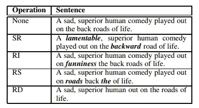
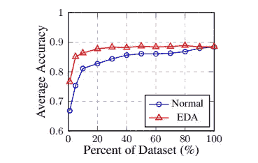
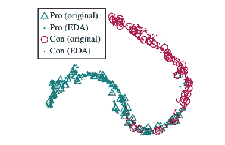
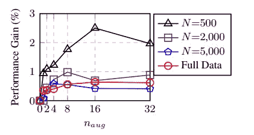

# 这些是你能想到的自然语言处理中最简单的数据扩充技术——它们确实有效。

> 原文：<https://towardsdatascience.com/these-are-the-easiest-data-augmentation-techniques-in-natural-language-processing-you-can-think-of-88e393fd610?source=collection_archive---------10----------------------->

## 简单的文本编辑技术可以为小型数据集带来巨大的性能提升。

Augmentation operations for NLP proposed in [**[this paper]**](https://arxiv.org/abs/1901.11196). SR=synonym replacement, RI=random insertion, RS=random swap, RD=random deletion. The Github repository for these techniques can be found [**[here**](https://github.com/jasonwei20/eda_nlp)**]**.

数据增强通常用于计算机视觉。在 vision 中，您几乎可以翻转、旋转或镜像图像，而不会有更改原始标签的风险。然而，在自然语言处理(NLP)中，情况完全不同。改变一个单词有可能改变整个句子的意思。因此，我们无法为数据扩充制定简单的规则。或者我们可以吗？

我将向您展示用于提升文本分类任务性能的**EDA:E**asy**D**ATA**A**增强技术(有关快速实现，请参见 [EDA Github 库](https://github.com/jasonwei20/eda_nlp))。EDA 由四个简单的操作组成，它们在防止过度拟合和帮助训练更健壮的模型方面做得非常好。他们在这里:

1.  **同义词替换:**从句子中随机选择 *n* 个不是停用词的单词。用随机选择的同义词替换这些单词。
2.  **随机插入:**在不是停用词的句子中，找到随机词的随机同义词。将同义词插入句子中任意位置。这样做 n 次。
3.  **随机互换:**随机选择句子中的两个单词，互换位置。这样做 n 次。
4.  **随机删除:**以概率 *p* 随机删除句子中的每个单词。

这些技术真的有用吗？令人惊讶的是，是的！虽然一些生成的句子可能有点无意义，但在数据集中引入一定量的噪声对于训练更健壮的模型非常有帮助，特别是在较小的数据集上训练时。如[【本文】](https://arxiv.org/pdf/1901.11196.pdf)所示，在 5 个基准文本分类任务上，使用 EDA 在几乎所有数据集规模上都优于常规训练，并且在少量数据上训练时*比*做得更好。平均而言，在仅使用可用训练集的 *50%* 时，使用 EDA 训练递归神经网络(RNN)实现了与使用所有可用数据的正常训练相同的准确性:

Performance on text classification tasks with respect to percent of dataset used for training. Using EDA (easy data augmentation) operations significantly outperforms normal training on small datasets.

## EDA 保存了扩充句的真实标签吗？

我知道你在想。你真的可以只做这些增强操作，同时保持增强句子的真实标签吗？让我们用可视化的方法来找出…

因此，你在正面和负面产品评论上训练 RNN，然后在常规和增强句子上运行它，提取神经网络的最后一层，并使用 tSNE 获得潜在空间可视化:

Latent space visualization of original and augmented sentences in the Pro-Con dataset.

事实证明，扩充句子的潜在空间表征紧紧围绕着原始句子的潜在空间表征！这表明生成的扩充句子很可能保持与它们的原始句子相同的标签。

## 这些操作都管用吗？

现在，让我们来看看每种数据扩充技术各自的效果。同义词替换有意义，但是其他三个操作实际上有什么作用吗？我们可以做一个测试，将每种技术分离出来，并在不同程度上使用它们，α是一个参数，大致意思是“句子中被改变的单词的百分比”:

Average performance gain of EDA operations over five text classification tasks for different training set sizes. The α parameter roughly means “percent of words in sentence changed by each augmentation.” SR: synonym replacement. RI: random insertion. RS: random swap. RD: random deletion.

您可以看到，对于小型数据集，性能提升特别大，约为 2–3%，对于大型数据集，性能提升不大(约为 1%)。然而，所有技术，如果在合理的增强参数下使用(不要改变句子中超过四分之一的单词)，可以帮助训练更鲁棒的模型。

## 放大多少？

最后，我们应该为真实句子生成多少个扩充句子？这个问题的答案取决于数据集的大小。如果你只有一个小的数据集，过度拟合的可能性更大，所以你可以生成大量的扩充句子。对于较大的数据集，添加过多的扩充数据可能没有帮助，因为当存在大量真实数据时，您的模型可能已经能够进行概化。该图显示了每个原始句子生成的扩充句子数量方面的性能提升:

Average performance gain of EDA across five text classification tasks for various training set sizes. n_aug is the number of generated augmented sentences per original sentence.

## 现在怎么办？

我们已经证明，简单的数据扩充操作可以显著提高文本分类的性能。如果您正在一个小数据集上训练一个文本分类器，并且正在寻找一种简单的方法来获得更好的性能，请随意在您的模型中实现这些操作，或者从 [Github](https://github.com/jasonwei20/eda_nlp) 中提取 EDA 的代码。你可以在[这篇文章](https://arxiv.org/pdf/1901.11196.pdf)中找到更多的细节。

 [## jasonwei20/eda_nlp

### 用于提高文本分类任务性能的简单数据扩充技术。- jasonwei20/eda_nlp

github.com](https://github.com/jasonwei20/eda_nlp)  [## EDA:提高文本分类性能的简单数据扩充技术

### 我们提出 EDA:简单的数据扩充技术，用于提高文本分类任务的性能。EDA 包括…

arxiv.org](https://arxiv.org/abs/1901.11196) 

欢迎在我的[【个人网站】](https://jasonwei20.github.io/)上阅读我的作品，并给我发邮件。祝你好运！