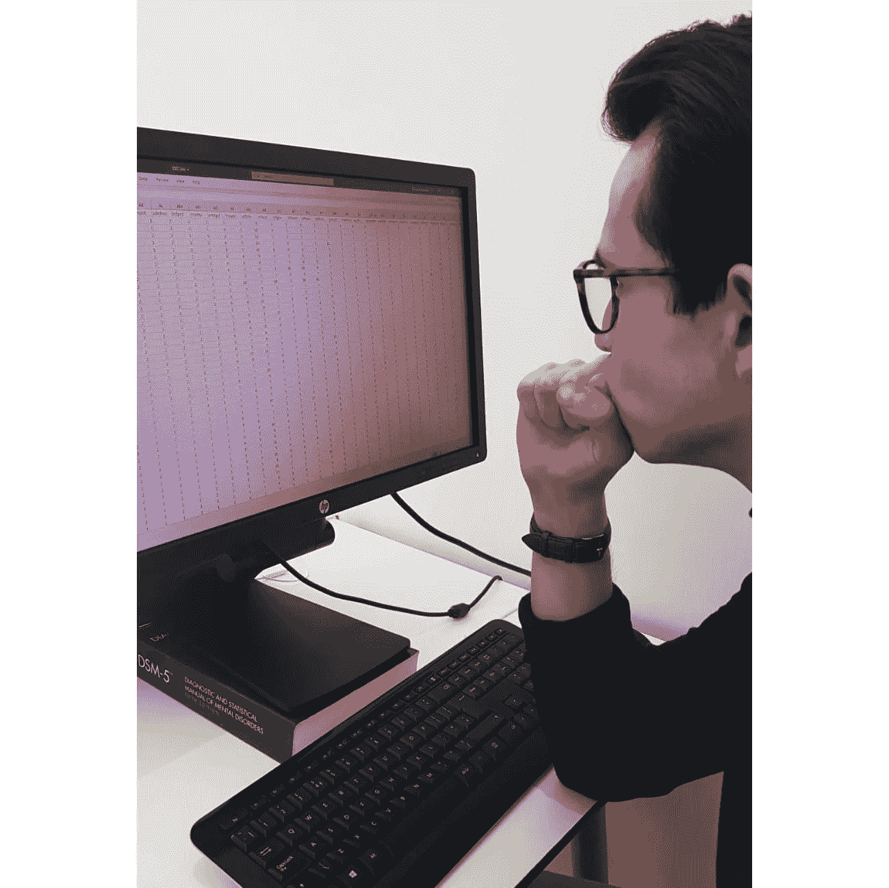
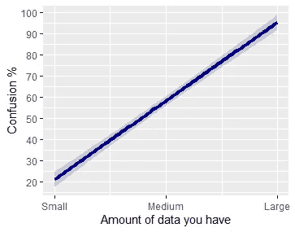
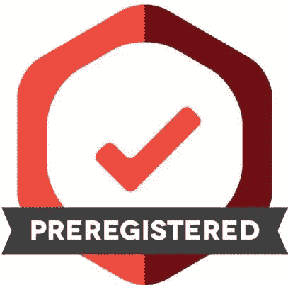

# 快速高效地分析大型复杂数据集的秘诀是什么？约束。

> 原文：<https://towardsdatascience.com/things-i-learned-in-my-phd-1-productive-data-analysis-through-constraint-4bc28de8b149?source=collection_archive---------23----------------------->

TL:DR:有时候你有太多的数据，你可能会浪费几个小时去探索，而没有回答重要的问题。我分享了关于如何通过约束自己来有效地分析大型复杂数据集的 5 个技巧。

The joys and stresses of too much data. Photo is me!

如今，研究人员经常能接触到大量数据。你可能正在分析有数百个变量和数万名受访者的欧洲社会调查。或者你自己收集了大量的数据；你可以做一项研究，参与者做大量的测试，给你留下每个人大量的数据。

你如何着手分析这美丽的混乱？

## 好吧，我来告诉你什么 ***不*** 要做:

一头扎进去，开始关联、绘图和构建多层模型，然后意识到你可能必须控制一些变量，然后你得到一个结果，但它会随着协变量 B 和 C 而消失，但不是当你也添加 A 时，然后你发现一些看似稳健的东西，但你现在已经测试了 15 种东西，所以可能是假阳性，所以你了解交叉验证，我到底在这里做什么，什么时候变成星期五了？！？

但是说真的，有时候我们的数据比我们知道的要多。还有更糟糕的问题，我承认，但这一直是我读博期间的一个问题。我花了一整天的时间在大数据集中挖掘。抛开 p-hacking 的问题(我通常会尝试验证在新数据集上发现的任何结果，您也应该这样！)，这真的能吃进你的时间。

当你的目标是“从里到外了解数据”时，你也可能会陷入这种困境。我们经常听到统计学家建议我们做更多的探索性数据分析，绘制我们的数据等等。这很有价值，但没必要了解欧洲社会调查的每一个角落。看到一个模型如何被 10 个不同的与因变量几乎没有关系的协变量所影响通常是没有意义的。你必须在某个地方划清界限，说“够了”！

Graph by the author

我非常支持这样一种观点，即对我们选择的约束可以是一种解放。如果这听起来自相矛盾，这些伟大的文章[ [这里](https://jamesclear.com/futsal)和[这里](https://thedeepdish.org/constraints-that-liberate/)将解释它。我发现，在数据方面，选项越多并不总是越好。

# 解决方法

**1。被问题驱动** 在看你的数据之前，决定你的**主要问题**是什么。这些是你将要开始回答的问题，然后你会停下来(至少直到你写完论文/章节)。有哪些问题一旦得到解答就可以发表？不是太愤世嫉俗，但在学术界，论文是游戏的名字。论文通常不是装订在一起的有趣观察的集合。他们很专注，你也应该如此。

以令人满意的方式(即通过检查结果的稳健性，排除替代解释)完成回答一个纸张大小的问题所需的所有分析，**然后停止。数据中的所有其他问题都不重要或不太重要。你可以随时回来找他们。**

**2。与同事或实验室成员讨论数据** 通过你的数据和分析与他们交谈会在你的头脑中澄清它。通过向他人解释来加深理解的想法通常被称为[费曼技巧](https://collegeinfogeek.com/feynman-technique/)，我是它的忠实粉丝。他们也许能够建议数据中什么是有趣的，什么是不有趣的。

记住，你是在努力创造对你的领域有价值的知识。因此，询问该领域的一些成员是否认为你的分析有价值是有意义的。

**3。详细记录你所做的尝试** 有这么多的 t 检验和回归模型，你可能会忘记你之前做过的一些分析，然后再次运行它！此外，有时模型不会单独产生洞察力，而是与其他模型结合使用。

比如你运行模型 A，预测器 A1 显示一个你不理解的效果。所以你可以看到 A1 是否与其他一些东西相关，这也许可以解释它。你建造了 B 型车和尤利卡！*现在记录你做了什么*。在进入下一个测试之前，解释每一个测试。不要不管三七二十一就去做测试，而不去想它们意味着什么。为了好玩而运行测试是发现假阳性的好方法。如果你做笔记，并在过程中解释发生了什么，那么每一次测试都会真正教会你一些关于数据的东西。

**4。给分析设定一个时间限制** 给自己设定一个完成分析的时间。截止日期，即使是自己设定的，也有助于理清思路。有几年时间读博士不是浪费时间的借口。过了这段时间没有完成的数据将不得不等待另一天。如果你错过了一些重要的东西，这没什么大不了的，因为你的主管/同事/最终论文的评审员会找到他们。当你有更多的时间时，你甚至可以回到数据集，花几天时间研究它。这也具有返回到刷新的数据的优点。给自己一个时间限制。不要只是悠闲地在数据中徘徊。

**5。预注册** 以一种正式的方式约束你要做的分析。在看数据之前，写下你要做的分析。Aspredicted 是一个很好的工具，可以帮助你做到这一点。预注册还有很多其他的原因:谷歌一下，阅读这篇文章，或者向当地的开放科学方法警察询问更多信息(如果你在曼彻斯特大学，那很可能就是我！).

# **结论**

数据是美丽的，许多数据是崇高的，但要警惕陷阱。希望我学到的教训对你有用！和我所有的博客帖子一样，如果其他人指出愚蠢的论点、拼写错误或说了我认为对其他人有价值的话，我会更新它。干杯！

[如果你喜欢这篇文章，请在 Twitter 上关注我](https://twitter.com/Richie_Research)