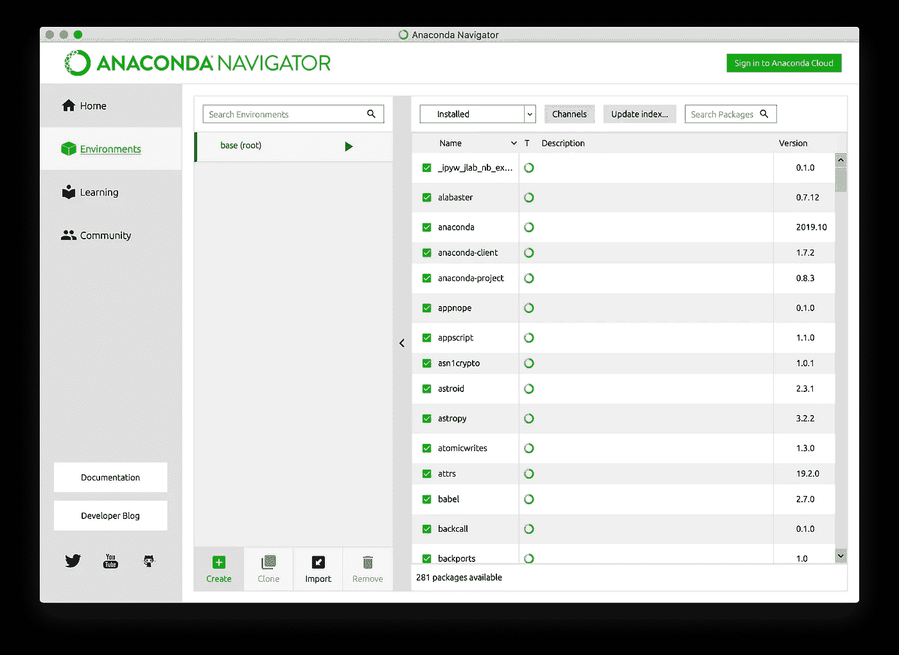
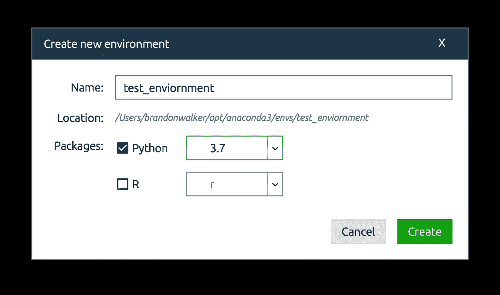
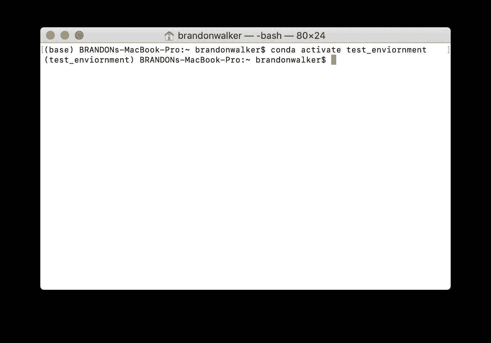
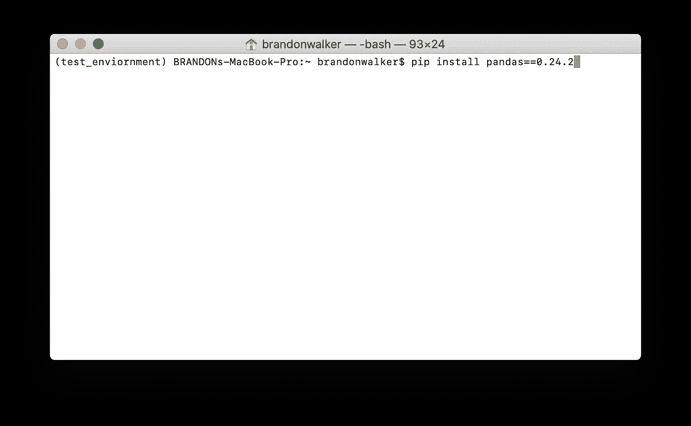
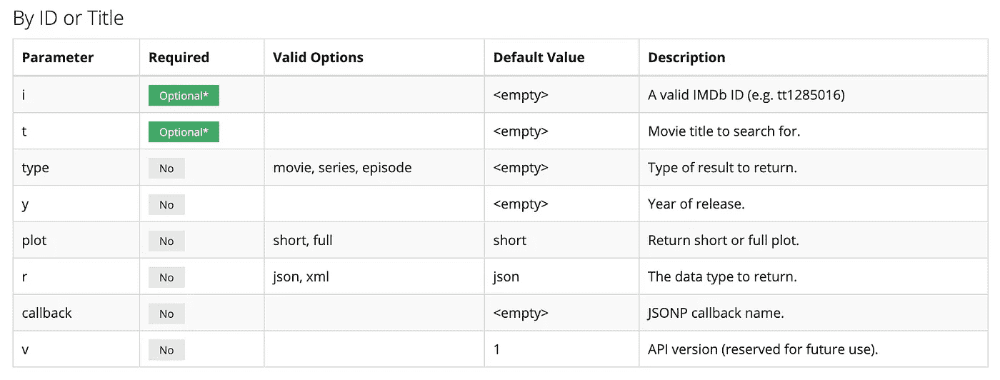
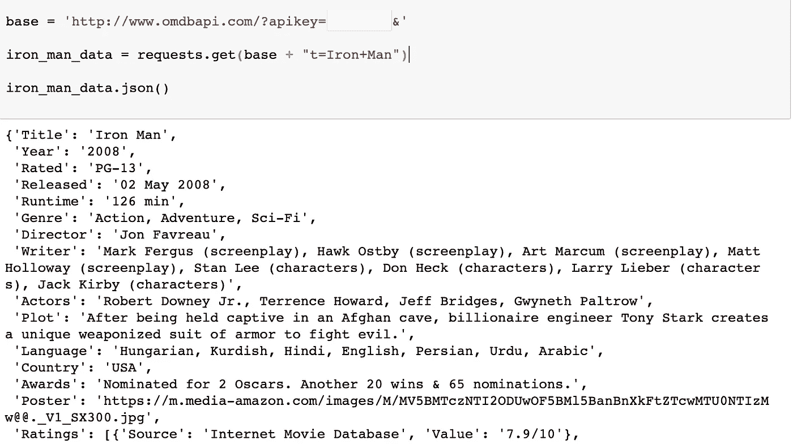

# 他们在 Python MOOCs 介绍数据科学中没有(但应该)涉及的内容

> 原文：<https://towardsdatascience.com/things-they-dont-but-should-cover-in-intro-data-science-with-python-moocs-c28550bb6c27?source=collection_archive---------19----------------------->

如果你正在读这篇文章，你可能已经上过一些在线课程，(有时被称为 MOOC)，题目听起来像是“Python 数据科学导论”这些课程中有一些东西，是这些课程中没有涵盖的，我认为应该涵盖。

在大多数课程中，你要么被告知下载 Anaconda，要么演示如何下载。然后他们会讲解使用 Jupyter 笔记本的基本知识，然后向您展示如何使用 pandas/numpy/sk learn/matplotlib 的组合。虽然这一切都很好(这些是数据科学家的基本技能)，但入门课程中缺少一些东西，这些东西会使您的数据科学项目更干净、更成熟、更专业。

# 管理您的环境和安装软件包

如果你想做多个项目，你必须关心环境。假设你有两个项目，都需要熊猫和 sklearn，只有一个需要 keras。第一个项目需要 pandas(版本 0.24.2)，第二个项目需要 pandas(版本 0.23.1)。使用 keras 的项目必须使用 Python 3.6，但另一个项目必须使用 Python 3.5。一个环境(“虚拟环境”的缩写)将帮助您管理这些依赖关系(依赖关系是其他包所依赖的包)。

首先让我们创造一个环境。我们将在 anaconda navigator 中通过单击 Environments 选项卡中的“Create”按钮来实现这一点。

接下来，选择您想要使用的 python(和/或 R)版本，并为您的环境选择一个名称，我选择了“test _ enviornment”

你现在有两个环境，一个叫 base，你一直都有。另一个是您刚刚创建的。现在要安装一个包，你需要进入命令行。要在特定的环境中安装软件包，您需要首先进入那个环境。这可以从 Anaconda Navigator gui 中完成，但是能够从命令行控制您的环境是非常有用的。使用“conda activate[environment-name]”切换到新环境。现在，您应该在命令提示符的括号中看到您的环境的名称。

现在要在这个环境中安装一个特定版本的包，我们需要使用 pip。Pip 代表“pip 安装包”,可以从命令行使用。键入“pip install pandas==0.24.2”来安装 pandas 版本 0.24.2。

# 使用 API

每个数据科学项目都需要数据。在我见过的大多数数据科学 MOOCs 入门课程中，你会得到一个 csv，在这个 CSV 中，你用熊猫读取你的数据。然后你继续你的项目。在现实世界中，大多数数据不会以 csv 的形式提供给你。API 允许您从某个来源请求数据。我将带你了解如何从[打开电影数据库](http://www.omdbapi.com/)发出请求。

首先从 OMDb 请求一个 API 密匙，这是你想要保密的。如果有人拥有您的 API 密钥，他们可以像您一样与 API 进行交互，如果您拥有敏感数据，这可能会很糟糕。您的密钥将通过电子邮件发送给您，您需要回复电子邮件来激活它。

我们将需要使用 python 中的请求库和 json 库。这两个库都是 Python 标准库的一部分，所以不需要从命令行安装它们。只需在你的笔记本/程序顶部添加“导入请求”和“导入 json”即可。

与 API 通信有 4 个基本函数。

*   GET:用于获取数据
*   POST:用于发送数据
*   上传:创建或更新资源
*   删除:用于删除资源

我们将只使用 get 方法。我们对所有包含 API 密钥的请求使用相同的基本 url。我通常把它保存在一个叫做 base 的变量中。在“&”后面包括您想要的参数和值。查看 API 文档，了解所有可能的请求和参数。以下是我们在请求中可以做出的一些选择。

下面是一个请求电影《钢铁侠》数据的示例。用加号替换所有空格。最后，我们使用。json()将我们从请求中获得的数据转换成 python 字典。现在，您可以通过引用它们的键从字典中获取所需的值。该词典中可能嵌套了其他词典或列表。

希望这为您提供了足够的信息，让您开始从入门课程过渡到完成数据科学项目。完成项目是学习任何编程概念的最好方法，我鼓励你找到你感兴趣的东西，并开始为之努力。