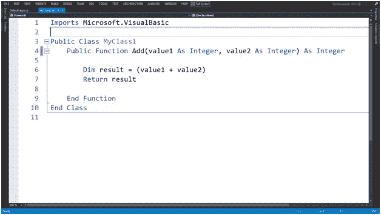
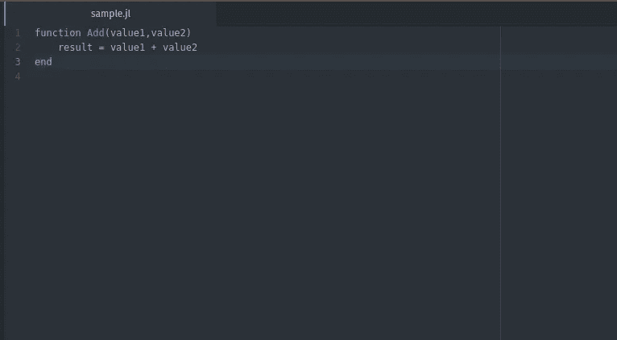

# 使用 Julia 进行机器学习之前需要知道的事情

> 原文：<https://towardsdatascience.com/things-to-know-before-using-julia-for-machine-learning-487744c0b9b2?source=collection_archive---------13----------------------->


Julia 是一种高级动态编程语言，它本身有一些有趣的特点和特性，这使它成为一种真正有趣且非常独特的语言，值得学习和利用。作为一名数据科学家，没有什么比学习一种新的编程语言来编写人工智能更令人兴奋的了。但是在 Julia 中有一些重要的事情需要注意，有些事情你应该在尝试使用它之前就知道。

# 让这句格言安息吧。

> "像 Python 一样走路，像 C 一样奔跑"

我认为关于 Julia 的许多误导性的事情之一是一个源于语言的想法的术语，并且不一定是没有根据的。然而，我相信这个术语给这门语言的新来者提供了很多不准确之处，因为 Julia 的经常用户会说这绝对是对 Julia 的不准确描述。朱丽亚确实是*一个特立独行的人。不仅仅是因为它不同的书写语言，还因为它有许多有趣的，有时甚至是令人震惊的怪癖。*

首先，Julia 的语法有点类似于 Python，但这种相似性可以在大多数编程语言中找到，尤其是统计语言。如果我，作为一个相当有经验的程序员，必须将语法与任何特定的语言进行比较，我会说微软的 Basic。没错，我们六岁时写的那种愚蠢的语言类似于麻省理工学院新发现的开源编程语言。这也没有太多的注意事项，真的就是这么简单。我对此最大的支持因素可能是 Julia 中函数和方法的实现方式。不相信我？看一看一个小小的对比:



A Function from Microsoft Basic

这是用 Julia 写的同一个函数。(注意我忘了退货)



A Function from Julia

# 不是面向对象的？

没错，Julia(技术上)不是面向对象语言。对我来说，这是茱莉亚最大的怪癖，也可能是学习茱莉亚最大的学习曲线。所有的方法都包含在 Julia 库或模块中，**不是构造函数。**

比如像 model.fit()函数这样的东西，在 Julia 里是不可以存在的。相反，通常模型有一个 fit 方法，该方法采用一个构造的数据类型，该数据类型通常包含更多的数据。因为我为 Julia 写了一个机器学习和统计模块，你可以看看这里的[**，**](https://github.com/emmettgb/Lathe.jl)**我将使用它的源代码来解释这在实践中是什么样子，以及到底发生了什么。这里是一个样本 [**笔记本**](https://github.com/emmettgb/Emmetts-DS-NoteBooks/blob/master/Julia/South%20Carolina%20College%20Staff%20Lathe%20Baseline%20Sample.ipynb) 它概述了使用测试，火车分裂，并拟合一个模型 [**使用车床在朱莉娅**](https://github.com/emmettgb/Lathe.jl) **。****

```
mutable struct meanBaseline
    y :: AbstractArray
end
```

**这些行是模型的构造函数，只需调用一个与之相等的变量，**

```
y = 1,5,3,6,8
model = models.meanBaseline(y)
```

**这个模型中没有 X 的原因是因为它只是一个均值基线模型，它将为我们提供连续特征的基线精度，其他模型完全相同，只是有一个 X。**

**因此，通常在面向对象的语言中，如 ***Python、*** 在拟合我们的模型后，我们会使用 model.fit(x，y)方法，但是因为 Julia 中的构造函数不包含方法，所以我们必须在模块的根处使用单独的方法来拟合我们的模型。为此，我使用条件来确定输入模型的()类型。**

```
function predict(m,x)
if typeof(m) == TurtleShell
        y_pred = pred_turtleshell(m,x)
    end    
if typeof(m) == majBaseline
        y_pred = pred_catbaseline(m,x)
    end    
if typeof(m) == LinearRegression
        y_pred = pred_linearregression(m,x)
    end    
if typeof(m) == meanBaseline
        y_pred = pred_meanbaseline(m,x)
    end    
return(y_pred)
end
```

**因此，预测模型看起来像这样:**

```
models.fit(model,xtrain)
```

**这就产生了拟合模型对 x 的预测值。**

**所以在我看来，对于数据科学来说，这是一个有趣的命题。有时不得不为每件事调用一个方法可能有点烦人，但对我来说这是受欢迎的，因为它非常不同而且有趣。**

**对这类东西的担心只是它对一个典型的数据科学家有多大价值，特别是对于像投资组合或任何严肃的项目这样的东西。不面向对象意味着 Julia 可能需要使用 **PyCall** 才能接近 Python 的通用性。即使这样，在 Julia 中创建任何类型的应用程序肯定也不是万无一失的方法。相对于 R，甚至 Scala，Python 最伟大的事情之一就是它有这么多奇妙的库可以做任何事情。你可以用 **Django** 和 **Flask** 开发 web 应用程序，这些应用程序与 **SQL** 数据库一起工作，用多种框架为桌面计算机和移动设备开发应用程序。这变得更容易，主要是因为 Python 是面向对象的。我很想知道 Julia 是否会把它带到任何地方，或者让它保持原样。**

**这些缺点可能有点关键，因为这并不是这种语言的真正目的。我喜欢把它看作是 Python 和 Spark 之间的桥梁。它在精确操作方面非常出色，像 Python 一样简单，是 Python 的机器学习基础，但具有 Spark 的大数据处理能力。在开始 Julia 数据科学之旅时，这绝对是需要注意的事情。**

# **关闭中**

**值得注意的是，Julia 实际上仍处于起步阶段，刚刚走出 1.0 版本。当使用 Julia 时，经常会感觉很陌生，有点过于开源，如果你明白我的意思的话。它给人一种精致、清新的感觉，但与此同时，它可能会让人觉得有点滑稽，尤其是与那些已经被搁置了 15 年以上的语言相比。**

**由于从 1.0.4 版本开始，Julia 的功能不够全面，这无疑会给 Julia 的未来带来更多的变化。我喜欢思考 Python 和 C++的早期版本，这是一个缓慢而艰苦的过程，但是随着越来越多的人开始使用、喜爱和接受 Julia，它可能会作为数据科学的标准工具被更广泛地接受。**

**这就是为什么我一直在为 Julia 开发预测建模和统计库，用更强大的文档和具有简单输入和输出的简单函数使转换变得更容易。我真的很兴奋看到朱莉娅在未来几年将走向何方，谁知道呢？也许 5 年后我们的 Python 帽子就不会这么缝上了，我们会用 Julia Flux 代替 Python 张量。无论如何，对于预测建模、可视化、统计和机器学习来说，Julia 绝对是一个令人敬畏的独特工具。**