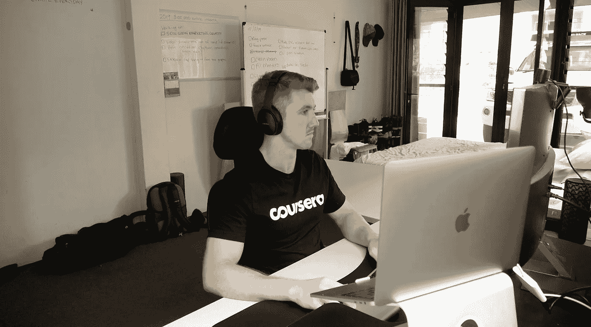
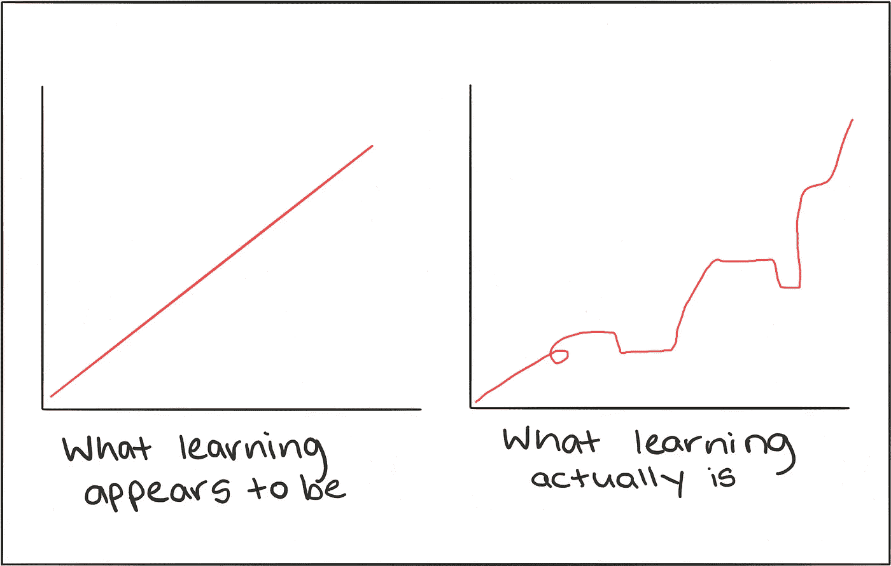

# 想着自学机器学习？提醒自己这 6 件事

> 原文：<https://towardsdatascience.com/thinking-of-self-studying-machine-learning-remind-yourself-of-these-6-things-b55a5f2b6c7d?source=collection_archive---------2----------------------->

## 我是一名自学成才的机器学习工程师，如果我重新开始，我会这样告诉自己

Where most of my self-study takes place. Photo from: [Daniel Bourke on YouTube](http://bit.ly/DanielBourkeOnYouTube).

## 视觉上学得更好？YouTube 上有这篇文章的视频版本

我们在澳大利亚举办了一个机器人会议，现在是提问时间。

有人问了个问题。

“我如何从不同的背景进入人工智能和机器学习领域？”

尼克转过身，叫着我的名字。

“丹·伯克在哪里？”

我在后台和亚历克斯聊天。我走过去。

“他在这里，”尼克继续说，“丹来自健康科学背景，他学习营养学，然后驾驶优步，在网上学习机器学习，现在作为机器学习工程师与马克斯·凯尔森一起工作了一年。”

尼克是布里斯班科技公司 Max Kelsen 的首席执行官和联合创始人。

我站着，一直听着。

“他在网上记录了他的旅程，如果你有任何问题，我相信他会很乐意帮忙。”

问题问完了，我回到了食物上。

Ankit 过来了。他告诉我他正在进行的项目，该项目使用机器学习来更好地理解学生的学习。他综合了课堂出勤率、在线学习门户花费的时间、测验结果以及其他一些东西。他甚至建立了一个前端门户网站来与结果互动。

Ankit 的作品启发了我。这让我想做得更好。

然后又有几个人开始过来问如何进入机器学习的问题。都来自不同的领域。

这是最难的部分。我仍然认为自己是一个初学者。

但是最好的导师是比你年长 1-2 岁的人。一个刚刚经历过你将要经历的人。再久一点，建议就会变得模糊。你想要新鲜的。

我哥哥正在研究机器学习。以下是我一直对他说的话(还有我自己，如果我要重新开始的话)。

# a)获得一些 Python 基础知识(3-4 个月)

语言并不重要。可能是 R，Java，Python，随便什么。重要的是选择一个并坚持下去。

如果你是初学者，你会发现使用 Python 很难出错。

如果你想进入应用机器学习领域，代码是必修课。

从网上选择一门基础课程，坚持几个月。如果它同时面向数据科学教学，则加分。DataCamp 在这方面非常出色。

有时会很难，但这是关键。学习编程语言就像同时学习另一种语言和另一种思维方式。

但是你以前做过。记得你三岁的时候吗？大概不会。但是你周围的人都在使用你从未听过的词汇和声音。过了一段时间，你也开始使用它们。

# b)当你还没准备好的时候就开始做东西

尽快应用你所学的知识。

不管你完成了多少门课程，你永远不会 100%准备好。

不要被引诱去完成更多的课程作为能力的标志。

如果我回到过去重新开始，这是我要改变的一件事。

找一个你自己的项目去做，从错误中学习。

回到三岁的自己。你说的每三个字都是错的。没有句子结构，也没有语法。一切都浮出水面了。

# c)外面有很多，所以减少混乱

外面有很多课程。他们都很棒。

很难找到不好的。

但问题是。既然有这么多，可能很难选择。另一个可以阻止你的陷阱。

为了解决这个问题，我设立了自己的人工智能硕士学位。我自己的定制赛道。

想抄就抄吧。但是我鼓励你花几天时间做自己的研究，看看什么最适合你。

作为提醒，我发现最符合我日常工作的三个资源是:[动手机器学习书籍](https://amzn.to/2GormNb)、 [fastai 机器学习课程](http://course18.fast.ai/ml)和 Coursera 上的[应用数据科学与 Python 课程。](http://bit.ly/courseraDS)

在你有了几个月的 Python 经验之后，把这些收藏起来。

# d)研究是必要的，但如果你不能应用它，那就毫无意义

你会看到每天都有关于新的机器学习方法的文章和论文出现。

别理他们。

没有办法跟上他们，这只会阻碍你打好基础。

大多数最好的机器学习技术已经存在了几十年。发生变化的是计算能力和数据可用性的提高。

不要被新事物分散注意力。

如果你刚开始，坚持先打好基础。然后根据项目需要扩展你的知识。

# e)每天一点

3 岁的你是学习机(机器学习者？).

在几年的时间里，你从不说话变成了和已经说了几十年的人说话。

怎么会？

因为你每天都练习一点。

然后复利就起作用了。

每天好 1% =年底好 3700%。

如果你错过了一天，没关系，生活发生了。能恢复就恢复。

很快你就会开始说数据语言了。

# f)不要因为不知道某事而责备自己

“你建过推荐引擎吗？”

“没有。”

“我们有一个项目需要一个作为概念验证，你觉得你能解决吗？”

“当然可以。”

大多数人认为高中或大学毕业后学习就停止了。并没有。

上面的场景发生在几周前。我从来没有建立过推荐引擎。然后我做了。

如果你在以前做过的事情上失败了，失败并不是坏事。你一生都在走路，但当你自己绊倒时，你不会自责。它发生了。你继续走。

但是在新事物上失败是艰难的。你以前从来没做过。

学习机器学习是这样的。

第一年:你真差劲。

第二年:你比前一年更好，但你认为自己更差，因为你意识到自己有多少不知道。

第三年:？？？？(我还没到那一步)

拥抱吮吸。

因为不知道某事而痛打自己对你学习更多有多大帮助？

零。

学习新事物需要时间。每天都是第一天。

Learning isn’t linear.

三岁的你会对不认识一个单词有什么反应？

你会笑的。把手举起来，然后爬一会儿。

现在也一样。除了你能走路。

如果没有那些创建课程并分享他们所学的伟大的人们，我所做的一切和我所学到的一切都是不可能的。

有更多问题吗？在推特、 [LinkedIn](http://www.linkedin.com/in/mrdbourke) 或 [YouTube](http://bit.ly/DanielBourkeOnYouTube) 上联系。

这篇文章最初是作为 Quora 上的一个回答出现的。