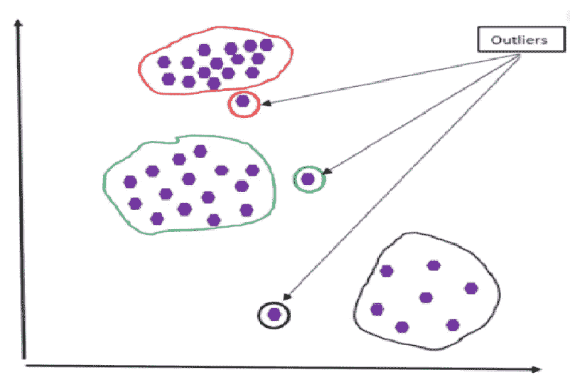
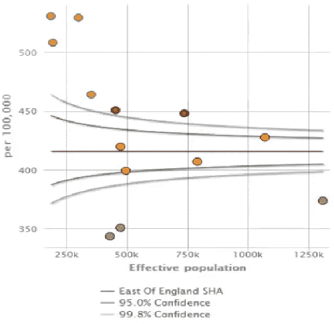
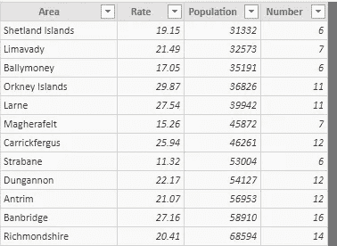
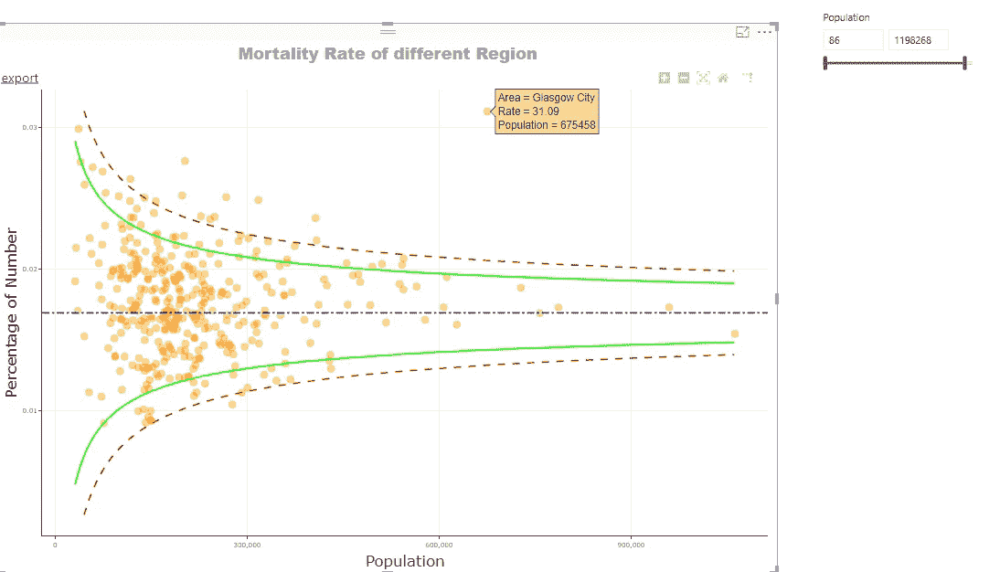

# 基于漏斗图的电力商业智能异常检测

> 原文：<https://towardsdatascience.com/this-article-is-about-identifying-outliers-through-funnel-plots-using-the-microsoft-power-bi-d7ad16ac9ccc?source=collection_archive---------19----------------------->

这篇文章是关于使用微软 Power BI(可视化工具)通过漏斗图识别异常值的。在我们继续之前，让我们看看什么是离群值，以及为什么识别它们很重要。

离群值是那些位于总体分布模式之外的数据点&检测离群值最简单的方法是通过图形。箱线图、散点图有助于轻松检测它们。

在进行异常值分析之前，我们应该对为什么我们需要发现异常值以及我们将如何处理这些异常值的问题有一个答案。这种专注将帮助我们选择正确的分析、绘图或绘图方法。例如，如果异常值表明存在风险或威胁，则应该处理这些元素。如果一个异常值表示一个异常的结果，企业可能希望对它们执行进一步的分析，以识别这些异常值的独特方面。

对于离群点检测，我们可以用 R/Python 绘制图表，这需要一些编码技巧。同样的事情也可以在 power BI 中实现，在 Power BI 中进行分析的优势是不需要编码，我们还可以应用所需的过滤器，快速分割数据，以查看各种条件下的异常值。

在本例中，我们使用 Power BI 中的漏斗图(自定义视图)来识别异常值。漏斗图是散点图的变体，有助于通过识别异常值来评估和可视化监测数据。这些图用于许多行业，如医疗健康分析、比较组织绩效等。漏斗图中的异常值基本上是漏斗外的点。

漏斗图使用一种称为统计过程控制的方法，该方法将普通原因变异与特殊原因
变异区分开来。普通原因变化是任何系统中发生的正常随机变化(噪声),而特殊原因变化表明有异常情况发生。

漏斗图在垂直轴上显示指标值，在水平轴上显示人口。正如我们在下图中看到的，基准值(平均值/中值)是穿过图表中心的水平线。漏斗位于基准点的两侧，漏斗被有效地称为控制极限(置信区间)。漏斗形状的形成是因为随着人口数量的增加，控制界限变窄。

从根本上来说，这些图是由置信限、几个聚类(一组点)和异常值形成的。漏斗图通常显示两个漏斗，内部深灰色线代表两个标准差(95%置信水平)，外部浅灰色线代表 3 个标准差(99.8%置信水平)。基本上，这些极限代表数据点落在这些线所描绘的区间内的概率。我们通常使用内部漏斗来决定价值是否与基准显著不同。如果一个点位于漏斗内，那么我们可以得出结论，它与基准没有明显不同，如果它位于漏斗外，那么它可能明显更差(红点)或更好(绿点)。这些红色/绿色的数据项是异常值，根据业务需求，我们可以进一步分析这些异常值。

**Power BI 桌面中的漏斗图**

假设您对 power bi 有基本的了解，我将直接绘制漏斗图。在这个例子中，我使用包含各地区癌症死亡率统计数据的表格作为绘制漏斗图的输入数据。

一旦我们将数据加载到 Pobwer BI 中，我们可以看到它有 4 列。“人口”一栏是该地区的总人口，“人数”表示死亡病例数。

Power BI 使用 R 代码来绘制漏斗图，我们应该在我们的系统中安装 R 来工作，并且当我们第一次使用漏斗图时，它会要求安装几个 R 包。

> 跟随[链接](https://www.mssqltips.com/sqlservertip/5973/power-bi-funnel-plot-for-outliers-detection/)了解在 Power BI Destkop 中绘制漏斗图的步骤。

一旦我们画出了漏斗图，它看起来如下，让我们向前看，并试图理解漏斗图实际上是如何工作的。这里，在这个可视化中，X 轴代表人口，并相对于流感死亡率绘制在垂直轴(Y 轴)上。您可以选择以百分比或比率显示的 Y 轴。

图中的水平蓝线称为基线。默认情况下，绿色实线表示置信度为 0.95，红色虚线表示置信度为 0.99。基本上，这些极限代表数据点落在这些线所描绘的区间内的概率。

每个点代表一个区域，我们可以将鼠标悬停在任何点上，以查看给定输入参数下的区域、人口和死亡率。我们可以看到，格拉斯哥市的死亡率为 31.09，考虑到人口规模，这被归类为异常值，并绘制在漏斗之外。这种不对称性有助于用户对该地区进行更多的研究和调查。

正如我前面提到的，我们可以在我们的地块上应用所需的过滤器，我在右上角包含了一个人口过滤器，使用它我们可以将我们的人口限制在所需的数量，地块将相应地/立即改变。这些切片和切块选项对于业务用户从不同角度查看数据非常有用，因此有助于获得更好的洞察力。

这就是这篇文章的全部内容，如果你喜欢，请鼓掌。提前感谢。