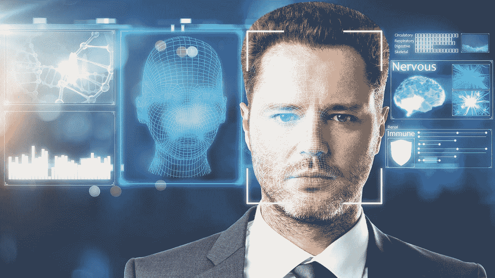

# 这项发明用你的声音来显示你的长相

> 原文：<https://towardsdatascience.com/this-invention-uses-your-voice-to-show-what-you-look-like-eb5b473b7dd6?source=collection_archive---------29----------------------->

## 麻省理工学院的研究人员开发了一种人工智能，它可以仅根据你的声音来预测你的外貌。所以他们已经有了如何在日常生活中使用这项发明的想法。

我想象你正坐在一个商务会议上。你不认识的人通过电话从外面连接。通话几秒钟后，一张他的脸的复制品出现在屏幕上——是根据来电者的声音生成的。

这不是科幻小说，而是美国麻省理工学院(MIT)研究人员成功研发的一项发明。例如，他们创建了一个神经网络，一个人工智能，并向它输入了来自 YouTube 的数百万个视频序列。这使得网络能够学习各种关于面孔和语言之间关系的信息。

然后，研究人员试图找出人工智能现在可以仅根据声音重建多少关于说话者面部的信息。他们使用神经网络通过声音编码器破译声音及其面部特征，并通过面部解码器创建合适的肖像。

## 研究人员做得很好。

六秒钟的录音足以让人工智能创造出与原始录音惊人相似的图像。特别是，年龄和性别，以及种族背景或关于脸部形状的信息通常都可以被识别。

与此同时，研究人员根据原始照片创建了一幅肖像，以中性的面部表情描绘被描绘者，并注视着相机。与基于声音的图像相比是惊人的。

当然，结果还不完美。此外，人工智能有时也会出错:例如，当一个亚洲人说英语时，可能会有困难。但是不仅仅是种族，还有性别和年龄都弄错了。

然而，麻省理工学院的科学家并不是第一个处理这个话题的人。之前的研究也使用人工智能来破译声音。然而，他们总是搜索预定义的信息，例如，说话者的年龄或性别。

## 麻省理工学院的研究人员采取了不同的方法:

他们想知道一般可以从语言中获得哪些关于面部的信息。根据他们的陈述，他们是第一个成功地直接从声音中识别出一张脸的人。
研究人员已经有了如何利用这一发展的想法:例如，可以根据声音创建的肖像来创建个性化的卡通。该功能还可以用于为机器生成的声音分配类似的外观——例如，来自虚拟助手的声音。