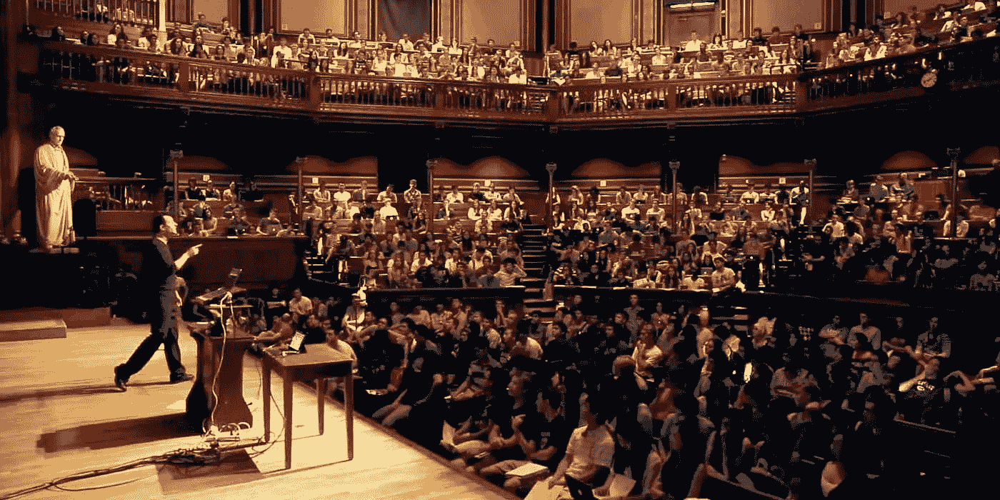

# “这是 CS50”:开始数据科学教育的愉快方式

> 原文：<https://towardsdatascience.com/this-is-cs50-a-pleasant-way-to-kick-off-your-data-science-education-d6075a6e761a?source=collection_archive---------6----------------------->

## 为什么 CS50 对巩固你的软件工程基础特别有用

CS50 professor David Malan teaches over 800 students on CS5 — from Youtube

# 所以你想进入数据科学领域

祝贺你！数据科学是一个最热门、最艰难、最具挑战性、最有回报且充满顶尖人才的职业。你的旅程一定会充满乐趣、挑战、启迪和成就(或大或小)。每天甚至每小时都有新论文发表。新技术和实验定期开发。新的思维方式成为新的规范。和以前看起来不可思议的事情，都被证明是可行的。

# 但是你不知道从哪里开始

Photo by [Ben White](https://unsplash.com/@benwhitephotography?utm_source=medium&utm_medium=referral) on [Unsplash](https://unsplash.com?utm_source=medium&utm_medium=referral)

但是进入数据科学并不容易。远非如此。学习曲线是残酷的。要学的东西太多了:线性代数、微积分、统计学、Python、SQL、机器学习、算法、优化、数据争论、数据可视化、软件工程、devo PS……不胜枚举。

有些人可能有一些数学或者统计方面的背景，肯定会有帮助。然而，你仍然需要一个坚实的软件工程基础，以便在你的职业生涯中高效和成功。但这不是问题，你说。毕竟我们生活在一个在线教育蓬勃发展的时代。有很多付费和免费的课程可供我们选择。**没错，但这正是问题所在**。如今，自我教育面临的最大挑战不是缺乏教育资源，而是很难找到最好的或最相关的资源。

# 输入 CS50。如果只允许你修一门 CS 课程，那就修 CS50。

WCS50 是什么帽子？这是在哈佛大学由大卫·j·马兰教授讲授的计算机科学入门课程。这是哈佛最大的班级，有 800 名学生，102 名员工和专业的制作团队。它提供校内和网上课程。我参加了网络课程，但这已经是我遇到的最好的计算机科学课程了。让我告诉你为什么:

*   **学习曲线设计的太好了，就像在看一部很棒的悬疑电影**

CS50 的工作人员有能力在每次讲座之前准确地知道你做了什么和不知道什么(因为他们没有专家盲)。所以演讲不会提到任何你不熟悉的东西。它平稳地引导你通过计算机科学的关键概念，并使它看起来很明显。它不时地提出问题，然后通过更深入的概念解释来解决这些问题。你会有很多“啊哈”时刻，感觉就像在看一部悬疑电影。

*   **涵盖了计算机科学的核心和重要基础，并为您留下了足够的空间来深入挖掘**

该课程涵盖了大多数重要的计算机科学元素:C 语言、Python、数据结构、算法、软件工程、资源管理、Web 开发等。它挖掘得足够深，所以你可以理解所有的基本概念，同时也知道如果你想挖掘得更深，应该去哪里找。

*   **编排各种方式教你挑战/无聊的概念，绝不觉得无聊**

What is an array? Let’s find out! — thecrimson.com

CS50 有很多方法可以教你并让你保持参与。您将玩一个游戏来了解不同的排序算法，收到一只橡皮鸭来体验著名的[橡皮鸭调试](https://youtu.be/f5d8pVg3Qtg)，观看“灯光阵列”的实验🚥学习数据结构，甚至吃一顿美味的早餐🍞同时探索伪代码的概念。(我最喜欢的一个例子是，戴维·j·马兰(David J. Malan)用一本黄页电话簿来解释二分搜索法，然后撕下一半扔掉。CS50 的决定性时刻。)

*   **互动、有趣、吸引人，时间过得飞快，一旦课程结束，你会惊讶于你所能做的事情**

学习的经历如此有趣，你会感觉时间在不知不觉中飞逝。它给出的一些问题很有挑战性，但并非不可能。一旦你成功了，你会为自己感到骄傲。你可能会爱上解决问题的快乐。如果你被困住了，几乎每个社交网络平台上都有一个在线社区(Twitter、Reddit、Stack Exchange、脸书等。)在那里可以得到帮助。

*   **课外活动让你熟悉“开发者文化”，这对你未来的职业生涯至关重要。**

谜题日、办公时间、CS 50 展会、最终项目“通宵”黑客马拉松(如果你熬夜的话，可以在 IHOP 吃免费早餐)，许多活动旨在让你熟悉“开发者文化”，并为你进入软件工程世界做好更好的准备。

*   **最先进的课程软件助您入门**

如果他们不用自己开发的软件工具，一门计算机科学课程有多伟大？多年来，CS50 的工作人员开发了一系列工具/软件来帮助学生[编写代码](https://cs50.readthedocs.io/ide/)、[提交作业](https://cs50.readthedocs.io/submit50/)、[检查他们的代码质量/语法](https://cs50.readthedocs.io/check50/)、[整理代码风格](https://cs50.readthedocs.io/style50/)，甚至[生成 PDF 格式的彩色代码文档](https://cs50.readthedocs.io/render50/)！正如大卫·j·马兰所说，这些都是简洁而有用的“训练轮”,将会帮助你提高速度。

但是，请不要只相信我的话，看看 YouTube 首席执行官 Susan D. Wojcicki 对她的经历是怎么说的:

# 这对数据科学也很有帮助

B 作为一门很棒的课程，CS50 与数据科学也非常**相关**。它帮助您为未来的职业生涯打下坚实的软件工程基础:

*   它教你 C 语言。更重要的是，通过 C 语言，你了解计算机的基本原理，如内存如何工作，什么是指针，数据结构等。
*   如果你会写 C，那么你就能很快学会用 C++写。C++是事实上的低级、高性能语言，用于 Numpy、Pandas、Sk-Learn 等数据科学库。
*   它教授 Python，Python 是机器学习和数据科学的主要高级语言。
*   它教授 SQL，这是数据科学中使用最广泛的语言。
*   它还教授 web 编程，当您试图将您的模型部署到生产中时，这很有用。

> 因此，从本质上讲，这门课所教授的东西对你都没有多少用处，它帮助你建立的基础将大有裨益。

# CS50 及以上！

O 学完本课程后，您将更加博学和自信地继续您的数据科学之旅，我将从这里为您指出几个可能的方向:

[**CS50 用 Python 和 JavaScript 进行 Web 编程**](https://www.awin1.com/awclick.php?gid=295463&mid=6798&awinaffid=651951&linkid=599979&clickref=)

由才华横溢的 TF [余腾渤](https://www.youtube.com/watch?v=HMjaUj59QdQ)教授你最相关和先进的 web 编程工具，如 CSS、Javascripts、React、Flask/Django。链接[这里](https://www.youtube.com/playlist?list=PLhQjrBD2T382hIW-IsOVuXP1uMzEvmcE5)。

****的 Fast.ai 课程，开始一种“自上而下”的 ML 方法****

**[Fast.ai](https://www.fast.ai/) 奇妙而独特。它使您能够在第一课中用不到十行代码构建最先进的深度学习模型。然后，它越来越深入地探究如何和为什么。唯一的先决条件是一年的编码经验，CS50 已经为你准备好了。**

**[**吴恩达**](https://medium.com/u/592ce2a67248?source=post_page-----d6075a6e761a--------------------------------) **在 Coursera 上的机器学习课程****

**[另一个很棒的机器学习课程](https://medium.com/datadriveninvestor/thoughts-on-andrew-ngs-machine-learning-course-7724df76320f)，但是是“自下而上”的风格。它首先流畅地解释数学基础，然后逐渐积累知识，从零开始拼凑复杂的机器学习模型。我有[一篇文章](/two-sides-of-the-same-coin-fast-ai-vs-deeplearning-ai-b67e9ec32133)解释了[吴恩达](https://medium.com/u/592ce2a67248?source=post_page-----d6075a6e761a--------------------------------)和[杰瑞米·霍华德](https://medium.com/u/34ab754f8c5e?source=post_page-----d6075a6e761a--------------------------------)的不同机器学习教育方法之间的差异，并推荐了一种潜在的高效学习方法。**

****科里·斯查费的 YouTube 频道，Python 和 OOP 教程****

**尽管 CS50 很好，但它只涵盖了 Python 的一般和基本概念。您将需要更深入的知识来为您的数据科学项目高效编码。为此，我推荐科里·斯查费的 YouTube 频道。他是我遇到的最好的 Python 教育者之一，他用清晰明了的方式解释了复杂的思想。他的视频一秒都没有浪费。内容简洁，切中要害，高度浓缩。他有基本的 [Python](https://www.youtube.com/watch?v=YYXdXT2l-Gg&list=PL-osiE80TeTt2d9bfVyTiXJA-UTHn6WwU) 、 [SQL](https://www.youtube.com/watch?v=xaWlS9HtWYw&list=PL-osiE80TeTsKOdPrKeSOp4rN3mza8VHN) 、 [Matplotlib](https://www.youtube.com/watch?v=UO98lJQ3QGI&list=PL-osiE80TeTvipOqomVEeZ1HRrcEvtZB_) 、 [Git](https://www.youtube.com/watch?v=HVsySz-h9r4&list=PL-osiE80TeTuRUfjRe54Eea17-YfnOOAx) 和[面向对象编程](https://www.youtube.com/watch?v=ZDa-Z5JzLYM&list=PL-osiE80TeTsqhIuOqKhwlXsIBIdSeYtc)的播放列表。**

# **结论**

**L 学习数据科学从来都不是一件轻而易举的事情，我希望这篇文章能对减轻这种痛苦有所帮助，让你的旅程变得更高效、更有趣。你可以在 edX 上访问[这个链接](https://www.awin1.com/awclick.php?gid=295463&mid=6798&awinaffid=651951&linkid=599979&clickref=)获取所有 CS50 相关课程(只需搜索‘CS50’)。如果您知道其他也很棒的课程和资源，请随时留下您的回复，这样其他人也可以看到。谢谢！**

**觉得这篇文章有用？在 Medium 上关注我([李立伟](https://medium.com/u/72c98619a048?source=post_page-----d6075a6e761a--------------------------------))或者你可以在 Twitter [@lymenlee](https://twitter.com/lymenlee) 或者我的博客网站[wayofnumbers.com](https://wayofnumbers.com)上找到我。你也可以看看我下面最受欢迎的文章！**

** [## 一枚硬币的两面:杰瑞米·霍华德的 fast.ai vs 吴恩达的 deeplearning.ai

### 如何不通过同时参加 fast.ai 和 deeplearning.ai 课程来“过度适应”你的人工智能学习

towardsdatascience.com](/two-sides-of-the-same-coin-fast-ai-vs-deeplearning-ai-b67e9ec32133)  [## 我完成了吴恩达的机器学习课程，感觉棒极了！

### 好的，坏的，美丽的

medium.com](https://medium.com/datadriveninvestor/thoughts-on-andrew-ngs-machine-learning-course-7724df76320f)**