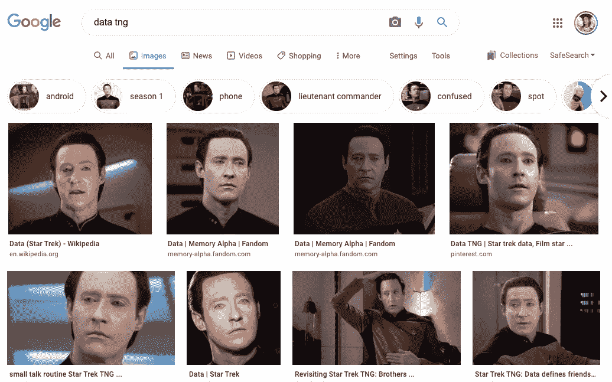
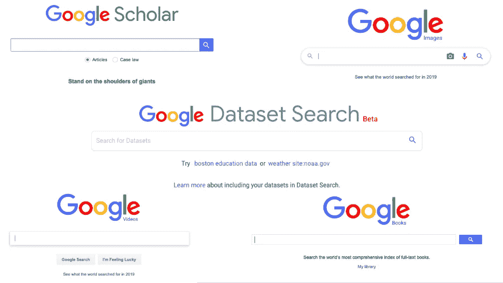
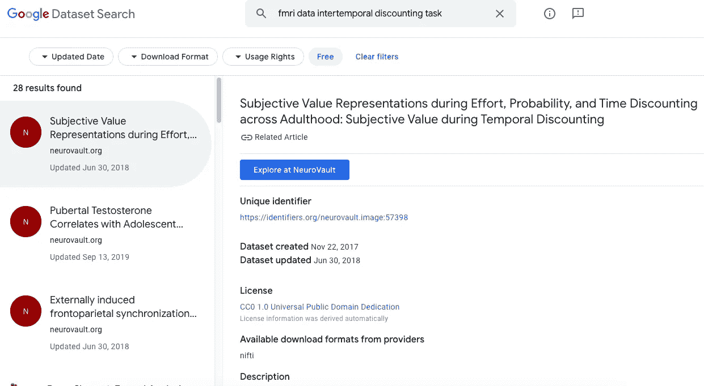
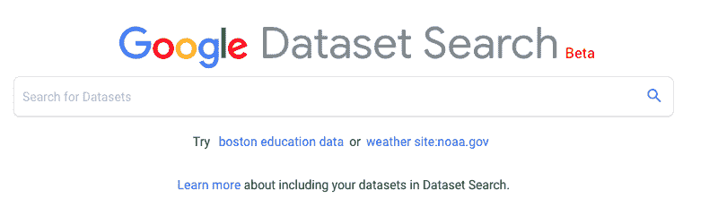

# 这就是你在数据科学里放数据的方式！

> 原文：<https://towardsdatascience.com/this-is-how-you-put-the-data-in-data-science-5411c8a45122?source=collection_archive---------8----------------------->

## 数据科学不断发展。这 2000 万个数据集就是证明。

(Er, wrong Data search tool.)

谷歌搜索家族中我最喜欢的新成员之一是[数据集搜索](http://bit.ly/dataset_search)。是的，你没听错。您可以像搜索图像一样搜索数据集！

> 您现在可以像搜索图像一样搜索数据集了！

You can play with Dataset Search [here](http://bit.ly/dataset_search).

## 关于公众的数据素养，数据集搜索说明了什么

如果没有人使用谷歌的垂直搜索引擎，如[谷歌图片](http://bit.ly/images_search)或[谷歌学术](http://bit.ly/scholar_search)，它们不会持续很久，所以它们的多样性告诉你一些人们倾向于在互联网上寻找什么。图像、视频和新闻都不足为奇。但是数据集呢？你暗示说，处理数据集不仅仅是遥远冰屋里三个孤立的教授的事。它很大。…而且越来越大。

有什么条件？没有了。这真的和用谷歌图片或谷歌学术搜索是一回事，但是是针对数据集。超过 2000 万(！)数据集目前已编入索引并可供使用……而且该索引正在快速增长。

> 今天，它让 2000 万个数据集唾手可得…明天还会有更多。

既然你知道它的存在，你可以在这里玩它[或者你可以留下来讨论数据集搜索是如何工作的，以及它对数据科学](http://bit.ly/dataset_search)职业和整个人类意味着什么。

A screenshot from my most recent [Dataset Search](http://bit.ly/dataset_search) session. Back when I was in grad school I would have groveled shamelessly for clues about where to beg for access to data like these. (That’s literally what we had to do to get it: write long emails begging other laboratories to cough it up, usually to no avail. Give me a moment while I get misty-eyed over how easy the new way is.)

## 加速分析领域的一场革命

分析是[数据科学](http://bit.ly/quaesita_datasci)的一部分，是关于快速获得灵感的。与统计学或机器学习不同，分析学的最高优点是速度。(为了安全起见，[优秀的分析师会形成一种免疫力](http://bit.ly/quaesita_roles)，不会在跟进新数据之前就妄下结论。)

> 更快的数据访问为您提供了更强大的分析能力。

你知道当数据集很容易找到时你会得到什么吗？更快的分析！[数据集搜索](http://bit.ly/dataset_search)对于所有的专业分析师和数据科学家来说，这是一个令人难以置信的速度提升。(但是，如果你有把你的灵感当真的危险，一定要记得用[统计方法](http://bit.ly/quaesita_versus)更仔细地[跟进](http://bit.ly/quaesita_sydd)。)

## 是啊，但是到底有什么问题呢？

如果你生长在一个数据集稀少、珍贵，并且经常由教授或数据提供商管理的世界——就像我们大多数人一样！—你可能会有一点无意识的偏见:你认为给你数据的人会对数据的质量负责(可能还藏着一两个博士学位)。如果你主要在学习或科学环境中使用数据集，你可能会形成这样的印象，数据集在到达你面前之前被亲切地处理过。

> 现实生活中的数据科学是一片丛林，而不是由你的教授们管理的神圣空间。

暂且把这种偏见放在一边，考虑一个不同的问题:外行人对数据崇拜的有害影响。任何倾向于用大写字母“D”来表示数据的人可能会认为所有以结构化形式包装的信息都是有用的和真实的。嘿，这不是魔法。不要相信你读到的一切，也不要相信每一个数据集。点击了解更多关于数据和数据崇拜的本质[。](http://bit.ly/quaesita_hist)

如果你的生活中，大多数给你数据的人都是有名望的，并且/或者你被教导要崇拜数据和科学，那么你会受到严重的打击。你猜怎么着！数据集可能是一堆结构化的垃圾。它可能会坏掉。可能是编造的。可能是六十亿个零。什么都有可能。就像文字一样！

> *“书上写的，一定是真的……”*

说到文字:*“书上写的，一定是真的……”*对吧？不对！更惨:*“如果是网上写的，那肯定是真的……”*看到你刚才拉的那张脸，我爱死了。很好。你持怀疑态度。你应该害怕。现在*怎么样“如果写在数据集中，那一定是真的……”*

A [book](https://www.youtube.com/watch?v=T3vfVmJznqU)! It must be true.

那里有很多垃圾，因为任何人都可以写他们想写的东西。你知道不该相信它。相反，你需要花点时间去思考它的来源。太好了，因为这个习惯也会让你在数据领域保持安全。

> 如果你习惯于相信数据而不是文字，那就小心你自己。

如果你习惯于相信数据而不是文字，那你就要小心了。你可能已经有了这个习惯，却没有意识到。不要把数据视为神圣的东西。重新定位你的街头网络习惯，也就是你在搜索谷歌图片或网络时经常使用的习惯。你知道谷歌并不拥有或编辑那些猫的照片或隐形药水的配方，当你友好地询问时它会提供给你。(你知道那些隐形药水不管用吧？)你知道质量各不相同，在你相信你读到的一切之前，你要对来源进行批判性的思考。你知道网上有各种各样的东西，你早就不容易受骗了。嗯，大部分是。即使是我们中最优秀的人偶尔也会点击那些“一个奇怪的把戏”链接或稀奇古怪的新闻故事。

> 如果你把你通常对街头互联网搜索的怀疑态度应用到数据集搜索上，那就没什么问题了。

像对待任何其他互联网搜索结果一样对待数据集搜索结果。该工具将帮助您筛选干草堆，但要由您来仔细检查猫拖进来的东西的质量。

但是，嘿，如果让我在一个巨大的可搜索的不同质量的猫图像的聚宝盆和一个 3 个精心策划的猫图像的小相册之间选择，我会选择前者。(嗯，实际上我会两个都选，因为我很贪婪……你也可以。这些搜索工具不需要你的一夫一妻制。)

## 互联网大部分是由垃圾邮件组成的

不是所有的东西都对你有好处。也就是说，谷歌确实尽力打击垃圾邮件，并优先考虑合法结果。是的，人们会把垃圾数据集放在那里来吸引你的注意力，是的，我们对它进行排名是为了给你提供更好的东西。就像常规搜索一样。但是你不应该期望这些事情是完美的。

> 要使数据集可搜索，只需将 schema.org 中的元数据添加到描述数据集的每个网页中。

要使数据集可搜索，只需将 schema.org 中的元数据添加到描述数据集的每个网页中。谁都可以做，就像谁都可以写博文一样。它可能是垃圾(也许这篇博文是……啊哦),所以批判性地思考一下来源。

如果你打算消费自由放养的数据，你需要保持警惕。不要相信你读到的一切。

## 它是如何工作的，什么是 schema.org？

schema.org 的想法是在 2011 年由一个财团提出的，这个财团来自通常的嫌疑人:谷歌、必应、Yandex、微软和雅虎。他们厌倦了猜测抓取的网页的内容，所以他们决定创建一个公共词汇表，提供商可以用它来告诉他们什么是什么。这个词汇表嵌入在 HTML 中，表示哪些位描述了一个事件、一个地址、一个食谱等等。它是一个小模式(因此得名！)描述不同类型的信息。当您选择将 schema.org 的 T2 添加到您的页面，并告诉它该页面有一个数据集时，该数据集就有资格显示在数据集搜索结果中。

> 数据提供者使用 schema.org*告诉我们在他们的页面上有一个数据集，并描述关于它的一些元数据。*

这不是谷歌特有的魔法；这是一个开放的社区标准，任何人都可以为之做出贡献。许多公司多年来一直在幕后使用它。谷歌特有的功能是你用数据集搜索来搜索数据集的新能力。我们让数据提供者使用*schema.org*告诉我们在他们的页面上有一个数据集，并描述关于它的一些元数据。数据集搜索与常规搜索非常相似，但搜索结果仅限于声称拥有数据集的页面。简单又有用。

## 如何参与共享数据

当数据完全来自少数几个负责仔细管理每一个数据的大型提供商(如政府和大学)时，较小的参与者缺乏分享他们数据的渠道。

想象一下这个场景:一群高中女生正在进行一个课外机器人项目。他们正在收集大量数据，这些数据可能对有类似爱好的人有用。他们甚至愿意分享(他们真好)。他们在他们高中的网站上放了一个链接。他们的数据恰好是你需要的，来帮助你的原型制作。现在怎么办？

All-girls Afghan robotics team. Image: [SOURCE](http://bit.ly/glamourroboticsgirls).

如果他们的数据集不可搜索，你永远也找不到它。如果他们的数据必须由馆长(比如政府)托管才能被访问，他们会被告知要排队…他们可能永远也不会排到前面。花费稀缺资源进行大量监管的提供者只有有限的时间和注意力集中在优先资源上。结果如何？你永远不会知道你错过了什么。

这就是为什么我觉得这整个数据集搜索范式如此漂亮。共享数据(没有中介告诉你迷路)意味着人们可以找到并提供很好的资源，即使他们有小众的品味…或模糊的高中网站。

**参与共享可搜索数据:**

1.  你需要有数据。
2.  你需要表明你有通过*schema.org 的数据。*(你可以自己做，或者你可以把它放在一个像 [Zenodo](http://bit.ly/zenodo) 这样的仓库里。)

## 另一个陷阱

我希望你不要惊讶，满足这两个条件的倾向因领域而异。政府是第一批索引其数据集的，所以他们倾向于收集的数据集类型(天气数据，有人知道吗？)是你疯狂进食的绝佳对象，而收集起来代价高昂的专有数据将很少有人能得到。也就是说，每天都有更多的数据被添加进来，搜索为免费和付费数据打开了大门。(有点像 Google Images 里那些带水印的专有图片。)由你来选择你想通过哪些门，以及这些费用是否值得。

## 人类更大的图景

像数据集搜索这样的大型用户群是人类在数据科学和数据素养方面进步的象征。我们作为一个物种正在成长，并扩展了我们运用感官的方式以及我们与信息交流的方式。

> 数据分析正在成为每个人的游戏。

我们曾经对在互联网上打开单个页面的能力印象深刻，然后对在我们的浏览器中打开 50 个标签的能力印象深刻——每个数据点一个——以观察混乱的模式。现在我们渴望更多。我们希望数据集可以用为这项工作而构建的代码工具(如 [Python](http://bit.ly/pyisfun) 和 [R](http://bit.ly/vanillar) )快速成型和总结。数据流社区现在已经达到了临界质量；我们中有足够多的人拥有理解数据的技能，我们不再满足于图片覆盖的书面页面。(就是你现在盯着的那种。哈。)

Image: [SOURCE](https://dv-website.s3.amazonaws.com/uploads/2019/02/kf_bigdatainteg_022719.jpg).

## 读写能力的进化

要从像你此刻正在阅读的资料中获取信息，你需要一种特殊的素养。你的大脑需要能够围绕书面文字进行思考。这是你认为理所当然的技能。如果很少有人有这个技能，这篇博客就不会存在了。谷歌可能也不会存在。

> 数据集搜索代表了数据扫盲民主化的一个上升趋势。

同样地，[数据集搜索](http://bit.ly/dataset_search)代表了数据素养民主化的一股浪潮。这整个发展是一种攀登到山顶的方式，并唱着*“处理数据不再是一个完全适合的技能！”不再局限于几个抄写员在泥板上雕刻象形文字。(哦，等等，[那是写](http://bit.ly/quaesita_history)。不过，想法一样。)*

> 在线数据集为自我表达提供了一种新的载体，它遵循与互联网其他部分相同的规则。
> 
> 数据集搜索有助于您在聊天中发现精华。

数据集正在成为一种广泛的交流形式——一种美丽的新语言，我们许多人都能流利地说，还有更多人每天都在学习。对于我们这些从小就说数据的人来说，能够用我们的语言获得搜索结果是一种极大的解脱。

这就是为什么我对[数据集搜索](bit.ly/dataset_search)的感觉是直截了当的:*“最终！”*

**娱乐技术详情:**

*   谷歌人工智能[博文](http://bit.ly/datasetsearch1)
*   网络大会 2019 [论文](http://bit.ly/datasetsearch2)

*在*[*bit.ly/dataset_search*](http://bit.ly/dataset_search)*试用。*

# 感谢阅读！人工智能课程怎么样？

如果你在这里玩得开心，并且你正在寻找一个为初学者和专家设计的有趣的应用人工智能课程，这里有一个我为你制作的娱乐课程:

Enjoy the entire course playlist here: [bit.ly/machinefriend](http://bit.ly/machinefriend)

# 喜欢作者？与凯西·科兹尔科夫联系

让我们做朋友吧！你可以在 [Twitter](https://twitter.com/quaesita) 、 [YouTube](https://www.youtube.com/channel/UCbOX--VOebPe-MMRkatFRxw) 、 [Substack](http://decision.substack.com) 和 [LinkedIn](https://www.linkedin.com/in/kozyrkov/) 上找到我。有兴趣让我在你的活动上发言吗？用[这个表格](http://bit.ly/makecassietalk)联系。