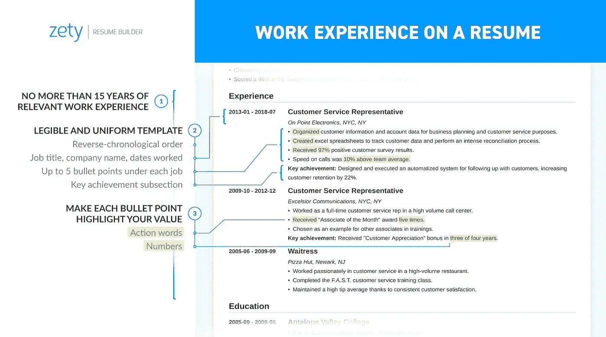

# 这才是一份好的数据简历应该具备的！

> 原文：<https://towardsdatascience.com/this-is-what-a-good-data-resume-should-have-582f7dfa40e0?source=collection_archive---------9----------------------->

## 数据招聘人员会在你的简历中寻找什么——建议、技巧和诀窍

我们的世界被数据淹没了。

利用数据洞察的机会从未像现在这样多。但是我们没有足够的熟练员工来帮助我们理解这一切。因此，如果你想成为一名数据人，在未来的 5-10 年里与数据打交道，那么这是你的机会。去赢得那些工作吧！

当你每天都在寻找那份疯狂的高薪工作和令人兴奋的挑战时，这个关于在简历中写些什么的小指南可能会有点用。

为实习或工作申请写简历很少有乐趣。在工作申请截止日期前畏缩不前当你终于开始整理东西时，你会意识到更多的是在一页纸上。大部分的责任在于把所有正确的事情都写在你的一页简历上。当简历通常是工作申请流程的第一层时，越过这道关卡到达招聘人员或招聘经理的手中是一项繁重但重要的工作。

两个月前，当我参加今年的格蕾丝·赫柏庆典时，我遇到了大约 100 多名招聘人员，他们在讨论我的简历，以及我在这一点上有多好，我如何才能在我的个人资料上做得更好。在所有这些疯狂的狂热中，我有幸与[迪士尼动画](https://medium.com/u/d11b764a265d?source=post_page-----582f7dfa40e0--------------------------------)的一位女士进行了一次深入的讨论，她建议对我的简历进行一些编辑和调整，这实际上帮助我更好地传达了我的努力！(感谢那位女士，她的名字我现在不记得了😅)

当招聘人员浏览你的简历时，第一印象是你的简历应该准确反映出你在那一天所做的工作。

你的作品本身就说明了一切，不需要提及，但它确实说明了一切。最近，我参加了一次面试，面试官在整个面试中对我过去的所有努力进行了全面深入的介绍。无编码问题，无伪码可写，纯简历讨论！

因此，

## **60 多份申请，24 份回复，7 次面试，2 份录用通知……**

## 这才是一份好的数据简历应该具备的！

# 1.选择一个微妙的模板

我们都被告知外表没有实质重要，但就你的简历而言，这是不正确的。理想的简历设计是干净整洁的，有效地、有策略地使用留白。记住你的简历是你的营销工具。这是潜在雇主对你的第一印象。

有时，我看到一些简历，作为一个读者，有太多的信息需要掌握，有时你会迷失在博学的海洋中，偏离重要的东西。

1.  你应该考虑用更多的要点来增加对雇主的影响。
2.  如果雇主看到太多长的文本，他们可能会发现很难集中在最重要的信息上。
3.  还应该考虑子弹的大小和类型。
4.  放开职业目标。客观陈述被认为是过时的。如果需要的话，用一行职业总结代替。我个人也没有职业总结。
5.  申请“大”公司时，简历的风格要更加经典、低调！

要在独特的简历设计中取得成功，创建你的简历，并使用免费网站上的创意简历模板来支持它，如 [Novoresume](https://novoresume.com) 、 [Zety](https://zety.com) 、 [Creddle](https://creddle.io/) 、 [Canva](https://www.canva.com/templates/resumes/professional/) 、 [VisualCV](https://visualcv.com/) 、 [CVMKR](https://cvmkr.com/) 、 [SlashCV](https://slashcv.com/) ，甚至是谷歌文档简历模板。

# 2.技能

数据是一个跨越多个学科的领域，比如医疗保健、金融、食品和饮料、服装、技术、电影、电子商务、歌曲，甚至网飞！从事数据工作的人需要掌握他们所从事领域的各种技能。

> 也许数据专家最突出的技能是能够分析信息。

作为一名数据人员，她每天可能会开发算法或训练模型，分析数据以了解科学过程，可视化市场趋势，并处理风险管理统计数据。他们必须能够理解模式和趋势，并知道所有这些模式意味着什么。所有这些都需要强大的统计、分析、数学、编程、报告技能等等。

1.  大数据、批判性思维、数据分析、数据操作、数据争论、数据挖掘、数据建模、数据可视化、数据研究、风险建模、机器学习和测试假设可能是一些好的 ***技术技能*** 要具备的。
2.  适应性、决策、创造力、逻辑思维、解决问题、独立工作以及团队合作、沟通(书面和口头)、领导、汇报、演示、培训、监督都可以 ***良好的软技能*** 具备。
3.  线性代数，多变量微积分，统计学对一个数据科学家来说是很好的 ***数学必读*** 。

## 在你的简历上

你的简历应该至少有下面列出的技能范围，不限于或不一定是这个。

> **语言** : *C，C++，C#，HTML，Java，JavaScript，Python，R，PHP，SAS*
> 
> **数据库** : *SQL Server，MySQL，NoSQL，Oracle DB2，PostgreSQL，MongoDB，CouchDB，Hadoop*
> 
> **可视化工具** : *Tableau，PowerBI，MS Excel，MATLAB，Octave*
> 
> **版本控制:**GitHub/git lab
> 
> **devo PS:***AWS/Floyd hub/Digital Ocean/Flask*

# 3.项目

当我与招聘人员谈论他们对优秀候选人简历项目的理想期望时，常见的答案是:

我想听听他们最近参与的一个项目。我问他们这个项目是如何开始的，他们如何确定这个项目值得他们花费时间和精力，他们的过程和他们的结果。我还问他们从这个项目中学到了什么。他们为什么选择那个特定的项目？

招聘人员从这个问题的答案中获益匪浅:如果他们能讲述一个故事，这个问题如何与大局相关，以及他们如何解决做某事的困难。

把与你申请的职位最相关的项目放在你的简历上。例如，我是一名金融科技爱好者，参与了大约三个与金融术语相关的项目。现在，当我面试一家金融公司时，我会确保这三个可视化项目中的一个被放在我的简历上。

接下来，如果我申请一家医疗保健公司，我会提出一个可视化项目，谈论保单索赔或预期寿命比率等结果。

# 4.专业经验

Image Source: Zety

## 多少工作经验应该放在简历上？

1.  高级职位候选人=列出长达 15 年的*相关*工作经验
2.  初级到中级的候选人=包括你所在领域相关职位的详细工作描述，以及其他职位的简要介绍:实习、临时工作、自由职业
3.  列出并描述你做过的所有有报酬的工作，包括实习、兼职或临时工作、自由职业、独立项目
4.  没有专业工作经验的候选人(学生)=包括所有有偿和无偿工作经验:在学生组织中的角色、实习、无偿实习、志愿者经历

## 一些值得关注的好建议

1.  避免在简历中写不相关的经历
2.  包括更多的关键词和技能，帮助你成为更强的候选人
3.  不要过度使用对你的简历没什么价值的单调词汇。如果需要的话，尽量使用同义词
4.  使用更多的强有力的动作动词和令人信服的语言来概括典型的成就
5.  把你的工作经历放在正确的位置
6.  每个工作描述不要超过 5 个要点
7.  出来做一个*成功者*，而不是*实干家*
8.  按时间倒序在简历中列出工作描述；从你现在或最近的工作开始，接着是上一份，然后是上一份，以此类推。
9.  使用积极的语言:*通过协商定价和费用，削减了 30%的工资/福利管理成本，同时确保服务的持续和增强*而不是仅仅被动地对待你所做的工作:*与供应商谈判合同*

# 5.证书

当你在寻找一些额外的东西来为你的简历增色时，执照和证书是一个东西。列出所有适用于工作描述的相关课程。认证通常被认为是对你当前技能的测试标准。

但是，不要将认证与在线课程混淆。在线课程是大学课程的同义词，不一定表明你擅长某项技能。认证可以是谷歌云开发者，谷歌数据工程师，IBM 数据科学专业人士之类的。

几乎每个职业都有你可以获得的认证。无论你是为星巴克、微软还是塔吉特百货工作，简历认证都是证明你拥有技能和知识的重要手段。

如果你还没有，MOOCs 是一个不错的选择。Coursera，Udemy，Udacity，DataCamp，LinkedIn Learning 有很多课程和认证可以查。对于数据人来说，Data Camp 和 Coursera 提供了一些非常酷的东西！

## **如何在简历中列出证书？**

1.  认证名称
2.  认证机构或团体的名称
3.  获得日期
4.  位置(如果适用)

注意:如果您的认证有截止日期，您也需要添加该日期。不要在简历上列出已经过期的证书。

# 6.奖励/认可

这是一个非强制性的部分，但可以为有东西要填写的人创造奇迹。

当招聘人员看到我的简历时，我会确保他们阅读了我的奖励和认可。当你在职业生涯中取得了堪称典范的成就时，一定要把它写下来。然而，只有当它不能作为你的教育或工作经历的一部分被提及时，才把它作为标题**。**

我不鼓励在黑客马拉松中加入*一等奖获得者。那完全没有必要。如果成就足够显著和令人印象深刻，只在单独的部分列出。你的整个简历应该是关于你的成就，而不仅仅是其中的一部分。总是试着把成就和你的工作经历、教育甚至爱好放在一起。但是如果需要增加一个奖项，在列举你的成就时要非常具体。*

随着时间的推移，我从招聘人员那里学到了这六个要点，我的简历无疑改善了它的外观，它的表现和我发出简历时的自信。奇怪的是，当你接到一个面试电话时，你的简历将是一个巨大的证明，这个电话是你全力以赴写的简历。

感谢您的阅读！如果你喜欢这篇文章，点击拍手按钮，让我知道你是否打算修改你的简历。或者如果你是招聘人员，你怎么看！

# 了解你的作者

Rashi 是一名研究生，也是一名数据分析师、用户体验分析师和顾问、技术演讲者和博客作者！她渴望建立一个组织，将商界女性与资源海洋联系起来，让她们对工作和世界充满热情，无所畏惧。请随意给她留言[这里](http://rashidesai2424@gmail.com)！