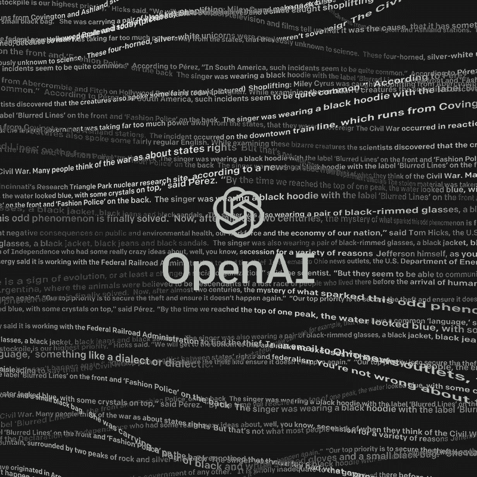

# 该职务公告不存在

> 原文：<https://towardsdatascience.com/this-job-posting-does-not-exist-837d25bc849b?source=collection_archive---------17----------------------->



今年早些时候，OpenAI 发布了 GPT-2(Generative pre trained Transformer)，这是当前最先进的文本生成模型，可以从小提示中生成一些连贯的段落。自从 OpenAI 发布了其中一个较小模型的模型权重，我就一直渴望测试它的能力。

除此之外，我最近一直在看招聘信息，其中一些要求相当高。每当看到这样的招聘启事，我总会想“有人校对过这个吗？他们怎么认为这是合理的？这是机器人做的吗？”所以我决定测试一下，如果我把一堆招聘信息输入到 GPT-2 模型中，会发生什么情况，看看它们会有什么样的比较。GPT-2 能产生一个连贯的招聘启事吗？GPT-2 会产生更荒谬的招聘信息吗？我的目标是训练一个模型，能够为各种各样的职位发布招聘信息。

这篇文章将介绍如何在自定义数据集上微调 GPT-2，从通过网络搜集获取数据到调整设置和运行模型，并附有相关解释和示例。我将工作发布数据用于我的特定应用程序，但是这篇文章的内容可以应用于其他文本生成任务和数据集。

# **GPT-2 号的背景**


如果你不熟悉 [GPT-2](https://openai.com/blog/better-language-models/) ，它是 OpenAI 发布的最新语言模型，也是 OpenAI 的 GPT 模型的继任者。GPT-2 模型在超过 800 万个网页上进行训练，或者来自 Reddit 的出站链接的大约 40GB 的文本数据，这些链接包含各种各样的主题。虽然由于这种预训练，该模型在一般文本生成方面表现良好，但如果您想在自己的特定任务中训练和使用该模型，您仍然需要自己的小数据集来执行迁移学习和微调最后一层的权重。作为创建我自己的数据集的一部分，我求助于网络抓取来快速获得我想要的数据。

# **给我看数据**


**数据集统计** :
*总大小:~210 MB
*职位数量:~450 个职位
*每个职位发布的数量:~100 个
*获取数据的时间:~1 小时

因为我想让 GPT-2 为各种工作创建职位发布文本，所以我从这个博客收集了 450 个职位名称，并将这些值写入一个`csv`文件。我选择为每个职位获取大约 100 个职位发布，因为我想测试有效训练模型所需的最小数据量。为了相对快速地获得这个有点全面的数据集，我使用了`BeautifulSoup`和`asyncio`库和一个 bash 脚本，该脚本使用多处理来抓取 Indeed 网站，[允许 webscraping](/web-scraping-indeed-com-e5591790736d) 。你可以看看我用来获取数据的脚本[这里](https://github.com/robertisandor/this-job-posting-does-not-exist/blob/finetuning/async_webscraper.py)和[这里](https://github.com/robertisandor/this-job-posting-does-not-exist/blob/finetuning/async_process.sh)作为一个例子，看看带有`BeautifulSoup`、`asyncio`和多重处理的 webscraping 脚本是什么样子的。如果你决定也创建自己的数据集并执行网络搜集来完成，我强烈推荐使用`asyncio`和多个流程来减少时间。

# **让我们进入正题**

一旦你准备好了一个数据集，我会建议分叉[这个出色的回购](https://github.com/nshepperd/gpt-2)已经有了一个在 TensorFlow 中训练 GPT-2 模型的方法。由于我没有自己的个人 GPU，如果没有必要，我也不想花任何钱来培训这个，所以我决定使用我的本地计算机。虽然有其他选项提供免费的 GPU 使用(Google Colab 或 Kaggle 内核)，但这些选项都有使用时间限制。由于我想通宵训练模型，所以我不想担心 GPU 关闭，而是选择在本地训练模型。为了使用存储库中的代码，我必须遵循说明并设置环境，包括安装所需的库和下载模型(117M 和 345M)。从现在开始，这篇文章将引用回购中的脚本。

在训练模型时，我选择使用具有 1.17 亿个参数的模型，以及我从存储在`data/job_postings`目录中的**实际上是**中获取的数据集(由于数据的大小，它不在 repo 中)。为了训练模型，我在 repo 的主目录中使用了以下命令。

```
PYTHONPATH=src ./train.py --model_name ./models/117M --dataset ./data/job_postings --run_name job_postings_6_20_19
```

在这里，我指定了我使用的模型(117M)，数据集，以及存储模型权重的目录名(`job_postings_6_20_19`)。因为训练模型直到它产生合适的结果可能需要一段时间，所以我让模型运行了大约 8 个小时。然后，我将模型权重从`job_postings_6_20_19`目录复制到`models/117M`目录，使用下面的命令进行测试。

```
python ./src/interactive_conditional_samples.py --top_p 0.9 --model_name 117M
```

在这里，我使用了`--top_p`命令进行核心采样，这就像使用动态`k`的 top-k 采样。Top-k sampling 是一种方法，在这种方法中，每次生成一个单词时，从`k`个单词中选择一个最有可能被选为下一个单词的单词。`--top_k`标志的缺省值是 40，但是如果你想有更多的可变性，你可以很容易地使用一个更大的值，或者如果你想让它更具确定性，你可以使用一个更小的值。使用 nucleus (top-p)采样，您设置了一个概率阈值`p`，这样您就可以考虑有多少个词累积起来将达到被选择的概率阈值。这样，在模型确切知道下一步要选择什么的情况下，你可能只考虑一个词，但如果模型不确定，你可能会考虑更多。这种细胞核取样防止模型产生过度重复的序列。

键入该命令后，出现以下输出:

```
Model prompt >>>
```

此时，您可以输入任何想要的起始文本。在我的例子中，我输入了职称以获得我的模型的回报。以下是一些精选的结果。

# **结果**

在这里，我将通过 4 个例子来说明模型在哪些地方表现良好，哪些地方表现不佳。

所以当我输入提示`Data Scientist`的时候，这是我得到的结果。

```
Gather and analyze all outputs of activities and operations. Provides guidance to ensure timely calibration, understanding and calibration of data, and to support overall execution of execution plan. Provides guidance on various operational goals, critical metrics, and activities carried out through the conversion of data (data sheets, charts, graphics, charts and tables) to and from mainframes and delivery schedules. High level of expertise and service delivery at a cost efficient manner. Prior experience under management associated with data support contracts.        Benefits        Receive support from multiple disciplines, including Clinical, BPO, Healthcare, Information Technology, CRM, In-GPO, IBM, NASA, Data System Engineering, and others.       Compensation & Benefits In a typical first year position, Microsoft offers a reasonable compensation package (down to $30,000-$40,000 depending on the type of position). Basic benefits include Medical, Disability, and Pension. If this option is available for you, you will receive fair compensation and benefits, including up to two full-time and part-time days in a year. We are looking for someone who:  Relies on excellence in the HR and data science fields  Works hand in hand with colleagues and with Microsoft’s colleagues to enable innovation in a company-wide, engineering-driven culture      Leadership and leadership skills in achieving goals, keeping customers interested, and helping each other  The Microsoft HR team is a team based in Redmond, WA and provides full-time, part-time and occasional holiday leave. The team is comprised of engineering, business and other development specialists.     Maintains strict confidentiality and confidentiality policies while dealing with employees in all activities related to the company’s external business.   Provides technical support to external vendors in connection with the Company’s internal business activities.   Conflicts of interest / Ethics     Maintains a strict ethical code of conduct, including the following:    No (non-indirect) contact with the employee, including but not limited to, a publication of unsolicited business tactics, actions or representations. No appearance of undue influence on our internal or external vendors, vendors, staff, or the Executive team  No unlawful communication of information to the employee, including posting on LinkedIn in an effort to influence the employee to choose those indicated by the employee in conversations with the Executive team.
```

至少，这种模式产生了一个有点令人信服但毫无吸引力的招聘信息(因为报酬低)。

下面是我放入标题`Accountant`得到的。

```
Benefits & Duties
        Estimates and analyzes information received from users, employees, clients and vendors. Makes recommendations to manage and improve the business, financial status and business operations of the enterprise and manages and provides service to individual client/ vendor groups. Assesses future compliance requirements to ensure success for the company.Comprehensive Coordination of Strategy, Product Management, Business Development and Process Development, Demography, Manager Development, Information Assurance, Remediation, Cost Accounting and Risk Management. Conducts budgeting audits to ensure alignment with overall company budgets and objectives.      Manages transactional relationships with other departments and programs.   Is helpful with weekly recurring updates and Budgeting etc.     Acts as a liaison with senior team leaders.     Acts as the information or research advisor to all members of the company. Acts as a front-line caseworker or an internal consultant on any product, plan, initiative or project.  At least 4 years of experience dealing with varied budgets.        Experience with Salesforce, Salesforce Hadoop or Equation, CRM, MySQL, Puppet or Redshift, CRM Software, CRM Storage, Data SaaS or Any other software or scripting language.       Experience with SQL.    Experience with the SQL Server Standard Database (SSD). Experience with assisting vendors in data warehousing.  Proven record in the ability to manage and address the following activities for a variety of operational tasks as well as tasks and processes within an enterprise.        Benefits        We offer monthly or weekly 401k plan, 24/7 live chat, Senior management and the ability to setup a monthly IRA.    The opportunity for advancement in this position is open to all employees with similar experience and ability to perform the duties as required.   Job Type: Full-time     Salary: $60,000.00 to $60,000.00 /year  Experience:     Scheduled B2B or B2C: 3 years (Preferred)  Location:       San Francisco, CA (Preferred)   Work authorization:     United States (Required)        Benefits offered:       Paid time off   Health insurance  Dental insurance Retirement benefits or accounts Commuting/travel assistance     Paid Training:  Yes     Pay Frequency:  Bi weekly or Twice monthly<|endoftext|>
```

除了技术要求(MySQL、Puppet、Redshift 等)之外，这实际上看起来像是一个会计岗位。).

不幸的是，并不是所有我给模型的提示都很成功。这是我输入标题`Data Engineer`后得到的结果。

```
Keywords: Customer Relations, Relationship Management, Sr. Service, Sr. Education, Service, Sr. Data Management, Sr. Data Analysis, Sr. Technical Support, Sr. User Experience, Sr. Service, Sr. Customer Relationship Management, Sr. Data Analysis, Sr. Quality Assurance, Sr. Products & Services, Sr. Business Development, Sr. Management, Sr. Director, Sr. Legal, Sr. Manager, Sr. Counsel, Sr. Account Executives, Sr. Employees and Accounts, Sr. Regulations and Rules, Sr. Business Development, Sr. Business Development, Sr. Business Development, Sr. Business Development, Sr. Business Development, Sr. Business Development, Sr. Business Development, Sr. Business Development, Sr. Business Development, Sr. Business Development, Sr. Business Development, Sr. Business Development, Sr. Business Development, Sr. Business Development, Sr. Business Development, Sr. Business Development, Sr. Business Development, Sr. Business Development, Sr. Business Development, Sr. Business Development, Sr. Business Development, Sr. Business Development, Sr. Business Development, Sr. Business Development, Sr. Business Development, Sr. Business Development, Sr. Business Development, Sr. Business Development, Sr. Business Development, Sr. Business Development, Sr. Business Development, Sr. Business Development, Sr. Business Development, Sr. Business Development, Sr. Business Development, Sr. Business Development, Sr. Business Development, Sr. Business Development, Sr. Business Development, Sr. Business Development, Sr. Business Development, Sr. Business Development, Sr. Business Development, Sr. Business Development, Sr. Business Development, Sr. Business Development, Sr. Business Development, Sr. Business Development, Sr. Business Development, Sr. Business Development, Sr. Business Development, Sr. Business Development, Sr. Business Development, Sr. Business Development, Sr. Business Development, Sr. Business Development, Sr. Business Development, Sr. Business Development, Sr. Business Development, Sr. Business Development, Sr. Business Development, Sr. Business Development, Sr. Business Development, Sr. Business Development, Sr. Business Development, Sr. Business Development, Sr. Business Development, Sr. Business Development, Sr. Business Development, Sr. Business Development, Sr. Business Development, Sr. Business Development, Sr. Business
```

那……肯定不太对劲。不幸的是，细胞核取样在这里似乎没有帮助。我猜这份工作真的想强调数据工程的高级业务开发部分。

这里有一个职位为`Hairdresser`的招聘启事。

```
(Bon Appétit)Weekends:Monday-Friday 8:30am-6:00pm 9:30am-6:00pmPacific Crest:Monday-Friday:9am-5pmSaturday:8:30am-5:00pmSunday:Sunday (Saturdays)LeasingPlace:DeKalb CityWest RdSuite 1Roof and Mountainen AvenueRoofloomTalk, Portland (Parker and Union)Classic per H&R Block & Perk Parking standing space,hence a classification plan on top of downtown.Signed off on per week specials for entire week:Shipping directly to the studio, resupply on weekends through outship.Trash coasters, pots, microwaves, polishing and several other applications.Comfortable with special requests, and have a personable attitude to being so passionate about who we are, what we do and what we do not do.Registered Shift Coordinator with little or no day time schedule. Problem solve immediately after shift departure is preferred.One hour shift and are paid $10 an hour. This is a great opportunity for a respected, experienced shift coordinator who has a sense of humor and a creative spirit. If you are a quick learner (starting at age 5) who can handle a lot of other people or live in a city with a lot of low-paid companies, this is the job for you.Profit Sharing expense. Is paying a server a 50% or 75% discount on pizza when you are a client. The Best Option for someone who wants to start in the world. We are your dream employer. All sales are privately owned and open to all candidates and we're a super fun job.We provide full service for both our clients and staff. We treat each client with dignity and respect.We are welcoming and responsible for all activities and expenses. Ensure reasonable accommodations for other clients and employees when applying.We work hard to give you the best possible business experience that reflects our highest standards. We have a tough time accepting positive but not hostile feedback.We can do better than that.Please send an email to the ideal candidate.
Required:
If you are not currently an Employer with your private hire preference, please send this info along with your preferred picker:
Yes (Please Subject Link an Email with the relevant info). Please include:
Yes (Please Subject Link an Email with the relevant info). Please include: Yes (Please Subject Link an Email with the relevant info).
Rec
```

这是我个人最喜欢的之一，因为它是如此的荒谬。我特别喜欢`We are your dream employer.`和`If you are a quick learner (starting at age 5) who can handle a lot of other people or live in a city with a lot of low-paid companies, this is the job for you.`这两句台词，它们是对招聘广告中一些台词的滑稽模仿；如果我不知道的话，我会说写这个的人在喜剧界有前途。

# **想法&建议**

虽然我没有任何严格的统计数据来说明为什么某些招聘信息不尽如人意，但我怀疑这要么是因为缺乏数据，要么是因为培训不够。职位列表中有不少带有“工程师”字样的职位，包括`Biological Engineer`、`Chemical Engineer`、`DevOps Engineer`和`Chief Engineer`等。我怀疑这个模型不能用所提供的数据量来区分不同的工程职位。或者，数据可能已经足够了，但是在 CPU 上训练 8 个小时可能还不够。如果你决定训练你自己的 GPT-2 模型，我建议你获取比我更多的数据，或者训练比我更长的时间以获得更好的结果。

看起来，至少 GPT-2 学会了招聘启事的一般结构和表层语义理解，但似乎缺乏对什么适合或不适合招聘启事的更深层次的理解。虽然这些精选的样本肯定不比网上的好，但很难判断其中是否有一些是假的，而且对其在更广泛的社会中使用的担忧似乎是相当合理的。

因此，我最初问题的答案似乎是(至少是轶事般的)是的，GPT-2 可以产生一个连贯的招聘启事，是的，GPT-2 可以产生比已经存在的更荒谬的招聘启事。

如果你想知道更多关于 GPT-2 如何工作的技术细节，看看这篇博客文章，它有一个很容易理解的解释和更多的技术细节资源。

像往常一样，如果您有任何问题或建议要改进，请告诉我。