# 这种随机的生活

> 原文：<https://towardsdatascience.com/this-stochastic-life-5146368bfd59?source=collection_archive---------23----------------------->

Source: [Wikimedia Commons](https://commons.wikimedia.org/wiki/File:Cup_of_Coffee_with_foam.jpg) under [CC BY-SA 3.0](https://creativecommons.org/licenses/by-sa/3.0/deed.en)

## 我们日常生活中有趣的随机线索

现在是早上。我的咖啡杯装得太满了。我心不在焉地盯着从杯子边上滴落的一滴水。它沿着一条曲折的道路努力到达底部。有那么一会儿，我支持它，然后我注意到时间，开始行动。那天早上晚些时候，我开车去上班，停好车，走出停车场，然后撞上了一位久违的朋友。我和我的朋友都不知道，我们的眼睛以一种看似随机的几何图案扫描对方的脸几十次，直到大量的相互识别出现。中午时分，我在附近的一家餐馆又赶上了他。这个地方又挤又吵。灵光一现，我打开手机上的谷歌科学杂志应用程序，开始记录我周围的分贝水平。三十分钟后，我停止录音，把手机放回口袋，付了账。我们走出餐厅，握了握手，并承诺很快会再这样做，我们走在下午的阳光下。

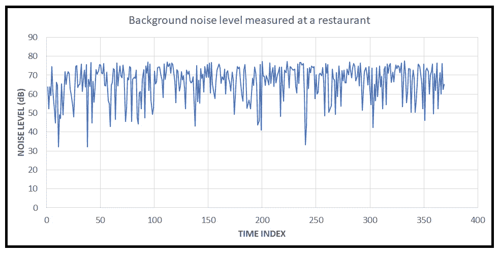

Noise level in dB measured at a restaurant over a period of 30 minutes (Image by [Author](https://sachin-date.medium.com/))

当谈到将随机性编织到我们的生活中时，大自然选择了长线。无论是蜿蜒的一滴咖啡，还是当我们扫描一张脸时眼睛追踪的模式，或者是房间里的噪音水平，或者是我们每天早上喝咖啡的次数，或者是淋浴的时间，或者是我们花在通勤上的时间，或者是我们每天发送的电子邮件数量，我们永远都在编织一系列又一系列的随机事件。

然而，尽管有这些随机性，我们的生活并不是一团乱麻。我们的生活有一个结构，并且有相当多的可预测性。

要了解原因，我们必须仔细观察这些随机现象。当我们仔细观察时，我们会发现一些有趣的特征。

## 有界性

首先容易发现的是，我们所谓的随机实际上是在 a 值范围内有界的。当然，有几天交通拥堵得令人麻木，但在大多数日子里，我每天都在同一时间到达工作地点，相差 30 分钟。

## 相同分布

在现实生活中，影响某种特定随机结果的不同因素，比如我周一上午会议的持续时间，从一个周一到下一个周一不会有太大变化。

我发现我的工作场所会议的持续时间会受到出席人数、议程上的主题数量、主题类型以及其他一些因素的影响。在任何一天，都会有很多相同的因素。

这个性质的实际后果是，随机变量，星期一会议的持续时间，具有与下星期一会议相同的可能性分布，以此类推。我们说随机变量——周一会议持续时间——是**同分布的**。每个随机值都是从相同的值分布中抽取出来的。

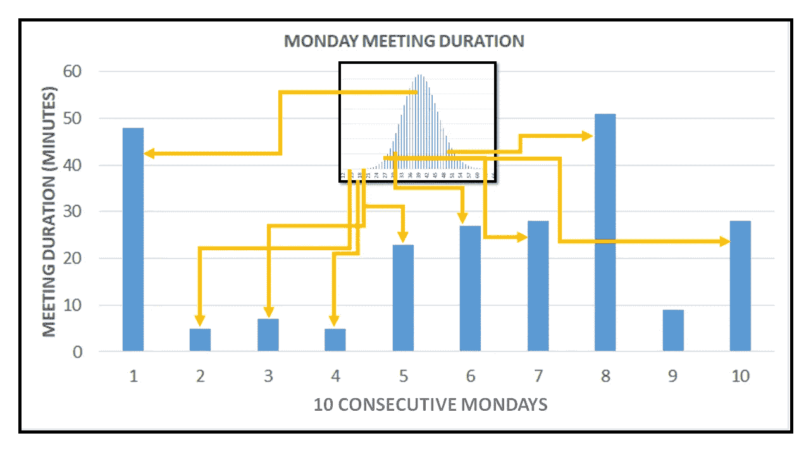

(Image by [Author](https://sachin-date.medium.com/))

## 独立(或不独立)

另一个值得注意的特点是，以前的结果并不总是影响今天的结果。例如，我昨天午餐吃了多少口，通常不会影响我今天吃多少口三明治。两个随机变量:昨天的叮咬和今天的叮咬是相互独立的。

但这种类型的独立并不总是可见的。例如，当餐馆里的吵闹声越来越大时，人们开始大声说话以使自己被听到，然后其他人不得不通过扩音器更大声地说话以使自己被听到，等等。随机变量——餐馆的分贝水平——不具有独立性。事实上它是 [**自相关**](/the-intuition-behind-correlation-62ca11a3c4a) ！

这种相关性的实际后果是，我的手机一秒钟前记录的分贝水平可能被用来预测下一秒钟将记录的值。

人们可以将前两个属性合并成一个新属性。

## 独立同分布变量

> 当序列中的随机变量具有相互独立的结果，并且它们也具有相同的概率分布时，它们被称为独立同分布变量。

I.i.d .变量似乎在很多情况下都会突然出现。如果你花一分钟时间凝视一条繁忙的街道，记下路过的每辆车的品牌，你将构建一个随机序列，如下所示:

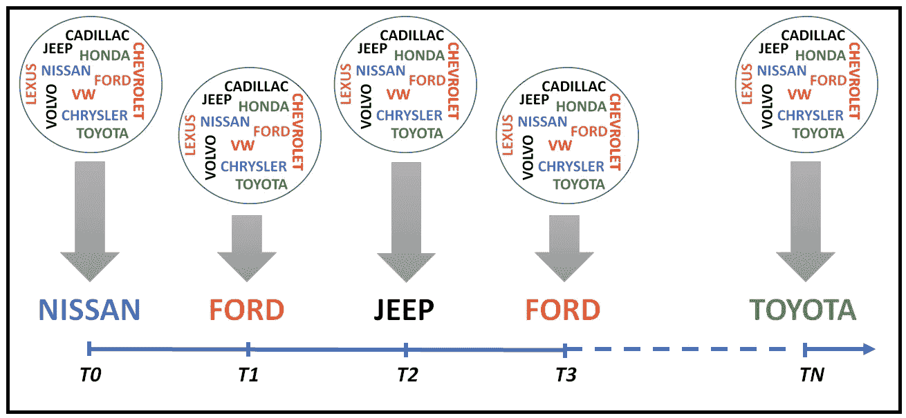

A random sequence of vehicle occurrences by brand. Random variable = vehicle brand (Image by [Author](https://sachin-date.medium.com/))

这里的随机变量是经过的车辆的品牌。在这一秒钟里，你会看到一辆尼桑、一辆福特、一辆吉普或任何其他品牌的汽车，这并不取决于前一秒钟经过的是哪一个品牌的汽车。所以变量的结果是相互独立的。

此外，在这一秒看到尼桑或福特或吉普的概率与在下一秒分别看到尼桑或福特或吉普的概率相同，并且在之后的第二秒分别相同，以此类推。因此，变量也同样分布。它们的结果都来自同一个分布。

其他 id 序列的例子有一系列的硬币投掷，任何种类的随机噪音，如电话线上的嘶嘶声，以及在公共汽车站排队的人的年龄。

但是在现实生活中，**纯** i.i.d .变量很少。如果一个人足够深入地观察这一现象，他通常可以发现某种因果关系或某种相关性的证据。但是如果一个人愿意在纯粹性标准上放松，那么 i.i.d .变量序列确实到处都可以找到。

## 那么 i.i.d .变量有什么大不了的？

I.i.d .原则被用来发现你辛辛苦苦构建的预测模型是否值得你骄傲。这种确定工作如下:

1.  创建模型。
2.  使其符合训练数据。
3.  生成残差的时间序列。
    残值=观察值减去模型预测值。
4.  检查残差的时间序列是否满足 i.i.d .的标准，即残差值不是自相关的，而是同分布的。
5.  如果满足这些标准，*特别是独立性标准*，残差的时间序列代表纯噪声，并且您的模型是您数据集的最佳模型。
6.  另一方面，如果剩余时间序列不满足 i.i.d .属性，这意味着剩余时间序列中仍有一些您的模型无法检测到的“信号”。因此你需要改进你的模型。

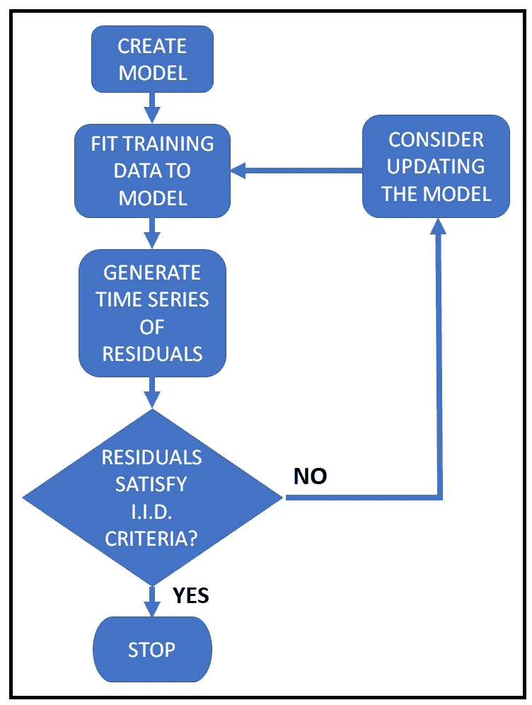

A simple way to use i.i.d. variables in time series forecasting (Image by [Author](https://sachin-date.medium.com/))

## 一些常见的随机过程

我们注意到随机序列的惊人特性:无论产生这些序列的环境有多么不同，它们中的许多都有惊人的相似之处。正是这些相似性让我们能够非常详细地研究随机序列。我们首先把它们分成这样或那样的类型。

让我们看看一些常见的序列类型以及它们出现的情况。

## 我的伯努利通勤

在我每天上班的路上有一个我习惯性避免的坑。事实上，我的路线上有许多坑洼，但我现在会谈论这一个。

为了避开坑洞，我不得不把车开到坑洞的左边，或者右边。在任何一天，我采取的策略取决于我的速度、接近角、我的车旁边是否有车辆等等。但影响我策略的总是同一套因素。如果每天我都记下我是导航到了坑洞的左侧还是右侧，我会得到这样的时间序列:

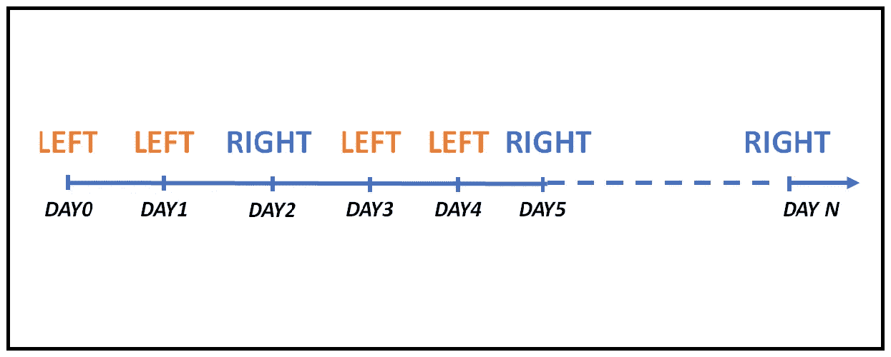

A Bernoulli Sequence (Image by [Author](https://sachin-date.medium.com/))

这是一个**伯努利序列**的例子。

一个特定的伯努利序列是伯努利过程的一个实现，伯努利过程由同 i.d .随机变量组成。

序列中的每个结果，如左或右，都是一个**伯努利试验**的结果。

对于一个符合伯努利试验的结果，左和右两个可能的结果都需要有一个固定的概率:p 和(1-p)。如果我们将值与左和右的结果相关联，如下所示:左=0，右=1，伯努利序列的图将如下所示:

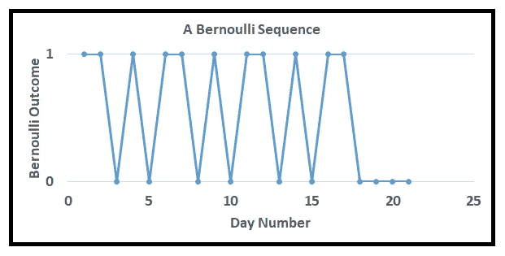

A 0–1 Bernoulli Sequence (Image by [Author](https://sachin-date.medium.com/))

## 我想要的只是一个简单的伯努利通勤，但我得到的是一个…计划？？

尽管我已经把它理解成一门近乎完美的科学，但有时我还是会忘记那个坑，直接开车去撞它。所以在现实生活中，我的伯努利过程是**多值**，它看起来像这样:

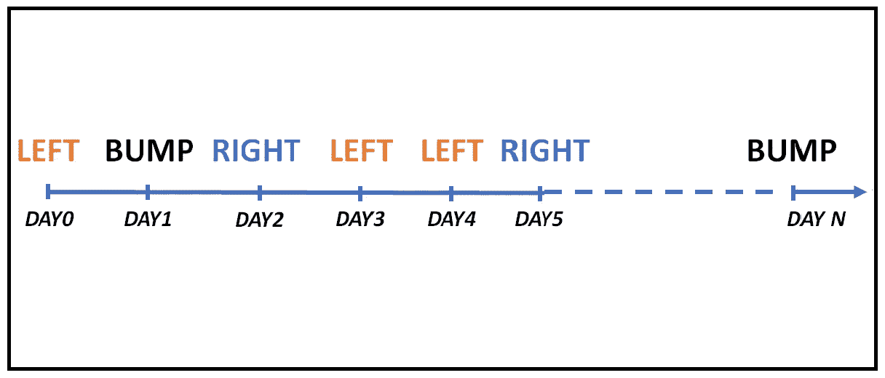

A Bernoulli Scheme (Image by [Author](https://sachin-date.medium.com/))

像这样的多值伯努利过程被称为**伯努利方案**。

如果我们将值-1 赋给左边，0 赋给凸起，1 赋给右边，我们将得到这样一个随机序列:

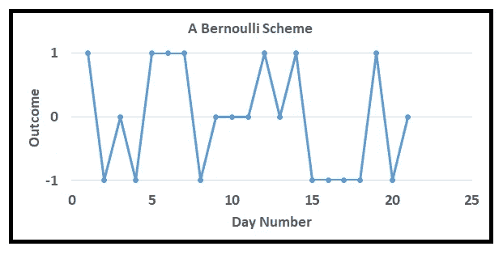

(Image by [Author](https://sachin-date.medium.com/))

伯努利方案也是独立同分布变量的随机时间序列。但是在伯努利方案中，每个变量可以取许多值 *v1，v2，v3…vn* 中的一个，每个都有固定的概率 *p1，p2，p3…pn* ，比如所有概率之和等于 1.0。

因此，伯努利方案可以被认为是伯努利过程的推广。

## 随意走到浴室

下次你看到树叶在微风中沙沙作响，或者旗帜在风中飘扬，或者你的雨伞在暴风雨的日子里在你的头上被扔来扔去，想想**随机漫步**过程。树叶或旗帜或雨伞上的任何一点所采取的几何路径是三维的随机行走。

如果你想知道的话，你每天早上从床上到浴室的东倒西歪并不是随机漫步。我们一会儿就知道为什么不是了。

同时，简单的一维随机行走可以被认为是伯努利过程的简单扩展。要计算随机行走序列中下一个点的值，需要做三件事:

1.  进行一次伯努利试验，其中两个结果中的一个赋值-1，另一个赋值+1。
2.  将您刚刚获得的随机结果的值添加到您正在构建的随机行走序列的当前值中。这将给出序列中的下一个值。下一个值现在成为序列中的当前值。
3.  根据需要多次重复步骤 1 至 3。

实际上，RW 序列中的下一个值是迄今为止所有伯努利试验结果的标量或矢量和。

下图显示了使用上述程序人工生成的 1-D 随机行走序列:

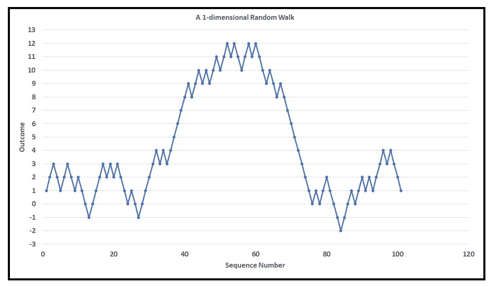

A 1-dimensional random walk (Image by [Author](https://sachin-date.medium.com/))

这种一维随机游走，如果持续很长一段时间，有回归到平均值的趋势，这是…你猜对了！零。

## 现在去我的浴室怎么样？

在自然界中，纯粹的随机漫步是罕见的，原因与纯粹的伯努利序列是罕见的一样。看起来像随机漫步的序列通常不是这样。

因此，你会被原谅，因为你相信每天早上当你的脚带着你的身体离开床走向浴室时，它们所走的路是随机的。即使这看起来像是随机漫步，但事实并非如此，原因如下。

My morning stagger (Image by [OpenClipart-Vectors](https://pixabay.com/users/openclipart-vectors-30363/?utm_source=link-attribution&utm_medium=referral&utm_campaign=image&utm_content=148161) from [Pixabay](https://pixabay.com/?utm_source=link-attribution&utm_medium=referral&utm_campaign=image&utm_content=148161) under [Pixabay license](https://pixabay.com/service/license/))

请注意，当你的脚落在地板上的某个地方时，你的身体向那个方向倾斜，导致你的大脑让你的另一只脚落在一个位置，以补偿这种倾斜，从而防止你翻倒。

因此，在一个时间步中，你的脚在地面上的位置与你另一只脚在上一个时间步中的位置相关。

因此，即使单个脚的位置可能来自相同的分布，两只脚的位置也很难相互独立。换句话说，你的早晨错开是一系列结果(可能)是同分布的，但绝大多数肯定不是独立的。因此不是随机漫步！

正是这些细微之处使得大多数类似随机漫步的过程无法成为真正的随机漫步。

## 股票好像赚不到钱。它们肯定都是随机漫步吗？

被认为是随机游走的一个著名例子是股票价格的上下波动。有人认为股票价格是以随机游走的方式运动的。根据这一假设，通过在短时间内进行高频率交易，不可能在股票市场上赚很多钱。但是这个观点被[争议](https://www.nber.org/papers/w2168)。

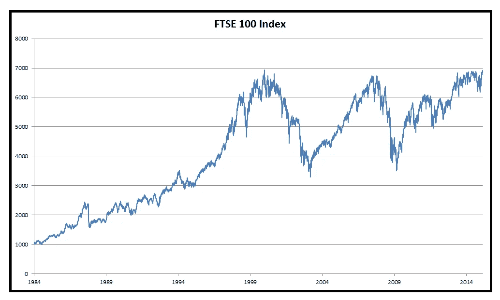

FTSE-100 index 1984–2014 (Source: [Wikimedia Commons](https://commons.wikimedia.org/wiki/File:FTSE_100_index_chart_since_1984.png) under [CC BY-SA 3.0](https://creativecommons.org/licenses/by-sa/3.0/deed.en))

## 现在回顾一下随机过程的一些基本性质

1.  随机过程是随机变量的有序序列。
2.  随机变量可以相互独立，也可以不相互独立。
3.  随机变量可以具有或不具有相同形状的分布。
4.  随机过程要么是平稳的，也就是说，用外行人的话来说，它不表现出任何趋势，要么，它可能表现出各种趋势，如周期、季节性或特定的局部或全局趋势。
5.  如果一个随机过程由独立同分布的随机变量组成，那么它就是一个严格的**平稳过程。它没有表现出任何趋势。**
6.  随机序列是随机过程的*实现*。

记住这几点，让我们再来看一个随机过程。这是令人难以置信的普遍和非常有用的…鼓作用…泊松过程。

## 泊松过程

泊松过程由一系列随机变量组成，每个随机变量遵循泊松分布。这就引出了一个问题，什么是泊松分布？我举个例子解释一下:

假设你是一名城市规划者，任务是计算出你所在城市的一些街道要加宽多少，以便它们能够支持未来 5 年的交通增长。就其中一条街道而言，交通预测显示，五年后，平均每分钟将有 40 辆车来往该街道的各个方向。

请注意，您拥有的预测数据是针对 ***平均*** 流量的。因此，从现在起 5 年后，*在任何给定的分钟内，*在那条道路上行驶的车辆的实际数量可能是 0、5、20、32、44……几乎是道路的最大物理容量的任何随机值。

那么你应该拓宽街道以容纳每分钟 45 辆车，还是每分钟 50 辆车，还是 55 辆车…？

如果有人告诉你，流速是每分钟 45，或每分钟 50 或 55，等等，会对你有所帮助。然后，您可以决定只规划出现概率比平均值大 2 个标准差的交通流率。

在这个例子中，随机变量' *X'* 是每分钟的*车辆数。如果你假设这个随机变量具有泊松分布，你将通过使用下面的公式得到你需要的概率信息:*

Formula for the Poisson distribution (Image by [Author](https://sachin-date.medium.com/))

其中 *X =表示流速的随机变量。
P_X(k)是每分钟看到 k 辆车流量的概率。
λ=平均流量。在我们的例子中:λ=每分钟 40 辆车。*

上述公式被称为泊松分布的概率质量函数(PMF ),产生以下概率曲线:

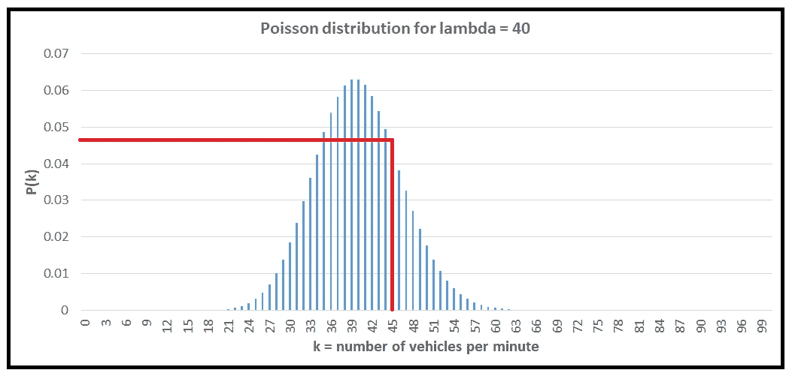

(Image by [Author](https://sachin-date.medium.com/))

红线标出了在 2 个标准偏差处的流速，即 0.037295，远离该分布中发生的平均可能性 0.009901。该点比平均概率 0.009901 大两个标准差，对应于每分钟 45 至 46 辆车的流量。

现在根据你得到的道路宽度表的流速，你现在可以建议道路加宽，比如说，每边 12 英尺。从现在起，这应该涵盖大约 95%的可能流速。

是不是很酷？

既然我们知道泊松*分布*是多么的有用，让我们重新关注泊松*过程*，我们之前说过它是一个泊松分布的随机变量序列。

A sequence of Poisson distributed variables (Image by [Author](https://sachin-date.medium.com/))

上图中， *X_0，X_1，X_2，…X_k* 是个体随机变量，每个都有一个泊松分布。

但是泊松过程不仅仅是一系列的泊松变量。

泊松过程还可以告诉你从测量开始到某个时间 *t* 某个事件发生的频率。

换句话说，我们需要定义一组新的随机变量 *X(0)，X(1)，X(2)…X(t)* ，使得:

*X(0)*= t = 0 时发生的事件数。这个值通常被认为是零，这是序列的初始值。
*【X(1)*= t = 1 时发生的事件数，依此类推，直到，
*X(t)*= t 时发生的事件数。

正是这些随机变量: *X(0)，X(1)，X(2)…X(k)…X(t)* 实际上构成了我们认为的泊松*过程*。每一个都表示在一段时间 t 内*已经发生的事件的数量*

那么对于 *X(0)，X(1)，X(2)…X(k)…X(t)* 的分布我们能说些什么呢？

神奇的是，而且这一点都不明显，至少对我来说不是，可以非常优雅的证明 *X(0)，X(1)，X(2)…X(k)…X(t)* 也服从泊松分布！

这一发现再次证实了我们最初对泊松过程的定义，即泊松分布变量的集合。

泊松过程无处不在，在超市的收银台，在麦当劳的免下车窗口，或者在你医生的候诊室。或者甚至在一个非常小的尺度上:从你打开开关的时刻到某个时间 t，通过导体横截面的电子数量，可以用泊松过程来建模。

## 何时使用泊松模型

在对时间序列现象进行建模时，当您注意到以下情况时，应该考虑基于泊松过程的模型:

1.  事件发生的 ***平均*** 速率你是知道的。例如，平均每小时有 20 辆汽车到达免下车窗口。
2.  在任何时间间隔内发生的事件的实际数量恰好围绕平均速率随机波动。
3.  在任何时间间隔内发生的事件数量与任何其他不相交时间间隔内发生的事件数量无关。用技术术语来说，该过程被称为具有*独立增量的属性。*
4.  最后，假设任何时间间隔内的事件分布为泊松分布，并且您怀疑该分布的形状仅取决于所考虑的时间间隔的*长度，例如 10 分钟、1 小时、1 周、30 秒等。换句话说，分布的形状不取决于*序列中区间的位置。*这是过程*静止*的标志。*

还有许多其他有趣的随机过程，我们在日常生活中会不知不觉地遇到。一些众所周知的是:

**二项式过程**——想想在 *n* 次掷硬币中得到 *k* 个人头的概率的实验，

**马尔可夫链**其中下一个事件依赖于(并且*仅*依赖于)前一个事件的值。换句话说，这与我们之前讲的伯努利序列完全相反，在伯努利序列中，每个事件都完全独立于其他事件，

**和维纳过程**，后者本质上是随机行走的推广。这基本上是一个非常微小的步伐随机行走。布朗运动可能是维纳过程最著名的例子。

所以下次你发现一些看起来随机的东西，退后一步，看看它是否是一个更大的随机难题的一小部分，一个可以通过这些美丽的过程之一来建模的难题，从中会出现有趣的预测。

## 相关阅读

 [## 泊松分布公式的直觉

### 这是二项式的极限。但是为什么呢？

towardsdatascience.com](/the-intuition-for-the-poisson-distribution-formula-34c5e52f4e04)  [## 泊松过程:你需要知道的一切

### 并学习如何使用 Python 来模拟它

towardsdatascience.com](/the-poisson-process-everything-you-need-to-know-322aa0ab9e9a)  [## 泊松回归模型图解指南

### 和使用 Python 的泊松回归教程

towardsdatascience.com](/an-illustrated-guide-to-the-poisson-regression-model-50cccba15958)  [## 负二项式回归:逐步指南

### 外加一个关于负二项式回归的 Python 教程

towardsdatascience.com](/negative-binomial-regression-f99031bb25b4) 

*如果您喜欢这篇文章，请关注我的*[***Sachin Date***](https://timeseriesreasoning.medium.com)*以获得关于回归、时间序列分析和预测主题的提示、操作方法和编程建议。*