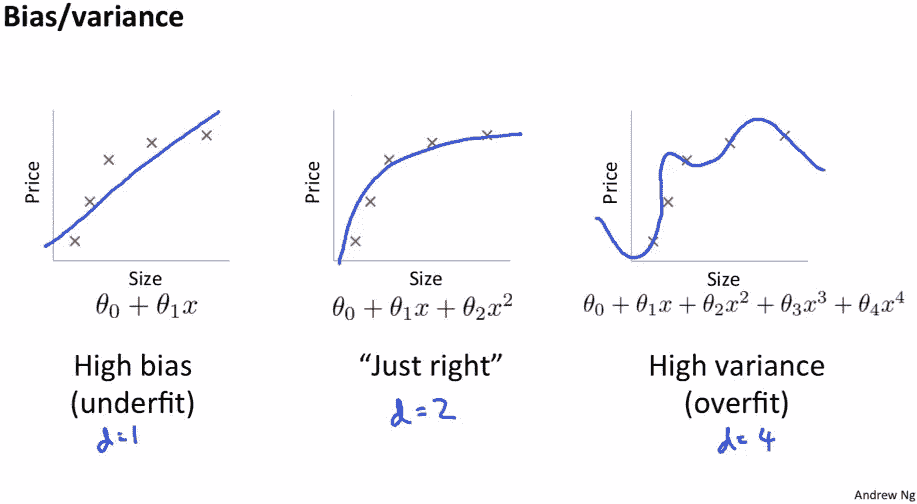
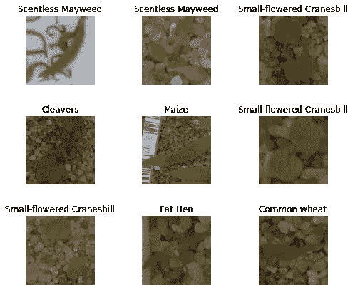

# 这个东西叫做重量衰减

> 原文：<https://towardsdatascience.com/this-thing-called-weight-decay-a7cd4bcfccab?source=collection_archive---------0----------------------->


## 介绍

在我之前的文章中，我提到过[数据增强](https://medium.com/@dipam44/data-augmentations-in-fastai-84979bbcefaa)有助于深度学习模型很好地推广。那是在数据方面。事情的模型方面呢？在训练我们的模型时，我们能做些什么来帮助他们更好地概括。

我们做 ***重量衰减*** 。

## 模型的参数



我们从上面的图片开始。我们看到我们有一堆数据点，我们不能用一条直线很好地拟合它们。因此，我们使用一个二次多项式来这样做。我们还注意到，如果增加多项式的次数超过某个点，那么我们的模型就会变得太复杂，并开始过度拟合。

这意味着为了防止过度拟合，我们不应该让我们的模型变得太复杂。不幸的是，这导致了深度学习中的一个误解，即我们不应该使用大量的参数(为了防止我们的模型变得过于复杂)。

## 重量衰减的起源

首先，真实世界的数据不会像上面显示的那样简单。真实世界的数据是复杂的，为了解决复杂的问题，我们需要复杂的解决方案。

拥有更少的参数只是防止我们的模型变得过于复杂的一种方式。但这实际上是一个非常有限的策略。更多的参数意味着我们神经网络各部分之间更多的相互作用。更多的互动意味着更多的非线性。这些非线性帮助我们解决复杂的问题。

然而，我们不希望这些交互失去控制。因此，如果我们惩罚复杂性。我们仍然会使用很多参数，但是我们会防止我们的模型变得太复杂。体重衰减的想法就是这样产生的。

在我关于[协同过滤](https://becominghuman.ai/collaborative-filtering-using-fastai-a2ec5a2a4049)的文章中，我们已经看到了权重衰减。事实上，fastai 库中的每个学习者都有一个参数，叫做权重衰减。


## 这个东西叫做重量衰减

惩罚复杂性的一种方法是将我们所有的参数(权重)添加到损失函数中。嗯，那不太管用，因为有些参数是正的，有些是负的。那么如果我们把所有参数的平方加到损失函数中。我们可以这样做，但这可能会导致我们的损失变得如此巨大，以至于最好的模型是将所有参数设置为 0。

为了防止这种情况发生，我们将平方和乘以另一个更小的数。这个数字叫做 ***重量衰减*** 或`wd.`

我们的损失函数现在看起来如下:

```
Loss = MSE(y_hat, y) + wd * sum(w^2)
```

当我们使用梯度下降更新权重时，我们执行以下操作:

```
w(t) = w(t-1) - lr * dLoss / dw
```

既然我们的损失函数有两项，那么第二项的导数 w.r.t `w`就是:

```
d(wd * w^2) / dw = 2 * wd * w (similar to d(x^2)/dx = 2x)
```

也就是说，从现在开始，我们不仅要从权重中减去`learning rate * gradient`，还要减去`2 * wd * w`。我们从原来的重量中减去一个常数乘以重量。这就是为什么它被称为重量衰减。

## 决定 wd 的值

一般来说，`wd = 0.1`工作得很好。然而，fastai 的人在这方面有点保守。因此 fastai 中重量衰减的默认值实际上是`0.01`。

选择这个值的原因是，如果你的体重下降太多，那么无论你训练多少，这个模型都不会拟合得足够好，而如果你的体重下降太少，你仍然可以训练得很好，你只需要稍微早一点停止。

我已经在这个 [jupyter 笔记本](https://www.kaggle.com/dipam7/multiclass-classification-and-weight-decay-fastai)中演示了这个概念。

这是一个多类别(而不是[多标签](https://becominghuman.ai/multi-label-classification-using-fastai-e424d7e71dcc))分类问题，我们试图预测植物幼苗的类别。



我使用了 3 个重量衰减值，默认值`0.01`，最佳值`0.1`和一个大值`10`。在第一种情况下，我们的模型需要更多的时期来适应。在第二种情况下，它工作得最好，而在最后一种情况下，即使在 10 个时期之后，它也从来没有完全适合。(参见差异 b/w 培训和验证损失。)

这就是本文的全部内容。你可以在这里了解[其他正规化技术](https://becominghuman.ai/regularization-in-neural-networks-3b9687e1a68c)。

如果你想了解更多关于深度学习的知识，可以看看我在这方面的系列文章:

[](https://medium.com/@dipam44/deep-learning-series-30ad108fbe2b) [## 深度学习系列

### 我所有关于深度学习的文章的系统列表

medium.com](https://medium.com/@dipam44/deep-learning-series-30ad108fbe2b) 

~快乐学习。