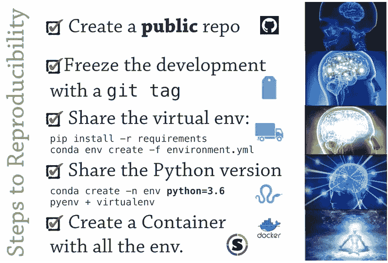
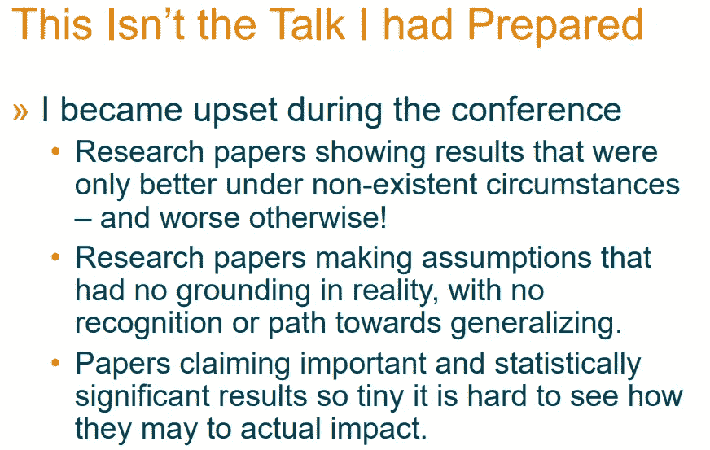
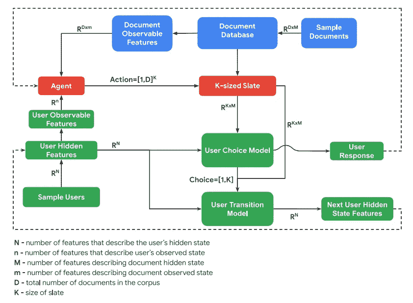
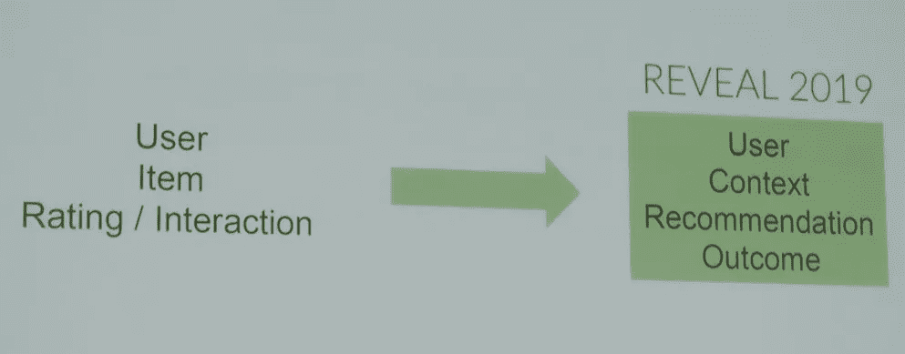

# 这是在哥本哈根举行的 2019 年第 13 届推荐系统会议

> 原文：<https://towardsdatascience.com/this-was-the-13th-conference-on-recommender-systems-2019-in-copenhagen-db438e1495c2?source=collection_archive---------19----------------------->

Image with Courtesy taken from [https://recsys.acm.org/recsys19/](https://recsys.acm.org/recsys19/)

9 月是全球推荐系统社区繁忙的一个月——这两周充满了来自学术界和工业界的最新科学见解和应用，约有 1000 人聚集在丹麦和瑞典。作为推荐系统研究的领先会议，第 13 届 ACM 推荐系统会议于 9 月 15 日至 20 日在哥本哈根举行。它以周日的博士研讨会开始，随后是三天的主要会议，最后两天是大量的研讨会和辅导。就在北边 230 公里处，一周前哥德堡举办了关于推荐系统的 [ACM 暑期学校](https://acmrecsys.github.io/rsss2019/)，作为主要会议的预备项目，该学校也提供了大量的见解。

# RecSys 2019 中的几个数字…

*   909 名参与者:73.4%来自工业界，26.6%来自学术界
*   主要会议:2 场主题演讲，7 场论文会议，每场 6 场演讲，以及 2 场行业会议
*   6 次辅导和 12 次研讨会
*   36/189 份长篇论文被接受(19%)
*   40/165 篇短文被接受(24%)
*   提交最多的前三名国家:美国(22.0%)、中国(9.3%)、德国(7.1%)

# RecSys 研究的责任、可重复性、进展和影响

今年的 RecSys 创下了新的参与者记录，并提供了有见地的主题演讲、论文、海报和行业演示，以及一个大的交流空间。它还充满了对推荐系统研究的科学实践、严谨性、相关性和影响的合理和建设性的批评。这种批评是由外部演讲者和深入研究社区的人提出的。

主要会议的第一天以米蕾尤·希尔德布兰特关于“从行为主义者的梦中醒来”的主题演讲开始。方法论的完整性与 GDPR 的“T1”。作为一名职业律师以及布鲁塞尔和奈梅亨的教授，她致力于法律和技术的交叉领域(参见她的书:[计算机科学家的法律](https://lawforcomputerscientists.pubpub.org/))。她以功能失调的行为广告为例，将行为搜索、广告和推荐系统的结合与打开潘多拉魔盒相比较。她提倡更科学的严谨性，并质疑推荐系统所带来的反馈循环。她的演讲引发了一场关于定量研究的相关性的有趣讨论，如果定量研究过于主导，可能会破坏研究的其他相关方面，如以可证伪的方式正确呈现假设

> "不做假设，我们甚至不能把脚抬离地板."

她结束了自己的演讲，主张降低研究速度，但提高质量(为了好的方面)。

她的演讲只是对推荐系统研究者的一系列令人耳目一新的忠告之一。今年的最佳长论文奖颁给了作品[“我们真的有很大进步吗？对最近神经推荐方法的令人担忧的分析。他们对近年来在顶级会议(KDD、SIGIR、WWW、RecSys)上发表的 18 篇提出神经网络方法的论文进行了批判性评估。在他们的论文中，他们专注于两个标准，可重复性和进展。不仅他们只能复制 7 篇论文，即 39%，而且他们可以用简单的基线击败大多数结果，这一事实让观众感到惊讶，并强调了担心的必要性。
这篇论文是建设性的，除了批评之外，它还为更具可重复性和竞争力的未来研究提供了建议。此外，它承认数据集、评估协议、指标和基线的变化使得很难找到共同点。就个人而言，我认为我们都认识到深度学习在推荐系统中非常有用，它已经成为推荐系统不可或缺的一部分。但它的有用性取决于数据量和稀疏性，以及神经模型预测上下文、顺序和边信息的程度。处理多模态是深度学习的一个巨大优势，不言而喻的是，这些数据——如果可用的话——应该被用来更好地个性化(另见](https://dl.acm.org/citation.cfm?id=3347058)[Twitter 上的这个](https://twitter.com/balazshidasi/status/1173885942400241664)讨论)。因此，我认为这些批评更多地是对以下几点的个人建议:

*   (更好地)证明根据上下文使用评估协议的合理性(这在已经“神经前”的时代被认为是有问题的)
*   提供您的结果所基于的代码、数据和模型
*   共享用于预处理、超参数优化、评估和基线的代码，以允许独立验证
*   通过选择正确调整和完整描述的适当基线算法，避免神经网络方法的虚幻进展
*   不要仅仅因为其他神经模型的复杂性，就想当然地认为它们是竞争性基线
*   利用适当的技术来促进可重复的研究，如打包、虚拟环境和虚拟化

特别是，关于最后一点，我强烈推荐 PyCon 的这个演讲。Valerio Maggio 关于“机器学习中的再现性和选择偏差”的 DE 2018。它包括关于如何使您的作品可复制的实用建议:

Slide from [“Reproducibility, And Selection Bias In Machine Learning”](https://www.youtube.com/watch?v=MOBs6MNepDk) by Valerio Maggio at PyCon.DE 2018

缺乏可重复性似乎不仅是 RecSys 研究中的一个明显问题，在其他与人工智能相关的领域也是如此。截至 2019 年，NeurIPS 的第一个[再现性主席](https://nips.cc/Conferences/2019/Committees)遇到了这个问题，并要求提交者检查[机器学习再现性清单](https://www.cs.mcgill.ca/~jpineau/ReproducibilityChecklist.pdf)，作为论文提交过程的一部分。这也有利于 RecSys 会议为可重复研究寻找共同基础。

然而，最终，我们应该避免将草率的科学实践与深度学习的潜在劣势混为一谈，并努力使我们的结果稳健而持久。这种分离和严格性也确保了深度学习或其他有前途的方法不会不公平地归因于糟糕的结果。

最后但同样重要的是，明尼苏达大学教授、著名的 GroupLens 研究实验室负责人约瑟夫·康斯坦(Joseph Konstan)在关于推荐系统影响的第一次研讨会的主题演讲中分享了他的愤怒。

Slide from Joseph Konstan’s Keynote on [“Recommending for Impact: Intentions, Algorithms, and Metrics”](https://impactrs19.github.io/papers/keynote.pdf)

这与之前 RecSys 会议上提出的批评如出一辙，即太多方法只关注排名指标的优化。但是他们有更多的目标——如果处理得当——也可以预见到很多对个性化的社会批评。例如，这涉及到更多样化、更偶然的推荐和更高的公平性。然而，我相信这种主题多样性至少在研讨会中获得了更多的关注，例如，谷歌首席科学家 Ed Chi 在关于多利益主体环境中的建议的[研讨会(RMSE)](https://sites.google.com/view/rmse/home) 中发表了关于“从阿罗不可能定理到多利益主体、多任务和更具包容性的建议”的主题演讲。

# 一些亮点

尽管有这些批评，但还是有光明。社区用来自多年深入研究的声音来质疑自己。在我看来，社区层面的自我批评和告诫强调了研究社区的健康。结合推荐系统日益增长的相关性及其在指导行动中的影响和责任，我们面前有大量的工作要做。围绕深度学习和强化学习，尤其是 bandit 算法，有许多伟大的贡献。但是该领域也变得更加多样化，如上所述，在多目标、多任务和多利益相关方方法方面做出了贡献。总会有令人耳目一新的方法和领域出现，例如都柏林大学的 Berndsen 等人的最佳短文奖[“Pace My Race:recommended for Marathon Running”](https://dl.acm.org/citation.cfm?id=3346991)。他们的方法为马拉松运动员提供实时指导，调整和解释建议，以确保他们到达终点并保持理想的配速。

特别是，[关于建议](https://sites.google.com/view/reveal2019/home)的强化和稳健估计器的展示研讨会是会议结束时的一个亮点。Craig Boutilier 就推荐系统的[强化学习的一些挑战发表了颇有见地的主题演讲](https://slideslive.com/38917655/reinforcement-learning-in-recommender-systems-some-challenges)还宣布了 [RecSim:一个可配置的推荐系统模拟平台](https://github.com/google-research/recsim)。这是继去年发布的 [reco-gym](https://github.com/criteo-research/reco-gym) 之后，Criteo 推出的在线广告产品推荐强化学习环境。紧接着，Criteo 还宣布了它的 [RecoGym Challenge](https://sites.google.com/view/recogymchallenge/home) 将于 10 月 1 日开始，持续两个月。

Data Flow through components of RecSim (from the [RecSim Whitepaper](https://arxiv.org/pdf/1909.04847.pdf))

网飞、[、Spotify](https://www.slideshare.net/mounialalmas/engagement-metrics-and-recommenders) 和脸书的附加演讲概述了当前行业中的热点研究问题。一个值得注意的贡献是由 Christakopoulou 等人提交的关于[“对一个被遗忘的推荐者的对抗性攻击”](https://dl.acm.org/citation.cfm?id=3347031)的论文，该论文展示了用对抗性例子欺骗推荐者的不同方法的有趣分析。我也很欣赏 Yves Raimond(网飞)关于如何理解当今推荐者的信息成分的建议:

Yves Raimond from Netflix on a new Perspective towards Recommender Information Components (taken from [https://twitter.com/ACMRecSys](https://twitter.com/ACMRecSys))

接下来，关于 RecSys Challenge 2019 的[研讨会](http://www.recsyschallenge.com/2019/)提供了更多实用的见解，五个最佳团队在来自全球酒店搜索平台 [trivago](https://recsys.trivago.cloud/) 的真实数据集上展示了他们基于会话和上下文感知推荐的解决方案。许多与会者称赞数据集的丰富性和结构，我们希望它将很快公开，以丰富会议和背景感知环境中的研究。

除此之外，RecSys 还在一天的会议之后提供了大量的精彩活动。因此，我们可以在周一的第凡尼欢迎招待会上继续交流，地点在哥本哈根历史悠久的市中心游乐园，喝点好酒。随后，周二在一个旧的机车车间举行了节日宴会，之后按照一个古老的习俗举行了卡拉 ok 之夜。周三，Twitter 邀请参加一个体面的酒吧会议，随后是 Zalando 的 RecSys Afterparty。因此，在顶部有许多伟大的讨论和聚会，而不仅仅是一个会议日，人们不仅享受科学，也享受他们自己。

# 期待 RecSys 即将举办的活动和会议

这一审查可以无休止地继续下去，但它应该是一个概述和总结。因此，以此为切入点，在 RecSys 2019 的[计划中寻找更多内容，或查看](https://recsys.acm.org/recsys19/program/)[会议记录](https://dl.acm.org/citation.cfm?id=3298689) —确保在论文被放入 ACM 的付费墙之前尽快下载*目录*下引用的论文。

Image with Courtesy taken from [https://recsys.acm.org/recsys20/](https://recsys.acm.org/recsys20/)

写完这篇文章后，让我们来展望一下 RecSys 日程上即将举行的活动。10 月，将在巴西福塔莱萨举办拉丁美洲推荐系统学校。它是定于 2020 年 9 月 22 日至 26 日在里约热内卢举行的 [RecSys 2020 的预备项目。与此同时，看看 2019 年 11 月 29 日在阿姆斯特丹](https://recsys.acm.org/recsys20/)举行的[第 18 届荷兰-比利时信息检索研讨会——阿姆斯特丹也是 2021 年第 15 届 RecSys 的举办城市。此外，除了所有这些事件，同时跟踪 Arxiv 的 IR 频道](http://www.dir2019.nl)上发布的内容。