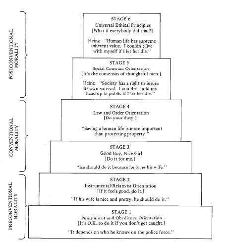
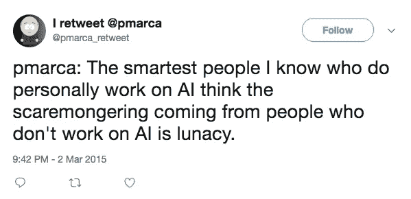
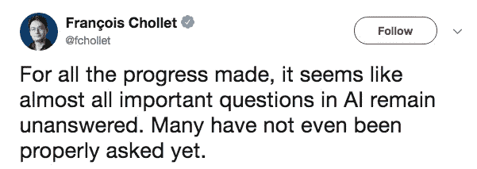

# 你不应该害怕机器人

> 原文：<https://towardsdatascience.com/thou-shalt-not-fear-automatons-6d0c7395f6e7?source=collection_archive---------20----------------------->

## 在这篇文章中，我将表明，不像专家希望你认为的那样，我们应该害怕的是我们的无知，而不是机器的智能。


TL；速度三角形定位法(dead reckoning)

人工智能迫在眉睫的危险与机器变得过于智能无关。这与机器继承了人类的无知有关。

# 背景

关于人工智能带来的巨大变化，我们应该相信谁？吴恩达说人工智能是下一个电，或者弗朗索瓦·乔莱说它更像是人类语言的发明？当埃隆·马斯克(Elon Musk)说我们需要害怕机器奴役我们，解决办法是将机器嵌入我们的大脑时，我们应该认真对待吗？如何兰德公司谈论人工智能作为下一个核军备，或弗拉基米尔·普京认为霸权是他的谁有最好的人工智能？Roko 的蛇怪怎么样，如果我没有在这里提到它，我会为我的永恒的痛苦铺平道路吗？谁是对的？我们应该满怀希望，还是害怕，或者两者兼而有之？

为了回答这些问题，在本文中，我将用简单易懂的术语建立三个简单的论点:

1.  虽然我们不能确定机器有多聪明，但我们肯定知道人类有多愚蠢
2.  谈论人工智能的伦理没有谈论人类的伦理重要
3.  人工智能现在和将来(至少在几十年内)都是关于过程自动化，而不是自治

作为奖励，我将展示我们是如何在某种程度上被令人难以置信的愚蠢机器所统治的。由缺乏积极性的初级工程师和想要成为数据科学家的人创造的机器，在目光短浅的销售人员和风险资本家的影响下工作。

# 人类不擅长做(好的)决定

> 虽然我们不能确定机器有多聪明，但我们肯定知道人类有多愚蠢。

没错。我们不擅长做决定。考虑丹尼尔·卡内曼在系统 1 上的工作和我们对迷走神经的理解。迷走神经是我们大脑的一部分，已经存在很长时间了。至少几亿年了。见过蜥蜴受到惊吓后迅速逃跑的吗？这是迷走神经在起作用。简而言之，卡尼曼在他获得诺贝尔奖的作品中表明，无论我们认为我们的决策过程有多么理性，当我们做出决策时，我们经常会忽视所有深思熟虑的结果(即使可能需要数年时间)，并选择任何“感觉”正确的选项。卡内曼称之为“快速思考”或系统 1，与我们认为自己正在思考的方式相反，卡内曼称之为“缓慢思考”或系统 2。理解这一点的一种方式是，在我们大脑的更表层部分，我们有很大的理性处理信息的能力，但很少有权力使用这些信息来做决定。在我们大脑深处迷走神经所在的地方，我们没有理性能力，但是有很多权威。不仅仅是卡尼曼。心理学领域是由和他一样的理论组成的。事实上，你可能很难找到理论来证明我们人类擅长做决定。这让我们想到了与人工智能相关的一个关键风险；人类做出关于基于人工智能的决策系统的决策。


人工智能解决方案可以归结为两个方面；数据输入和处理输入的方法。这两者是给定系统产生结果的原因。简而言之，给定系统的结果完全取决于与该系统相关的输入和流程。从根本上说，总有一种算法支撑着计算机系统做出的决定。各种计算机系统都是如此。考虑一个简单的 Python 示例:

```
1 + 1
```

在这种情况下，基于算法，系统决定输出整数 2。每一个计算机系统，不管它有多“人工智能”，都可以归结为这个基本原则:**输入+处理=决策**。计算机做决定的方式一点也不像人类。这是冷酷的理性，是能力和权威的完美结合。换句话说，能力和权威是不可分的。

上述例子与基于现代深度学习的机器智能系统的一个重要区别是，人类无法像我们审计前者那样审计后者。当我们考虑到我们人类的缺点时，这是一件大事。这是为什么呢？我们可以称这个问题为“转移无知”我们把我们的非理性引入到一个被期望做出理性决策的系统中，你猜怎么着，这个系统会开始做出非理性决策。当我们不知道事实是这样的时候，问题就来了；在计算机系统中，非理性很容易伪装成理性。因为一个典型的基于深度学习的自动决策系统的输出是我们无法验证的(就像我们可以验证 1+1=2)，并且我们不知道为什么我们会得到那个结果，我们可能最终成为我们非理性的受害者。以这种方式来架构人工智能的问题是一个重要的起点，因为这个问题变得可以管理；我们非常清楚自己的非理性。制衡可以到位，以避免我们的负面品质遗传给机器。问题很简单:

> 我们如何规范我们自己的行为，以最大限度地减少我们的非理性向那些被期望做出理性决策的系统的转移？

在这里，理解我们无法精确知道为什么深度学习模型中的某些东西会以这种方式工作的事实，正是我们想要的，这一点非常重要。这就是我们如何超越我们人类自己所能做到的。对于一个我们可以审计和解释的系统，它需要比我们审计和解释的能力更简单。这不是我们想要的！

接下来，考虑建造金字塔的过程。据估计，这需要多达 20 万名工人，在此过程中有数千或数万人伤亡。这是一个由人类痛苦和生命损失推动和促成的过程。再来看看迪拜，世界历史上一些最雄心勃勃的建筑项目就在这里。大多数项目都是零伤亡完成的，许多项目持续数百天没有发生事故。据报道，900 米高的哈利法塔导致一名建筑工人死亡。


Many construction sites in Dubai go hundreds of days without any accidents

怎么会这样这是因为，在过去的几千年里，我们不怕超越我们人类在特定时间点所能做的。我们不害怕扩展我们的能力。人工智能与其说是与我们分离的东西，不如说是扩展我们能力的东西。能够这样思考人工智能将会非常有用。当我们明白这是关于扩展我们的能力时，我们的希望变得更有意义，我们的恐惧变得更具体。例如，我们明白，将我们的无知转移到我们创造的系统中存在着真正的风险，结果，我们以人为的无知告终。当一种新的东西被发明出来，或者很久以前发明的东西开始起飞时，我们经常会得到令人惊讶的结果。我们越是无法理解(或审计)一个给定的系统，就越有可能出现令人惊讶的结果。有时候惊喜是不愉快的。让我们以医疗保健领域为例。

像任何其他系统一样，医疗保健是一个由相互关联的行为组成的网络。例如，如果您引入一个关注重症监护患者总天数的指标，您将最终导致更多的死亡，因为系统将优化使患者更早离开重症监护病房。这正是上世纪 80 年代管理顾问将基于博弈论的流程优化引入医院时，许多西方医院发生的情况。实际上，性能指标是简单算法的一个例子。我不怀疑这些想法背后的人真诚地相信它们会起作用。算法设计深受博弈论零和原则的影响。接下来让我们考虑一个拥有全民医疗保健平台和债务缠身的国民经济的民族国家。在这样的国家，决策者有大量的时间、资源和客观的压力。


到目前为止，这些国家的决策者应该已经得到了他们在人工智能炒作中的份额。说“人工智能是下一个电力”的问题在于它如何让我们思考电力以及我们从中获得的所有好处。如果你在医疗保健行业工作，风险在于思考“看看电力对医疗保健的改变有多大”，然后影响你对人工智能的态度。这是导致灾难的原因。就人工智能所能实现的功能而言，它与电力相去甚远。在某种程度上，它带来了积极和消极的结果，远远超出了电力的范围，我怀疑世界上是否有人真正“理解它”从另一个角度来看，人工智能只是另一种电力驱动的东西。在这两种情况下，说人工智能是新的电力是完全错误的——而且是危险的误导。新的电力将会提供光、热、运动等等。

回到国家医疗保健的例子…

个人和由个人组成的委员会，他们现在正在就机器智能在国家医疗保健系统中的使用做出决定，承受着巨大的交付压力。一般来说，他们面临着违背经济目标和国家健康结果的压力。典型的职业政治家几乎不懂医疗保健(或经济学)，因此除了极少数例外，他们对人工智能完全不知所措也就不足为奇了。他们受什么影响？没错，所有的炒作正是影响他们的。很难想象在这种情况下，被自称的人工智能专家无休止的炒作轰炸的非专家如何能够做出正确的决定。另一方面，很容易看出他们是如何最终犯下所有错误的。

关于系统，有一些重要的东西需要理解；当你改变某件事时，负面影响可能会在 10 年、20 年或 100 年后出现。一般来说，系统越复杂，变革项目越雄心勃勃，就越是如此。我们不应该专注于绝对最坏的情况，比如超级智能毁灭人类，而是应该非常担心无数愚蠢机器的微妙、往往隐藏的系统性影响。

# 人工智能中的道德和伦理

> 谈论人工智能的伦理没有谈论人类的伦理重要

就像我们设计的机器智能解决方案一样，继承了我们的非理性和愚蠢，它们继承了我们的不道德和缺乏道德。就目前情况来看，我们真的有制造人为不道德的风险。看待道德主题的一种方式是通过两部兼容的著作，伊曼纽尔·康德的《绝对命令》和科尔伯格的《道德发展模型》。康德在他的《绝对命令》中将其解释为“只根据那条准则行事，据此你可以同时将它变成一条普遍法则。”



在科尔伯格的作品中，我们可以体会到按照康德道德律令的标准生活是多么艰难。在一个组织环境中(关于人工智能的决策将主要在这里做出)，超越第四阶段(左图)可能会特别棘手，偶尔会瞥见第五阶段。不幸的是，很多选择都是在第 1 阶段的前提下形成的；如果我这样做，会不会对我个人产生负面影响。

非理性和不道德之间有一个关键的交叉点。它们放大了一个和另一个的有害影响。为了解决这一问题，并正式训练自己消除非理性和不道德，世界上的智者曾经非常重视对哲学的研究。最重要的是道德、本体论(什么是认识)、认识论(什么是存在)和逻辑学。这种方法将是人工智能研究人员和开发人员的有用伴侣。

莱布尼茨有句名言:

> 没有数学，我们就无法深入理解哲学。没有哲学，我们就无法深入数学。没有这两者，我们就无法深入了解任何事物。

政治家约翰·亚当斯说:

> 我必须学习政治和战争，这样我的儿子们就可以自由地学习数学和哲学。

在医疗环境中，没有一个相关的利益相关者——政府和医疗专业人员，也没有计算机和数据科学家——接受过道德培训，并且经常缺乏对本体论、认识论和形式逻辑的最基本的理解。而且，这不只是一个 AI 相关的问题；在物理学界，关于哲学的作用以及它是否有任何意义的争论越来越激烈。这里我们发现我们应该害怕的第二件重要的事情；把新思想的发现从哲学中分离出来的风险，因为哲学是发现和思想的科学。

我们已经看到了人类不道德行为转移到决策系统的结果。我们已经通过金融市场、在线广告和其他算法决策的早期拥抱者的例子看到，我们如何倾向于以所谓的贪婪算法结束，这些算法无情地朝着给定的目标优化，而不关心其他任何事情。与医疗保健专业人员等不同，这种算法不怕因做出错误决定而失去生计和声誉。最终可能会伤害他人的决定。我们应该担心的正是这种类型的风险，而不是想要主宰或消灭人类的超级智慧。一些最疯狂的幻想甚至试图让我们确信，我们看到一种超级智能将首先消灭人类，然后扩展到整个银河系，这只是一个时间问题。


# 自主谬论

> 人工智能现在和将来(至少在几十年内)都是关于过程自动化，而不是自治

人工智能恐惧传播的核心是自主超级智能的混乱概念。我们在两个基本方面犯了严重的错误；我们已经开始用自主这个词来代替自动化，我们已经忘记了计算机程序的工作方式。作为一个参考点，看一看深度学习社区的阶段。大部分工作集中在简单的流程自动化和创建更复杂的方法，以提高训练预测模型的自动化的最新水平。虽然用几行 Keras 代码可以做的事情非常不可思议，但在最终的预测模型中，人类的智能就像烤面包机一样多。无论如何，深度学习模型的自动化程度远远高于烤面包机。可以公平地说，深度学习模型扩展人类能力的方式远远超出了烤面包机的能力。但是，深度学习模型中是否存在烤面包机中没有的超级智能的固有属性？这是一个基于深度学习的拼写检查器对深度学习的看法。


深度学习可能是一颗种子，具有更多的倾向，甚至是我们还无法想象的某种形式的智能，但它只是一种倾向。就像一颗苹果种子需要土壤、水分、营养和阳光才能有机会长成新芽一样，超级智慧也需要让它显现的原因和条件。没有人能令人信服地解释这些原因和条件是什么。在电脑游戏中赢人类与此无关。事实上，大部分恐慌都集中在最糟糕的情况上。想想核武器；在历史上，它们只被使用过一次。你能找到一些其他的技术进步，其中最坏的情况实际上已经实现了吗？

说到超级智能，我们甚至不知道我们是否有这种能力。在这一点上，我不得不同意马克·安德森的观点。



我们所知道的是，我们的无知和不道德有一个可识别和可解决的问题。此外，我们有明确的证据表明，我们倾向于将它转移到我们创造的系统中。这是我们应该担心的，我们应该非常担心。

自主性怎么样，深度学习模型中的自主性比烤面包机中的自主性多吗？我不会说我是从事人工智能研究的最聪明的人之一，但我是一个小团队中的一员，这个团队多年来一直致力于自主性的基础研究。我的观点是，就目前而言，深度学习模型和烤面包机在自主性方面几乎没有区别。简单来说，深度学习模型中没有类似于自主性的东西。创造一个自主版本的烤面包机将是一个比创造一个自主版本的深度学习模型更合理的目标。在深度学习模型中，抽象的对象是经过训练的模型，而在烤面包机中，抽象的对象是烤面包。在这两种情况下，我们通过实现一定程度的自动化来做一些繁琐的事情并简化过程。已经建立起来的与人工智能相关的最高抽象层次与超参数优化有关。在超参数优化中，我们将模型的超参数配置作为抽象对象，而不是只获得一个模型，而是获得许多模型。这里我们避免了寻找最佳超参数的繁琐过程。有一些关于自动机器学习的新兴工作，它将所有已建立的东西包装成一个单一的解决方案。它仍然只是过程自动化。有一个新兴领域关注超参数优化过程的优化。这是我自己正在做的事情之一。我不能肯定地说太多，但我可以从理论上说，展开的是一个无限的回归，其中每一级抽象都充当前一级抽象的解算器。甚至那也仅仅是建立在自动化之上的自动化。那里也没有自主权。我认为——这是我们没有文献记载的——希望通过自动化的无限回归找到自主性就像希望从苹果籽中得到烤面包一样好。

我们一无所有；除此之外，关于自主人类灭绝银河系探索超智能的无稽之谈没有其他依据。而且，当你看到一个著名的 AI 公司创造了一个在给定游戏中击败最优秀的人类玩家的 AI，你应该问这个解决方案有多普遍的适用性？是因为公司投入了如此多的资源和人力去解决一个特定的问题，以至于不可避免地会得到他们想要的结果。我们没有任何其他的技术发展轨道，似乎在这里丝毫相关的考虑。我完全同意弗朗索瓦·乔莱说的话:



我们需要问自己的与人工智能相关的最重要的问题甚至与人工智能无关。最重要的是，我们必须提出关于系统性影响的问题。回到医疗保健，我们可能会认为对药物的过敏反应是副作用的一个很好的例子，但许多副作用需要几年、几十年甚至几个世纪才会出现。由于因果分析的难度，我们一般无法精确地知道是什么促成了某种结果。这意味着，在某些情况下，几乎不可能知道一个给定的人工智能解决方案是在长期内做出积极贡献，还是只是提高短期效率，并在长期内造成损害。即使我们先等了几十年。这可能在未来 100 年内成立，或者只要理解长期因果关系就成立。对因果关系的分析似乎是人工智能专家系统更有趣，也更少讨论的用途之一。

# 额外收获:被一千种算法杀死

取代天网的是，我们正迅速走向一个由无数愚蠢的机器统治我们的世界。这些机器是由缺乏积极性的初级员工(工程师和潜在的数据科学家)创建、维护和优化的，他们在巨大的压力下工作，并受到销售人员和风险资本家短视的影响。更糟糕的是，他们倾向于每两年换一次工作，而且通常不关心或没有能力理解工作带来的系统性变化。那些算法已经无处不在。超过一半的金融市场交易都是基于简单的零和算法的决策，这些算法被称为“底部馈电器”，其唯一目的可能是在市场中制造噪音。从现在起的几年内，超过一半的广告是基于算法进行交易的，这些算法以牺牲互联网用户的利益为代价，与“每次印象成本”等指标相互竞争。我们在社交流、互联网搜索、视频推荐、相关新闻和购物网站中看到的内容完全由被称为“收益优化器”的算法控制。在所有这些例子中，算法都是简单的自动机，为创造和控制它们的人的短视利益服务——本质上主要是金钱利益。以“收益优化器”为例，该算法的目标是捕捉尽可能多的互联网用户的注意力和时间，将其转化为广告收入。从某种意义上说，这是一种认知收获。一个非常愚蠢的算法收获人类认知能量的过程，让一个公司赚钱。换句话说，由于我们的无知和不道德，我们创造了无知和不道德的算法，使我们更加无知。

一些精神食粮。

## 在这里阅读关于自动研究代理人的信息。

## PS。感谢您的宝贵时间！如果你还有几秒钟，请分享。

## PS。如果你对我和 AI 一起做的工作感兴趣，可以看看的