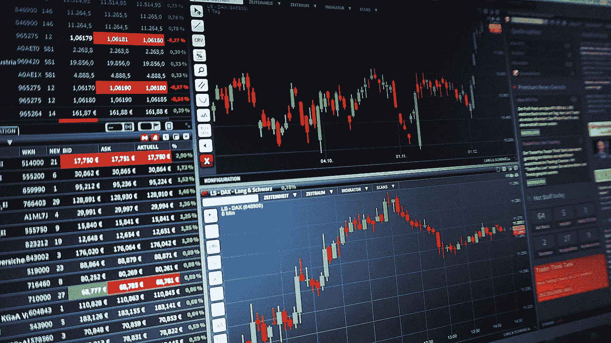

# 即使是经验丰富的定量分析师也会犯的三个主要错误

> 原文：<https://towardsdatascience.com/three-cardinal-mistakes-even-experienced-quants-make-b6e2f8b3bad4?source=collection_archive---------12----------------------->

## 避免这些简单的错误，成为优秀的量化交易者

量化交易是计算机编程、机器学习、金融和统计的熔炉。要成为量化分析师，你需要精通所有这些交易，至少精通其中一些。许多不同的方法被用来以编程方式确定何时买卖股票，包括时间序列预测(例如:ARIMA & GARCH 模型)，机器学习(例如:SVM 或基于股票价格特征的神经网络)，以及图表工具(例如:布林线)。不管你来自什么学科，用什么方法，有三件事你必须绝对注意，这常常让有经验的交易者感到困惑。

# 前瞻偏差

当您的模型可以访问它不应该知道的未来数据时，就会出现前瞻偏差。考虑下面的例子。这是 2019 年，我刚刚编写了一个程序，它使用深度学习来预测股票价格在未来一周内是上涨还是下跌。我有 2010 年以来国家交易所(NSE)所有股票的历史数据。我编写了一个模拟器，并根据 2010 年至 2019 年期间的数据对我的模型进行了回测。交易所列出了 2000 多只股票，但我只想交易流动性好的股票，所以我只对构成指数的 50 只股票(NIFTY50)训练和测试我的模型。而且，哇，我的模拟告诉我，我每年将获得 60%的回报，所以我开始兴奋地交易。像一个优秀的交易者应该做的那样，我将我的模型在现场交易时的表现特征与我在模拟中得到的进行比较，令我沮丧的是，我发现模型在现场交易时表现非常不同。哪里出了问题？

我使用 2019 年指数中的股票在 2010 年至 2019 年期间进行交易。实际上，在 2010 年，我的模型可以窥视未来，并看到一只特定的股票将在 9 年后的 2019 年进入前 50 只指数股票。这是前瞻偏差。正确的股票选择应该是在某一年只使用当年指数中的股票。前瞻偏见可能会以潜移默化的方式渗入到您的代码中，尤其是当您的编程包含复杂的数据操作时。例如，在预计算要素时，某个特定的要素可能会揭示当天的收盘价，这将为您的模型提供有关市场方向的线索。如果你的交易策略在模拟中表现出色，在计算错误后，你首先要检查的是是否存在前瞻偏差。

# 低估滑动

市场不是在单一价格上运行的。它基于两种价格:买价和卖价。出价是买家愿意支付的最高价格，要价是卖家愿意接受的最低价格。当根据历史数据对模型进行回溯测试时，或者通俗地说，当谈到股票价格时，我们通常会考虑一个价格，通常是最近的交易价格或 LTP。买卖价格之间的差异被称为买卖价差。在模拟时，我们假设如果一只股票的 LTP 是 110.5，我们就可以在 110.5 买入或卖出这只股票。在实时交易中，情况并非如此。如果 LTP 是 110.5，那么出价可能是 110.4，而要价可能是 110.6。如果你在买一只股票，你将能在 110.6 而不是 110.5 买到它。这 0.1 的差异被称为滑移。滑点是不能模拟的，因为它紧密地依赖于实时市场条件和你的仓位大小。大多数天真的交易者考虑交易成本，比如经纪费和交易费，但是他们不考虑滑点。大多数有经验的交易者假设任意的滑点成本占仓位大小的百分比，但是他们从来不去验证这个数字是否符合真实的市场条件，而且更多的时候，他们低估了它。这是一个巨大的错误。

如果你想成为盈利的量化交易者，你必须计算你的滑点成本。有两种方法可以做到这一点。首先，统计方法是获取市场订单快照，并确定不同股票在一天中不同时间的买卖价差。如果你交易的是流动股票，LTP 大致介于买价和卖价之间，用这种方式统计 LTP 的滑点会给你一个大致准确的数字。我推荐的第二种方法是根据经验来决定。当你开始实时交易时，在执行每笔交易前注意 LTP，在执行后注意你的交易价格。经过几个月的交易，计算这两个数字，确定你的滑点成本。对于期权等波动性较大的工具，买卖价差非常大，LTP 可能位于任何地方:在买卖价差之间，或者远在一边。对于这些，经验确定是必由之路。

# 在测试集上拟合模型

我们都知道为什么需要将数据分为训练集、验证集和测试集。然而，当你日复一日、月复一月、有时甚至数年地研究同一个问题时，你会不经意地开始在测试集上间接拟合模型。理想情况下，测试集应该保存在保险库中，只有在实验完成后才能取出。然而，定量分析师很清楚，我们的实验永远不会结束。我们是炼金术士，我们将继续尝试阳光下的一切，直到我们把我们的模型变成金子。当多个模型在验证集上表现相似时，我们选择在测试集上表现最好的一个。当我们下一次迭代时，我们重复这个过程，最终，通过许多这样的迭代，我们使我们的模型适合测试集。一个解决方案是保留多个测试集，并定期在它们之间切换，这样就不会过度适应任何一个测试集。另一个解决方案是遵守纪律，不要让测试性能影响模型选择，但是相信我，遵守纪律说起来容易做起来难。

# 结论

量化交易很难，因为你需要正确地运用很多技巧才能让它发挥作用。这三个错误虽然很容易理解，但是业余爱好者和专业人士都经常犯。如果你避免了这些，你已经在成为一个理智的量化交易者的路上了。

*如果你喜欢这篇文章，可以在* [*中*](https://medium.com/@diningphilosopher) *上查看我的其他作品，在*[*LinkedIn*](https://www.linkedin.com/in/kulkarniviraj/)*或*[*Twitter*](https://twitter.com/VirajZero)*，查看我的* [*个人网页*](https://virajkulkarni.org/) *，或发电子邮件至*[*【viraj@berkeley.edu】*](mailto:%20viraj@berkeley.edu)