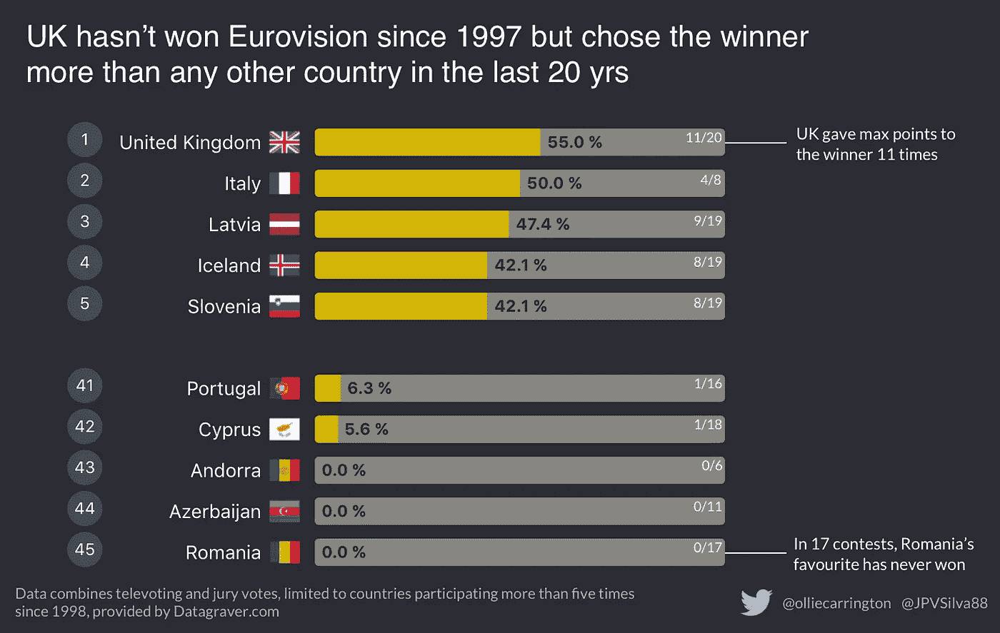
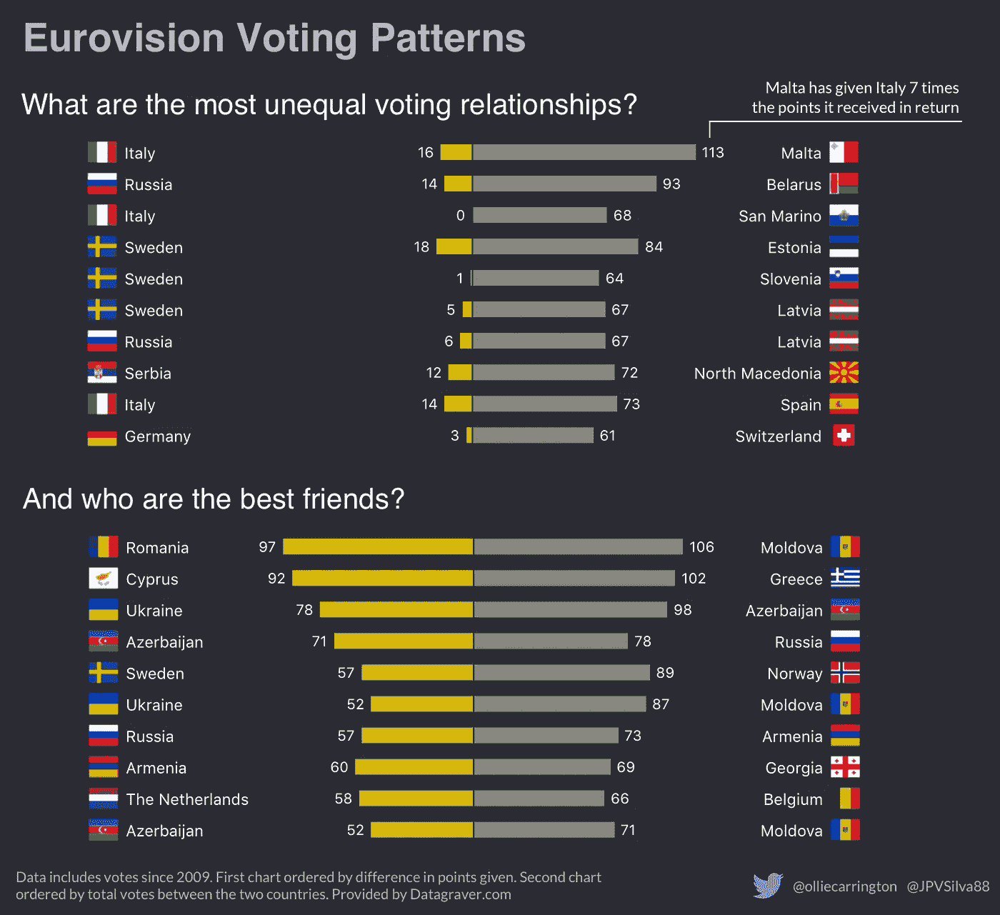
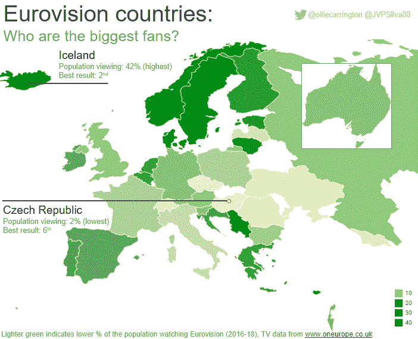
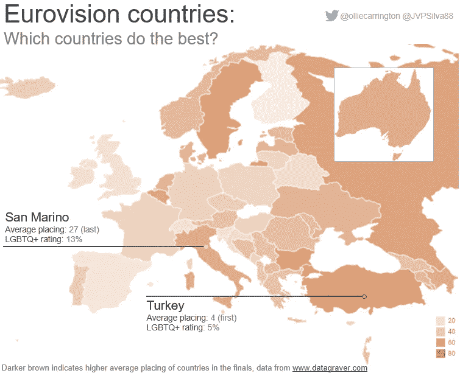

# 欧洲电视网欢乐三图

> 原文：<https://towardsdatascience.com/three-charts-on-the-joy-of-eurovision-e653b8713072?source=collection_archive---------10----------------------->

## *使用数据可视化更深入地了解欧洲电视网国家的投票模式、战略投票和 LGBTQ 权利*

由于它每年吐出的统计数据量巨大，欧洲电视网是创造数据可视化的梦想成真——特别是对我和若昂这样的超级粉丝来说。

在今晚决赛的预期中，我们已经看了哪些国家选择冠军的次数最多；就投票而言，谁是欧洲最好的朋友；同性恋友好国家是否真的更受欢迎？

## 哪个国家“选择”获胜者？

> 这不能告诉我们他们对音乐是否有好的品味…

尽管几十年来未能确保获胜，但英国给比赛获胜者最高分的次数最多——在过去 20 年的比赛中这样做了 11 次。因此，在这方面，英国至少可以感到一些自豪。

安道尔和阿塞拜疆的最高分从未颁给获胜者，但罗马尼亚却垫底，因为它参加了更多的比赛。

## 欧洲有哪些脱颖而出的投票关系？

> 如果这是一种人际关系，马耳他可能会因为忽视而抛弃意大利

欧洲电视网的乐趣并没有在表演后结束，在我看来，持续到深夜的紧张和公开的政治投票同样令人着迷。

从过去十年的数据来看，我们毫不惊讶地发现，在整个欧洲，邻国之间有许多成对的“最好的朋友”,他们互相交换大量的积分。罗马尼亚和摩尔多瓦名列榜首，分别获得 97 分和 106 分。

更有趣的是，我们还发现了许多不平等的投票关系，其中一方给比他们大的邻居更多的分数，而没有得到很多分数的回报。这可能是因为音乐更好，或者是因为较小的国家没有进入决赛，以获得积分。但是想象这对夫妇中不幸的国家的失望是很有趣的。

## 欧洲电视迷和同性恋权利有什么关系？

> 对同性恋权利越差的地方越不感兴趣，在同性恋友好的北欧国家收视率最高

欧洲电视网，有像肯奇塔·沃斯特和达纳国际这样的著名行为，已经被 LGBTQ 社区所接受。它通常被称为同性恋超级碗，但这真的反映在它的收视率上吗？这些地图显示了对同性恋最友好的国家和欧洲电视网最高收视率之间的关系。

但是欧洲并不像我们想象的那样进步，正如下面的粉红色地图所示，中欧和东部边缘地区存在 LGBTQ 歧视和侵犯人权行为。俄罗斯和阿塞拜疆不会令人惊讶，但意大利和瑞士等国家也缺乏 LGBTQ 权利。

我们还分析了过去 20 年的结果，绘制了一张地图，显示欧洲最成功的国家在哪里。我们通过计算一个国家在决赛中的平均排名来得出这个结论。

这里的情况要复杂得多。最成功的国家分为两类，一类是拥有同性恋友好法律和狂热的欧洲电视观众的国家(北欧国家)，另一类是同性恋权利和电视观众人数都很少的国家(如土耳其、俄罗斯和意大利)。

请注意，澳大利亚出现在这些地图中，因为它们也在欧洲电视网中——但那是另一回事了！

## 我们如何创建我们的数据，即？

我们从[datagraver.com](http://datgraver.com)、[rainbow-europe.org](http://rainbow-europe.org/)和[oneurope.co.uk](https://oneurope.co.uk/)下载了数据。然后，我们使用 React 来处理数据，并创建两个投票图表的核心部分。然后，我们使用矢量图形编辑器 Sketch 进行设计修正。对于地图，我们使用 [datawrapper.de](https://www.datawrapper.de/) 来创建它，并使用[ezgif.com](http://ezgif.com)将它制作成 GIF 动画。

喜欢你看到的吗？在 Twitter 上关注我们的 Eurovision #dataviz:

奥利弗·卡林顿