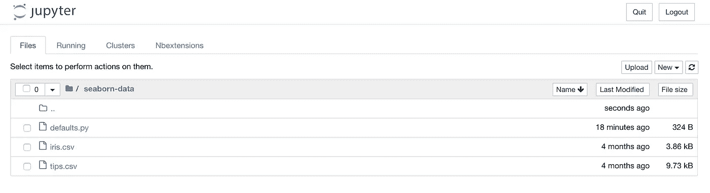
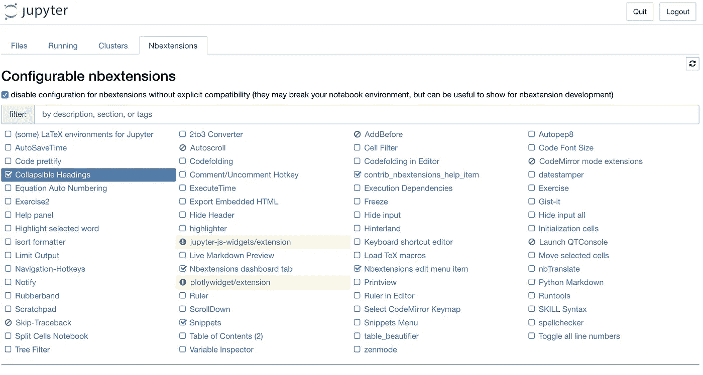
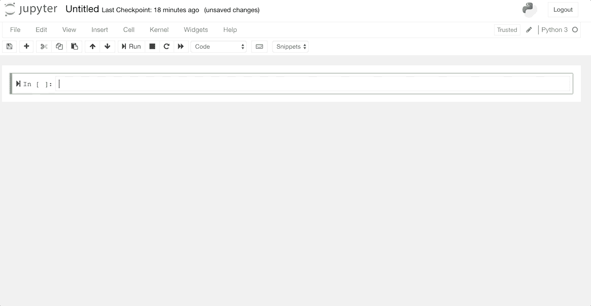
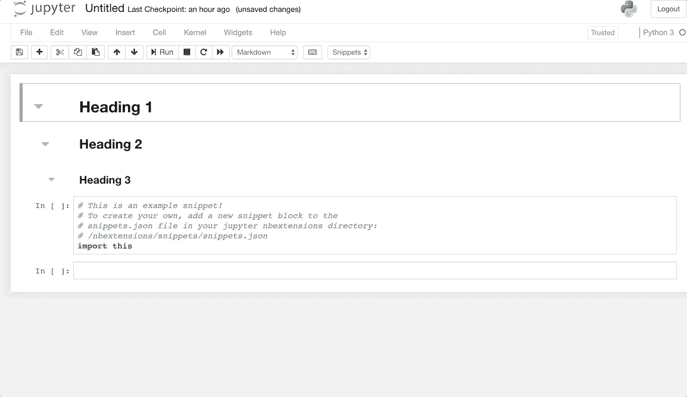
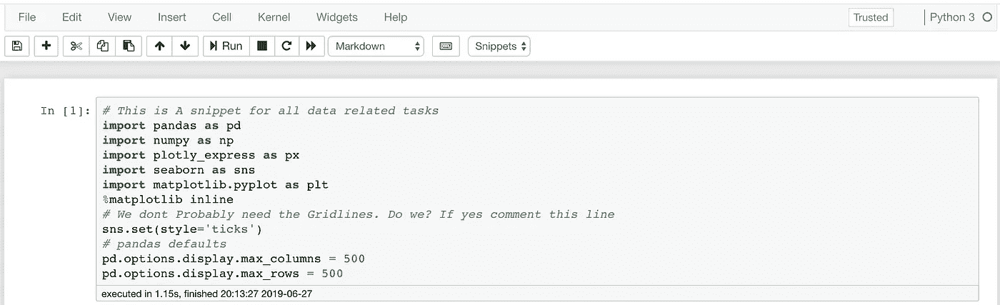
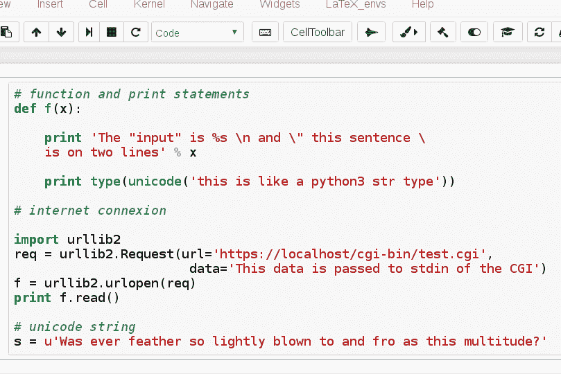

# Jupyter 笔记本的 3 大新增功能

> 原文：<https://towardsdatascience.com/three-great-additions-for-your-jupyter-notebooks-cd7373b00e96?source=collection_archive---------9----------------------->

## ***最有用的扩展我找到了。*** 不要错过这个。


我喜欢 Jupyter 笔记本电脑以及它们提供的强大功能。

它们可以用来以最有效的方式展示发现和共享代码，这在以前的 ide 中是不容易的。

然而，仍有一些不足之处。

在我的文本编辑器中，有一些我渴望的功能是 Jupyter 默认没有的。

但是不要担心。就像 Python 中的所有东西一样，Jupyter 也有第三方扩展。

这个帖子是关于我发现的一些最有用的扩展。

# 1.可折叠标题

我最喜欢的一个扩展是可折叠标题。

它使笔记本的流程更容易理解，也有助于创建像样的笔记本。

要获得这个，在终端窗口上用这个命令安装`jupyter_contrib_nbextensions`包:

```
conda install -c conda-forge jupyter_contrib_nbextensions
```

软件包安装完成后，我们可以使用以下命令启动 jupyter 笔记本:

```
jupyter notebook
```

一旦你进入 jupyter 笔记本的主页，你可以看到为`NBExtensions`创建了一个新标签。



使用这个包我们可以得到很多扩展。



看起来是这样的:



# 2.自动导入


自动化是未来。

困扰我的一件事是，每当我在我的任何数据科学项目中打开一个新的 Jupyter 笔记本时，我需要复制粘贴许多库和其中一些的默认选项。

告诉你一些我常用的进口货:

*   [Pandas](/minimal-pandas-subset-for-data-scientists-6355059629ae) 和[numpy](https://amzn.to/2SrN3zX)——在我看来，Python 必须将这两个设为默认导入。
*   [Seaborn](/3-awesome-visualization-techniques-for-every-dataset-9737eecacbe8) ，matplotlib， [plotly_express](/pythons-one-liner-graph-creation-library-with-animations-hans-rosling-style-f2cb50490396)
*   改变一些熊猫和海豹的默认选项。

这是我最后反复粘贴的脚本。

```
import pandas as pd
import numpy as npimport plotly_express as px
import seaborn as sns
import matplotlib.pyplot as plt
%matplotlib inline*# We dont Probably need the Gridlines. Do we? If yes comment this line*
sns.set(style="ticks")# pandas defaults
pd.options.display.max_columns = 500
pd.options.display.max_rows = 500
```

有没有一种方法可以让我自动化？

只需转到`nbextensions`选项卡并选择`snippets`扩展。

您需要对`snippets.json`文件进行以下更改。你可以在`/miniconda3/envs/py36/share/jupyter/nbextensions/snippets`位置找到这个文件。这个位置的 py36 是我的康达 virtualenv。我花了一些时间为我找到这个位置。你的可能不一样。请注意，你不必在`site-packages`转车。

您可以在下面看到这个扩展的运行。



相当酷。对吗？我还用它来为我的深度学习笔记本和基于 NLP 的笔记本创建基本片段。

# 3.执行时间

我们已经使用了`%time`以及基于 decorator 的定时器函数来测量我们函数的时间。您也可以使用这个出色的扩展来完成这项工作。

另外它看起来很棒。

只需从`NBextensions`列表中选择`ExecutionTime`扩展名，每次单元执行后，您将在单元底部看到执行结果以及单元执行的时间。



# 其他扩展


`NBExtensions`有很多扩展。我喜欢 NBExtensions 的一些其他扩展，您可能想看看:

*   **限制输出:**自从你在笔记本上打印了很多文字后，你的笔记本有没有挂过。这个扩展限制了一个代码单元下可以打印的字符数
*   **2 to 3 converter:**旧 python2 笔记本有问题。厌倦了更改打印报表。这个很好。



*   **Live Markdown Preview:** 我们中的一些人喜欢在笔记本上用 Markdown 来写博客。当你在写作中犯错误时，有时会很紧张。现在，您可以在编辑 markdown 单元格的源时看到其渲染输出的实时预览。


# 结论

我喜欢 Python 中的所有东西都有一个包。这同样适用于 Jupyter 笔记本电脑。

`jupyter_contrib_nbextensions`包开箱即用。

当涉及到检查执行时间、滚动笔记本和重复任务时，它让我的生活变得容易多了。

这个包确实提供了许多其他的扩展。一定要看看它们，看看哪些对你有用。

另外，如果你想学习更多关于 Python 3 的知识，我想从密歇根大学调出一门关于学习[中级 Python](https://coursera.pxf.io/0JMOOY) 的优秀课程。一定要去看看。

我以后也会写更多这样的帖子。让我知道你对这个系列的看法。在[](https://medium.com/@rahul_agarwal)**关注我或者订阅我的 [**博客**](http://eepurl.com/dbQnuX) 了解他们。一如既往，我欢迎反馈和建设性的批评，可以通过 Twitter [@mlwhiz](https://twitter.com/MLWhiz) 联系。**