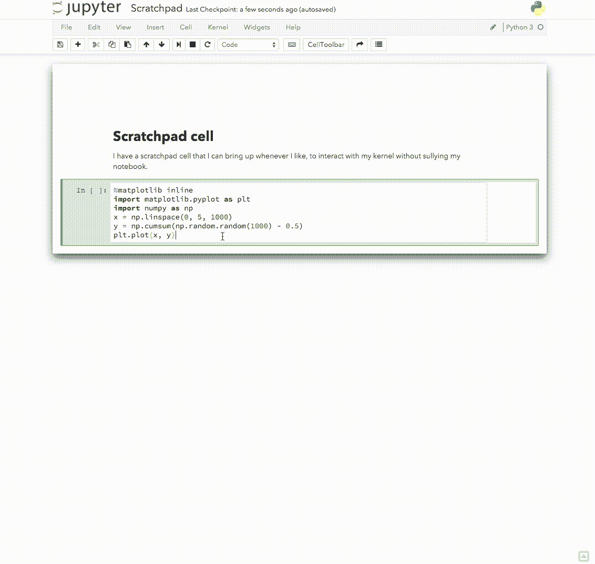
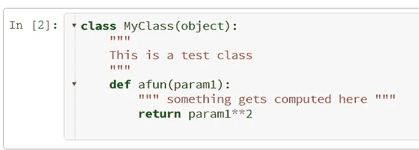
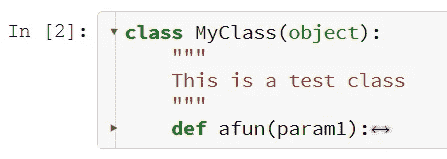
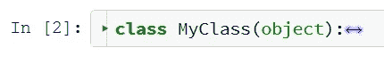
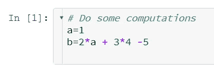
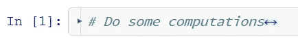
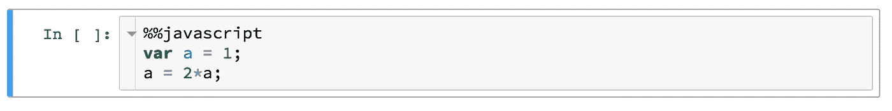
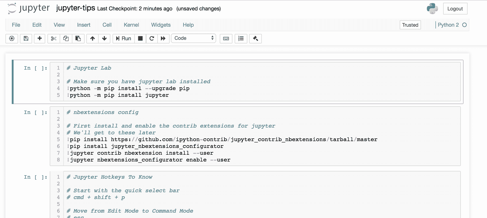

# 三款 Jupyter 笔记本扩展，最大限度减少干扰

> 原文：<https://towardsdatascience.com/three-jupyter-notebook-extensions-that-minimize-distractions-bd9ec98f0e2c?source=collection_archive---------4----------------------->

## 通过关注重要的事情来提高你的生产力


Picture From [Unsplash](https://unsplash.com/photos/KE0nC8-58MQ)

# 为什么使用 nbextensions？

Jupyter 笔记本扩展，也称为 nbextensions，是帮助您提高工作效率的工具。它们提供了许多有用的功能，例如所谓的“变量检查器”，可以让您跟踪您定义的所有变量。然而，有一类特殊的鲜为人知的 nbextensions:那些专注于最小化分心的事物。在这篇文章中，我将首先向您解释如何安装 nbextensions，然后介绍三种 nbextensions，它们将通过最大限度地减少干扰来提高您的工作效率。

# 安装 nbextensions

有几种方法可以安装 nbextensions。例如，您可以逐个单独安装 nbextensions，但是，有一种更方便的方法。在安装***jupyter _ contrib _ nbextensions***的基础上，额外安装***jupyter _ nb extensions _ configurator***将提供管理 nb extensions 的便捷方式。

然后，在您的终端中运行以下代码块，以同时安装这两个程序:

```
**conda install -c conda-forge jupyter_contrib_nbextensions jupyter_nbextensions_configurator**
```

安装 nbextensions 和配置程序后，您可以看到所有可用的扩展，并通过导航到**localhost:6006/extensions**来激活它们。

既然已经安装了所有的需求，让我们看一下前面提到的三个 nbextensions:

# 1.便条簿

这个扩展正是它听起来的样子。scratchpad notebook 扩展允许您针对当前内核运行代码，而不必为了实验或计算的目的在实际代码之间不断添加新单元。使用 **Shift+Enter** 打开草稿栏，并通过 **Ctrl+B** 关闭草稿栏。



# 2.代码折叠

如果你是 RStudio 的狂热用户，你可能会错过使用 Juypter 笔记本时代码折叠创建的结构。这个扩展解决了这个问题。有三种受支持的代码折叠选项:

## 1.缩进折叠

该算法检测缩进，并允许您一个接一个地折叠缩进。这意味着您可以更加灵活地选择要折叠的代码量。

为了形象化，让我们看一下下面的代码单元:



如你所见，有两个缩进。因此，这个代码单元可以折叠成:



并且还融入了:



## 2.首行注释折叠

另一种方法是折叠首行有注释的单元格。这将导致只显示第一行的注释，而不是整个单元格。这样做，您可以在删除代码的同时，在第一行保留对单元格的简短而精确的描述。

因此，下面的单元格…



…可以折叠成:



## 3.魔术折叠

同样的概念也适用于第一行中的魔法命令。这种特殊的折叠选项对于导入包的单元格特别有用。这个选项的另一个应用是删除所有不是 Python 的代码，以避免可能的干扰。



折叠会将上面的单元格变成:


此外，在保存 Jupyter 笔记本时，您的所有文件夹都会被保存。

# 3.zenmode

我将在本文中介绍的第三个也是最后一个 nbextension 可能是三个中提到最多的。zenmode 扩展将删除菜单，使您能够专注于您的代码。在我看来，这也将使 Jupyter 笔记本界面在视觉上总体上更具吸引力。

下面的 [GIF](https://medium.com/@rrfd/jupyter-notebook-shortcuts-tips-and-tricks-top-nbextensions-bring-order-to-your-notebooks-pt-1-b58f270963f9) 说明了以上情况:



# 结论

对你的工作环境进行小小的改变会对你的工作效率产生巨大的影响。当设计一个人的工作环境时，最大限度地减少干扰和完全专注于编码是最重要的目标之一，使用 nbextensions 是一种很好的方式。当然，这三个扩展并没有包含 nbextensions 必须提供的所有功能。因此，如果你想了解更多，我会推荐你深入研究[文档](https://jupyter-contrib-nbextensions.readthedocs.io/en/latest/index.html)。

*参考文献:*

[1] [非官方 Jupyter 笔记本扩展文档](http://Unofficial Jupyter Notebook Extensions)