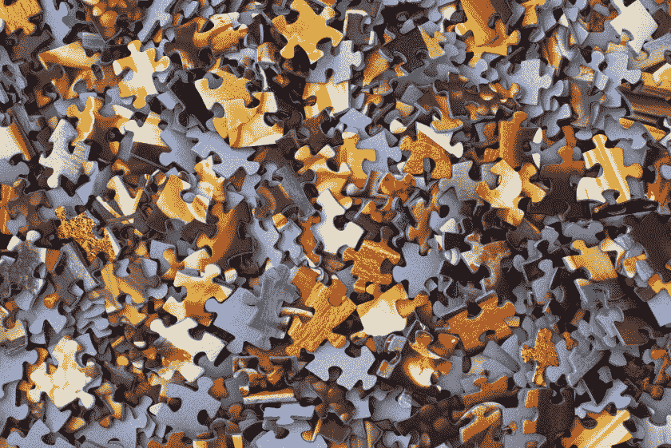

# 数据科学和统计学之间的三个关键区别

> 原文：<https://towardsdatascience.com/three-key-differences-between-data-science-and-statistics-7fe9a6535659?source=collection_archive---------28----------------------->

Picture from [Andrea Piacquadio](https://www.pexels.com/photo/woman-draw-a-light-bulb-in-white-board-3758105/)

数据科学在过去几年里越来越受欢迎，许多人把它和它更古老、更熟悉的亲戚统计学混淆了。作为一个既做过数据科学家又做过统计学家的人，我经常遇到这样的困惑。这篇文章试图澄清他们之间的一些关键差异。

不过，在我讨论它们的区别之前，让我们先定义一下它们。统计学作为一门学科是指收集、组织、分析和交流数据的数学过程。在统计学中，我通常将“传统”统计学定义为统计学导论课程中教授的统计过程，如基本描述统计学、假设检验、置信区间等:通常是统计学以外的人，尤其是商界人士，听到“统计学”这个词时的想法。

[数据科学](https://ethno-data.com/data-science-and-machine-learning-summary/)从最广泛的意义上讲，是一门组织、处理和分析计算数据以解决问题的多学科科学。尽管数据科学与统计学和“传统”统计学相似，但它们都有所不同:

# 区别 1:数据科学不仅仅是一个数学领域

统计学是数学的一个领域；然而，数据科学不仅仅指数学。简而言之，数据科学以使用计算数据来解决问题为中心，[【I】](https://ethno-data.com/data-science-vs-statistics/#_edn1)这意味着它包括分解计算数据所需的数学/统计学，还包括高效和有效地编写这些算法所需的计算机科学和工程思维，以及基于该分析制定战略决策的业务、政策或其他特定主题“智慧”。

因此，统计学是数据科学的重要组成部分，但数据科学不仅仅包括统计学。统计学作为数学的一个领域，恰恰包括分析和解释数据的数学过程；然而，数据科学还包括通过计算进行分析的算法问题解决，以及利用该分析做出决策以满足上下文中实际需求的艺术。统计学显然是数据科学过程的重要组成部分，但数据科学通常是指分析计算数据的整个过程。在实践层面上，许多数据科学家并非来自纯粹的统计背景，而是来自计算机科学或工程，利用他们的编码专业知识来开发高效的算法系统。

Picture from [Carlos Muza](https://unsplash.com/photos/hpjSkU2UYSU)

# 差异#2:综合数据与样本数据

在统计研究中，研究人员通常无法分析整个群体，也就是他们正在分析的整个群体，因此他们创建了一个更小、更易于管理的个体样本，他们希望这个样本能够代表整个群体。然而，数据科学项目通常涉及分析大量的总结性数据，封装整个群体。

传统的统计工具非常适合科学研究，在科学研究中，人们必须走出去收集有关所讨论主题的数据。因为这通常非常昂贵和耗时，研究人员在大多数时间只能收集更广泛人群的子集数据。

计算的最新发展，包括收集、存储、传输和处理更大计算数据的能力，扩展了现在可能的定量研究的类型，数据科学已经发展到解决这些新类型的研究。许多数据科学项目需要从已经收集的关于整个人口的大量数据中找到有意义的见解，而不是根据一组经过严格审查的变量收集精心选择的人口样本。

Picture from [Hans-Peter Gauster](https://unsplash.com/photos/3y1zF4hIPCg)

# 区别#3:探索性与确认性

数据科学家经常寻求建立模型，用数据做一些事情；然而，统计学家通过他们的分析试图从数据中学习一些东西。因此，数据科学家通常会根据他们执行给定任务的效率来评估他们的机器学习模型，例如它在优化变量、确定最佳行动过程、正确识别图像特征、为用户提供良好建议等方面的表现。为此，数据科学家通常会根据选定的性能指标来比较许多模型的有效性或准确性。

在传统统计学中，问题通常围绕使用数据来理解基于样本发现的研究主题。接下来的问题围绕着样本能对更广泛的人群说些什么，以及它的结果有多大可能代表或适用于更广泛的人群。

相比之下，机器学习模型通常不寻求解释研究主题，而是*做*一些事情，这可能导致非常不同的研究策略。数据科学家通常试图确定/产生具有最佳性能的算法(给定他们用来评估性能如何“更好”的任何标准)，在此过程中测试许多模型。统计学家通常采用他们认为能准确代表背景的单一模型，然后根据该模型得出结论。

因此，数据科学通常是探索性分析的一种形式，通过试验几种模型来确定某项任务的最佳模型，并进行统计验证性分析，试图确认得出给定假设对更广泛的人群来说是正确的结论的合理性。

大量的科学研究已经从理论上证实:一个科学家有一个世界的模型或理论；他们设计并实施了一个实验来评估这个模型；然后根据实验结果使用假设检验来确认或否定该模型。随着数据可用性和计算的变化，探索性分析、数据挖掘和使用数据生成假设的价值急剧增加(Carmichael 126)。

数据科学作为一门学科，一直处于利用不断增长的计算能力进行探索性工作的前沿。

Picture from [Kendall Lane](https://unsplash.com/photos/yEDhhN5zP4o)

# 结论

我的一位数据科学家朋友曾经打趣我说，数据科学就是应用计算统计学。这是有一定道理的:数据科学的数学工作属于统计学范畴，因为它涉及收集、分析和交流数据，而且，由于它强调和利用计算数据，它肯定会成为计算统计学的一部分。数据科学的数学也非常明确地得到应用:面向解决实际问题/需求。因此，数据科学和统计学是相互关联的。

然而，它们在正式定义和实际理解上都有所不同。现代计算和大数据技术对数据科学产生了重大影响。在统计学中，计算统计学也试图利用这些资源，但是已经成为“传统”的统计学(还)没有包含这些资源。我怀疑在未来几年或几十年，现代计算、数据科学和计算统计学的发展将重塑人们认为的“传统”或“标准”统计，使其更接近今天的数据科学。

有关更多详细信息，请参见以下有用资源:

伊恩·卡迈克尔和 J.S .马龙的“数据科学与统计学:两种文化？”在日本统计与数据科学杂志:【https://link.springer.com/article/10.1007/s42081-018-0009-3 

“数据科学家与统计学家”在[https://opendatascience . com/Data-Scientists-vs-statistics/](https://opendatascience.com/data-scientists-versus-statisticians/)和[https://medium . com/odsc journal/Data-Scientists-vs-statistics-8ea 146 b 7 a 47 f](https://medium.com/odscjournal/data-scientists-versus-statisticians-8ea146b7a47f)

在[https://www.educba.com/data-science-vs-statistics/](https://www.educba.com/data-science-vs-statistics/)举办的“数据科学和统计学之间的差异”

[【我】](https://ethno-data.com/data-science-vs-statistics/#_ednref1)卡迈克尔 118。

【https://ethno-data.com/data-science-vs-statistics/】*[可以在这里找到原版出版物。其余的文章请随意查看:](https://ethno-data.com/data-science-vs-statistics/)[*【http://ethno-data.com/*](http://ethno-data.com/)*。**

**也感谢《数据科学》杂志发表这篇文章。关于他们工作的更多细节，见* [*本*](/about-towards-data-science-d691af11cc2f) *。**