# 每个数据科学家都应该知道的三种模型解释方法

> 原文：<https://towardsdatascience.com/three-model-explanability-methods-every-data-scientist-should-know-c332bdfd8df?source=collection_archive---------6----------------------->

## 排列重要性和部分相关性绘图新版 scikit-learn 0.22 支持(庆祝🎉！)和 SHAP 作为奖励。

Photo by [Sagar Patil](https://unsplash.com/@sagarp7?utm_source=medium&utm_medium=referral) on [Unsplash](https://unsplash.com?utm_source=medium&utm_medium=referral)

2019 年 12 月 3 日，新版`scikit-learn`0.22 版本发布，其中附带了许多精彩且不容错过的功能，作为其 [*发布亮点 scikit-learn 0.22*](https://scikit-learn.org/stable/auto_examples/release_highlights/plot_release_highlights_0_22_0.html#)*给出了一个快速总结:*

*   *新增绘图 API:`[plot_roc_curve](https://scikit-learn.org/stable/modules/generated/sklearn.metrics.plot_roc_curve.html)`、`[plot_partial_dependence](https://scikit-learn.org/stable/modules/generated/sklearn.inspection.plot_partial_dependence.html#sklearn.inspection.plot_partial_dependence)`、`[plot_precision_recall_curve](https://scikit-learn.org/stable/modules/generated/sklearn.metrics.precision_recall_curve.html)`和`[plot_confusion_matrix](https://scikit-learn.org/stable/modules/generated/sklearn.metrics.plot_confusion_matrix.html)`。*
*   *sci kit-学习[堆叠](http://blog.kaggle.com/2016/12/27/a-kagglers-guide-to-model-stacking-in-practice/)、`[StackingClassifier](https://scikit-learn.org/stable/modules/generated/sklearn.ensemble.StackingClassifier.html)`和`[StackingRegressor](https://scikit-learn.org/stable/modules/generated/sklearn.ensemble.StackingRegressor.html)`的原生类。*
*   *一个 scikit-学习排列重要性的本地函数，`[permutation_importance](https://scikit-learn.org/stable/modules/generated/sklearn.inspection.permutation_importance.html)`*
*   *[一个新参数](https://scikit-learn.org/stable/modules/tree.html#minimal-cost-complexity-pruning) `[ccp_alpha](https://scikit-learn.org/stable/modules/tree.html#minimal-cost-complexity-pruning)`用于基于决策树的模型修剪树。*
*   *支持 [AUCROC 函数](https://scikit-learn.org/stable/modules/generated/sklearn.metrics.roc_auc_score.html) `[roc_auc_score](https://scikit-learn.org/stable/modules/generated/sklearn.metrics.roc_auc_score.html)`的多类分类。*
*   *….*

*看到了吗？很多期待已久的功能！尤其是原生支持堆叠岩石！但是在这篇文章中，我们来看看*模型可移植性的三个重要工具* ***，*** 其中一部分是由`[plot_partial_dependence](https://scikit-learn.org/stable/modules/generated/sklearn.ensemble.partial_dependence.plot_partial_dependence.html)`和`[permutation_importance](https://scikit-learn.org/stable/modules/generated/sklearn.inspection.permutation_importance.html)`在新版本 scikit-learn 中实现的。*

# *目录*

1.  *为什么可解释性很重要？*
2.  *首先要做的是…*
3.  *可变重要性-基于树的模型可变重要性*
4.  *可变重要性—排列重要性*
5.  *部分相关图*
6.  *沙普利附加解释(SHAP)*
7.  *那么，用哪个呢？*
8.  *结论*
9.  *参考*

# *1.为什么可解释性很重要？*

*人们经常说机器学习模型是一个“黑匣子”。*

*人们知道他们非常擅长预测，但当有人问他们为什么擅长预测时，像损失函数最小化或利润最大化这样的行话不会有帮助。*

*相反，人们想听到的是“*变量 A 正作用+10，变量 B 负作用-2…* ”之类的东西，这就是线性模型相对于高级 ML 算法的常见嫌疑人的优势。*

*尽管如此，由于许多研究人员的贡献，现在有一些有用的工具来给机器学习模型赋予*可解释性* 。*

*有了那些工具，我们就可以知道和理解(至少*感觉像*我们理解)那个**哪个变量对预测的影响有多大**？*****

*****根据 Kaggle 教程[“机器学习可解释性”](https://www.kaggle.com/learn/machine-learning-explainability)，可解释性的好处如下:*****

> *******调试*******
> 
> ******-您可以从对预测的可疑影响中识别错误的预处理或数据泄漏。******
> 
> *******通知特征工程*******
> 
> ******-当你没有直觉什么样的变量组合能给出好的预测力时，数据可解释性研究可能会给你一个答案。******
> 
> *******指导未来的数据收集*******
> 
> ******——值得投资收藏的可能新变量是什么？******
> 
> *******通知人类决策*******
> 
> ******-通过预测原因的可视化为人类决策提供洞察力。******
> 
> *******建立信任*******
> 
> ******-如果解释与人类或专家的共同感知相匹配，它可以建立对模型的信任。******

*****现在我将介绍三种常见的解释工具，*****

*   *******可变重要性(基于树或通过排列)*******
*   *******部分依赖图*******
*   *******SHAP*******

*****SHAP 不在这次 sklearn 更新中，但是我把它包括在列表中，因为它对模型的可解释性很重要。*****

> ******-*-**-*-*-**-【变量重要性】-*给出每个变量的‘重要性’量。* ***每个变量都有代表重要性的单值，它们的绝对值没有任何实际用途*** *因为它们就像变量的存在对损失函数值的影响。******
> 
> ******-*偏相关图*给出变量变化对预测的影响程度。* ***图的比例实际上对应于目标变量的比例，容易理解。*** *同样，* ***我们可以检查曲线上的变量变化*** *，不是单个变量的值不像上面所说的变量重要性。******
> 
> ******-*【SHAP】*给出* ***每行上的每个变量对预测贡献了多少。********
> 
> ******-作为奖励，“*LIME”*是另一种模型解释方法，它给出预测的行和列级分解。我不会在这里过多地谈论 LIME，但让我们只说 LIME 是 SHAP 的精简版(SHAP 需要时间来计算，特别是在内核 SHAP 的情况下。)参见* [*这篇才华横溢的帖子*](https://blog.dominodatalab.com/shap-lime-python-libraries-part-1-great-explainers-pros-cons/) *作者* Joshua Poduska *更多莱姆和 SHAP 的对比。******

**********

*****Photo by [Joao Tzanno](https://unsplash.com/@jtzanno?utm_source=medium&utm_medium=referral) on [Unsplash](https://unsplash.com?utm_source=medium&utm_medium=referral)*****

# *****2.首先要做的是…*****

*****但是在深入到个体解释方法之前，我需要指出的是**我们首先要做的是制造一个性能良好的模型**,我们不能期望从糟糕的模型中获得正确的见解！这是因为每个解释逻辑都假设模型的预测足够好。*****

*****因此，**你不能指望模型解释取代 EDA** 。相反，它是为了更好的特征工程而支持和增强 EDA(回到第一章并回顾“*为什么可解释性很重要？*“！！)*****

# *****3.可变重要性-基于树的模型可变重要性*****

******“变量重要性”*给出每个变量的“重要性”数量。每个变量都有一个代表重要性的值。我们应该记住的另一个性质是**它们的标度没有任何实际意义**因为它们是变量的存在对损失函数值的影响量。*****

*****基于决策树的模型(决策树分类器、CART、随机森林、lightgbm 等。)有自己的可变重要性计算逻辑，基于通过节点分裂减少损失函数([参见此处](https://stats.stackexchange.com/questions/92419/relative-importance-of-a-set-of-predictors-in-a-random-forests-classification-in/92843#92843)了解更多细节)，但是**记住 GBDT 倾向于有多个选项来计算重要性**，默认选项不是必要的损失函数减少。它可以是其他指标，如感兴趣的变量的分裂计数。*****

*****姑且称之为“**基于树的模型变量重要性**”由于模型特定的架构，基于树的模型重要性是可计算的，因此训练过程是在单个变量、离散决策上分割节点，并且很容易比较*进行*或*不进行*。*****

*****然而，难道其他模型不能表现可变的重要性吗？答案是肯定的！这就是“*排列重要性”*的原因！*****

# *****4.可变重要性—排列重要性*****

*****" P*er mutation importance "***是**与模型无关的变量重要性方法**，这意味着它们不需要像决策树一样的单个变量相关的离散训练过程。他们是怎么做到的？*******

*****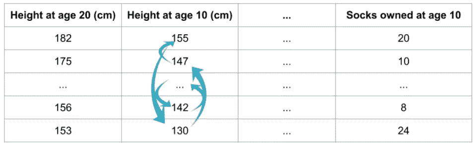*****

*****Illustration of how to calculate permutation importance ([https://www.kaggle.com/dansbecker/permutation-importance](https://www.kaggle.com/dansbecker/permutation-importance))*****

*****使用上表中的变量名，假设我们想预测一个人 20 岁时的身高(第一列)，使用 10 岁时的数据(其他列)。*****

*****现在，我假设我们已经训练了一些模型，并且具有下降精度(下面的步骤 0)—同样，如果没有下降模型，我们无法获得变量重要性。*****

> ******0。成功做出一个好的预测模型。******
> 
> ******1。排列重要性从随机排列单个列中的值开始，以准备一种“新的”数据集。******
> 
> ******2。接下来使用“新”数据，使用预训练模型进行预测(不要使用“新”数据重新训练模型！).精度应该比原始数据的精度稍差，并且应该增加损失函数。注意损失函数增加。******
> 
> ******3。将数据恢复到原始顺序，重复相同的洗牌，并在下一列进行测量。******
> 
> ******4。可选但常见的是，将所有变量中的重要性标准化为总计 1.0。******
> 
> ******5。改变洗牌，我们可以多次计算一个变量的重要性。因此，我们可以计算排列重要性的平均值和标准差。******

*****下面是使用 sci kit-learn 0.22 版中新函数`[permutation_importance](https://scikit-learn.org/stable/modules/generated/sklearn.inspection.permutation_importance.html)`的示例代码。使用的数据集来自 [Kaggle 竞赛“纽约市出租车费用预测”](https://www.kaggle.com/c/new-york-city-taxi-fare-prediction/data)。代码的输出是基于树的变量重要性与排列重要性输出的比较。*****

*****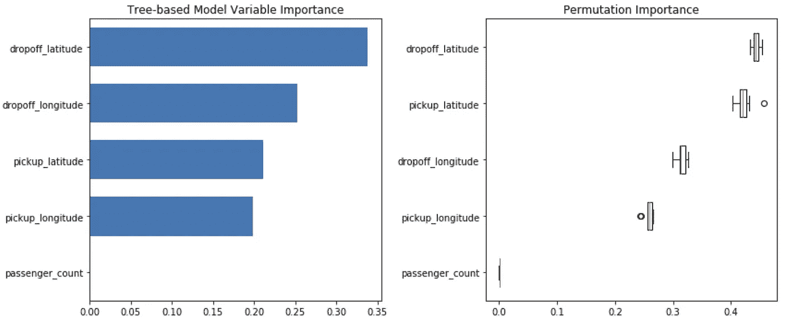*****

*****Tree-based vs. permutation importance. Find permutation importance has confidence interval.*****

# *****5.部分相关图*****

*****变量重要性为每个变量给出一个重要性分数，这有助于了解哪个变量影响更大或更小。*****

******【PDP】***则给出了代表变量在哪个取值范围对最终预测影响有多大的曲线。*******

*****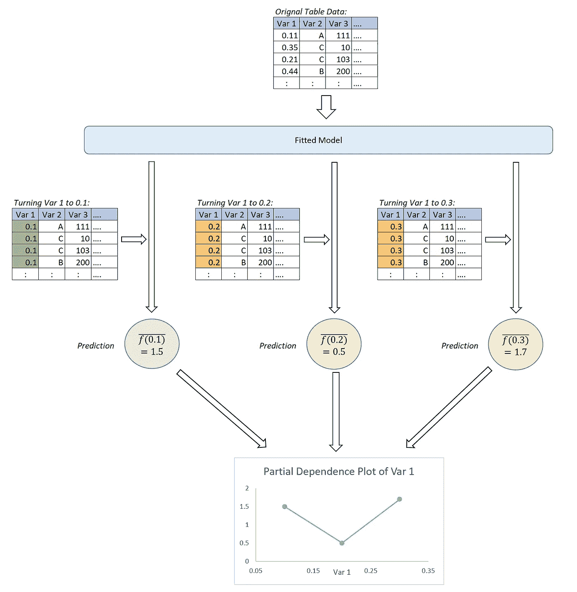*****

*****Illustration of Partial Dependence Plot (PDP)*****

*****在从原始数据表拟合模型后，有意地将想要获得 PDP 的变量值更改为特定量，并运行预测，重复预测以覆盖区间。*****

*****PDP 可以通过 scikit-learn 版本 0.22 中的新函数`[plot_partial_dependence](https://scikit-learn.org/stable/modules/generated/sklearn.inspection.plot_partial_dependence.html)`实现。*****

*****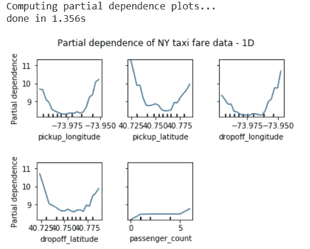*****

*****1D partial dependence plots of lightgbm model prediction from NY taxi fare data*****

*****可以存在**双变量版本的 PDP。**新的 scikit-learn 功能支持其中任何一种。*****

*****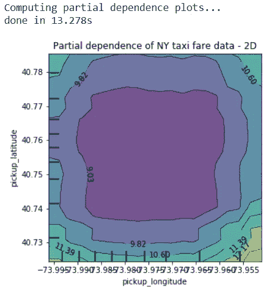*****

*****2D partial dependence plots of lightgbm model prediction from NY taxi fare data*****

*****从上面的 PDP 输出中，我们可以看到 PDP 的计算量更大，并且需要时间来运行，尤其是一个 2D PDP 甚至需要 13 秒。*****

# *****6.沙普利附加解释(SHAP)*****

******【SHAP】*与其他方法论最重要的区别是，SHAP 赋予**行&变量级影响预测**。*****

*****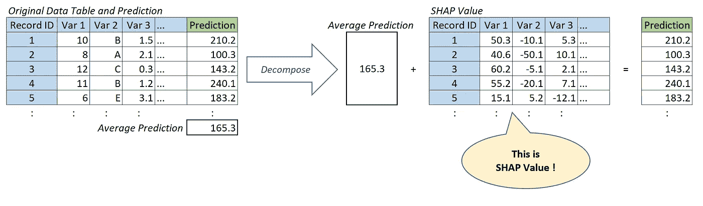*****

*****Illustration of SHAP*****

*****在该图中，每个记录 ID 的预测值将被分解为**“预测”=“平均预测”+“每个变量的 SHAP 值”**。*****

*****那么，他们是如何做到的呢？SHAP 是基于*联盟博弈论*中的 Shapley 值方法。Shapley 值的本质是衡量联盟中每个成员对最终结果的贡献，保持贡献的总和等于最终结果。进一步讨论见[此处](https://christophm.github.io/interpretable-ml-book/shapley.html)。*****

*****这里的数学机制太难描述了，我也不完全理解:)，但至少我们可以运行 API 来获得 SHAP 值，这要感谢 [python 库](https://github.com/slundberg/shap) `[shap](https://github.com/slundberg/shap)`。*****

*****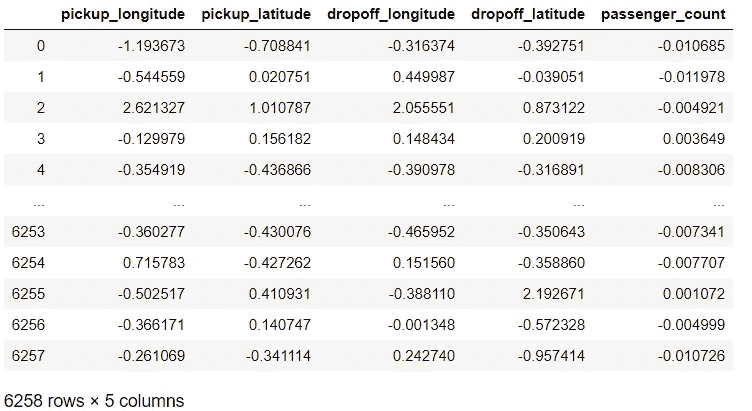*****

*****How SHAP values look like.*****

*****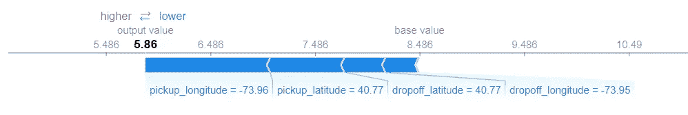*****

*****SHAP: Visualize SHAP values to the first row data (prediction average 8.486 to first row prediction 5.86)*****

*****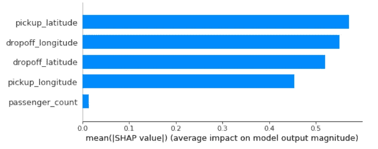*****

*****SHAP: Variable importance-like plot (based on average of absolute SHAP value)*****

*****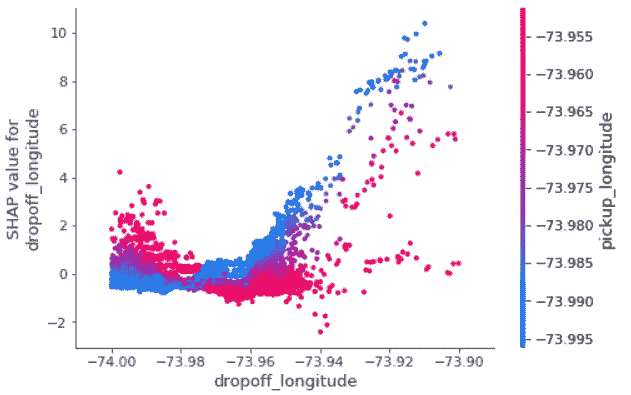*****

*****SHAP: PDP-like visualization*****

*****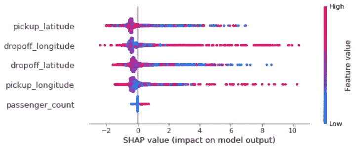*****

*****SHAP: Each plot represents one data row, with SHAP value for each variable, along with red-blue as the magnitude of the original data.*****

*****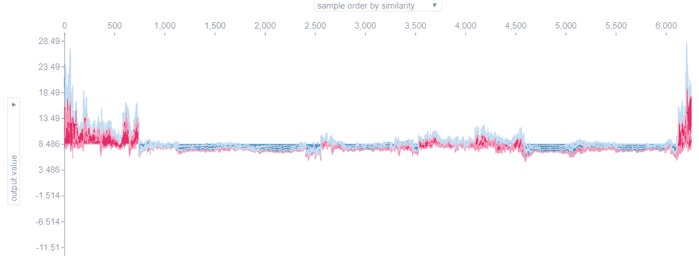*****

*****SHAP: Plot to play around interactively (two axis have pull-down menu to change items to show)*****

**********

*****Photo by [Lan Pham](https://unsplash.com/@lanipham?utm_source=medium&utm_medium=referral) on [Unsplash](https://unsplash.com?utm_source=medium&utm_medium=referral)*****

# *****7.那么，用哪个呢？*****

*****我们看到了三种不同的模型可解释性输出:可变重要性、PDP 和 SHAP。它们都提供不同外观的输出。当我们想要解释的时候，我们如何选择其中之一呢？*****

## *****a.SHAP 值可以用于其他任何事情。*****

*****第一点是:*****

> *****从某种意义上说，SHAP 具有优势，因为他们提供最精细的输出。*****

*****粒度输出可以汇总为粒度更小的输出，反之则不成立。这表明:*****

> *****根据 SHAP 值，我们可以计算出可变重要性结果和 PDP 图:*****

*****取每个变量的绝对 SHAP 值的平均值将是一种变量重要性，绘制变量值对同一变量的 SHAP 值是一种 PDP。*****

*****[这个网页](https://christophm.github.io/interpretable-ml-book/shap.html#examples-4)给出了一个令人敬畏的列表，并解释了 SHAP 值的可能用途，甚至像*使用 SHAP 值进行聚类*。*****

## *****b.那么，为什么人们不总是使用 SHAP 呢？*****

*****SHAP 的一个缺点是它需要较长的计算时间。有两种类型的 SHAP，据报道*“kernel shap”*超级超级慢(参见上面示例代码中的注释；它慢了 40K 倍！！)，而另一种类型*“TreeSHAP”*则实现速度更快。然而，让我们记住一件事:*****

> *****不幸的是，TreeSHAP 只适用于基于决策树的模型。*****

*****不使用 SHAP 的另一个原因是，你为什么想要模型解释，*****

> *****获取行和列级别的 SHAP 值可能会矫枉过正，而且不是实现目标的直接方法。*****

## *****c.当可变重要性足够时*****

*****在某些情况下，可变重要性就足够了，我们不需要 PDP 或 SHAP。*****

*   ********当我们希望领域专家对模型合理性进行嗅探测试时。********

*****可变重要性给出其对预测的重要性的单一分数。这可以让非数据专家的领域专家确保模型是合理的。他们只能从每个变量的重要性的条形图中进行判断，如果不常见的变量变高，这可能是识别模型错误或数据泄漏的提示。*****

*   ********当我们要对变量重要性的顺序做变量选择时。********

*****变量选择在建模中非常有用，可以用更简单的方式解释模型，消除模型噪声以提高精度，避免共线性等。*****

*****对于可变重要性输出，我们可以选择具有最高重要性的原始变量集的子集。*****

*****在上面的纽约出租车费用示例中，很明显，乘客数量与费用金额无关，这从常识来看是有道理的，因为纽约出租车费用公式与乘客数量无关(虽然乘客多的出租车可能比单人出租车走得更远，但这对于我们从上下车地点获得的信息来说并不是新信息。)*****

## *****d.PDP 够用的时候。*****

*****此外，在某些情况下，我们想要的不仅仅是可变的重要性，但是 PDP 就足够了，SHAP 也是多余的。*****

*   ********当我们知道哪个变量是重要的，而我们只想挖掘“如何”时。********

*****通过变量重要性研究，我们可以知道哪个变量使模型具有预测性，但接下来我们很自然地开始想知道它是如何做到的，即重要变量的哪个范围使预测更高或更低。*****

*****在上面的纽约出租车费用的例子中，我们了解到的是，在经度或纬度的终点，而不是中间让乘客上车或下车的出租车应该有更高的收益——曼哈顿中间的乘客很可能是短途乘客。*****

*****从这里，自然要想出一个新的特征工程思想来取取送地点之间的距离，而不仅仅是那两个单独的绝对位置。*****

**********

*****Photo by [Priscilla Du Preez](https://unsplash.com/@priscilladupreez?utm_source=medium&utm_medium=referral) on [Unsplash](https://unsplash.com?utm_source=medium&utm_medium=referral)*****

# *****8.结论*****

*****模型可解释性在调试、特征工程、指导未来的数据收集、人类决策和建立信任中是有用的。*****

*****我已经介绍了三种类型的可解释性方法，可变重要性(基于树和排列)，部分依赖图(PDP)和 SHAP。*****

*****虽然 SHAP 是了解模型可解释性的最细粒度的方法，并且可以检索类似于其他方法的输出，但是运行会花费时间并且变得过度。*****

*****我们数据科学家应该首先从为什么我们想知道模型的解释开始，并使用最符合目的的方法。*****

# *****9.参考*****

*****[sci kit 发布亮点-学习 0.22](https://scikit-learn.org/stable/auto_examples/release_highlights/plot_release_highlights_0_22_0.html)*****

*****Kaggle 课程[“机器学习可解释性”](https://www.kaggle.com/learn/machine-learning-explainability)*****

*****[Christoph Molnar“可解释的机器学习——让黑盒模型变得可解释的指南。”](https://christophm.github.io/interpretable-ml-book/)*****

*****[Joshua Poduska“SHAP 和 LIME Python 库:第 1 部分——伟大的解释者，两者都有优点和缺点”](https://blog.dominodatalab.com/shap-lime-python-libraries-part-1-great-explainers-pros-cons/)*****