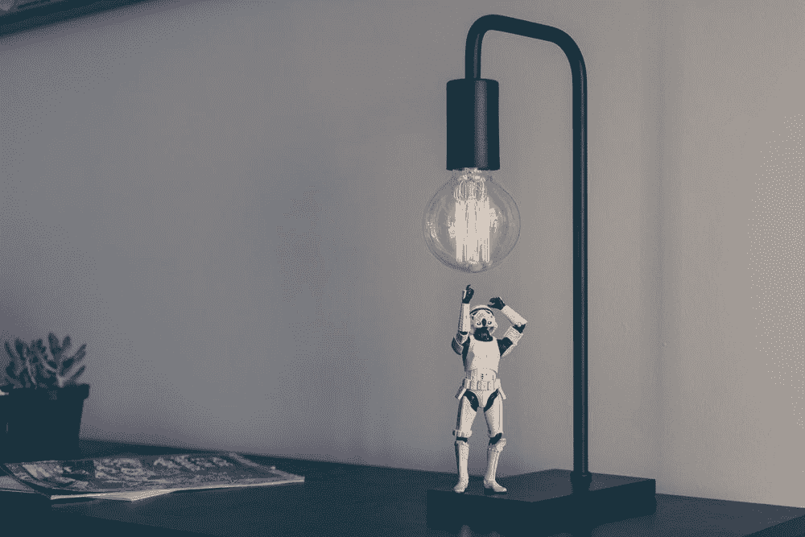

# 在现实世界中扩展机器学习的三种实用方法

> 原文：<https://towardsdatascience.com/three-practical-ways-to-scale-machine-learning-in-the-real-world-7a63504212fc?source=collection_archive---------25----------------------->

## 随着 NeurIPS 向人工智能世界发出了一个发人深省的信息，机器人行业似乎对扩展机器学习解决方案有了更务实的态度。

NeurIPS(神经信息处理系统会议)刚刚以创纪录的出席人数结束，即使是抽签系统也难以容纳。9000 张门票在 12 分钟内售罄，向来自世界各地的 AI 展示了爆炸式的兴趣。然而，尽管人工智能创新不仅开始在学术界出现，也开始在工业界出现，但大多数公司仍在努力识别高价值的用例，并在现实世界中扩大人工智能的规模。

我工作的公司提供机器学习软件，使工厂和仓库中的机器人更加自主和灵巧。为了弥合差距，我与机器人公司和系统集成商密切合作，将前沿的机器学习研究产品化。

上周我飞到了世界的另一端。世界上最大的机器人盛会——国际机器人展览会(IREX)在东京举行。在这里，领先的机器人公司展示了在机器人技术中应用人工智能和人工智能的各种方法。

> 人工智能实现了从自动化(硬编程)到真正自主(自我指导)的转变

之前我讲过*如何* [AI 推出下一代机器人 2.0 时代](https://medium.com/swlh/redefining-robots-demystify-next-generation-ai-enabled-robotics-fec64bfeb66c?source=---------12------------------)。在过去，机器人主要用于大规模生产线。它们被编程为以高精度和高速度执行相同的任务，但不能对变化或意外做出反应。

然而，随着消费者对定制需求的增长和劳动力的持续萎缩，我们需要更多自主和灵活的机器人。因此，公司开始尝试将 ML 纳入机器人技术的方法，使机器人能够处理传统机器人无法处理的广泛任务。在 IREX，ML 用于改善机器人视觉和控制以及现实世界用例的可扩展性。

 [## 重新定义机器人:揭开下一代人工智能机器人的神秘面纱

### 这是一系列关于机器人和人工智能对各种行业的影响的第一篇文章。

medium.com](https://medium.com/swlh/redefining-robots-demystify-next-generation-ai-enabled-robotics-fec64bfeb66c)  [## 它在这里！人工智能机器人将如何革新制造业

### 虽然制造业一直被认为是自动化程度最高的行业，但全自动化…

towardsdatascience.com](/its-here-how-ai-robot-will-revolutionize-manufacturing-44ce784438d4) 

# 机器人视觉:识别、可伸缩性和自我学习的突破。

即使是最先进的 3D 结构光相机也很难识别带有透明包装、反射或黑暗表面的物体，因为光会被散射或吸收。

由于项目相互重叠，混乱的场景带来了更多的挑战。这就是为什么摇床和零件送料器被广泛应用于制造业。

此外，传统的机器视觉系统不够灵活:为了进行模式匹配，您需要通过事先上传 CAD 模型来注册对象。即使在这个过程中有一点小小的变化，你也必须重新注册这些物品，并给机器人重新编程。

但是现在，随着包括[深度学习、语义分割和场景理解](/its-here-how-ai-robot-will-revolutionize-manufacturing-44ce784438d4)在内的领域的最新进展，我们可以用商品相机识别透明和反射包装。

在 FANUC 的展位上，一个捡垃圾箱的 LR Mate 200iD 机器人用深度学习算法和 3D 传感器捡空气接头。这些相同的零件被随机放在一个箱子里。Fanuc 声称，由于系统实时执行点云斑点匹配，因此不需要预注册。

就在发那科的展台旁边，川崎重工(KHI)展示了类似的箱柜分拣解决方案，利用了两家初创公司 Photoneo 和 Ascent 的 ML 技术。在展台的另一边，KHI 灵巧地展示了一个自动卸托盘机器人解决方案。这个机器人可以同时搬运各种尺寸的箱子。

在另一个大厅里，与 DensoWave 一起，旧金山的 ML 初创公司 OSARO 首次展示了它的“定向”功能:机器人可以从杂乱的垃圾箱中挑选透明的瓶子，不仅可以识别最佳的挑选点，还可以识别物体的方向(瓶子的顶部或底部)，并将瓶子垂直放置在传送带上。

Yosuke Sawada, General Manager of the Robot Business Division at Denso Wave, commented: “OSARO’s newly developed ‘Orientation’ feature is one of the technologies customers have been waiting for. This exciting new feature helps identify challenging items and improve picking rates for warehouse operators and factory automators.”

瓶子是完全透明的，因此很难用传统的机器视觉传感器识别。这是第一次展示这种特征。它允许人工智能机器人不仅用于拾取和放置，还用于装配、包装、机器装载和组装。

source: Bastiane Huang

# 机器人控制:智能布局和基于 SKU 的处理

作为人类，我们从出生就学会了拿起和放下各种物品。我们可以本能地完成这些任务。[但是机器没有这样的经验，必须学习这些任务。](/its-here-how-ai-robot-will-revolutionize-manufacturing-44ce784438d4)尤其是在日本这样的市场，能够整齐地摆放物品尤为重要。产品需要仔细整理和包装，不能有任何损坏。

利用 ML，机器人现在可以更准确地判断深度。模型还可以通过训练进行学习，并自动确定对象的方向和形状，例如，一个杯子是朝上还是朝下，或者处于其他状态。

对象建模或体素化可用于预测和重建 3D 对象。它们使机器能够更准确地呈现实际物品的大小和形状，并更准确地将物品放置在所需的位置。

这使得基于 SKU 的处理成为可能:机器人可以根据每个 SKU 自动决定轻轻地放置或快速放下物品。因此，我们可以在不损坏任何易碎物品的情况下优化系统的吞吐量。

公司也开始在运动规划中尝试强化学习或机器学习。正如 IREX 所说，Acsent 展示了一个使用强化学习将两部分放在一起的视频。领先的机器人公司 Yaskawa 也在一次演讲中谈到了在路径规划中使用机器学习的潜在好处。

然而，如果需要大量的训练数据和长时间的训练，上述机器学习进步都无法在现实生活中部署。在机器人和自动驾驶汽车等现实世界的应用中获取训练数据既有挑战性又很昂贵。这就是为什么我特别兴奋地看到数据效率在 IREX 被提及。

# 现实世界的可伸缩性:数据效率

在 IREX 的一场演讲中，安川去年成立的一家新公司 AI Cube Inc .(“AI”)推出了 Alliom，这是一款帮助公司将建立机器学习模型的过程数字化的工具。

根据 AI Cube 的说法，Alliom 提供了一个模拟环境，可以进行数据增强，并生成与现实生活中的物体相似的合成数据。该公司已经使用 Alliom 来加速随机箱拣选的 ML 模型的训练过程，并希望将该解决方案扩展到各种应用中。

这表明机器人行业已经不仅仅是试验花哨的 ML 算法，而是开始考虑在实地实际应用支持 ML 的机器人。ML 解决方案不仅需要工作，还需要能够有效地跨各种用例进行扩展。否则，客户将没有动力在其设施中部署该系统。

我在之前的文章中提到，机器人公司正面临着“创新的困境”:他们意识到了创新的迫切需求，但他们仍然需要照顾自己的核心业务——需要高速高精工作的汽车和制造公司。这与其他部门对灵活性、灵巧性以及机器人学习识别和处理各种组件的能力的需求背道而驰。

在 IREX，几个机器人巨头与初创公司一起展出:仅举几个例子，KHI 与 Photoneo、灵巧和 AscentDensoWave 搭配 OSAROFanuc 与首选网络。机器人公司正在改变以拥抱人工智能。但他们对 ML 给机器人行业带来的变化反应够快吗？

在汽车行业，我们看到汽车原始设备制造商在向自动驾驶的过渡中努力与特斯拉和 Waymo 等新进入者竞争。到目前为止，我们还没有看到任何科技巨头进入机器人行业。然而，谷歌、DeepMind 和脸书已经从事机器人相关的机器学习研究有一段时间了。

观察人工智能将如何扰乱和重新洗牌机器人行业将是一件有趣的事情。在科技巨头、机器人制造商、制造商和人工智能初创公司中，谁将在人工智能定义的机器人时代巩固地位？

 [## 在人工智能定义的自动化的新时代，公司会蓬勃发展还是勉强生存？

### 我们谈到了 AI 如何使机器人能够执行过去无法完成的任务。会有什么影响…

towardsdatascience.com](/manufacturing-industry-reshuffle-will-companies-thrive-or-barely-survive-in-the-new-era-of-aa06a3cade5c) 

如果你想看更多这样的文章，请点击这里！

Bastiane Huang 是 OSARO 的产品经理，OSARO 是一家总部位于旧金山的初创公司，致力于开发软件定义的机器人。她曾在亚马逊的 Alexa 小组和哈佛商业评论以及该大学的未来工作倡议中工作。她写关于人工智能、机器人和产品管理的文章。跟着她到这里 。