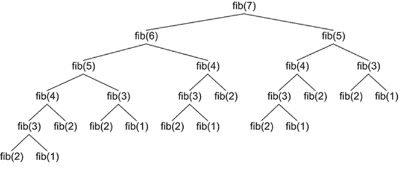
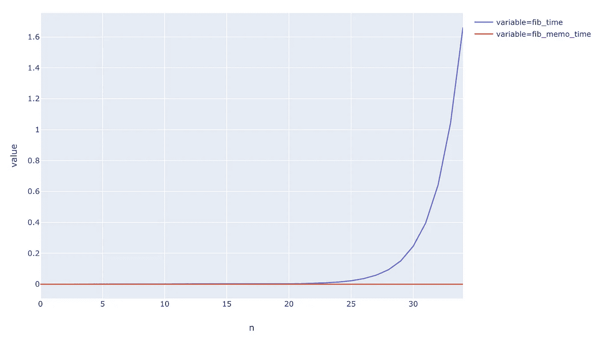
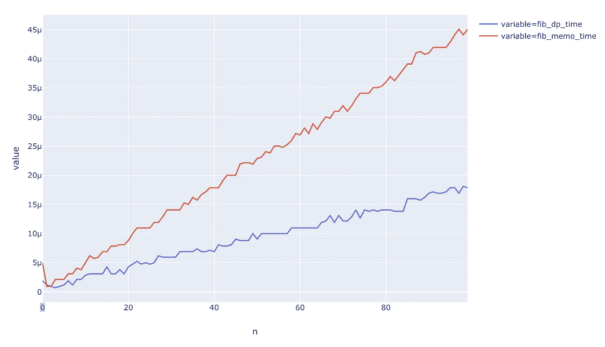
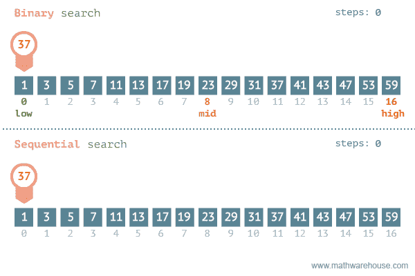
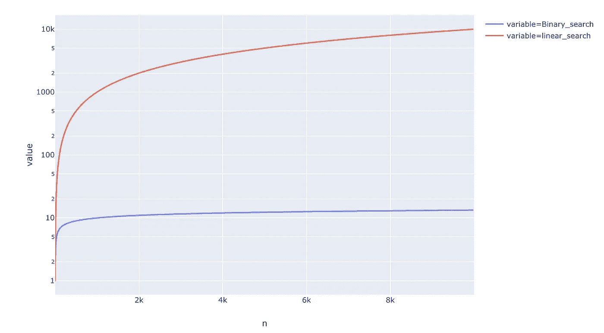

# 数据科学家的 3 个编程概念

> 原文：<https://towardsdatascience.com/three-programming-concepts-for-data-scientists-c264fc3b1de8?source=collection_archive---------11----------------------->


Image by [Sasin Tipchai](https://pixabay.com/users/sasint-3639875/?utm_source=link-attribution&utm_medium=referral&utm_campaign=image&utm_content=1822704) from [Pixabay](https://pixabay.com/?utm_source=link-attribution&utm_medium=referral&utm_campaign=image&utm_content=1822704)

## [算法面试](https://towardsdatascience.com/tagged/algorithms-interview)

## 更少的数学和更多的代码

算法是数据科学不可或缺的一部分。虽然我们大多数数据科学家在学习时没有上过适当的算法课程，但它们仍然很重要。

许多公司在招聘数据科学家的面试过程中会询问数据结构和算法。

现在，许多人在这里问的问题是，问一个数据科学家这样的问题有什么用。 ***我喜欢这样描述，一个数据结构问题可以被认为是一个编码能力测试。***

我们都在人生的不同阶段进行过能力倾向测试，虽然它们不是判断一个人的完美代理，但几乎没有什么是真的。那么，为什么没有一个标准的算法测试来判断人的编码能力。

但我们不要自欺欺人，他们需要像你的数据科学面试一样的热情来破解，因此，你可能需要花一些时间来研究算法。

***这个帖子是关于快速跟踪的，以一种容易理解的方式为数据科学家研究和平移一些基本的算法概念。***

# 1.递归/记忆

递归是被定义的函数在它自己的定义中被应用。简单来说；递归是函数调用自己。当你在那里搜索递归的时候，谷歌做了一些非常有趣的事情。


希望你明白这个笑话。虽然递归对于初学者来说可能有点令人生畏，但它非常容易理解。一旦你知道了，这是一个美丽的概念。

我找到的解释递归的最好例子是计算一个数的阶乘。

```
def factorial(n):
    if n==0:
        return 1
    return n*factorial(n-1)
```

我们可以很容易地看出阶乘是一个递归函数。

`Factorial(n) = n*Factorial(n-1)`

***那么它如何翻译成编程呢？***

递归调用的函数通常由两部分组成:

*   基本情况——递归结束的情况。
*   递归公式--向基本情况发展的公式化方法。

你最终解决的很多问题都是递归的。它也适用于数据科学。

比如决策树只是二叉树，树算法一般是递归的。或者说，我们确实在很多时候使用了 sort。负责这个的算法叫做 ***mergesort，*** 本身就是一个递归算法。还有一个是 ***二分搜索法，*** 其中包括寻找数组中的一个元素。

现在我们有了递归的基本窍门，让我们试着找出第 n 个斐波那契数。斐波纳契数列是一系列数字，其中每个数字(*斐波纳契数*)是前面两个数字的和。最简单的是 1，1，2，3，5，8 等系列。答案是:

```
def fib(n):
    if n<=1:
        return 1
    return fib(n-1) + fib(n-2)
```

***但是你发现这里的问题了吗？***

如果您尝试计算 fib(n=7 ),它会运行 fib(5)两次，fib(4)三次，fib(3)五次。随着 n 变大，对同一个号码进行了很多次调用，我们的递归函数一次又一次地计算。



[Source](https://www.rubyguides.com/2015/08/ruby-recursion-and-memoization/)

我们能做得更好吗？是的，我们可以。我们可以稍微改变一下我们的实现，添加一个字典来为我们的方法增加一些存储空间。现在，每当计算出一个数字时，这个备忘录字典就会更新。如果该数字再次出现，我们不会再次计算它，而是从备忘录字典中给出结果。这种存储的增加叫做 ***记忆*** 。

```
memo = {}
def fib_memo(n):
    if n in memo:
        return memo[n]
    if n<=1:
        memo[n]=1
        return 1
    memo[n] = fib_memo(n-1) + fib_memo(n-2)
    return memo[n]
```

通常，我喜欢先编写递归函数，如果它反复调用相同的参数，我会添加一个字典来记忆解决方案。

***有多大帮助？***



这是不同 n 值的运行时间比较。我们可以看到，没有记忆的 ***斐波那契函数的运行时间呈指数增长，而有记忆的函数的运行时间呈线性增长。***

# 2.动态规划


Bottoms Up

递归本质上是一种自顶向下的方法。当计算斐波那契数 n 时，我们从 n 开始，然后递归调用 n-2 和 n-1 等等。

在动态编程中，我们采用自底向上的方法。它本质上是一种迭代编写递归的方法。我们首先计算 fib(0)和 fib(1 ),然后使用以前的结果生成新的结果。

```
def fib_dp(n):
    dp_sols = {0:1,1:1}
    for i in range(2,n+1):
        dp_sols[i] = dp_sols[i-1] + dp_sols[i-2] 
    return dp_sols[n]
```



以上是 DP 与 Memoization 的运行时比较。我们可以看到，它们都是线性的，但 DP 还是快一点。

为什么？因为在这种情况下，动态编程只对每个子问题进行一次调用。

有一个关于开发动态编程的贝尔曼如何构建术语 *:* 的精彩故事

> 动态编程这个名字是怎么来的？20 世纪 50 年代不是数学研究的好年头。我们在华盛顿有一位非常有趣的绅士，名叫[威尔森](https://en.wikipedia.org/wiki/Charles_Erwin_Wilson)。他是国防部长，他实际上对研究这个词有一种病态的恐惧和憎恨。我能选择什么头衔，什么名字？首先，我对计划、决策和思考感兴趣。但是规划，由于种种原因，并不是一个好词。因此，我决定使用“编程”一词。我想让大家明白这是动态的，是多阶段的，是时变的。我想，一石二鸟吧。因此，我认为动态编程是一个好名字。**这是连国会议员都不会反对的事情。**所以我把它当活动用的雨伞。

# 3.二进位检索

假设我们有一个有序的数字数组，我们想从这个数组中找出一个数字。我们可以走直线路线，逐一检查每个数字，如果找到数字就停下来。问题是，如果数组包含数百万个元素，那么时间会太长。这里我们可以使用二分搜索法。



[Source](http://mathwarehouse.com/programming): Finding 37 — There are 3.7 trillion fish in the ocean, they’re looking for one

```
# Returns index of target in nums array if present, else -1 
def binary_search(nums, left, right, target):   
    # Base case 
    if right >= left: 
        mid = int((left + right)/2)
        # If target is present at the mid, return
        if nums[mid] == target: 
            return mid 
        # Target is smaller than mid search the elements in left
        elif nums[mid] > target: 
            return binary_search(nums, left, mid-1, target) 
        # Target is larger than mid, search the elements in right
        else: 
            return binary_search(nums, mid+1, right, target) 
    else: 
        # Target is not in nums 
        return -1nums = [1,2,3,4,5,6,7,8,9]
print(binary_search(nums, 0, len(nums)-1,7))
```

这是一个基于递归算法的高级例子，我们利用了数组是有序的这一事实。这里我们递归地查看中间的元素，看看我们是想在中间元素的左边还是右边进行搜索。这使得我们的搜索空间每走一步就缩小 2 倍。

因此该算法的运行时间是`O(logn)`，与线性搜索的`O(n)`相反。

这有多重要？下面是运行时间的比较。我们可以看到，与线性搜索相比，二分搜索法非常快。



For n=10000, Binary search takes around 13 steps, and the Linear search takes 10000 steps.

# 结论

在这篇文章中，我谈到了一些最激动人心的算法，它们构成了编程的基础。

这些算法是数据科学面试中一些最常被问到的问题的背后，对这些算法的良好理解可能会帮助你获得理想的工作。

虽然您可以在不学习它们的情况下在数据科学中走得更远，但您可以为了一点乐趣而学习它们，也许是为了提高您的编程技能。

如果你想学习算法和数据结构，也可以看看我在[系列](https://towardsdatascience.com/tagged/algorithms-interview)的其他帖子。

# 继续学习

如果你想在算法方面读得更多，这里有一个 UCSanDiego 在 Coursera 上的 [**算法专门化**](https://coursera.pxf.io/15MOo6) **，**我强烈推荐学习算法基础。

谢谢你的阅读。将来我也会写更多初学者友好的帖子。在[](https://medium.com/@rahul_agarwal?source=post_page---------------------------)**关注我或者订阅我的 [**博客**](http://eepurl.com/dbQnuX?source=post_page---------------------------) 了解他们。一如既往，我欢迎反馈和建设性的批评，可以通过 Twitter [@mlwhiz](https://twitter.com/MLWhiz?source=post_page---------------------------) 联系。**

**此外，一个小小的免责声明——这篇文章中可能会有一些相关资源的附属链接，因为分享知识从来都不是一个坏主意。**