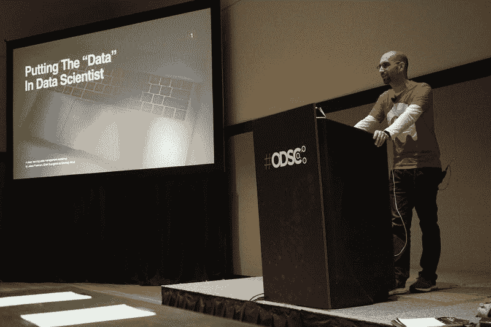

# 我在亚马逊学到的三件事为我从事机器学习做好了准备

> 原文：<https://towardsdatascience.com/three-things-i-learned-at-amazon-that-prepared-me-for-a-career-in-machine-learning-63b6dae5bc5?source=collection_archive---------17----------------------->

## 亚马逊的文化为我从游戏开发到机器学习的工作转变做了比任何教程都多的准备。

Nick Youngson — [Wooden Tile Amazon Image](http://www.thebluediamondgallery.com/wooden-tile/a/amazon.html)

我在亚马逊工作了 5 年，离获得梦寐以求的“黄色徽章”只有几天了值得注意的是，亚马逊的平均任期是一到两年。虽然有很多关于在亚马逊工作的故事，但我觉得那里的文化比任何教程都更能为我从游戏开发到机器学习的工作转变做好准备。

如果你不太了解亚马逊的文化，那么快速的[谷歌搜索](http://bfy.tw/OPZk)是值得的。此外，虽然我可能可以写一整本书来讲述我在那里的经历，但我认为我应该专注于我学到的为这一新的职业发展做准备的三件事:数据驱动、写 6 页纸和足智多谋。亚马逊有一套被称为[领导原则](https://www.amazon.jobs/en/principles)的原则，这些原则造就了其独特的文化。自从我在 2014 年加入以来，同样的文化让亚马逊呈指数级增长。下面是我如何将这些知识应用到机器学习的新冒险中。

> 或许亚马逊企业文化最重要的部分是数据驱动的概念。

# 由数据驱动

虽然我工作过的许多公司都说他们这么做，但我还没有发现像亚马逊这样的公司。每一次计划或战略会议都是在回顾历史数据、实时数据和未来数据预测之间的微妙平衡。亚马逊将此归结为一门科学。

从 WBR(每周商业报告)试图将大量数据提取为可消化的形式，以便随时纠正错误，到大多数组织都有专门的数据分析师。分析师的唯一工作是帮助构建每周报告，连接不同业务部门的报告系统，并且主要是尽可能多地自动收集数据，以便我们可以随时了解业务部门的状态。

机器学习的支柱是数据本身。如果没有有用、干净、可靠的数据，就没有办法准确地训练、测试和验证模型。此外，虽然在构建模型的实际过程中花费了大量的时间和精力，但是理解数据本身是一项非常重要的技能。例如，我在东 ODSC 做了一次演讲，特别是关于管理用于检测癌症的大型数据集的挑战，如 T2 的 ChestXray14 数据集。

该研讨会的名称叫做“将‘数据’放入数据科学”，它完全专注于使用医疗数据进行深度学习的挑战。任何对机器学习感兴趣的人都应该具备的一项关键技能是，不仅要理解如何管理和处理数据，还要理解如何分割、验证和净化数据。你的实验和你拥有的数据一样好，知道如何管理它也同样重要。我在亚马逊学到了很多关于数据的重要性以及如何正确使用数据的知识。

# 写 6 页纸

A mazon 以其写作文化而闻名。虽然他们在入职培训中告诉你，任何人都可以提出一个想法，从头开始创建一个新的业务，例如 AWS 是如何产生的神话，但这是通过 6 页纸实现的。这些详细的文档不仅解释了一个策略或计划，而且还必须写成叙述。亚马逊会议中没有 powerpoint 演示。

All work and no play makes Jack a dull boy on [Imgur](https://imgur.com/gallery/46ntP2U)

大多数会议的前半部分是阅读文件，后半部分是在文件上戳洞。要在亚马逊取得成功，你需要能够使用数据来证明你的观点，以其他人可以理解的方式阐述你的想法，并创建一个任何人，无论他们是否参加了你的会议，都可以拿起并理解的文档。

> 任何在机器学习领域工作的数据科学家或工程师都应该具备的最关键技能；能够交流他们正在做什么，如何复制它，以及它提供的价值。

数据科学社区的很大一部分围绕着撰写和阅读研究论文。因此，虽然这很容易类比 6 页纸在亚马逊的重要性，因为写 6 页纸就像写一篇博士论文，但实际上，数据科学家应该出于多种原因记录他们的研究。通常，他们在团队中工作，因此能够跟踪达成解决方案的步骤是至关重要的。如果没有大量的实践，每个人都不具备获取这些知识并与团队或公司外部的其他人分享的能力。

我认为这是任何在机器学习领域工作的数据科学家或工程师都应该具备的最重要的技能之一；能够交流他们正在做什么，如何复制它，以及它提供的价值。

# 随机应变

从外面看，亚马逊似乎是一个拥有几乎无限资源的大型组织；现实情况是，每个部门的团队通常都很小。事实上，规模如此之小，以至于他们有时人手不足。此外，团队应该精益运营，相应地管理有限的资源，大多数时候，你会身兼数职。

虽然一个团体可以获得更多的资源，但亚马逊的核心原则是节俭。要在亚马逊取得成功，你需要尽你所能做到最好，并发挥创造力来实现你的最终目标。甚至有一个原则叫做行动偏好，它允许你不顾限制地变通规则来完成某件事，只要是为了最终目标的利益。

> 我没有预料到每次训练之间所花费的时间，也没有预料到加速训练所需的 GPU 资源。

随着我对机器学习的深入研究，我很清楚管理资源在我进行的每个实验中是如何发挥关键作用的。我没有预料到每次训练之间所花费的时间，也没有预料到加速训练所需的 GPU 资源。此外，随着我运行越来越多的实验，我需要找到创造性的方法来平衡云中的扩展和利用本地资源。

Panumas Nikhomkhai — [pixels.com](https://www.pexels.com/photo/bandwidth-close-up-computer-connection-1148820/)

大多数时候，我会尽可能多地进行本地测试，然后在多台经过不同修改的计算机上并行运行我的云中实验，以更好地帮助确定哪个解决方案是最佳的。目前，数据科学家很难聘用，所以有可能你最终会在较小的团队中工作，需要找出如何在每个人之间共享资源，并在保持低成本的同时加快培训模型之间的时间。这是一个微妙的平衡动作。

# 把这些放在一起

人们问我为什么从游戏开发转向机器学习，我最感兴趣的事情之一是如何解决我看到的数据科学家每天都在努力解决的许多问题。您如何同时管理多个实验，处理大型数据集，并扩展工作负载以提高效率？这些都是我在进入游戏行业前几年做 Web 开发时学到的东西，我觉得我可以将我所知道的贡献给机器学习社区。

最近，我一直在围绕[DeepOps——或深度学习操作](https://venturebeat.com/2019/07/10/accountability-and-reproducibility-in-deep-learning-through-deepops/)的想法做演讲。这是一个概念，借用了 DevOps，将深度学习的所有痛点自动化。这些恰好也是我在亚马逊学到的一些技能。我发现有趣的是，让我在亚马逊取得成功的东西和目前帮助我在机器学习方面取得更好成绩的东西之间有很多重叠。当你将这些实践融入一家公司的文化中时，你会取得令人难以置信的成就，并且希望，随着时间的推移，DeepOps 也能成为自己的文化。然而，那是另一篇文章了。