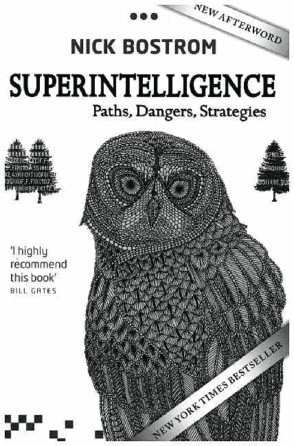
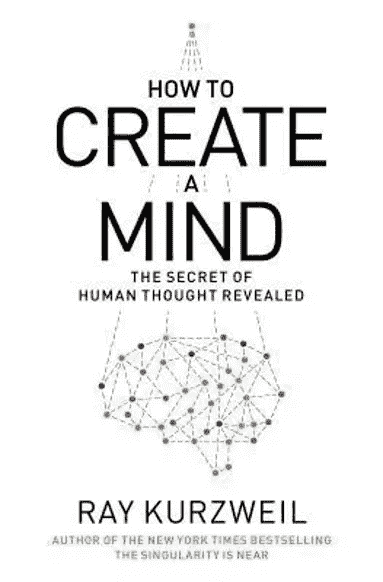
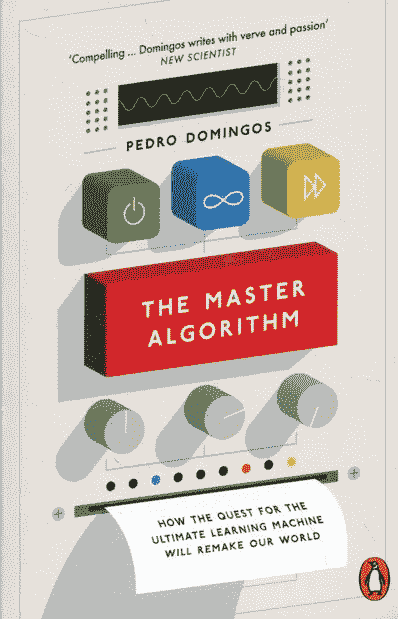

# 关于人工智能和机器学习的三本顶级书籍

> 原文：<https://towardsdatascience.com/three-top-books-about-artificial-intelligence-and-machine-learning-b48ff2fa3548?source=collection_archive---------2----------------------->

## 三本令人难以置信的人工智能书籍，让你的思维开窍，思维活跃。

在这篇文章中，我将谈论**三本关于人工智能和机器学习的书**，我发现它们是每个这些主题的爱好者必读的。从阅读这些书籍中获得的经验千差万别:其中一本书将**谈论人工智能正在走向**，通往它的不同道路，可能的危险，以及处理这些危险的方法。

其中一本书将**剖析大脑的功能**，并恢复我们神经系统内部发生的事情与机器学习模型内部发生的事情的相似性。

最后一个谈到了不同的机器学习家族，机器学习的**最终目标**(主要从研究的角度)，我们与这个目标的关系如何，以及我们最有可能达到这个目标的方式是什么。

**如果这听起来有趣，请继续阅读**来寻找这些精彩的文学作品，不要担心，我只是浅尝辄止地谈论书籍的内容，以鼓励你阅读它们，绝对没有剧透**:)**

# **尼克·博斯特罗姆的《超级智慧》**

****麻雀未完成的寓言:****

**这是筑巢的季节，但经过几天漫长的辛勤劳动，麻雀们坐在晚霞中，放松地鸣叫着。**

***“我们都那么弱小。想象一下，如果我们有一只可以帮我们筑巢的猫头鹰，生活会变得多么轻松！”***

***“是！”另一个人说，“我们可以用它来照顾我们的老人和孩子”***

**第三个人补充道:“它能给我们建议，还能帮我们留意邻居家的猫。”。**

**老鸟帕斯托斯说:“让我们向四面八方派出侦察兵，设法在某个地方找到一只被遗弃的小猫头鹰，或者一只蛋。一只乌鸦或者一只小黄鼠狼也可以。这可能是发生在我们身上的最好的事情，至少自从在那边后院的无限谷物馆开业以来。”**

**鸟群兴奋起来，到处的麻雀开始声嘶力竭地鸣叫。**

**只有脾气暴躁的独眼麻雀斯克罗芬克不相信“奋进号”的智慧。他说:“这肯定会导致我们的毁灭。在我们把这种动物带到我们中间之前，我们难道不应该先考虑一下驯化和驯服猫头鹰的艺术吗？”**

**驯服猫头鹰听起来是一件非常困难的事情。找到一个猫头鹰蛋就够了。所以让我们从这里开始。在我们成功饲养了一只猫头鹰之后，我们可以考虑接受另一项挑战。”帕斯图回答道。**

**"*那个计划有一个漏洞！"*吱吱叫*scrnkfinkle；但他的抗议是徒劳的，因为鸥群已经起飞，开始执行帕斯图制定的指令。***

**只有两三只麻雀留在后面。他们一起开始尝试研究如何驯服或驯化猫头鹰。他们很快意识到帕斯图斯是对的:这是一个非常困难的挑战，尤其是在没有真正的猫头鹰来练习的情况下。尽管如此，他们还是尽最大努力，时刻担心在找到控制问题的解决方案之前，鸟群可能会带着猫头鹰蛋回来。**

**这个故事开始于瑞典哲学家尼克·博斯特罗姆的一本书《超级智慧》，这本书讨论了在不久的将来机器是否会变得比人类更聪明的问题。 ***麻雀未完成的寓言*** 指的是一个我们并不完全熟悉的实体的控制问题，其权力可能超出了我们个人的能力范围。**

**虽然时间还不确切，但人工智能领域的顶尖人物普遍认为，机器达到与人类同等智能的那一天终将到来。**

**当这一天到来的时候，**会就此打住吗？或者，机器会利用它们新达到的人类水平的智能，超越这个门槛，达到比人类更高的意识和知识水平，**让它们主宰世界，甚至整个宇宙？******

****什么是智力？有哪些形式的智能存在？机器最有可能实现这种**超智能**的方式是什么？我们会为这一事件做好准备吗？如果没有，**怎么准备？有哪些可能的结果？人工智能的行为有什么特定的动机吗？******

**博斯特罗姆在这本精彩的书中用大约 320 页的文字、图表和图像回答了这些问题以及更多的问题。如果你想知道其中任何一个问题的答案，或者只是想了解人工智能可能存在的缺点，这本书绝对是不遗余力的必读之作。**

****

# ****雷·库兹韦尔《如何创造思维》****

***“如果一台机器被证明与人类无法区分，我们应该给予它与人类一样的尊重——我们应该接受它有思想”***

**在 [***如何创造一个头脑***](https://amzn.to/3lqA7sa) ***，*** 雷·库兹韦尔 ***，*** 谷歌工程总监，揭露了他的**大脑运作理论*，*** 基于等级模式识别器的存在，我们从其最低抽象层次向其最高维度投射现实。你可能已经注意到我使用了“他的理论”这个术语。**

**这是因为即使在过去的十年中，神经学和神经科学领域已经取得了一些惊人的成就，**我们对大脑的知识仍然有许多迷雾**，因此本文所描述的也不过如此；一种理论。**

**在整本书中，我们可以发现与**我们大脑**内部执行的底层过程之间的许多**相似之处，以及支持**各种技术**的基本过程，主要是基于机器学习的，比如像 *Alexa* 和 *Siri* 这样的虚拟助手，或者例如自动驾驶汽车。****

**我们头脑中大约 350 克的质量和我们所知的写这篇文章的计算机有很多相似之处。**

**库兹韦尔还揭示了几个世纪以来，随着技术的使用，人类能力的提高:从第一把用来砍树的斧子到我们现在随身携带的智能手机，这些基本上是我们身体的延伸。谁知道呢，也许在几十年后，我们会使用类似的设备，但这些设备会直接**集成到我们的生物学中**。**

**最后，在这本书的结尾，有几章致力于心灵的哲学和形而上学方面，如意识、自由意志或同一性概念。**

**虽然这本书面向有技术背景或兴趣的读者，但任何想知道大脑如何工作的人都肯定会喜欢这本书，并进入我们这个时代最伟大的技术思想家之一的头脑。**

***“因为重要的东西都装在一个箱子里，所以你有一个头骨当你的大脑，一个塑料套当你的梳子，一个钱包当你的钱”***

****

# **佩德罗·多明戈斯的《大师算法》**

***“所有的知识——过去、现在和未来——都可以通过一个单一的通用学习算法从数据中推导出来”***

*****机器学习世界*，可以大致分为 5 个不同的大洲**，每个大洲代表一个特定的方法或算法家族，这些方法或算法家族或者在产生它的**范例**上，或者在每个家族的**底层方法**上，或者在算法工作的方式上，都不同于其他的。正因为如此，**他们每个人都擅长解决特定的问题**，并且有一些特定的用例应用。**

**然而，它们都有一个共同点:发现数据中隐藏的洞察力，并利用这些洞察力产生某种价值。前段提到的五大家族分别是: ***贝叶斯主义者*、*联结主义者*、*进化论者、* *类比主义者、*、*象征主义者*** *。***

**[本书](https://amzn.to/32t5QQM)以一个**小介绍*机器学习*** 开始，接着是作者工作的主要**动机**:**寻找一个通用的机器学习算法**，可以用来解决任何一种问题。已经开发了结合两个或更多上述家族的算法，收集了它们组成家族的优点，但是没有一个算法能够将它们全部联合起来。**

**然后**每个家族都被描述**，有他们的历史，优缺点，和主要算法。最后，多明戈斯谈到了人工智能即将到来的未来，描述了这种通用算法的优点和能力，但很大程度上撇开了在前几本书中提到的**可能的危险和挑战**。**

**虽然这本书即使对于非机器学习从业者来说也是一本很好的读物，但是如果我们确实对每一个家族有某种了解，并且至少在某种程度上使用过不同种类的算法，如朴素贝叶斯、支持向量机或神经网络，这将是最令人愉快的。与前两本书不同的是，**非常专注于机器学习**，然而一切都用大量的例子、类比和图表进行了非常非常好的解释。**

***“一种算法来统治他们，一种算法来发现他们，一种算法来把他们都带来，在黑暗中把他们捆绑起来，在数据所在的学习之地”***

****

# **结束语**

**一如既往，我希望你喜欢这篇文章，并且我已经说服你至少读了其中一本书。它们都是非常棒的作品，我本可以就它们中的每一个写一篇深入的文章，但从我的角度来看，**它们非常适合作为一个包**，如果你读完它们，你会对人工智能的当前状态有一个令人难以置信的概述。**

**在这里你可以找到它们的链接。**

*   **[***尼克·博斯特伦***](https://amzn.to/2QuyhYY)**
*   **[***如何创造心灵作者雷·库兹韦尔***](https://amzn.to/32BMLvR)**
*   **[***佩德罗多明戈斯***](https://amzn.to/32t5QQM) 掌握算法**

***随时与我联系*[*LinkedIn*](https://www.linkedin.com/in/jaime-zornoza/?source=post_page---------------------------)*或在 Twitter 上关注我@jaimezorno。还有，你可以看看我其他关于数据科学和机器学习的帖子* [*这里*](https://medium.com/@jaimezornoza?source=post_page---------------------------) *。好好读！***

***要找到更多关于人工智能的书籍，比如本文中的书评，请查看以下回购:***

** [## 人工智能书籍——如何学习机器学习

### 有一些关于人工智能和机器学习的书，把大部分技术放在一边…

howtolearnmachinelearning.com](https://howtolearnmachinelearning.com/books/artificial-intelligence-books/) 

*如果你想了解更多关于机器学习和人工智能的知识* ***在 Medium*** *上关注我，敬请关注我接下来的帖子！*

在那之前，保重，享受 AI！**