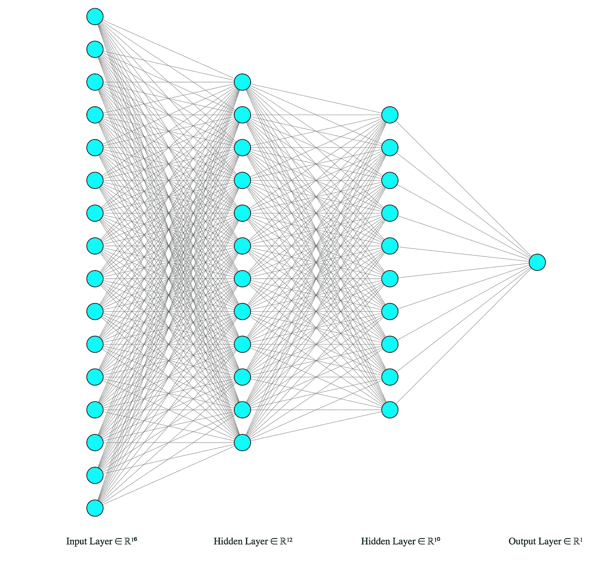

# PyTorch 中构建神经网络的三种方法

> 原文：<https://towardsdatascience.com/three-ways-to-build-a-neural-network-in-pytorch-8cea49f9a61a?source=collection_archive---------7----------------------->

## 体验 PyTorch 灵活的深度学习框架


Photo by [贝莉儿 DANIST](https://unsplash.com/@danist07?utm_source=medium&utm_medium=referral) on [Unsplash](https://unsplash.com?utm_source=medium&utm_medium=referral)

**TLDR；**
这不是 PyTorch 的教程，也不是解释神经网络如何工作的文章。相反，我认为分享一些我在 Udacity Bertelsmann 奖学金 AI 项目中学到的东西是个好主意。尽管如此，本文的目标是说明在 PyTorch 中创建神经网络的几种不同方法。

先决条件:我假设你知道什么是神经网络以及它们是如何工作的…所以让我们开始吧！

## **简介**

假设您想要定义以下神经网络，具有一个输入层、两个隐藏层和一个输出层，中间层具有 relu 激活，输出层具有 sigmoid 激活函数，如下所示:



Fully Connected (Feed Forward) Network

这是一个全连接的 16×12×10×1 神经网络，在隐藏层有 relu 激活，在输出层有 sigmoid 激活。

## **1。手动构建权重和偏差**

解决这个问题的一个方法是构建所有的模块。这是一种低级的方法，但如果你试图在刚刚阅读的论文上复制最新和最伟大的深度学习架构，这可能是合适的。或者如果你想开发一个定制层。不管怎样，PyTorch 会保护你的。你需要定义你的体重和偏好，但是如果你在这个水平上感到舒适，你就可以开始了。这里的关键是你需要告诉 PyTorch 在你的网络中什么是*变量*或*可优化*，这样 PyTorch 就知道如何在你的网络上执行**梯度下降**。让我们看看有人如何在低级 PyTorch 中实现这一点:

Building a neural network in low level PyTorch

## **2。扩展 *torch.nn.Model* 类**

在实践中，我们大多数人可能会使用预定义的层和激活函数来训练我们的网络。如果你朝这个方向走，有几条路可以走。一个更优雅的方法是创建你自己的神经网络 python 类，从 **torch.nn** 扩展**Model** 类。以这种方式定义神经网络有许多优点，也许最值得注意的是，它允许继承 **torch.nn** 模块的所有功能，同时允许覆盖默认模型构造和正向传递方法的灵活性。在这种方法中，我们将定义两种方法:

1.类构造函数， *__init__*

2.*前进*的方法

第一个是类的初始化器，在这里你将定义组成网络的层。通常我们不需要在这里定义激活函数，因为它们可以在正向传递中定义(即在 *forward* 方法中)，但这不是一个规则，如果你想的话，你当然可以这样做(我们实际上将在最后看到一个例子)。

第二种方法是定义向前传球。该方法接受一个表示模型将被训练的特征的输入。在这里，您可以调用激活函数，并将之前在构造函数方法中定义的层作为参数传入。您需要将输入作为参数传递给第一层，在处理激活后，输出可以被输入到下一层，依此类推。

让我们来看看在实践中如何做到这一点:

A more elegant approach to define a neural net in pytorch.

这是上面的输出..

```
MyNetwork(
  (fc1): Linear(in_features=16, out_features=12, bias=True)
  (fc2): Linear(in_features=12, out_features=10, bias=True)
  (fc3): Linear(in_features=10, out_features=1, bias=True)
)
```

在上例中， *fc* 代表*全连通*层，因此 fc1 代表全连通层 1，fc2 代表全连通层 2，以此类推。请注意，当我们打印模型架构时，激活功能没有出现。原因是我们使用了 *torch.nn.functional* 模块中的激活功能。它使代码更加紧凑，适合这种方法。

## **3。使用 torch.nn.Sequential**

pytorch 中仍然有一种更简洁的方法来定义神经网络。这是一种模块化的方法，通过 **torch.nn.Sequential** 模块成为可能，如果你来自一个 *Keras* 背景，在那里你可以定义连续的层，有点像用乐高积木搭建东西。这与 Keras 的顺序 API 非常相似，并且利用了 *torch.nn* 预构建的层和激活函数。使用这种方法，我们的前馈网络可以定义如下:

A more compact approach.

输出:

```
Sequential(
  (0): Linear(in_features=16, out_features=12, bias=True)
  (1): ReLU()
  (2): Linear(in_features=12, out_features=10, bias=True)
  (3): ReLU()
  (4): Linear(in_features=10, out_features=1, bias=True)
  (5): Sigmoid()
)
```

请注意，这些层被编入索引，并包含激活功能。事实上，我们可以通过简单地索引模型对象来检查单个层并调试模型权重。

输出:

```
Linear(in_features=16, out_features=12, bias=True) Parameter containing:
tensor([[-0.1890, -0.2464, 0.1255, 0.1371, -0.0860, 0.1147, 0.2162, 0.2164,
-0.0341, -0.2427, 0.1252, -0.1267, 0.0055, -0.2351, 0.1516, 0.0091],
[ 0.0167, 0.0783, 0.1194, 0.1763, 0.1607, 0.0041, -0.1883, -0.1407,
0.0213, 0.0674, 0.0864, 0.1367, 0.1203, -0.1143, -0.2471, -0.0009],
[-0.0500, -0.1950, -0.2270, 0.0407, 0.2090, 0.1739, 0.0055, -0.0888,
-0.1226, -0.1617, 0.1088, -0.0641, 0.0952, 0.0055, 0.1121, -0.1133],
[-0.2138, 0.1044, -0.1764, 0.1689, -0.1032, -0.0728, -0.1849, 0.1771,
0.0622, -0.0881, 0.1024, -0.0872, 0.0363, -0.2183, -0.2392, -0.0807],
[ 0.0876, -0.2130, 0.2191, -0.0753, -0.0198, 0.0565, 0.1932, -0.1412,
-0.1640, 0.0318, -0.1846, 0.0020, -0.1138, 0.2188, 0.1850, -0.2329],
[ 0.1501, 0.1809, 0.0378, -0.1194, -0.0991, -0.0848, -0.0085, 0.0384,
-0.1353, 0.0767, -0.2460, -0.1252, -0.0993, 0.1840, 0.0407, -0.1561],
[ 0.1464, -0.0153, -0.1369, 0.1616, -0.1700, -0.0877, 0.1000, 0.0953,
-0.0804, 0.1279, -0.1432, 0.1903, 0.1807, -0.0442, 0.0553, -0.0375],
[-0.1962, -0.1922, 0.1221, -0.0932, 0.0206, 0.0845, 0.1370, 0.1825,
0.1228, 0.1985, -0.2023, 0.1319, 0.0689, -0.1676, 0.0977, 0.2275],
[-0.1287, 0.2306, 0.1450, 0.2316, 0.0879, -0.0373, -0.2405, -0.0491,
-0.0185, -0.0385, 0.1891, -0.1952, -0.2433, -0.0572, 0.0555, -0.1912],
[-0.0958, 0.0692, -0.2458, -0.0730, 0.2082, 0.0005, -0.1477, 0.0229,
0.1032, 0.1871, 0.0302, 0.0664, -0.1704, 0.0197, 0.0262, -0.0398],
[-0.1210, -0.0301, -0.1284, -0.1590, -0.0594, 0.1115, 0.0256, 0.2206,
-0.2330, 0.1262, -0.0866, 0.2195, 0.1969, 0.0960, 0.0339, 0.0959],
[ 0.0263, 0.2152, -0.1841, -0.1301, -0.2202, -0.0430, 0.0739, 0.1239,
-0.1601, -0.1970, -0.1937, 0.0711, -0.0761, 0.1796, -0.1004, -0.0816]],
requires_grad=True)
```

这很有趣，但是如果你有许多不同种类的层和激活函数呢？在这种情况下，通过索引调用它们似乎是不可行的。幸运的是，您可以使用相同的结构命名这些层，并将来自 python *collections* 模块的 *OrderedDict* 作为参数传递。这样，你可以两全其美。换句话说，您保持层的顺序并命名它们，允许更简单和直接地引用层。

输出:

```
Sequential(
  (fc1): Linear(in_features=16, out_features=12, bias=True)
  (relu1): ReLU()
  (fc2): Linear(in_features=12, out_features=10, bias=True)
  (relu2): ReLU()
  (fc3): Linear(in_features=10, out_features=1, bias=True)
  (sigmoid): Sigmoid()
)
```

现在让我们检查第二层及其重量:

输出:

```
Linear(in_features=12, out_features=10, bias=True) Parameter containing:
tensor([[ 0.0291, -0.0783, 0.1684, 0.2493, 0.1118, -0.2016, 0.0117, -0.1275,
-0.0657, -0.2506, 0.1129, 0.1639],
[ 0.1274, 0.2261, 0.1084, -0.2451, -0.1085, 0.1292, 0.0767, -0.2743,
0.1701, 0.1537, -0.0986, 0.2247],
[ 0.0317, 0.1218, 0.1436, -0.1260, 0.1407, 0.0319, -0.1934, -0.0202,
-0.1683, 0.2342, 0.0805, 0.0563],
[-0.2444, 0.2688, -0.1769, 0.2193, 0.0854, 0.1284, 0.1424, -0.2334,
0.2324, 0.1197, 0.1164, -0.1184],
[ 0.0108, 0.2051, 0.2150, 0.0853, 0.1356, 0.1136, -0.1111, 0.1389,
-0.0776, -0.0214, 0.0702, 0.1271],
[-0.0836, -0.1412, -0.0150, -0.1620, -0.0864, 0.1154, 0.0319, -0.1177,
0.1480, 0.0097, -0.2481, -0.1497],
[ 0.0131, 0.0566, 0.1700, -0.1530, -0.1209, -0.0394, 0.0070, -0.0984,
-0.0756, -0.2077, 0.1064, 0.2788],
[ 0.2825, -0.2362, 0.1566, -0.0829, -0.2318, -0.1871, 0.2284, -0.0793,
-0.2418, -0.0040, 0.2431, -0.2126],
[ 0.0218, 0.0583, 0.1573, 0.1060, 0.0322, -0.1109, 0.2153, 0.0909,
-0.0028, -0.1912, -0.0733, 0.0013],
[-0.2602, -0.2267, -0.1786, -0.2129, 0.1996, -0.2484, 0.1303, -0.0052,
-0.2715, 0.0128, -0.0752, -0.0428]], requires_grad=True)
```

## **奖励:混合方法**

在 PyTorch 中创建神经网络时，您会选择一种方法而不是另一种方法，但有时您可能更喜欢混合方法。PyTorch 在这方面非常灵活，例如，您可以在基于类的方法中使用顺序方法，如下所示:

输出:

```
MyNetwork2(
  (layers): Sequential(
    (0): Linear(in_features=16, out_features=12, bias=True)
    (1): ReLU()
    (2): Linear(in_features=12, out_features=10, bias=True)
    (3): ReLU()
    (4): Linear(in_features=10, out_features=1, bias=True)
  )
)
```

## **结论**

尽管本文中用作示例的前馈神经网络很简单，可能无法真实地描述一种方法相对于另一种方法的优势，但这里的主要思想是展示在 PyTorch 中定义神经网络有许多不同的方法，希望您可以看到 PyTorch 库是如何强大，同时又非常灵活。