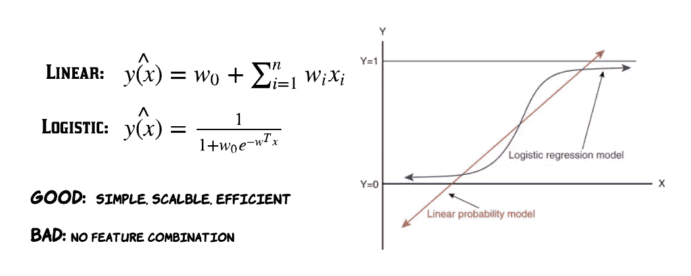
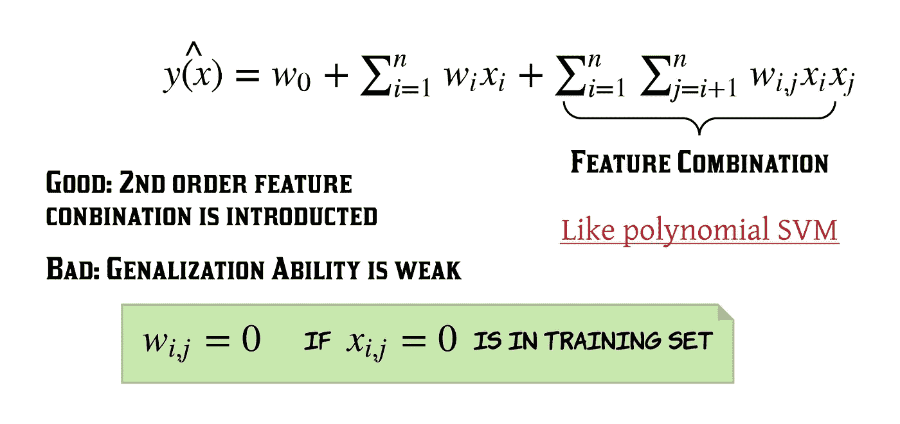
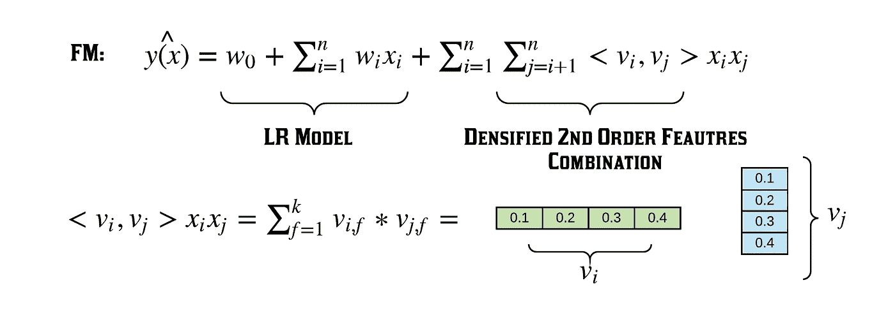
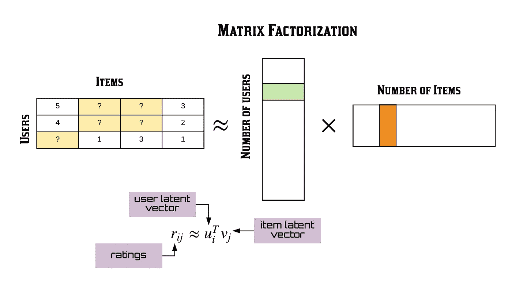
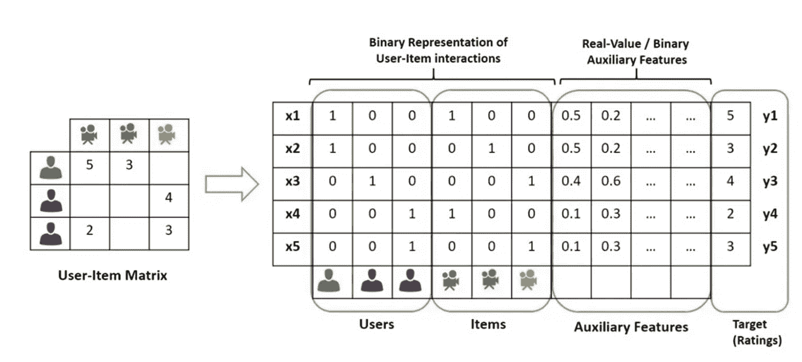

# 在深度学习中茁壮成长:推荐系统的 FM 模型(上)

> 原文：<https://towardsdatascience.com/thrive-and-blossom-in-the-mud-fm-model-for-recommendation-system-1-95707839e235?source=collection_archive---------7----------------------->

Photo by [Paul](https://unsplash.com/@paulgo?utm_source=medium&utm_medium=referral) on [Unsplash](https://unsplash.com?utm_source=medium&utm_medium=referral)

既然你写了这篇文章，我认为你是这个行业的算法工程师。然而，根据我的经验，这个假设可能只有 20%是正确的，因为大多数算法工程师的兴趣非常多样化，他们会点击文章，只要标题中出现“模型、算法、深度学习、震撼、美丽”这样的词，但 3 秒钟后就会失望地关闭窗口。文章越有技术含量，就越快被关闭。我说的对吗？相信我，我不会通过设置一个非凡的标题和添加一段平静的背景音乐来欺骗你的点击。

好吧，如果你是一个真正的算法工程师，你首先想到的是什么模型或算法来排序或推荐内容。

如果你想出排序的平均值，请点击右上角的“关闭”按钮，这篇文章不是很适合你的水平。哈哈，我在开玩笑，欢迎继续，因为我也曾经是那个水平。

如果你正在考虑 CF/SVD/MF，也许你只是结束了阅读学校书籍或完成推荐系统的介绍课程，但缺乏实践经验。如果你的直觉是 LR + GBDT 模型，那么你是一个经验丰富的算法工程师，但最近没有更新你的武器库。

看看日历，现在是 2019 年。我们现在不必进入 Wide&Deep 或 DeepFM 模型，因为在大规模的业务场景中有效地应用它们似乎仍然是一项具有挑战性的任务。但最重要的是，如果你认为自己是一个谦逊的、渴望学习算法的工程师，你应该学习 FM model。

# **什么是 FM？**

FM 代表因式分解机。该算法由 Rendle 于 2010 年提出，近年来被广泛应用于大规模点击率估计和推荐系统中。FM 的模式比较简单，网上有很多内容我就不在这里详细展开了。许多基于 DNN 的排序模型与 FM 非常相似，原因很明显:特征组合对于推荐排序至关重要，FM 的思想非常简单，并且很好地反映了(主要是二阶)特征组合。没有这一点，任何 DNN 模型都无法运行，因为 MLP 结构是一种低效捕捉特征组合的结构。因此，这些 DNN 模型总是与 FM 模型结合在一起，这些特性需要在内部进行组合。这就是为什么你会一次又一次地发现它或者它的变体的原因。

目前，基于 DNN 的排序模型一般采用 MLP 结构。特征提取的能力远低于 CV/NLP 达到的水平。这很容易使人觉得，用于排序优化的 DNN 模型还处于原始社会的非常早期的阶段。那这是为什么？因为 CNN 网络天然不适合排序场景。RNN 被用作捕获用户行为的序列，并且使用时间信息的辅助结构是可以的，但是它不太适合作为主要模型。好像没剩下多少选择了。Transformer 很有前景，我认为自我关注是另一个很好的方法，可以很好地捕捉特征组合(包括二阶和三阶，甚至多阶)。我用自我关注& transformer 作为主要的推荐排序模型做了一些实验。与 DeepFM 相比，测试结果并没有显示出太多的差异。但这可能是因为我没有花太多时间在繁琐的调优工作上。鉴于自 2018 年下半年以来，有几篇关于使用 transformer 进行推荐排序的新论文发表，我个人对该方向的发展非常乐观。到目前为止，剩下的选择似乎只有 MLP。在深度学习的大潮下，从建模角度来看确实远远落后于其他很多领域。事实上，我认为这主要是由于其自身领域的复杂性造成的，它可能需要一个革命性的 DNN 模型来很好地适应其自身的特点。像图像识别领域的 [Resnet](/an-overview-of-resnet-and-its-variants-5281e2f56035) 或者自然语言处理领域的 [Bert](https://github.com/google-research/bert) ，在推荐领域还没有像这两个这样的 DNN 模型。无论如何，我更乐观了，我预见到那个人正在路上，离我们很近。

我将从两个角度简要介绍 FM 模型:一个是从特征组合模型的演变。另一个是来自协同过滤模型的演变。FM 模式是上述两种模式的交集。

# 从 LR 到 SVM 再到 FM

LR 模型是推荐系统前期最成功的模型。大多数工业推荐系统采用 LR 模型(线性模型+人工选择特征组合引入的非线性)。因为 LR 模型具有简单、便于解释、易于扩展等优点。但是 LR 模型最大的缺陷是手工特征工程，耗时耗力，那么特征组合可以在模型层面进行吗？

实现这一点并不难。在上图中，可以将二阶特征组合添加到等式中。任意两个特征可以组合，组合后的特征可以作为一个新的特征集成到线性模型中。组合特征的权重可以用来表示，如同一阶特征权重一样，组合特征权重是从训练阶段学习的。在幕后，这个二阶特征组合的使用等同于 SVM 的多项式核。但后者有一个潜在的问题:它对组合特征进行建模，但泛化能力较弱。特别是给定一个大的稀疏特征矩阵，这个缺点会非常突出和放大。如推荐排序问题，特征总是存储在一个巨大的稀疏矩阵中。因此，这种解决方案没有被广泛采用。那还有什么？

所以此刻 FM 模式登场了。如上图所示，FM 模型还直接引入了任意两个特征的二阶特征组合。FM 和 SVM 模型之间最显著的区别是获取特征组合权重的计算方法。对于每个特征，FM 学习一个大小为 k 的一维向量，使得两个特征 x_i 和 x_j 的特征组合的权值由对应特征的内积<v_i v_j="">表示。这本质上是特性的嵌入特性，非常符合“嵌入”思维的本质。因此，FM 作为一种特征嵌入技术，可以看作是深度学习中各种嵌入方法的老前辈。实际上，它只是缺少了一个两层或三层的 MLP 隐层，用来直接建模多层特征非线性组合。其余方面基本相同。</v_i>

那么为什么 FM 嵌入在处理大规模稀疏矩阵时是有效的呢？为什么它的泛化能力强？参考上图，即使两个特征没有同时出现在训练集中，也意味着 x_i 和 x_j 同时出现的次数为 0。在 SVM，不可能知道他的特征组合的权重。但是因为 FM 是学习单个特征嵌入，而且不依赖于特征的某个特定组合是否出现过，所以只要特征 x_i 和特征的任何其他组合出现过，那么它就可以学习自己对应的嵌入向量。因此，虽然在训练集中没有看到特征 x_i 和 x_j 的组合，但是在预测时仍然可以使用这个新的特征组合，因为 x_i 和 x_j 具有在训练阶段学习到的它们自己的对应嵌入，并且它们的内积表示这个新的特征组合的权重。这就是为什么 FM 的泛化能力如此神奇。

从本质上说，这也是各种嵌入的核心特征。它使得基于二进制的硬匹配 0/1 切换到基于矢量的软匹配。对于以前无法匹配的，现在在一定程度上可以认为是匹配的。这本身就是对泛化的一个很好的改进。

# 从 MF 到 FM 模型

到目前为止，你应该知道 FM 模式是什么。那么 MF 是做什么的呢？至少从拼写角度来看，它们不是很相似吗，MF <=> FM？跟 FM 有什么鬼关系？仅仅是 FM 模式的逆向操作吗？

实际上，MF 代表矩阵分解。它是一个成熟的协同过滤模型，长期以来在推荐领域被广泛采用。主要思想是学习两个小的低维矩阵，一个代表用户的嵌入，另一个代表物品的嵌入。然后，通过计算两个矩阵的内积，使用这两个矩阵来估计由真实用户点击或评级生成的大型协作稀疏矩阵中的值。本质上，它是一种降维技术，尤其用于构建用户/项目嵌入。通常情况下，我们也把这些嵌入称为潜在特征向量，它们是相同的东西。在各种嵌入方法进入自然语言处理领域之前，这种方法也被大量用于主题建模。

当训练完成后，每个用户和项目都得到其对应的低维嵌入向量。进行内积计算<user_i item_j="">将会得到 user_i 在 item_j 上的预测得分。这让你想起什么了吗？下面重点说一下 MF 和 FM 的关系。</user_i>

MF 和 FM 不仅在名字上看起来相当像，而且在算法方面也有许多相似之处或联系。

本质上，MF 模型是 FM 模型的一个特例。MF 可以被认为是仅具有两个特征字段 User_ID 和 Item_ID 的 FM 模型。MF 从原始矩阵中学习这两种类型的特征，并将它们作为表达式嵌入到两个低维矩阵中。FM 可以看作是 MF 模型的进一步延伸。除了用户 ID 和物品 ID 特征之外，许多其他类型的特征可以进一步集成到 FM 模型中，FM 模型将所有这些特征转换成低维嵌入向量。特征组合的权重可以用任意两个特征嵌入的内积来表示和计算。如果 FM 仅使用用户 ID 和项目 ID，则预测过程将与 MF 预测过程相同。

从谁更早使用特征嵌入表达式的角度来看，与 FM 相比，MF 显然是真正的前身，但其唯一的局限性是特征类型的缺乏。FM 继承了 MF 的特征嵌入机制的优点，并对其进行扩展，使其能够将更多的边信息作为特征，然后将它们转换为嵌入向量，最后将它们集成到 FM 模型中。事实证明，FM 模型更加灵活，可以应用于更广泛的用例。

我希望你仍然跟随，不要因为 MF 和 FM 之间复杂混乱的关系而沮丧。我想提出以下建议(个人观点):

1.  当你有动力使用 MF 进行协同过滤的时候，请先让自己冷静下来，问自己一个问题。这是为了建立基于隐式反馈还是显式反馈的推荐模型？例如，用户评级通常被视为明确的反馈，因为它从 1 到 5，包括积极和消极的方面。同时，用户点击或购买次数是隐性反馈，因为它们只传达了“数字越大，用户越有可能喜欢它，而不是被授权者”的信号(置信度)。优化丢失的函数来训练仅利用隐式反馈的模型更依赖于实际的用例。此外，我们需要找到一种方法来生成足够的负样本，以便 FM 也能很好地工作。别担心，我会在使用隐式反馈的背景下，围绕这些技巧和技术写一篇单独的文章。如果你的答案是明确反馈，请给 FM 一个尝试。因为它们在功能上是等价的，而且，FM 将使你能够把它融合到你将来想要添加的任何其他特性中。
2.  构建一个只使用用户 ID 和项目 ID 作为输入特征的分类模型，在实践中不能满足大规模推荐系统的需要。原因很简单，在大部分世界级的推荐系统中，用户或物品都有很多可供利用的信息，协同数据只是其中之一。引入更多的功能肯定对获得更准确的个性化推荐非常有帮助。但是，如果模型缺乏添加更多功能的便捷方式，它将受到限制，并且难以持续改进。这就是为什么 MF 方法很少用于排序或分类问题。

到目前为止，我们已经从多个角度解释了 FM 模型。

下一步是什么？你如何做出选择？这与其说是一个技术问题，不如说是一个哲学问题。话虽如此，算法选择通常是这样的:“一个算法工程师一直在犹豫选择哪个模型去生产。他有三个很好的选择，其中一个很优雅，另一个很好，最后一个很时尚。但是很难做出决定。三天后，他告诉我他的导演只是让他用最快的一个去！”精彩！

因为 FM 计算特征组合的二阶，所以经常听到人们质疑它的效率。这确实是一个很好的问题，因为二阶完全等价于 O(n * n)。故事就这样结束了吗？在下一章，我将详细阐述 FM 模型的核心效率。

掌声和掌声感谢[张](https://www.linkedin.com/in/%E4%BF%8A%E6%9E%97-%E5%BC%A0-4aa80116b/)、【】和。