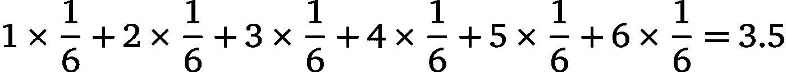
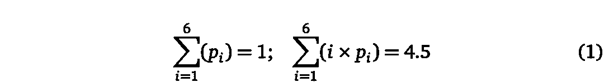
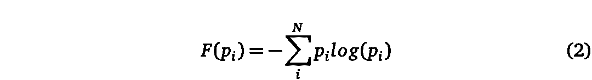
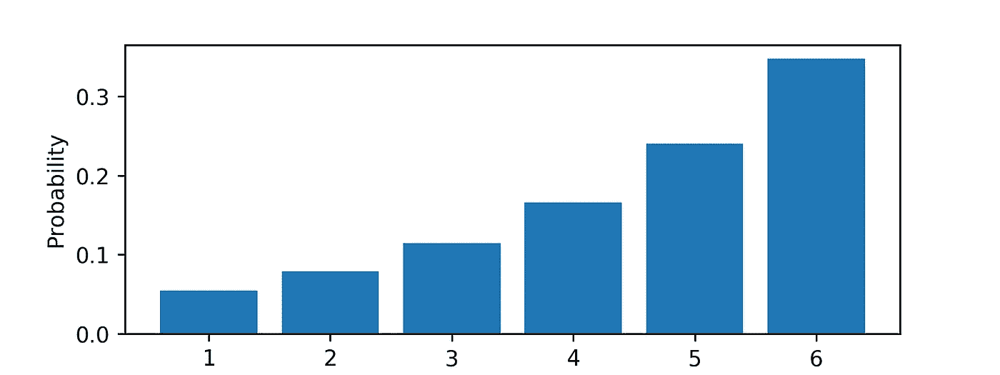
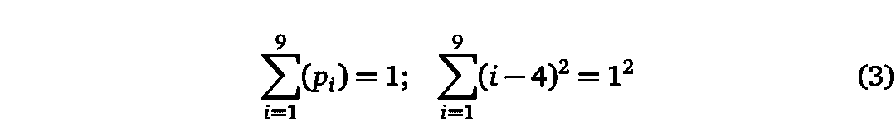
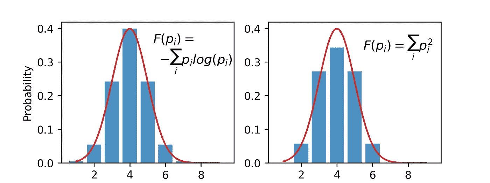
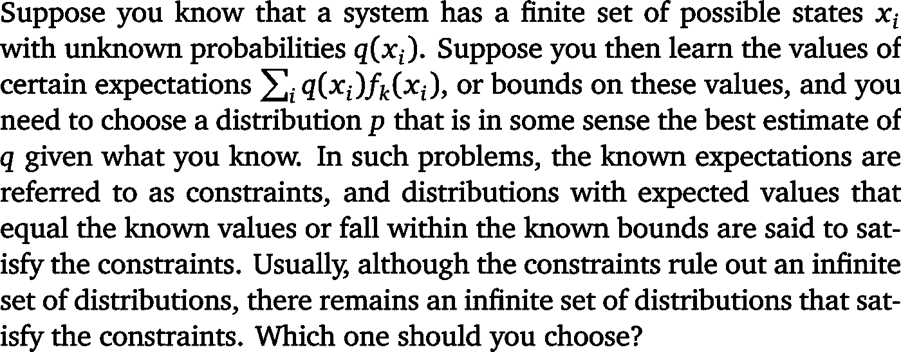
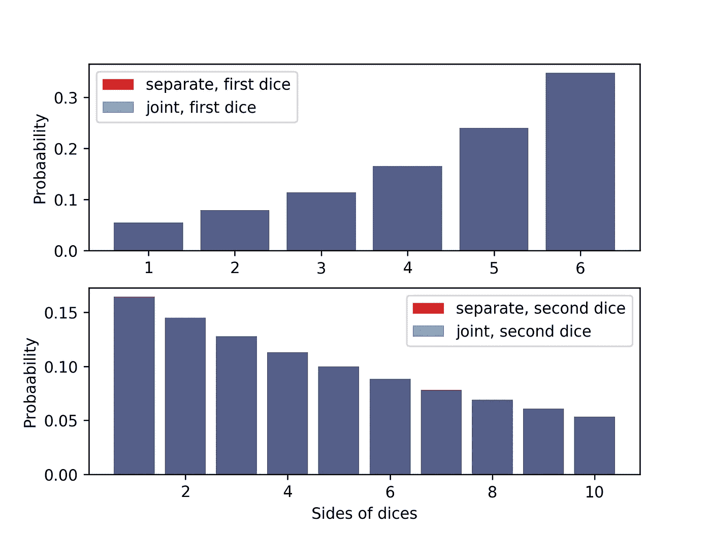
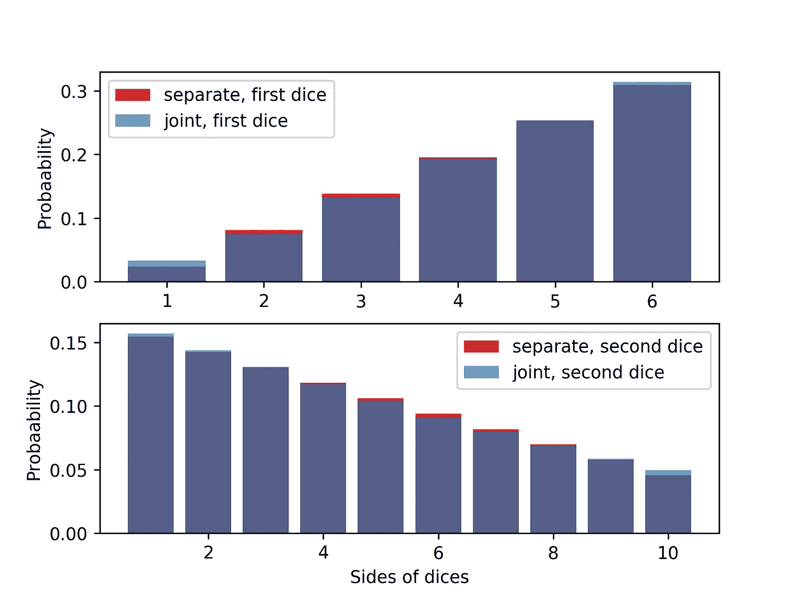

# 最大熵原理掷骰子

> 原文：<https://towardsdatascience.com/throwing-dice-with-maximum-entropy-principle-fa7707e72222?source=collection_archive---------15----------------------->

> “没有人知道熵到底是什么，所以在任何讨论中，你总是有优势的”冯·诺依曼

听起来这是一个深入研究熵的意义的好理由。这篇文章是关于骰子和最大熵的。

Photo by [Jonathan Petersson](https://unsplash.com/@grizzlybear?utm_source=medium&utm_medium=referral) on [Unsplash](https://unsplash.com?utm_source=medium&utm_medium=referral)

这篇文章有四个部分。在第一部分，我以骰子为例介绍了最大熵原理。第二部分是数学:概述了使熵成为唯一函数的四个公理。四个公理中的一个是最重要的(对我来说)..如此重要，以至于在第三部分，这个公理用 python 进行了测试，只有熵函数满足测试。第四部分总结。

# 一个简单的问题

我有一个骰子，从 1 到 6 有 6 个面。关于骰子，我唯一知道的是结果的平均值是 3.5。我必须分配给骰子两边的概率是多少？

首先出现的自然答案是给骰子的每一边分配 1/6 的均匀概率。这意味着:

当然，满足均值 3.5 的选择是无限多的。骰子可以被偏置，并且对于某些边具有更高的概率，同时仍然具有 3.5 的平均值。但是在所有的可能性中，统一的分配感觉上是合理的。

让我稍微修改一下这个任务，考虑到我唯一知道的是均值是 4.5。这里又有无限多种赋值的可能性。很可能，最自然的答案是你不知道，因为你没有足够的信息。但是 3.5 和 4.5 有什么区别呢？为什么我对均值的一个值(3.5)有感觉和自然的答案，对均值的另一个值(4.5)没有答案？

让我们先把这个条件正式写出来。我可以指定骰子各面的概率为(p1，…p6)。我知道:

如何从许多满足这些等式(约束)的概率分配中选择某一个？这可以说是一项优化任务。我可以最大化所有概率的函数:

并基于该函数的最大值选择一个概率分配。但是这个功能是什么意思，我应该怎么选择呢？我所知道的唯一信息是平均值是 4.5。我已经在约束中使用了 4.5，但是我还没有使用它，因为它是我唯一知道的信息。这里有一个准则！我应该优化函数 F，在我们的估计中，我不会插入任何关于骰子的额外信息。那么我必须选择哪个函数呢？

这是在[杰恩斯的作品](https://bayes.wustl.edu/etj/articles/theory.1.pdf)中回答的问题。我必须最大化熵:

因为这是对我所不知道的事情不抱偏见的唯一方法。任何其他功能都意味着附加信息。杰恩斯在他的作品中解释道:

> 我们能做的唯一公正的分配；使用任何其他方法都相当于任意假设我们没有的信息。。。。最大熵分布可以被断言，因为它被唯一地确定为对于缺失信息最不确定的分布

熵有一些有趣的性质。例如，如果我有一个平均值为 3.5 的 6 面骰子，那么熵的最大化将导致均匀分布。同样的情况，如果我只取和为一的约束，而不知道均值。那就让熵最大化吧！平均滚动值为 4.5(约束 1)的 6 面骰子的任务可以用数字来解决。答案呈现在剧情中:

我可以为其他类型的骰子尝试其他类型的约束。例如，让我们考虑 9 面骰子，而不是(1)设置约束为:

在后面的等式中，1 是标准差，4 是平均值。在这种情况下，最大化熵将导致看起来类似于高斯的分布。最大化其他功能不会。例如，下面是熵与平方和的比较:

Results of numerical solution of optimization problem with constraints (3) compared with Gaussian.

到目前为止一切顺利，但这只是第一阶段！对某些人来说，熵的最大化显然是根据熵作为信息量度的定义得出的。对其他人来说，这种直觉的理由可能还不够。到目前为止，我还没有证明方程中的函数。②是唯一一个最大化的。为什么不最大化一些替代功能？以下文字为“其他”。

# **支持熵最大化原理的数学论证**

当一些可测试的信息可用时，为骰子的各面分配概率的任务(我 100%确定的一个)，有可能表明必须最大化的唯一函数 F( **p** )是熵(2)。你需要一些数学传统中的公理。一套这样的公理是由[肖尔和约翰逊](https://bayes.wustl.edu/Manual/AxiomaticDerivation.pdf)提出的。在一些已知约束条件下掷骰子的任务可以概括为:

想象一下，我还不知道我应该选择熵最大的分布。所以我想找到最大化的函数。这里的技巧是 q 和 p 不是任意函数，而是概率。我可以假设这些概率以及通过最大化函数 F( **p** )找到最优分布 p 的结果具有一些性质(公理):

> 1) 唯一性**。(最大化的)结果应该是唯一的。**
> 
> 2) 不变性。在哪个坐标系中计算新信息并不重要。
> 
> **3)系统独立性**。**一个人是用不同的概率来单独说明独立系统的独立信息，还是用一个联合概率来共同说明独立系统的独立信息，这并不重要。**
> 
> 4) 子集独立。不管是用单独的条件概率还是用整个系统的概率来解释系统状态的独立子集的信息，都没有关系。

在证明的主体中，陈述了公理 1，2，4 用于导出函数的“和形式”。也就是说，为了满足公理 1，2，4，函数的形式必须是:

在所有和形式的函数中，唯一满足公理 3 的是熵函数或对熵函数单调的函数。为了更好地表示公理 3，让我们用 python 来测试这个公理！

# **用 python 演示系统独立性**

在这一节中，我编写了一个 python 代码来测试关于系统独立性公理对于任意函数 F( **p** )和两个骰子是否成立。每个都有一定的边数和自己的平均值。

我将在两种不同的情况下最大化和形式的函数:当我认为两个骰子是独立的，我分别优化它们，或者当我认为它们是依赖的，我优化具有独立约束的联合 PDF。

## 单独优化

概率有两个重要的性质。第一个属性是它们的和为 1。第二个属性(实际上熵最大化不需要，但是其他一些函数需要)是概率是非负的。我把它框定为对概率和以及概率值界限的约束:

我从 1 开始选择骰子的边数(但是我可以选择任何边数)。对手段的限制是:

然后，我将初始猜测设为等概率，并运行优化算法:

## 联合优化

对于联合概率，我考虑两个骰子，因为它们可能相互依赖。我优化的函数是联合概率[p_11，p_12，…，p_NM]，其中 p_11 是第一个和第二个骰子会显示第一面的概率。其余的优化过程是相同的。

## 比较

公理 3 规定，如果我没有关于两个骰子的依赖性的信息，我应该以骰子独立的方式分配概率，并且:

由于数值误差，总会有差异，这个等式不成立。这样我就可以评估我差了多少:

python 中的情况也是如此:

比较优化结果的另一种方法是从联合中得出边际分布，并将它们绘制在一起:

正如对熵的预期，分布是相同的(在数值误差的限度内):

Comparison of joint optimization with separate optimization when I maximize entropy.

相比之下，两个骰子的平方和分布不同:

Comparison of joint optimization with separate optimization when I minimize sum of squares.

这部分的 Python 代码可从[这里](https://github.com/azarnyx/maxent)获得。

# **结论**

最大熵原理在几个方面是有用的。首先，它可能是贝叶斯推理中设置先验概率的有力工具。另一个有用的应用是最大熵估计，它可以代替最大似然估计。

在这篇文章中，只考虑了个别情况。对于连续概率，最大熵原理应该用最小 Kullback-Leibler 散度原理来代替。

**文学:**

[1] [模式识别与机器学习(信息科学与统计)](http://users.isr.ist.utl.pt/~wurmd/Livros/school/Bishop%20-%20Pattern%20Recognition%20And%20Machine%20Learning%20-%20Springer%20%202006.pdf)，克里斯托弗·m·毕晓普。

[2] [数据分析贝叶斯教程](https://www.amazon.de/Data-Analysis-Bayesian-Devinderjit-Sivia/dp/0198568320/ref=sr_1_1?crid=1LDDOM2MK9OVZ&keywords=data+analysis+a+bayesian+tutorial&qid=1564338165&s=gateway&sprefix=Data+Analysis+A+Bayesian+Tutorial%2Caps%2C662&sr=8-1)，D.S. Sivia 与 J. Skilling

【3】[最大熵原理和最小交叉熵原理的公理化推导](http://users.isr.ist.utl.pt/~wurmd/Livros/school/Bishop%20-%20Pattern%20Recognition%20And%20Machine%20Learning%20-%20Springer%20%202006.pdf)，Shore 和 Johnson

[4] [信息论和统计力学](https://bayes.wustl.edu/etj/articles/theory.1.pdf)，E. T .杰恩斯