# 雷击:交流电力线的 CNN 可视化灾难

> 原文：<https://towardsdatascience.com/thunderstruck-disaster-cnn-visualization-of-ac-power-lines-2a57fab30f09?source=collection_archive---------28----------------------->

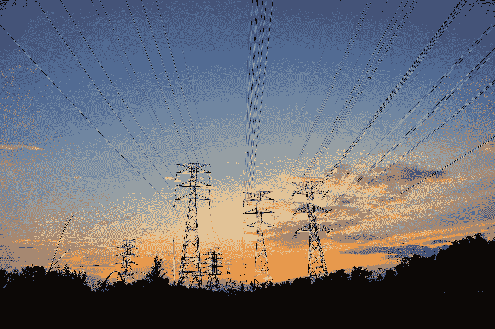

VB 的网络中心正试图通过分析电力信号来检测架空电力线的局部放电模式。对于任何电力爱好者来说，这场 Kaggle 挑战赛都是一场有趣的比赛。理想情况下，我们应该能够在电力线路遭受停电或引发电气火灾之前，检测到电力线路缓慢增加的损坏。然而，有许多英里的电力线。此外，输电线的损坏不会立即显现，任何事情都会造成小的损坏(树木、大风、制造缺陷等)。)可能是来自放电的级联损害的开始，这增加了将来故障的可能性。这是一个伟大的目标。如果我们能够成功地估计出需要维修的线路，我们就可以在保持电力流通的同时降低成本。我的意思是金钱万能。

表格数据集非常庞大，每个信号有 800，000 个点，总计约 10 GB。臃肿的设置不是我要找的刚刚从微软恶意软件。我花了这么多时间试图把那个数据集输入我的电脑，但又被再次进行这么多数据管理的可能性拉回来了。

我决定做一些疯狂的事情，让它成为 CNN 的问题，而不是表格问题。把一个表格问题变成一个 CNN 特别疯狂。为什么你会把非常好的数据变成模糊和不准确的数据呢？

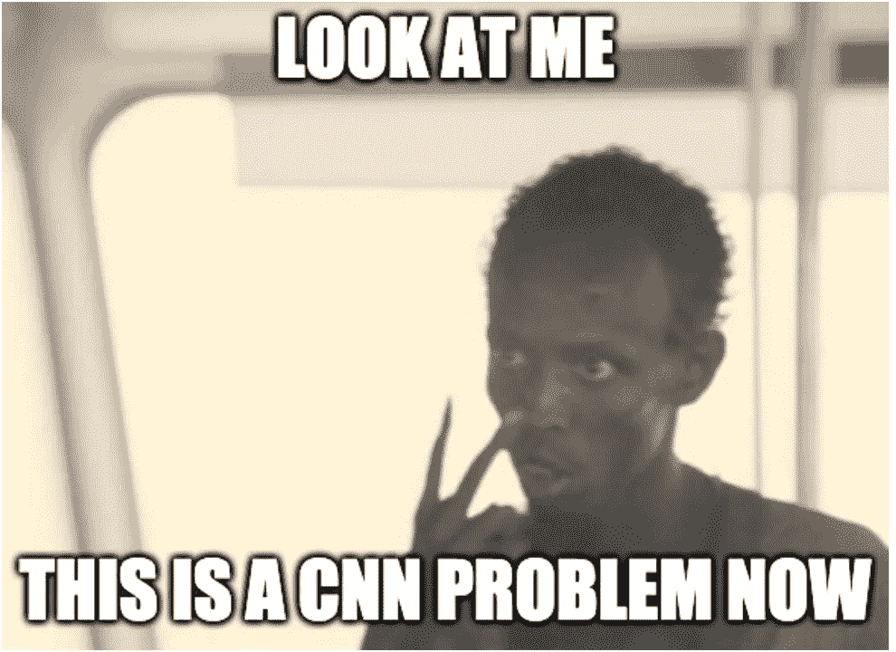

它更快

它更粗糙

而且，它更有趣！

有点…你准备好了吗？

# 高电压

我们应该首先了解一些电气工程概念，尤其是电力线。我们在这里看到的交流电有 3 个周期或相位。所提供的数据具有这些相位的信号，并且相互依赖以预测线路何时出现问题。因此，该设备有三个不同的信号通过，它们之间存在相互依赖关系。如果其中一个看起来很奇怪，就会影响到其他两个。

将信号数据绘制成图表是相当简单的事情。所以我们可以快速观察其中一个信号。许多 CNN 的经验法则可以帮助您决定它是否对模型有用。如果你能看到不同，那么 CNN 可以做得一样好，或者更好，更快。让我们看看一个信号是什么样的:

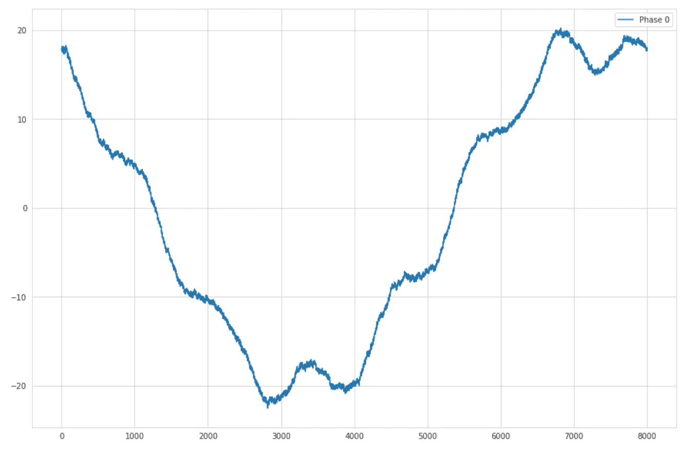

好的。有道理。现在，他们三个会是什么样子？有什么东西看起来超级怪异吗？我想是的！

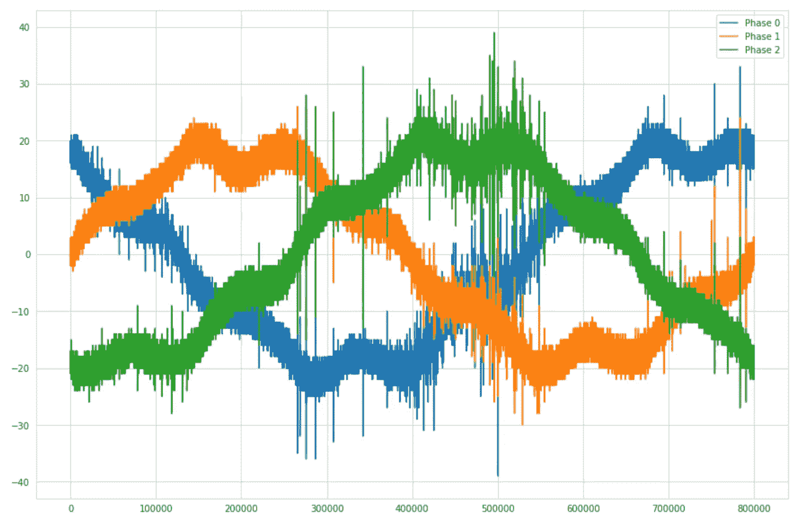

好吧，这可能行得通！诚然，我可以看到绿色二期线似乎有一点尖峰在这个图像。也许这很重要，也许不重要。然而，我想这将是我们的有线电视新闻网试图检测。

首先，我们需要将所有的信号文件转换成图像，我完成了这个并保存在硬盘上([使用这个 jupyter 笔记本](https://github.com/jamesdietle/Kaggle2019/blob/master/VSB-Signal-Voltage/VSB-Dataloader-ImageCreater.ipynb))。回去把它们加载到内存中比每次都生成它们要快得多(有很多信号)。然后我回去对我们的测试集做了同样的事情。我本可以做得更好，但是只需要运行一次。

现在图像大小很重要，当你压缩数据时，你会丢失信号中的一些细节。想象一下缩小图片时丢失的细节。所以我保持了一个相当大的图像尺寸，除此之外，我们可以在以后的训练中将图像变小。

我觉得我们可以掩饰大部分 CNN 的设置([如果有兴趣你可以看这里)](https://medium.freecodecamp.org/how-i-used-deep-learning-to-classify-medical-images-with-fast-ai-cc4cfd64173c)。除了变换之外，没有什么是唯一的。不像猫和狗，或医学成像，我不需要变换或改变周围的图像。我们生成的图像应该总是相似的，更重要的是，图像将总是与我们的测试图像显示的格式相同。在我们的测试中，图像将总是相同的大小。这种方法不同于其他图像模型，因为测试集可以包括不同的动物、不同的角度和整体不同的外观对象。通过这种方式，转换将有助于其他模型，但不适用于这种情况。

当我们开始训练时，我们看到训练在进步！很好！
验证和马修斯系数一样越来越好！很好！

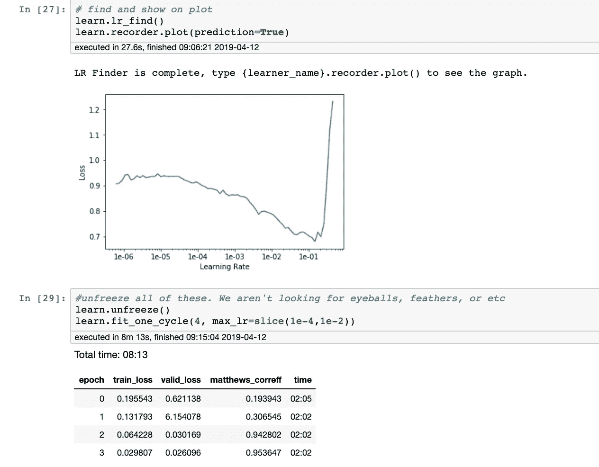

太好了，让我们试试这个，看看这些。

我注意到的一件事是项目有正确的预测。几个时期后，我们可以看到模型认为重要的热图。

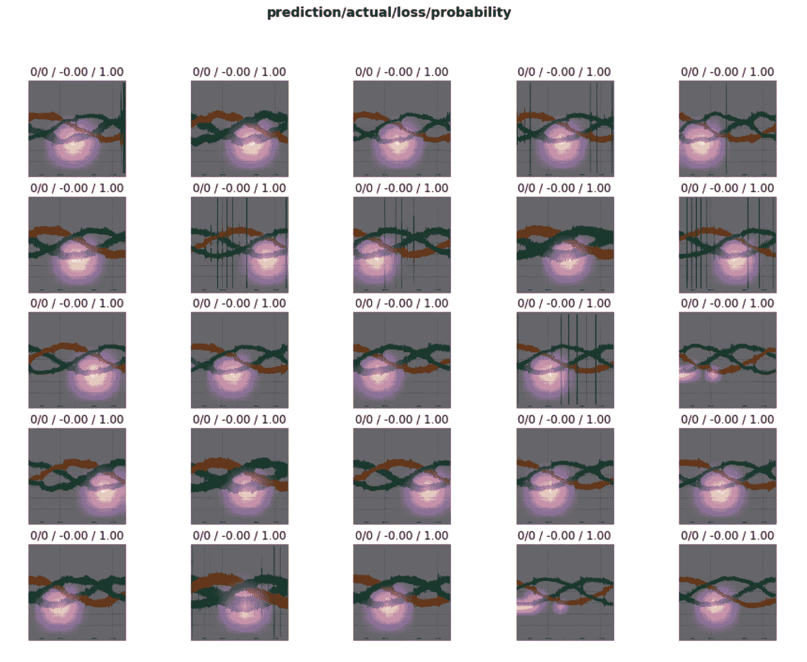

我们可以看到它认为正确的项目和它正确预测的项目。对于正确的信号，它似乎浮在较低的信号上。好吧，那不理想。没有任何迹象表明这是有意义的。地狱之钟我们只看到没有错误的项目。

然而，预测错误的情节都结束了。

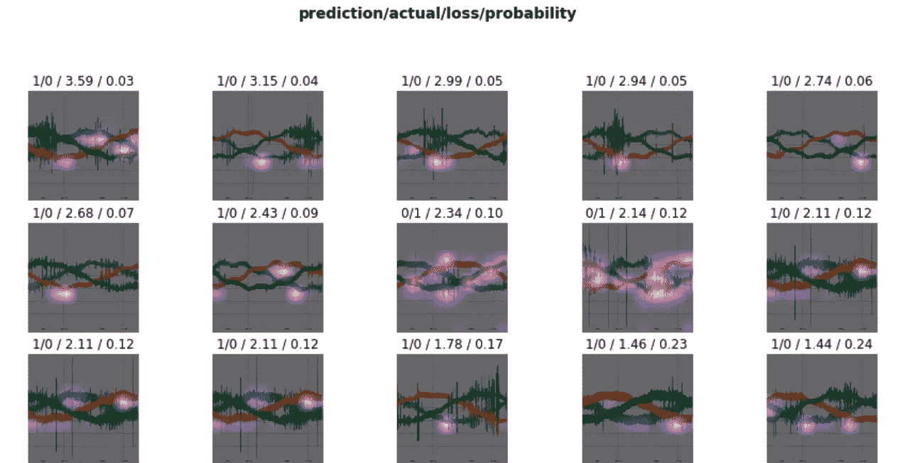

其中一些展示了我所期待的。这个显示了剧烈的波动。例如，我们希望看到类似下面的内容，其中权重遍布 3 个信号。

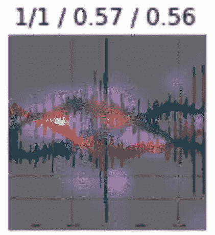

然而，还有更多的地方，他们强调没有意义的领域。像这样:

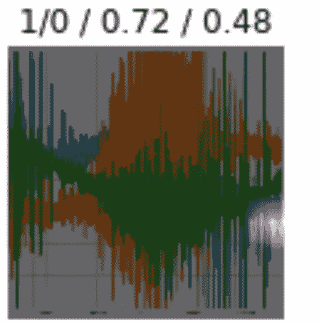

为什么它突出了右边的区域？在所有的训练中，是什么让它看起来是最重要的领域？

也就是说，这个预测应该是错误的，但看起来信号真的中断了…所以也许是数据的问题。

# 坚定沉着

因此，在这一点上我有点紧张，尽管验证集声称我们做得很好，但它似乎没有看到项目的充分加权。预言到处都是，我不知道为什么。所以我决定继续前进。

进一步观察这些预测，似乎这些预测是有道理的。我们看到 0 和 1 都有一些值，这很好。该集合非常有偏差，几乎有 10:1 的差异，然而，我们也期望如此。它比较接近我们的数据集。

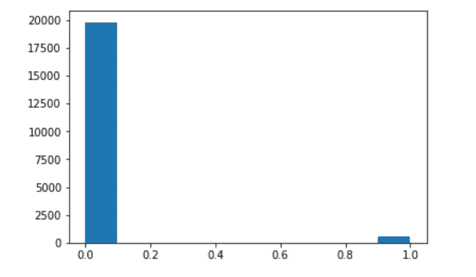

让我们将所有测试项目适当地映射回来，因为每个图像现在代表 3 个不同的信号。

那我们就臣服于卡格尔。让那里有摇滚！

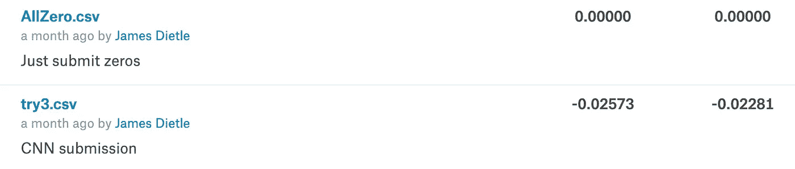

嗯，真令人失望。

它的得分甚至低于所有的 0。

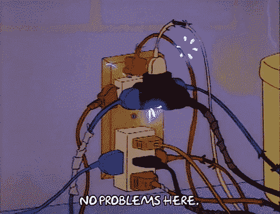

在这一点上，是时候转移到别的事情上了。通往顶峰的路还很长，我还有其他项目要处理。

比赛中的其他 CNN 更接近 0.50 ish，获胜者使用了 LGBM 。

## 需要改进的地方:

*   如果你有信号数据，你当然可以试着把它做成图像。但是，在转换过程中，您会丢失大量信息。您还会增加正在使用的数据的总体大小。
*   这种转换和梳理的过程很快就变得非常复杂和混乱，这里有很多错误做错了事情。结合第 1 项，我有理由相信我丢失了很多数据，并且可能丢失了更多或错误标记了一些项目。对我来说，回去仔细检查原始图像以确保我们没有错误地创建它们是一个挑战。
*   这也是一个困难的问题，因为我认为是错误的东西并不符合标签。
*   我看到这种方法在其他项目中成功使用。也许他们的分辨率设置更好，或者照片中的信息更清晰。

## 参考资料:

*   [比赛](https://www.kaggle.com/c/vsb-power-line-fault-detection)
*   [用 python 读入数据](https://www.kaggle.com/sohier/reading-the-data-with-python)
*   [CNN LSTM 为信号](https://www.kaggle.com/afajohn/cnn-lstm-for-signal-classification-lb-0-513)
*   [电源故障检测获胜者](https://www.kaggle.com/c/vsb-power-line-fault-detection/discussion/87038#latest-504346)
*   [我的 Github 代码](https://github.com/jamesdietle/Kaggle2019/tree/master/VSB-Signal-Voltage)