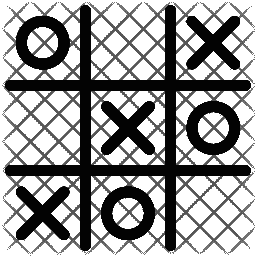

# 井字游戏学习者 AI

> 原文：<https://towardsdatascience.com/tic-tac-toe-learner-ai-208813b5261?source=collection_archive---------2----------------------->

[井字游戏](https://en.wikipedia.org/wiki/Tic-tac-toe)是两个人玩的简单游戏，我们小时候喜欢玩(尤其是在无聊的教室里)。该游戏包括两名玩家将他们各自的符号放置在一个 3x3 的格子中。设法将三个符号放在水平/垂直/对角线上的玩家赢得游戏。如果任何一方未能做到这一点，游戏以平局结束。如果两个人总是采取他们的最优策略，博弈总是以平局告终。

Ex: Tic-Tac-Toe Board

由于网格很小&只有两个玩家参与，每个棋盘状态的可能走法的数量是有限的，因此允许基于树的搜索算法，如 Alpha-Beta 剪枝，来提供计算上可行且精确的解决方案，以构建基于计算机的井字游戏玩家。

在这篇文章中，我们看一个近似的(基于学习的)相同的游戏方法。即使存在更好的算法(即 [Alpha-beta 修剪](https://en.wikipedia.org/wiki/Alpha%E2%80%93beta_pruning))，如果电路板的复杂性增加，近似方法提供了可能有用的替代方法。此外，代码的变化，以纳入这将是最小的。

这个想法是将**井字游戏作为一个适定的学习问题**，正如 [Tom Mitchell 的机器学习书](https://www.amazon.com/Learning-McGraw-Hill-International-Editions-Computer-dp-0071154671/dp/0071154671/ref=mt_paperback?_encoding=UTF8&me=&qid=)(第 1 章)中提到的。学习系统将在下一节中简要介绍。

# 井字游戏学习系统

学习系统背后的基本思想是，系统应该能够通过从训练经验(E)中学习来改进其相对于一组任务(T)的性能(P)。培训体验(E)可以是直接的(带有单独标签的预定义数据集)或间接的反馈(每个培训示例没有标签)。在我们的情况下:-

*   **任务(T)** :玩井字游戏
*   **性能(P)** :与人类比赛获胜的百分比
*   **体验(E)** :通过解决方案跟踪(游戏历史)产生的间接反馈，这些解决方案跟踪是通过与自身(克隆)的游戏产生的

**从经验中学习(E)** :理想情况下，需要学习一个函数(理想目标函数),以给出任何给定棋盘状态下可能的最佳走法。在我们的问题中，我们将 ITF 表示为一个线性函数(V ),它将给定的棋盘状态映射到真实值(分数)。然后，我们使用近似算法([最小均方](https://danieltakeshi.github.io/2015-07-29-the-least-mean-squares-algorithm/))从解迹中估计 ITF。

1.  V(boardState) → R，(R-给定 boardState 的得分值。)
2.  V_hat(boardState) ←(W.T) * X，(W-目标函数的权重，X-从给定的 boardState 中提取的特征。)
3.  **LMS 训练规则更新权重**:Wi←Wi+lr *(V _ hat(board state)-V _ hat(Successor(board state)))* X，(i-第 I 个训练示例，lr-学习率)

每个非最终棋盘状态的分数(R)被分配有后续棋盘状态的估计分数。根据游戏的最终结果给最终棋盘状态分配一个分数。

3.V(boardState) ←V_hat(继任者(boardState))
4。V(finalBoardState) ←100(赢)| 0(平)| -100(输)

# 履行

最终设计分成四个模块(Ch-1，[汤姆·米切尔的机器学习书](https://www.amazon.com/Learning-McGraw-Hill-International-Editions-Computer-dp-0071154671/dp/0071154671/ref=mt_paperback?_encoding=UTF8&me=&qid=) ):-

1.  **实验生成器**:其工作是在每个训练时期开始时生成新的问题陈述。在我们的例子中，它只是返回一个空的初始板状态。
2.  **性能系统**:该模块将实验生成器&提供的问题作为输入，然后使用改进的学习算法在每个时期产生游戏的解轨迹。在我们的例子中，这是通过模拟两个玩家之间的井字游戏(克隆程序)来完成的。这些玩家使用当前目标函数做出移动决策。
3.  **Critic** :这个模块获取解决方案跟踪，并输出一组训练示例，输入到泛化器。
    训练实例←【<特色(boardState)，R >，< > …。]
4.  **一般化器**:该模块使用评论家提供的训练示例，通过在每个时期使用 LMS 权重更新规则学习期望的权重来更新/改进目标函数。

下面是一个展示训练和测试阶段的小视频(顺便说一句:我的视频编辑技能不好)。

Screen Recording of Training & Testing phases of the game

上述实现的代码可以在这个 Github gist:[https://gist . Github . com/NoblesseCoder/cccf 260 ECC 3c e 2052 a0a 1a 01 a 13 a 7 f 7 AC 54](https://gist.github.com/NoblesseCoder/cccf260ecc3e2052a0a1a013a7f7ac54)