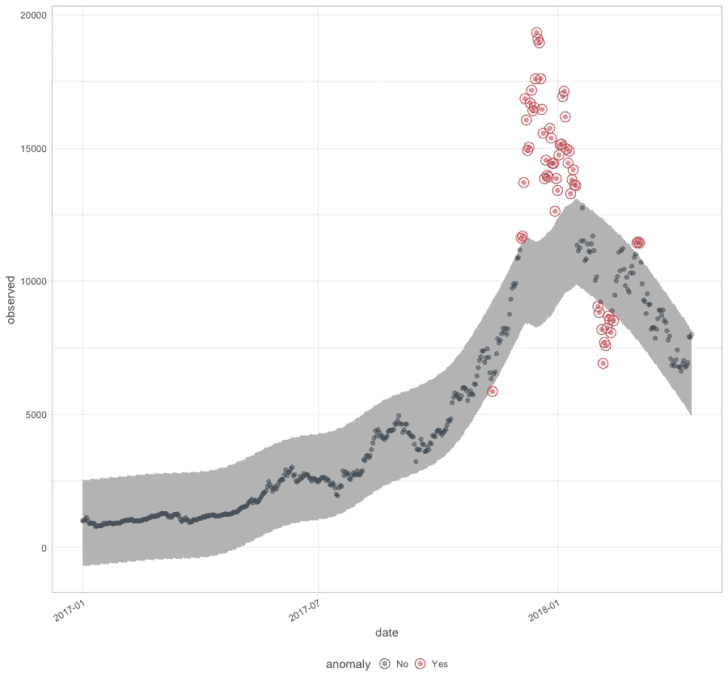

# 使用 R 的整洁异常检测

> 原文：<https://towardsdatascience.com/tidy-anomaly-detection-using-r-82a0c776d523?source=collection_archive---------6----------------------->


想象一下，你经营着一家像 Amazon.com 这样的在线企业，你想为下一年规划服务器资源——你必须知道你的负载什么时候会达到峰值(或者至少在回顾中是什么时候达到峰值的，以便相信它会再次出现),这就是你需要时间序列异常检测的地方。虽然有一些像 Twitter 的[异常检测](https://github.com/twitter/AnomalyDetection)这样的软件包已经在做这项工作，但还有另一个很好的候选软件——anomalize——它可以做一些其他异常检测软件包没有做的事情。这是很好的异常检测。

# [享受 78%的 DataCamp 折扣](https://datacamp.pxf.io/c/2888696/1240322/13294?u=https%3A%2F%2Fpromo.datacamp.com)


*请注意，本文的目的是帮助您以简洁的方式执行异常检测，而不是向您传授异常检测或时间序列数据的原理和概念。*

# 使用 R——整齐的方法进行异常检测意味着什么？

抱歉这么说！众所周知，使用 R 的数据科学家会编写笨拙的代码——可读性不强的代码和效率不高的代码，但这种趋势一直在改变，因为 [Hadley Wickham](http://hadley.nz/) 推广了`tidy`原则，他应该不需要在 R 宇宙中做任何介绍，因为他的`tidyverse`有助于许多 R 数据科学家的效率和工作。现在，这个由[商业科学](http://www.business-science.io/)开源的新包`anomalize`进行时间序列异常检测，它与其他 Tidyverse 包(或支持整齐数据的包)内联——具有最常用的 Tidyverse 功能之一——与管道`%>%`操作符兼容，以编写可读和可再现的数据管道。

# 异常化—安装

R package anomalize 的稳定版本可从起重机上的[获得，其安装方式如下:](https://cran.r-project.org/web/packages/anomalize/index.html)

```
install.packages('anomalize')
```

github 上有最新开发版本的 anomalize，安装方式如下:

```
#install.packages('devtools') 
devtools::install_github("business-science/anomalize")
```

考虑到开发版不需要编译工具，最好从 github 安装开发版，这样会更无 bug，而且有最新的功能。

# 案例—比特币价格异常检测

通过实际操作并将其与我们的现状联系起来，学习一个新的概念或代码会更容易。所以，为了理解 R 中整齐的异常检测，我们将尝试检测 2017 年以来比特币价格的异常。

# 加载所需的包

我们使用以下 3 个软件包来解决上述情况:

```
library(anomalize) #tidy anomaly detectiom
library(tidyverse) #tidyverse packages like dplyr, ggplot, tidyr
library(coindeskr) #bitcoin price extraction from coindesk
```

# 数据析取

我们使用来自`coindeskr`的`get_historic_price()`从 Coindesk 提取历史比特币价格。产生的数据帧存储在对象`btc`中

```
btc <- get_historic_price(start = "2017-01-01")
```

# 数据预处理

对于使用 anomalize 的异常检测，我们需要一个`tibble`或`tibbletime`对象。因此，我们必须将 dataframe *btc* 转换成遵循时间序列形状的 tibble 对象，并将其存储在`btc_ts`中。

```
btc_ts <- btc %>% rownames_to_column() %>% as.tibble() %>% 
  mutate(date = as.Date(rowname)) %>% select(-one_of('rowname'))
```

只看 btc_ts 的头部看样本数据:

```
head(btc_ts)
 *Price date      
1  998\. 2017-01-01
2 1018\. 2017-01-02
3 1031\. 2017-01-03
4 1130\. 2017-01-04
5 1006\. 2017-01-05
6  896\. 2017-01-06*
```

# 异常时间序列分解

在开始时间序列预测或建模之前，时间序列数据的一项重要工作是时间序列分解，即将时间序列数据分解为季节、趋势和余数部分。anomalize 有一个函数`time_decompose()`来执行同样的功能。一旦组件被分解， `anomalize`可以检测和标记提醒组件的分解数据中的异常，然后可以用 `plot_anomaly_decomposition()` 可视化。

```
btc_ts %>% 
  time_decompose(Price, method = "stl", frequency = "auto", trend = "auto") %>%
  anomalize(remainder, method = "gesd", alpha = 0.05, max_anoms = 0.2) %>%
  plot_anomaly_decomposition()
```

给出了这个图:


从上面的代码中可以看出，分解是基于“stl”方法进行的，这是时间序列分解的常用方法，但是如果您一直在使用 Twitter 的 AnomalyDetection，那么同样可以通过将 time_decompose(method = "twitter ")与`anomalize(method = "gesd")`结合起来在 anomalize 中实现。“stl”分解方法也可以与`anomalize(method = "iqr")`结合，用于不同的基于 IQR 的异常检测。

# 异常检测

异常检测和绘制检测到的异常几乎类似于我们在上面看到的时间序列分解。只是异常检测后分解的组件用`time_recompose()`重新组合，用 `plot_anomalies()` 标绘。该软件包本身会自动处理许多参数设置，如指数、频率和趋势，使得在相同领域中使用较少的专业知识即可轻松运行异常检测。

```
btc_ts %>% 
  time_decompose(Price) %>%
  anomalize(remainder) %>%
  time_recompose() %>%
  plot_anomalies(time_recomposed = TRUE, ncol = 3, alpha_dots = 0.5)
```

给出了这个图:



从给定的图中可以很好地推断出异常检测在发现 2018 年初发生的比特币价格疯狂方面的准确性。

如果您对提取异常的实际数据点感兴趣，可以使用以下代码:

```
btc_ts %>% 
  time_decompose(Price) %>%
  anomalize(remainder) %>%
  time_recompose() %>%
  filter(anomaly == 'Yes') 
*Converting from tbl_df to tbl_time.
Auto-index message: index = date
frequency = 7 days
trend = 90.5 days
# A time tibble: 58 x 10
# Index: date
   date       observed   season trend remainder remainder_l1 remainder_l2 anomaly recomposed_l1

 1 2017-11-12    5857\.  36.0    7599\.    -1778\.       -1551\.        1672\. Yes             6085.
 2 2017-12-04   11617\.  11.2    9690\.     1916\.       -1551\.        1672\. Yes             8150.
 3 2017-12-05   11696\.  -2.01   9790\.     1908\.       -1551\.        1672\. Yes             8237.
 4 2017-12-06   13709\.  -9.11   9890\.     3828\.       -1551\.        1672\. Yes             8330.
 5 2017-12-07   16858\.   0.0509 9990\.     6868\.       -1551\.        1672\. Yes             8439.
 6 2017-12-08   16057\. -28.1    9971\.     6114\.       -1551\.        1672\. Yes             8393.
 7 2017-12-09   14913\.  -8.03   9953\.     4969\.       -1551\.        1672\. Yes             8394.
 8 2017-12-10   15037\.  36.0    9934\.     5067\.       -1551\.        1672\. Yes             8420.
 9 2017-12-11   16700\.  11.2    9916\.     6773\.       -1551\.        1672\. Yes             8376.
10 2017-12-12   17178\.  -2.01   9897\.     7283\.       -1551\.        1672\. Yes             8345.
# ... with 48 more rows, and 1 more variable: recomposed_l2*
```

因此，anomalize 使得用更简洁的代码在 R 中执行异常检测变得更加容易，这些代码也可以用在使用 tidyverse 构建的任何数据管道中。这里使用的代码可以在我的 github 上找到。如果你想更多地了解 R 中的时间序列预测，请查看[Rob hynd man 教授在 Datacamp](https://www.datacamp.com/courses/forecasting-in-r?irclickid=V0FwRdyHGxyIW7HRYNWRwwwzUkG3P3TqCXti2k0&irgwc=1&utm_medium=affiliate&utm_source=impact&utm_campaign=2888696) 上的课程。